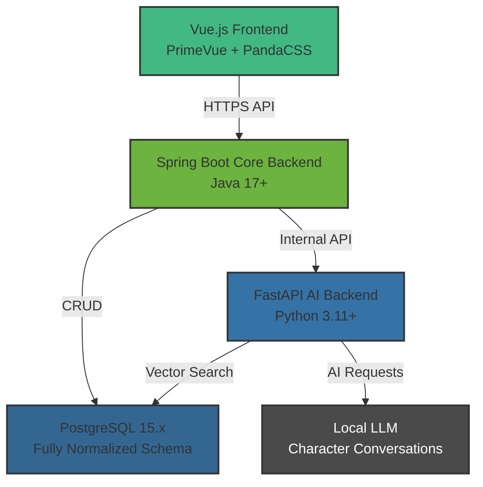

# Gaji (가지): Branch All of Story

<div align="center">

**🌿 Explore infinite timelines. Where every story branches. 🌿**

[](LICENSE)
[](https://www.oracle.com/java/)
[](https://spring.io/projects/spring-boot)
[](https://vuejs.org/)
[](https://fastapi.tiangolo.com/)
[](https://www.postgresql.org/)

</div>

---

## 📖 What is Gaji?

**Gaji** (가지, Korean for "branch") is a revolutionary platform that brings **"What If?"** storytelling to life. Inspired by Marvel's What If...? and powered by AI, Gaji enables readers to explore alternative timelines where beloved characters face different circumstances, make different choices, or exist in entirely different settings.

Unlike traditional book discussion platforms, Gaji doesn't just let you talk _about_ books—it lets you **fork reality itself** and explore infinite story possibilities.

### 🌟 Core Concept

```
📚 Classic Story
    ├─ 🔀 What if Hermione was sorted into Slytherin?
    │   ├─ 💬 Conversation: How did it affect her friendships?
    │   └─ 💬 Conversation: What about her rivalry with Harry?
    │
    ├─ 🔀 What if Gatsby never met Daisy?
    │   ├─ 💬 Conversation: Would he still pursue wealth?
    │   └─ 🔀 Meta-fork: What if he became a tech entrepreneur?
    │
    └─ 🔀 What if Pride & Prejudice happened in 2024 Seoul?
        └─ 💬 Conversation: How does Darcy's pride translate to K-drama?
```

### 🎯 Key Features

- **🔀 Scenario Forking**: Create "What If" scenarios with three types:

  - **Character Changes**: "What if Hermione was in Slytherin?"
  - **Event Alterations**: "What if Gatsby never met Daisy?"
  - **Setting Modifications**: "What if Pride & Prejudice was set in 2024 Seoul?"

- **💬 AI Character Conversations**: Talk to characters adapted to alternate timelines
- **🌳 Tree Visualization**: Explore how scenarios branch into infinite variations
- **👥 Social Discovery**: Share viral timelines and fork others' creative scenarios
- **📊 Community-Driven**: Like, follow, and collaborate on story explorations

---

## 🏗️ Architecture Overview

Gaji uses a **microservices architecture** with clear separation of concerns:



### Technology Stack

| Layer            | Technology                           | Purpose                                        |
| ---------------- | ------------------------------------ | ---------------------------------------------- |
| **Frontend**     | Vue 3, PrimeVue, PandaCSS, Pinia     | Modern SPA with component-based UI             |
| **Core Backend** | Java 17+, Spring Boot 3.x            | Business logic, API gateway, user management   |
| **AI Backend**   | Python 3.11+, FastAPI, LangChain     | RAG, character analysis, AI prompt generation  |
| **Database**     | PostgreSQL 15.x                      | Fully normalized relational schema (32 tables) |
| **AI Service**   | Local LLM                            | Character conversations in alternate timelines |
| **Deployment**   | Railway (backend), Vercel (frontend) | Cloud infrastructure                           |

## 📊 Database Schema

Gaji uses a **fully normalized relational design** with 32 tables (21 core + 11 relationship tables). Key highlights:

### Core Tables

- **`scenarios`**: What If scenario definitions (root scenarios)
- **`conversations`**: User conversations within scenarios
- **`messages`**: Individual chat messages (normalized via join table)
- **`users`**: User accounts and profiles
- **`characters`**: Story characters with AI-extracted metadata

### Advanced Features

- **Scenario Forking**: Unlimited depth for creative meta-scenarios
- **Conversation Forking**: Root-only (max depth = 1) with automatic 6-message copy
- **Normalized Character Data**: Separate tables for aliases, personality traits, relationships
- **Social Features**: Follows, likes, memos with efficient indexing

See [ERD.md](docs/ERD.md) for complete schema diagram.

---

## 🎨 User Experience

### Creating a "What If" Scenario

1. **Select Base Story**: Choose from popular books (Harry Potter, Pride & Prejudice, etc.)
2. **Choose Scenario Type**:
   - **Character Change**: Modify a character's properties (house, personality, etc.)
   - **Event Alteration**: Change what happens at a key moment
   - **Setting Modification**: Shift time period or location
3. **Configure Parameters**: Fill in structured templates (no freeform text chaos)
4. **Validate**: AI checks for logical coherence
5. **Publish**: Share with the community

### Exploring Scenarios

- **Browse by Book**: See all "What If" scenarios for your favorite stories
- **Trending Timelines**: Discover viral scenarios gaining rapid forks
- **Fork & Remix**: Create meta-scenarios by branching existing timelines
- **Tree Visualization**: Navigate the multiverse with D3.js-powered graphs

### AI Conversations

**Example Prompt (Auto-generated)**:

```
You are Hermione Granger in an alternate timeline where you were
sorted into Slytherin instead of Gryffindor. You befriended Draco
Malfoy in your first year, developed cunning ambition under Snape's
mentorship, and experienced the complete Harry Potter series from
Slytherin's perspective. Discuss your alternate journey with readers.
```

**User**: "How did being in Slytherin change your relationship with Harry?"

**AI Hermione**: "It was complicated. We were rivals at first—he saw
me as a traitor to 'good' wizards. But in our third year, during the
Sirius Black incident, we realized we were fighting the same battle
from different houses..."

## 🤝 Contributing

We welcome contributions! Please see our [Contributing Guide](CONTRIBUTING.md) for details.

### Development Workflow

1. Fork the repository
2. Create a feature branch (`git checkout -b feature/amazing-feature`)
3. Commit changes (`git commit -m 'Add amazing feature'`)
4. Push to branch (`git push origin feature/amazing-feature`)
5. Open a Pull Request

### Code Style

- **Java**: Google Java Style Guide
- **Python**: Black + flake8
- **TypeScript/Vue**: ESLint + Prettier

---

## License

This project is licensed under the MIT License - see [LICENSE](LICENSE) file for details.

---

## Acknowledgments

- **Inspiration**: Marvel's What If...?, Archive of Our Own (AO3)
- **AI Models**: Local LLM (Llama, Mistral, or similar open-source models), LangChain ecosystem
- **UI Components**: PrimeVue, PandaCSS
- **Community**: BookTok creators, fanfiction writers, literature professors

---

## Team

Meet the team behind Gaji:

<div align="center">

| Member     | GitHub                                       | Role           |
| ---------- | -------------------------------------------- | -------------- |
| **민영재** | [@yeomin4242](https://github.com/yeomin4242) | Core Developer |
| **구서원** | [@swkooo](https://github.com/swkooo)         | Core Developer |

</div>

We're a passionate team of developers building the future of interactive storytelling! 🚀

---

## Contact & Support

- **Documentation**: [/docs](/docs)
- **Issues**: [GitHub Issues](https://github.com/your-org/gaji/issues)
- **Discussions**: [GitHub Discussions](https://github.com/your-org/gaji/discussions)
- **Email**: support@gaji.app

---

<div align="center">

**🌿 Let's gaji some timelines! 🌿**

Made with ❤️ by the Gaji team

[Website](https://gaji.app) • [Docs](docs/) • [Blog](https://blog.gaji.app)

</div>
