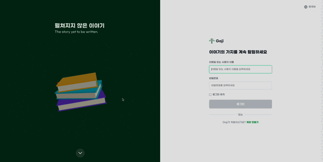
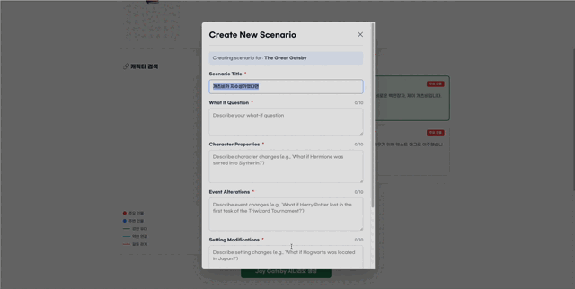
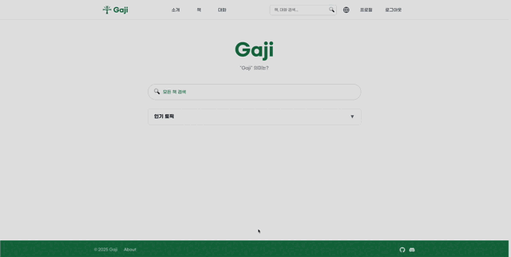
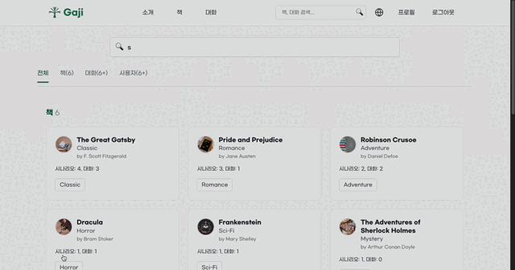

# Gaji Frontend

<div align="center">

**Branch All of Story** 🌿

AI 기반 "What If" 스토리 탐험 플랫폼의 프론트엔드

[](https://vuejs.org/)
[](https://www.typescriptlang.org/)
[](https://vitejs.dev/)
[](https://panda-css.com/)
[](LICENSE)

</div>

---

## 프로젝트 소개

**Gaji** (가지, Korean for "branch")는 Git 스타일의 포킹을 AI 기반 책 토론에 적용한 혁신적인 플랫폼입니다.

원작 소설에서 분기된 무한한 가능성의 **What If 시나리오**를 생성하고, AI 캐릭터와 대화하며 새로운 이야기를 탐험할 수 있습니다. "가지(Branch)"라는 이름처럼 하나의 이야기에서 무수히 많은 대체 타임라인이 펼쳐집니다.

### 핵심 개념

**"What if?"** - 만약 해리포터가 슬리데린에 배정되었다면? 만약 개츠비가 데이지를 만나지 않았다면?

### 주요 기능

#### 로그인 & 인증

- **3D 인터랙티브 로그인**: Three.js 기반의 몰입형 3D 환경
- **소셜 로그인**: Google, Kakao 소셜 인증 지원
- **안전한 인증**: JWT 기반 토큰 관리



#### 책 브라우징 & 검색

- **책 목록 탐색**: 장르별, 작가별 필터링
- **상세 정보**: 책 메타데이터, 줄거리, 등장인물 정보
- **시리즈 지원**: 책 시리즈 연결 및 탐색


#### What If 시나리오 생성

사용자는 세 가지 타입의 시나리오를 생성할 수 있습니다:

- **캐릭터 변경** (Character Property Changes)
  - 예: "해르미온느가 슬리데린에 배정되었다면?"
  - 성격, 소속, 관계 등 변경

- **이벤트 변경** (Event Alterations)
  - 예: "개츠비가 데이지를 만나지 않았다면?"
  - 스토리의 특정 시점에서 분기

- **설정 변경** (Setting Modifications)
  - 예: "오만과 편견이 2024년 서울에서 일어났다면?"
  - 시대, 장소, 문화적 맥락 변경



#### AI 캐릭터와의 대화

- **캐릭터 시스템**: 원작의 등장인물과 AI 대화
- **컨텍스트 인식**: 시나리오 기반 캐릭터 성격 적용
- **스트리밍 응답**: Server-Sent Events(SSE) 기반 실시간 대화
- **완전한 스토리 지식**: 캐릭터가 전체 스토리를 알고 있는 접근 방식


#### 대화 포킹 (Conversation Forking)

- **ROOT-only 포킹**: 최대 깊이 1 레벨의 포킹 지원
- **메시지 복사**: min(6, 전체 메시지 수) 복사 규칙
- **트리 시각화**: 대화 분기 시각화
- **"가지치기"**: "Let's gaji this discussion" - 직관적인 포킹 경험


#### 소셜 기능

- **팔로우 시스템**: 다른 사용자 팔로우
- **좋아요**: 대화에 좋아요 표시
- **메모**: 개인 메모 작성
- **프로필**: 사용자 프로필 및 활동 내역


#### 시나리오 & 대화 탐색

- **탐색 페이지**: 인기 시나리오 및 대화 목록
- **검색 & 필터링**: 책, 캐릭터, 시나리오 타입별 필터
- **무한 스크롤**: 원활한 탐색 경험




### 기술 스택

| 카테고리            | 기술                                 | 버전      |
| ------------------- | ------------------------------------ | --------- |
| **프레임워크**      | Vue 3 (Composition API) + TypeScript | 3.x / 5.x |
| **빌드 도구**       | Vite                                 | 5.x       |
| **상태 관리**       | Pinia                                | latest    |
| **라우팅**          | Vue Router                           | 4.x       |
| **스타일링**        | PandaCSS (Zero-runtime CSS-in-JS)    | latest    |
| **UI 컴포넌트**     | PrimeVue                             | 3.x       |
| **3D 그래픽**       | Three.js                             | latest    |
| **HTTP 클라이언트** | Axios                                | 1.x       |
| **폼 검증**         | VeeValidate + Yup                    | 4.x       |
| **코드 품질**       | ESLint + Prettier                    | 9.x       |
| **패키지 매니저**   | pnpm                                 | 9.x       |

### 프로젝트 구조

```
src/
├── assets/              # 정적 리소스 (아이콘, 이미지)
├── components/          # 재사용 가능한 컴포넌트
│   ├── auth/            # 인증 관련 컴포넌트
│   │   ├── AuthLayout.vue
│   │   └── The3DLoginScene.vue
│   ├── common/          # 공통 컴포넌트
│   ├── book/            # 책 관련 컴포넌트
│   ├── scenario/        # 시나리오 관련 컴포넌트
│   ├── conversation/    # 대화 관련 컴포넌트
│   └── user/            # 사용자 관련 컴포넌트
├── views/               # 페이지 컴포넌트
│   ├── Login.vue
│   ├── Home.vue
│   ├── BookBrowsePage.vue
│   ├── BookDetailPage.vue
│   ├── ScenarioDetailPage.vue
│   ├── ConversationChat.vue
│   ├── Conversations.vue
│   ├── Profile.vue
│   └── ...
├── router/              # Vue Router 설정
│   └── index.ts
├── stores/              # Pinia 스토어
│   ├── auth.ts          # 인증 상태
│   ├── user.ts          # 사용자 프로필
│   ├── book.ts          # 책 브라우징
│   ├── scenario.ts      # 시나리오 생성/탐색
│   └── conversation.ts  # 대화 관리
├── services/            # API 서비스
│   ├── api.ts           # Axios 인스턴스 (Spring Boot)
│   └── authService.ts   # 인증 API
├── types/               # TypeScript 타입 정의
│   ├── book.ts
│   ├── scenario.ts
│   ├── conversation.ts
│   └── user.ts
├── utils/               # 유틸리티 함수
├── styles/              # 전역 스타일
└── App.vue              # 루트 컴포넌트
```

---

## 🧑🏻‍💻 프로젝트 멤버

| Member     | GitHub                                       | Role           |
| ---------- | -------------------------------------------- | -------------- |
| **민영재** | [@yeomin4242](https://github.com/yeomin4242) | Core Developer |
| **구서원** | [@swkooo](https://github.com/swkooo)         | Core Developer |
