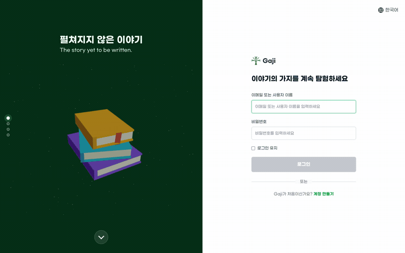
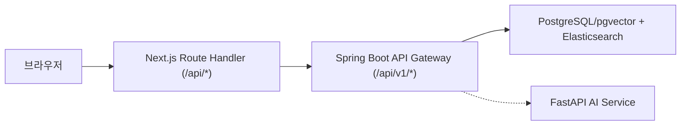

# Gaji Frontend

Gaji의 웹 프론트엔드입니다. 사용자가 책을 고르고, 가지를 만들고, 캐릭터와 대화하고, 다시 이어갈 대화를 찾는 전체 화면 경험을 담당합니다.

## 기능별 화면 데모

### 인증과 첫 진입

로그인, 회원가입, 언어 선택, 3D scrollytelling 화면입니다. 첫 방문자가 서비스의 분위기를 바로 이해하고 계정을 만들 수 있는 진입 흐름을 담았습니다.



### 가지 탐색과 시나리오 상세

책을 고르고, What-if 가지를 탐색하고, 원작에서 무엇이 바뀌는지 확인하는 흐름입니다. 사용자가 대화를 시작하기 전 필요한 맥락을 한 화면에서 파악하도록 구성했습니다.


### 캐릭터 대화와 메모

시나리오에서 대화를 시작하고, 답변을 읽고, 메모를 남기며 새 가지로 이어가는 핵심 사용 흐름입니다. Gaji가 제공하는 “대화에서 다시 가지치기” 경험을 보여줍니다.


### 검색과 프로필

책, 가지, 대화, 사용자를 통합 검색하고, 프로필에서 내가 만든 가지와 좋아요한 대화를 확인하는 흐름입니다. 반복 방문자가 다시 이어갈 대화를 찾는 화면을 정리했습니다.


## 화면이 담당하는 경험

- 첫 방문자가 로그인/회원가입 화면에서 서비스 분위기를 이해합니다.
- 사용자는 책과 What-if 가지를 탐색하고 대화할 맥락을 고릅니다.
- 대화 화면에서는 캐릭터에게 질문하고, 답변을 읽고, 메모를 남깁니다.
- 검색과 프로필에서는 다시 이어갈 책, 가지, 대화를 찾습니다.

## 주요 화면과 기능

| 화면 | 역할 |
| --- | --- |
| 홈 | 사용자가 이어갈 이야기, 최근 대화, 첫 방문 안내를 확인하는 시작점 |
| 로그인 / 회원가입 | 3D scrollytelling 기반 인증 화면과 언어 선택 제공 |
| 가지 목록 | 책과 What-if 가지를 탐색하고 필터링하는 목록 화면 |
| 가지 상세 | 원작 장면, 바뀐 가정, 대화할 캐릭터, 예상 흐름을 한 화면에 정리 |
| 대화 | 캐릭터와 대화하고, 메모를 남기고, 새 가지로 이어가는 핵심 작업 화면 |
| 검색 | 책, 가지, 대화, 사용자를 통합 검색 결과 카드로 표시 |
| 프로필 | 내가 만든 가지, 좋아요한 대화, 다시 열 대화, 팔로우 관계를 정리 |

## 구현 포인트

- Next.js App Router로 화면과 API proxy를 함께 구성했습니다.
- 인증 화면은 Three.js 기반 3D scrollytelling으로 첫 인상을 만듭니다.
- 대화, 메모, 새 가지 만들기는 같은 흐름 안에서 이어지도록 설계했습니다.
- Playwright로 핵심 사용자 흐름과 화면 회귀를 검증합니다.

## 기술 구성

| 영역 | 사용 기술 |
| --- | --- |
| 프레임워크 | Next.js 15, React 19, TypeScript |
| 스타일링 | Panda CSS, global CSS |
| UI 요소 | Ark UI, lucide-react |
| 3D | Three.js, React Three Fiber, Drei |
| 상태 관리 | Zustand, browser storage |
| 테스트 | Playwright, Vitest, Testing Library |

## 코드 구조

```text
gajiFE/
├── src/app/              # App Router 페이지와 route handler
├── src/domains/          # auth, home, journeys, catalog, shell
├── src/components/       # 공용 UI 컴포넌트
├── src/api/              # 브라우저 API wrapper
├── src/lib/              # route 검증, proxy, 유틸리티
├── src/i18n/             # 언어 파일과 locale helper
├── tests/e2e/            # Playwright 사용자 흐름 테스트
└── public/demo/          # README 기능별 GIF
```

## 실행

```bash
npm install
PORT=3100 npm run dev
```

기본 개발 서버는 `http://127.0.0.1:3100`에서 실행합니다.

## 주요 스크립트

| 명령어 | 설명 |
| --- | --- |
| `npm run dev` | Next.js 개발 서버 실행 |
| `npm run build` | 프로덕션 빌드 |
| `npm run start` | 빌드 결과 실행 |
| `npm run lint` | Next.js lint 실행 |
| `npm run test:unit` | Vitest 단위 테스트 |
| `npm run test:e2e` | Playwright 전체 E2E 실행 |
| `npm run test:e2e:parity` | 핵심 parity/visual gate 실행 |
| `npm run panda:codegen` | Panda CSS 코드 생성 |

## API 통신

브라우저는 Next.js Route Handler를 통해 Spring Boot API Gateway와 통신합니다. FE는 FastAPI, PostgreSQL, Elasticsearch에 직접 접근하지 않습니다. AI/RAG 작업은 Spring Boot 경계를 통해 처리되며, 현재 백엔드는 과도기적으로 FastAPI를 호출할 수 있습니다.


```mermaid
flowchart LR
    Browser["브라우저"] --> Next["Next.js Route Handler (/api/*)"]
    Next --> Spring["Spring Boot API Gateway (/api/v1/*)"]
    Spring --> Search["PostgreSQL/pgvector + Elasticsearch"]
    Spring -.-> FastAPI["FastAPI AI Service"]
```

관련 파일:

- `src/lib/springProxy.ts`: 서버 전용 Spring API 프록시
- `src/api/http.ts`: 브라우저 JSON 요청 유틸
- `src/api/*Api.ts`: 기능별 API wrapper

## 테스트

```bash
# 단위 테스트
npm run test:unit

# E2E 테스트
npm run test:e2e

# 주요 화면 회귀 테스트
npm run test:e2e:parity
```

Playwright는 `playwright.config.ts`의 `webServer` 설정을 사용해 `127.0.0.1:3100`에서 앱을 띄우고 테스트합니다.

## 품질 기준

- 로그인/회원가입 3D 화면은 모바일과 데스크톱 모두에서 프레이밍이 깨지지 않아야 합니다.
- 로딩, 실패, 빈 상태에서는 사용자에게 개발 용어가 보이지 않아야 합니다.
- 검색 결과, 프로필, 대화 입력창은 반복 사용자가 빠르게 스캔할 수 있어야 합니다.
- 기능별 GIF는 포트폴리오에서 각 화면의 목적을 바로 보여주는 기준 자료로 관리합니다.
