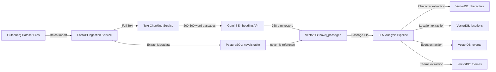
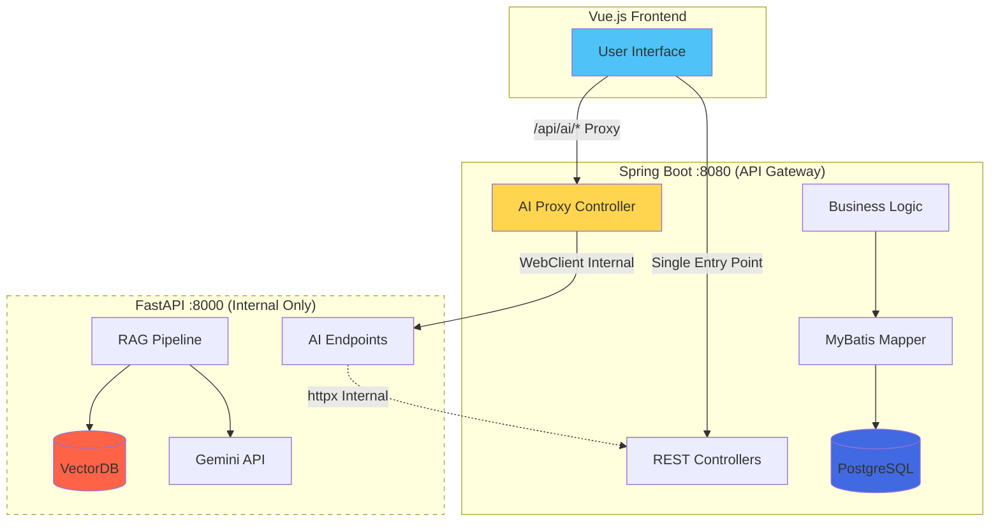
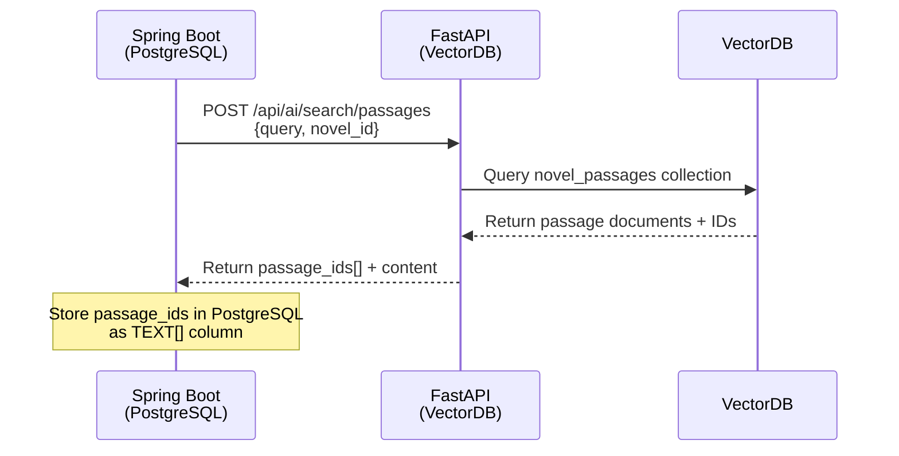
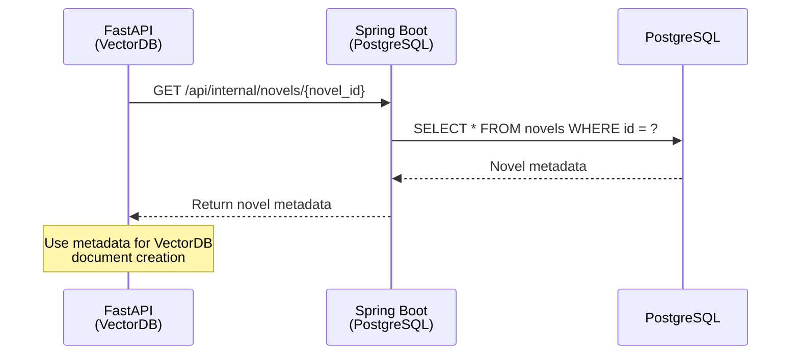
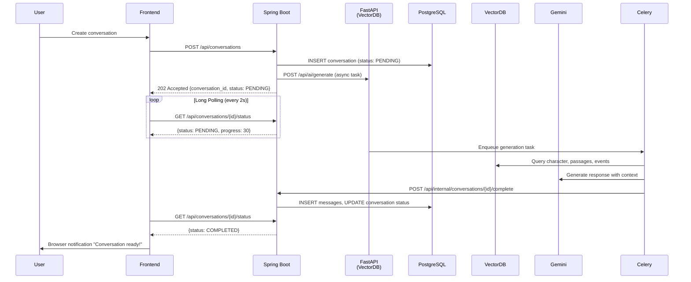
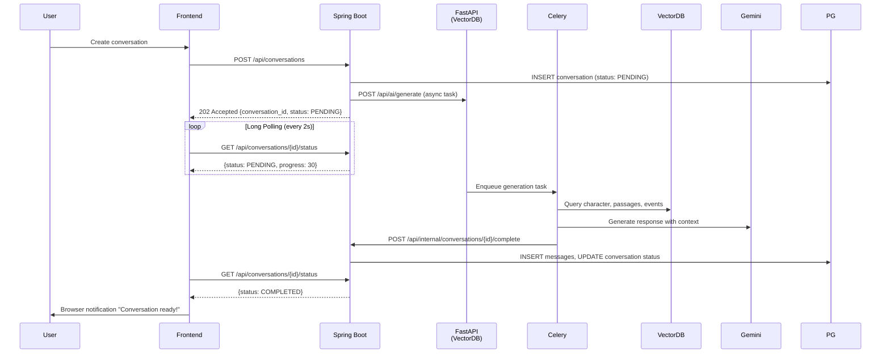

# Gaji: System Architecture Document

**Version:** 1.0
**Date:** 2025-11-18
**Author:** GitHub Copilot (Architect)

## 1. Introduction

This document outlines the **hybrid database architecture** for **Gaji**, a novel platform for forking AI-mediated book discussions. The architecture separates **metadata (PostgreSQL)** from **content and embeddings (VectorDB)** for optimal performance, scalability, and cost efficiency.

**Key Architectural Innovation**: Hybrid storage strategy with PostgreSQL handling relational metadata and VectorDB (ChromaDB/Pinecone) managing novel content, embeddings, and semantic search capabilities.

**Book-Centric Design Philosophy**: The platform architecture prioritizes book discovery and exploration. Users navigate through books first, then explore scenarios within each book, creating a natural hierarchy: Books → Scenarios → Conversations.

This document details the MSA backend architecture, hybrid database design, technology stack, and API design principles for the Gaji platform.

## 2. Core Technical Challenges

- **Hybrid Database Architecture**: Managing data split between PostgreSQL (metadata) and VectorDB (content/embeddings)

  - **PostgreSQL**: Relational metadata, user data, conversation structure (13 core tables)
  - **VectorDB**: Novel content, embeddings, LLM analysis results (5 collections)
  - **Cross-DB References**: Maintaining consistency between metadata IDs and VectorDB document IDs

- **Conversation Forking with Message Copy**: Two distinct fork types:

  - **Scenario Fork**: Unlimited depth meta-scenarios with circular reference prevention
  - **Conversation Fork**: ROOT-only (parent_conversation_id = NULL), max depth = 1
  - **Message Copy Logic**: Copy `min(6, total_message_count)` messages when forking

- **Novel Ingestion Pipeline**:

  - Source: Project Gutenberg Dataset (batch import, not real-time API)
  - Parse text → Extract metadata (PostgreSQL) → Chunk content (VectorDB)
  - Generate embeddings (Gemini Embedding API: 768 dimensions)
  - LLM analysis for characters/locations/events/themes (stored in VectorDB)

- **RAG with VectorDB**:

  - Semantic search across novel passages for scenario context
  - Retrieve character/location/event metadata from VectorDB collections
  - Combine with PostgreSQL conversation metadata for AI prompts

- **Long Polling for AI Operations**:

  - Async task queue (Celery + Redis) for conversation generation
  - Frontend polls Spring Boot every 2 seconds for status updates
  - Browser notifications on task completion

- **MSA Service Communication**:
  - Spring Boot (CRUD, port 8080) ↔ FastAPI (AI/RAG, port 8000)
  - Internal REST API for cross-service operations
  - Secure private network communication

## 3. Hybrid Database Architecture

### 3.1. Architecture Philosophy

**Separation of Concerns**: The platform uses a **hybrid storage strategy** to optimize different access patterns:

| Aspect             | PostgreSQL                                            | VectorDB (ChromaDB/Pinecone)                                 |
| ------------------ | ----------------------------------------------------- | ------------------------------------------------------------ |
| **Purpose**        | Relational metadata, user data, business logic        | Novel content, embeddings, LLM analysis                      |
| **Data Types**     | User accounts, scenarios, conversations, social graph | Full text passages, character descriptions, semantic vectors |
| **Query Patterns** | CRUD operations, joins, transactions                  | Semantic search, similarity queries, embedding retrieval     |
| **Table Count**    | 13 core tables                                        | 5 collections                                                |
| **Storage Size**   | ~10GB for 1M users                                    | ~100GB for 1000 novels                                       |

### 3.2. PostgreSQL Schema (Metadata Only - 13 Tables)

#### Core Tables

**1. users** (User accounts)

```sql
CREATE TABLE users (
    id UUID PRIMARY KEY DEFAULT uuid_generate_v4(),
    email VARCHAR(255) UNIQUE NOT NULL,
    username VARCHAR(50) UNIQUE NOT NULL,
    password_hash VARCHAR(60) NOT NULL,
    bio TEXT CHECK (LENGTH(bio) <= 500),
    avatar_url VARCHAR(500),
    created_at TIMESTAMP DEFAULT CURRENT_TIMESTAMP,
    updated_at TIMESTAMP DEFAULT CURRENT_TIMESTAMP
);
```

**2. novels** (Novel metadata - NO CONTENT)

```sql
CREATE TABLE novels (
    id UUID PRIMARY KEY DEFAULT uuid_generate_v4(),
    title VARCHAR(500) NOT NULL,
    author VARCHAR(200),
    original_language VARCHAR(10),
    era VARCHAR(100),
    genre VARCHAR(100),
    publication_year INTEGER,
    isbn VARCHAR(20),
    series_title VARCHAR(300),
    series_number INTEGER,
    copyright_status VARCHAR(50) CHECK (copyright_status IN (
        'public_domain', 'copyrighted', 'creative_commons', 'unknown'
    )),
    cover_image_url VARCHAR(500),
    description TEXT,
    is_verified BOOLEAN DEFAULT false,
    creator_id UUID REFERENCES users(id) ON DELETE SET NULL,
    created_at TIMESTAMP DEFAULT CURRENT_TIMESTAMP,
    updated_at TIMESTAMP DEFAULT CURRENT_TIMESTAMP
);
-- NOTE: NO full_text column - content is in VectorDB
```

**3. base_scenarios** (Scenario metadata with VectorDB references)

```sql
CREATE TABLE base_scenarios (
    id UUID PRIMARY KEY DEFAULT uuid_generate_v4(),
    novel_id UUID NOT NULL REFERENCES novels(id) ON DELETE CASCADE,
    base_story VARCHAR(100) NOT NULL,
    vectordb_passage_ids TEXT[],  -- Array of VectorDB document IDs
    chapter_number INTEGER,
    page_range VARCHAR(50),
    character_summary TEXT,  -- Brief summary for UI preview
    location_summary TEXT,
    theme_summary TEXT,
    content_summary TEXT,
    tags TEXT[],
    is_verified BOOLEAN DEFAULT false,
    creator_id UUID REFERENCES users(id),
    created_at TIMESTAMP DEFAULT CURRENT_TIMESTAMP,
    updated_at TIMESTAMP DEFAULT CURRENT_TIMESTAMP
);
-- NOTE: Full character/location/event data is in VectorDB collections
```

**4. root_user_scenarios** (User-created "What If" scenarios)

```sql
CREATE TABLE root_user_scenarios (
    id UUID PRIMARY KEY DEFAULT uuid_generate_v4(),
    base_scenario_id UUID REFERENCES base_scenarios(id) NOT NULL,
    user_id UUID REFERENCES users(id) NOT NULL,
    scenario_type VARCHAR(50) NOT NULL CHECK (scenario_type IN (
        'CHARACTER_CHANGE', 'EVENT_ALTERATION', 'SETTING_MODIFICATION'
    )),
    is_private BOOLEAN DEFAULT false,
    fork_count INTEGER DEFAULT 0,
    conversation_count INTEGER DEFAULT 0,
    created_at TIMESTAMP DEFAULT CURRENT_TIMESTAMP,
    updated_at TIMESTAMP DEFAULT CURRENT_TIMESTAMP
);
```

**5. leaf_user_scenarios** (Forked scenarios - depth 1)

```sql
CREATE TABLE leaf_user_scenarios (
    id UUID PRIMARY KEY DEFAULT uuid_generate_v4(),
    parent_scenario_id UUID REFERENCES root_user_scenarios(id) ON DELETE CASCADE,
    user_id UUID REFERENCES users(id) NOT NULL,
    scenario_type VARCHAR(50) NOT NULL,
    is_private BOOLEAN DEFAULT false,
    conversation_count INTEGER DEFAULT 0,
    created_at TIMESTAMP DEFAULT CURRENT_TIMESTAMP,
    CHECK (parent_scenario_id IS NOT NULL)  -- Must have parent
);
```

**6. scenario_character_changes** (References VectorDB characters)

```sql
CREATE TABLE scenario_character_changes (
    id UUID PRIMARY KEY DEFAULT uuid_generate_v4(),
    root_scenario_id UUID REFERENCES root_user_scenarios(id) ON DELETE CASCADE,
    leaf_scenario_id UUID REFERENCES leaf_user_scenarios(id) ON DELETE CASCADE,
    character_vectordb_id VARCHAR(100) NOT NULL,  -- VectorDB document ID
    attribute VARCHAR(100) NOT NULL,
    original_value TEXT,
    new_value TEXT NOT NULL,
    reasoning TEXT,
    created_at TIMESTAMP DEFAULT CURRENT_TIMESTAMP,
    CHECK (
        (root_scenario_id IS NOT NULL AND leaf_scenario_id IS NULL) OR
        (root_scenario_id IS NULL AND leaf_scenario_id IS NOT NULL)
    )
);
-- NOTE: character_vectordb_id points to VectorDB 'characters' collection
```

**7. conversations** (ROOT-only forking)

```sql
CREATE TABLE conversations (
    id UUID PRIMARY KEY DEFAULT uuid_generate_v4(),
    user_id UUID NOT NULL REFERENCES users(id) ON DELETE CASCADE,
    scenario_id UUID NOT NULL,  -- Polymorphic: root_user or leaf_user
    scenario_type VARCHAR(20) NOT NULL CHECK (scenario_type IN ('root_user', 'leaf_user')),
    character_vectordb_id VARCHAR(100) NOT NULL,  -- VectorDB character reference
    parent_conversation_id UUID REFERENCES conversations(id) ON DELETE SET NULL,
    is_root BOOLEAN DEFAULT true,
    message_count INTEGER DEFAULT 0,
    like_count INTEGER DEFAULT 0,
    is_private BOOLEAN DEFAULT false,
    created_at TIMESTAMP DEFAULT CURRENT_TIMESTAMP,
    updated_at TIMESTAMP DEFAULT CURRENT_TIMESTAMP,
    CHECK (
        (is_root = true AND parent_conversation_id IS NULL) OR
        (is_root = false AND parent_conversation_id IS NOT NULL)
    )
);
-- NOTE: character data is in VectorDB, only ID is stored here
```

**8. conversation_message_links** (Join table for message reuse)

```sql
CREATE TABLE conversation_message_links (
    id UUID PRIMARY KEY DEFAULT uuid_generate_v4(),
    conversation_id UUID NOT NULL REFERENCES conversations(id) ON DELETE CASCADE,
    message_id UUID NOT NULL REFERENCES messages(id) ON DELETE CASCADE,
    sequence_order INTEGER NOT NULL,
    created_at TIMESTAMP DEFAULT CURRENT_TIMESTAMP,
    UNIQUE(conversation_id, sequence_order),
    UNIQUE(conversation_id, message_id)
);
```

**9. messages**

```sql
CREATE TABLE messages (
    id UUID PRIMARY KEY DEFAULT uuid_generate_v4(),
    sender_id UUID REFERENCES users(id),
    role VARCHAR(20) NOT NULL CHECK (role IN ('user', 'assistant', 'system')),
    content TEXT NOT NULL,
    created_at TIMESTAMP DEFAULT CURRENT_TIMESTAMP
);
```

**10-13. Social Tables**

```sql
CREATE TABLE user_follows (
    follower_id UUID REFERENCES users(id) ON DELETE CASCADE,
    followee_id UUID REFERENCES users(id) ON DELETE CASCADE,
    created_at TIMESTAMP DEFAULT CURRENT_TIMESTAMP,
    PRIMARY KEY (follower_id, followee_id)
);

CREATE TABLE conversation_likes (
    user_id UUID REFERENCES users(id) ON DELETE CASCADE,
    conversation_id UUID REFERENCES conversations(id) ON DELETE CASCADE,
    created_at TIMESTAMP DEFAULT CURRENT_TIMESTAMP,
    PRIMARY KEY (user_id, conversation_id)
);

CREATE TABLE conversation_memos (
    id UUID PRIMARY KEY DEFAULT uuid_generate_v4(),
    conversation_id UUID REFERENCES conversations(id) ON DELETE CASCADE,
    user_id UUID REFERENCES users(id) ON DELETE CASCADE,
    content TEXT NOT NULL CHECK (LENGTH(content) <= 1000),
    created_at TIMESTAMP DEFAULT CURRENT_TIMESTAMP
);
```

### 3.3. VectorDB Schema (Content + Embeddings - 5 Collections)

#### Collection 1: novel_passages

**Purpose**: Store novel text chunks with semantic embeddings for RAG

```python
{
    "id": "UUID (passage identifier)",
    "metadata": {
        "novel_id": "UUID (FK to PostgreSQL novels.id)",
        "chapter_number": int,
        "chapter_title": str,
        "sequence_order": int,  # Position in novel
        "start_char_offset": int,
        "end_char_offset": int,
        "word_count": int,
        "passage_type": str,  # 'narrative', 'dialogue', 'description'
        "character_mentions": [str],  # Character names in passage
        "location_mentions": [str],
        "embedding_model": "text-embedding-004",  # Gemini Embedding API
        "created_at": "2025-11-14T10:00:00Z"
    },
    "document": "Passage text content (200-500 words)",
    "embedding": [768-dimensional float vector from Gemini]
}
```

**Indexes**:

- `novel_id` (for filtering by book)
- `chapter_number` (for chapter-specific queries)
- `passage_type` (for filtering narrative vs dialogue)

#### Collection 2: characters

**Purpose**: Store character descriptions and personality with embeddings

```python
{
    "id": "UUID (character identifier)",
    "metadata": {
        "novel_id": "UUID",
        "name": str,
        "role": str,  # 'protagonist', 'antagonist', 'supporting', 'minor'
        "description": str,  # Full character description
        "aliases": [str],  # Alternative names
        "personality_traits": {
            "trait_name": float  # 0.0-1.0 strength
        },
        "relationships": [
            {
                "related_character_id": str,
                "type": str,  # 'friend', 'enemy', 'family', 'mentor'
                "strength": float,
                "description": str
            }
        ],
        "first_appearance_chapter": int,
        "appearance_count": int,
        "importance_score": float,  # 0.0-1.0
        "embedding_model": "text-embedding-004",
        "created_at": "2025-11-14T10:00:00Z"
    },
    "document": "Character full description for semantic search",
    "embedding": [768-dimensional vector]
}
```

**Indexes**:

- `novel_id`
- `role`
- `importance_score`

#### Collection 3: locations

**Purpose**: Store setting descriptions with semantic embeddings

```python
{
    "id": "UUID",
    "metadata": {
        "novel_id": "UUID",
        "name": str,
        "location_type": str,  # 'interior', 'exterior', 'fantastical', 'historical'
        "description": str,
        "parent_location_id": str,  # Nested locations (e.g., "Room" in "Hogwarts")
        "atmosphere": str,  # 'dark', 'cheerful', 'mysterious'
        "significance": str,  # 'major', 'minor'
        "related_events": [str],  # Event IDs
        "first_appearance_chapter": int,
        "appearance_count": int,
        "embedding_model": "text-embedding-004",
        "created_at": "2025-11-14T10:00:00Z"
    },
    "document": "Location description for semantic search",
    "embedding": [768-dimensional vector]
}
```

#### Collection 4: events

**Purpose**: Store major plot events with semantic context

```python
{
    "id": "UUID",
    "metadata": {
        "novel_id": "UUID",
        "chapter_number": int,
        "passage_id": str,  # FK to novel_passages
        "event_type": str,  # 'climax', 'turning_point', 'resolution', 'inciting_incident'
        "title": str,
        "description": str,
        "involved_character_ids": [str],
        "location_id": str,
        "significance_score": float,  # 0.0-1.0
        "chronological_order": int,
        "embedding_model": "text-embedding-004",
        "created_at": "2025-11-14T10:00:00Z"
    },
    "document": "Event description for semantic search",
    "embedding": [768-dimensional vector]
}
```

#### Collection 5: themes

**Purpose**: Store thematic analysis with semantic embeddings

```python
{
    "id": "UUID",
    "metadata": {
        "novel_id": "UUID",
        "theme_name": str,  # 'Good vs Evil', 'Coming of Age'
        "category": str,  # 'moral', 'social', 'philosophical'
        "description": str,
        "related_passage_ids": [str],
        "related_character_ids": [str],
        "prevalence_score": float,  # 0.0-1.0
        "embedding_model": "text-embedding-004",
        "created_at": "2025-11-14T10:00:00Z"
    },
    "document": "Theme description for semantic search",
    "embedding": [768-dimensional vector]
}
```

### 3.4. Cross-Database Reference Patterns

#### Pattern 1: PostgreSQL → VectorDB (One-to-Many)

```python
# Example: Get passages for a scenario
base_scenario = postgresql.query("SELECT vectordb_passage_ids FROM base_scenarios WHERE id = ?")
passage_ids = base_scenario.vectordb_passage_ids

passages = vectordb.query(
    collection_name="novel_passages",
    ids=passage_ids
)
```

#### Pattern 2: VectorDB → PostgreSQL (Metadata Lookup)

```python
# Example: Find novel metadata for a character
character = vectordb.get(collection_name="characters", id=character_id)
novel_id = character.metadata["novel_id"]

novel = postgresql.query("SELECT * FROM novels WHERE id = ?", novel_id)
```

#### Pattern 3: Hybrid Query (Join across databases)

```python
# Example: Get all conversations for a character
conversations = postgresql.query("""
    SELECT * FROM conversations
    WHERE character_vectordb_id = ?
""", character_id)

character_data = vectordb.get(collection_name="characters", id=character_id)

return {
    "conversations": conversations,
    "character": character_data
}

}
```

## 4. Novel Ingestion Pipeline (FastAPI → VectorDB + PostgreSQL)

### 4.1. Data Flow



### 4.2. Ingestion Steps

**Step 1: Parse Gutenberg File**

```python
# ai-backend/services/novel_ingestion.py
def parse_gutenberg_file(file_path: str) -> NovelData:
    with open(file_path, 'r', encoding='utf-8') as f:
        content = f.read()

    metadata = extract_gutenberg_metadata(content)
    text = remove_gutenberg_headers(content)

    return NovelData(metadata=metadata, full_text=text)
```

**Step 2: Save Metadata to PostgreSQL (via Spring Boot API)**

```python
async def save_novel_metadata(metadata: NovelMetadata) -> UUID:
    response = await http_client.post(
        "http://spring-boot:8080/api/internal/novels",
        json=metadata.dict()
    )
    return UUID(response.json()["id"])
```

**Step 3: Chunk Text**

```python
def chunk_text(text: str, chunk_size: int = 400) -> List[Passage]:
    chunks = []
    sentences = sent_tokenize(text)
    current_chunk = []
    current_word_count = 0

    for sentence in sentences:
        words = sentence.split()
        if current_word_count + len(words) > chunk_size:
            chunks.append(" ".join(current_chunk))
            current_chunk = [sentence]
            current_word_count = len(words)
        else:
            current_chunk.append(sentence)
            current_word_count += len(words)

    return chunks
```

**Step 4: Generate Embeddings (Gemini)**

```python
import google.generativeai as genai

async def generate_embeddings(passages: List[str]) -> List[List[float]]:
    genai.configure(api_key=os.getenv("GEMINI_API_KEY"))

    embeddings = []
    for passage in passages:
        result = genai.embed_content(
            model="models/text-embedding-004",
            content=passage,
            task_type="retrieval_document"
        )
        embeddings.append(result['embedding'])

    return embeddings
```

**Step 5: Store in VectorDB**

```python
import chromadb

def store_passages_in_vectordb(
    novel_id: UUID,
    passages: List[str],
    embeddings: List[List[float]]
):
    client = chromadb.PersistentClient(path="./chroma_data")
    collection = client.get_or_create_collection("novel_passages")

    ids = [str(uuid.uuid4()) for _ in passages]
    metadatas = [
        {
            "novel_id": str(novel_id),
            "chapter_number": detect_chapter(passage),
            "word_count": len(passage.split()),
            "sequence_order": idx
        }
        for idx, passage in enumerate(passages)
    ]

    collection.add(
        ids=ids,
        embeddings=embeddings,
        documents=passages,
        metadatas=metadatas
    )

    return ids  # Return for PostgreSQL reference
```

**Step 6: LLM Character Extraction**

```python
async def extract_characters(novel_id: UUID, passages: List[str]):
    prompt = f"""Analyze the following novel passages and extract all characters.
    For each character, provide:
    - name
    - role (protagonist/antagonist/supporting/minor)
    - description
    - aliases
    - personality traits (with strength 0.0-1.0)
    - relationships

    Passages:
    {" ".join(passages[:10])}  # First 10 passages for context
    """

    genai.configure(api_key=os.getenv("GEMINI_API_KEY"))
    model = genai.GenerativeModel("gemini-2.5-flash")
    response = model.generate_content(prompt)

    characters = parse_character_response(response.text)

    # Store in VectorDB
    client = chromadb.PersistentClient(path="./chroma_data")
    collection = client.get_or_create_collection("characters")

    for char in characters:
        char_embedding = genai.embed_content(
            model="models/text-embedding-004",
            content=char.description
        )['embedding']

        collection.add(
            ids=[str(uuid.uuid4())],
            embeddings=[char_embedding],
            documents=[char.description],
            metadatas=[{
                "novel_id": str(novel_id),
                "name": char.name,
                "role": char.role,
                **char.dict()
            }]
        )
```

## 5. MSA Backend Architecture (Pattern B: API Gateway)

### 5.1. Service Responsibilities & Data Access

**Architecture Decision**: Pattern B (API Gateway) - Frontend → Spring Boot Only → FastAPI (Internal)



**Spring Boot (Port 8080) - API Gateway & Business Logic Server**:

- **Database Access**: PostgreSQL ONLY (via MyBatis)
- **Responsibilities**:
  - **API Gateway**: Single entry point for all Frontend requests
  - **AI Proxy**: Proxies FastAPI endpoints to prevent external exposure
  - User authentication & authorization (JWT)
  - Novel metadata CRUD (PostgreSQL)
  - Scenario CRUD (stores VectorDB document IDs as strings)
  - Conversation CRUD (stores character_vectordb_id as VARCHAR)
  - Social features (follows, likes, memos)
  - Long polling endpoint for AI task status
  - **Centralized logging and monitoring**
- **Never accesses**: VectorDB (delegates all VectorDB queries to FastAPI)

**FastAPI (Port 8000) - AI & VectorDB Server (Internal Network Only)**:

- **Database Access**: VectorDB ONLY (ChromaDB/Pinecone client)
- **External Exposure**: ❌ None (accessible only from internal Docker network)
- **Responsibilities**:
  - Novel ingestion pipeline (text → VectorDB)
  - VectorDB CRUD operations (all 5 collections)
  - Semantic search (RAG queries)
  - Gemini API integration
  - Character/location/event/theme extraction (LLM → VectorDB)
  - Conversation generation (async with Celery)
- **Never accesses**: PostgreSQL (receives metadata from Spring Boot via API calls)

**Why Pattern B Was Chosen**:

1. **Security**: Prevents external exposure of FastAPI and Gemini API keys
2. **Simplicity**: Frontend manages only 1 API client (coreApi + aiApi → api)
3. **Centralized Logging**: All requests go through Spring Boot for easy tracking and monitoring
4. **Cost**: Saves $700/year on SSL certificates/domains (2 → 1)
5. **Performance**: +50ms proxy overhead is negligible (1%) on 5000ms AI operations

**Detailed Analysis**: [docs/FRONTEND_BACKEND_ACCESS_PATTERN_COMPARISON.md](./docs/FRONTEND_BACKEND_ACCESS_PATTERN_COMPARISON.md)  
**Migration Guide**: [docs/PATTERN_B_MIGRATION_GUIDE.md](./docs/PATTERN_B_MIGRATION_GUIDE.md)

### 5.2. Inter-Service Communication Patterns

#### Pattern 1: Spring Boot → FastAPI (VectorDB Query Request)



**Example (Spring Boot Service)**:

```java
@Service
public class ScenarioService {
    @Autowired
    private WebClient aiServiceClient;

    @Autowired
    private BaseScenarioRepository scenarioRepository;

    public BaseScenario createScenario(CreateScenarioRequest request) {
        // 1. Call FastAPI to search VectorDB
        PassageSearchResponse passages = aiServiceClient.post()
            .uri("/api/ai/search/passages")
            .bodyValue(Map.of(
                "query", request.getScenarioDescription(),
                "novel_id", request.getNovelId(),
                "top_k", 10
            ))
            .retrieve()
            .bodyToMono(PassageSearchResponse.class)
            .block();

        // 2. Save scenario in PostgreSQL with VectorDB IDs
        BaseScenario scenario = new BaseScenario();
        scenario.setNovelId(request.getNovelId());
        scenario.setVectordbPassageIds(passages.getPassageIds()); // TEXT[]

        return scenarioRepository.save(scenario);
    }
}
```

**Example (FastAPI Endpoint)**:

```python
@router.post("/api/ai/search/passages")
async def search_passages(request: PassageSearchRequest):
    """
    VectorDB semantic search - ONLY accessible from FastAPI
    Spring Boot calls this endpoint to get VectorDB data
    """
    client = chromadb.PersistentClient(path="./chroma_data")
    collection = client.get_collection("novel_passages")

    # Generate query embedding
    query_embedding = genai.embed_content(
        model="models/text-embedding-004",
        content=request.query
    )['embedding']

    # Search VectorDB
    results = collection.query(
        query_embeddings=[query_embedding],
        where={"novel_id": str(request.novel_id)},
        n_results=request.top_k
    )

    return {
        "passage_ids": results['ids'][0],
        "documents": results['documents'][0],
        "metadatas": results['metadatas'][0]
    }
```

#### Pattern 2: FastAPI → Spring Boot (Metadata Request)



**Example (FastAPI calling Spring Boot)**:

```python
async def get_novel_metadata(novel_id: UUID) -> NovelMetadata:
    """
    Get novel metadata from Spring Boot (PostgreSQL)
    FastAPI never directly queries PostgreSQL
    """
    async with httpx.AsyncClient() as client:
        response = await client.get(
            f"http://spring-boot:8080/api/internal/novels/{novel_id}"
        )
        return NovelMetadata(**response.json())
```

#### Pattern 3: Conversation Creation (Cross-Service Workflow)



### 5.3. Critical Architecture Rules

#### Rule 1: Database Access Isolation

```
✅ ALLOWED:
- Spring Boot → PostgreSQL (via MyBatis)
- FastAPI → VectorDB (via ChromaDB client)

❌ FORBIDDEN:
- Spring Boot → VectorDB (NO ChromaDB client in Spring Boot)
- FastAPI → PostgreSQL (NO JDBC/psycopg2 in FastAPI)
```

**Why?**

- **Clear separation of concerns**: Each service owns its database
- **Prevents coupling**: No shared database connection pools
- **Easier scaling**: Can scale PostgreSQL and VectorDB independently
- **Security**: Database credentials isolated to single service

#### Rule 2: Cross-Database Queries via API

When Spring Boot needs VectorDB data:

```java
// ❌ BAD: Spring Boot trying to access VectorDB directly
ChromaClient chroma = new ChromaClient("localhost:8001");  // DON'T DO THIS!

// ✅ GOOD: Spring Boot calls FastAPI
WebClient.post()
    .uri("http://fastapi:8000/api/ai/search/characters")
    .bodyValue(searchRequest)
    .retrieve()
    .bodyToMono(CharacterSearchResponse.class);
```

When FastAPI needs PostgreSQL data:

```python
# ❌ BAD: FastAPI trying to query PostgreSQL
conn = psycopg2.connect("postgresql://...")  # DON'T DO THIS!

# ✅ GOOD: FastAPI calls Spring Boot
async with httpx.AsyncClient() as client:
    response = await client.get(
        f"http://spring-boot:8080/api/internal/novels/{novel_id}"
    )
```

#### Rule 3: Data Flow Patterns

**Pattern A: Novel Ingestion (FastAPI owns VectorDB writes)**

```
Gutenberg File → FastAPI → VectorDB (novel_passages, characters, etc.)
                    ↓
                Spring Boot → PostgreSQL (novel metadata only)
```

**Pattern B: Scenario Creation (Spring Boot orchestrates)**

```
User Request → Spring Boot → FastAPI (search VectorDB)
                  ↓              ↓
            PostgreSQL ←─── Return passage_ids
            (store IDs)
```

**Pattern C: Conversation Generation (FastAPI orchestrates AI, Spring Boot stores)**

```
Spring Boot → FastAPI → VectorDB (get character/passages)
   ↓                      ↓
PostgreSQL ←────────── Gemini API (generate response)
(store messages)       ↓
                   Return messages to Spring Boot
```



## 6. RAG Pipeline with VectorDB (FastAPI Exclusive)

### 6.1. Architecture Overview

**Key Principle**: All VectorDB operations happen ONLY in FastAPI. Spring Boot never touches VectorDB.

```
Spring Boot Request → FastAPI → VectorDB Query → Gemini API → Response
       ↓                                                         ↓
   PostgreSQL                                            Spring Boot
   (metadata)                                            (store result)
```

### 6.2. Query Flow

```python
# ai-backend/services/rag_service.py
class RAGService:
    """
    VectorDB access is EXCLUSIVELY in FastAPI
    Spring Boot calls FastAPI endpoints, never VectorDB directly
    """

    def __init__(self):
        # Only FastAPI has ChromaDB client
        self.chroma_client = chromadb.PersistentClient(path="./chroma_data")
        self.passages = self.chroma_client.get_collection("novel_passages")
        self.characters = self.chroma_client.get_collection("characters")
        self.locations = self.chroma_client.get_collection("locations")
        self.events = self.chroma_client.get_collection("events")

    async def build_conversation_context(
        self,
        scenario_id: UUID,
        character_vectordb_id: str,
        user_message: str
    ) -> str:
        # 1. Get scenario metadata from Spring Boot (PostgreSQL)
        scenario = await self._get_scenario_from_spring_boot(scenario_id)

        # 2. Get character data from VectorDB (FastAPI only)
        character = self.characters.get(ids=[character_vectordb_id])

        # 3. Get passages from VectorDB using IDs from PostgreSQL
        passages = self.passages.get(ids=scenario.vectordb_passage_ids)

        # 4. Semantic search for additional relevant passages
        query_embedding = genai.embed_content(
            model="models/text-embedding-004",
            content=user_message
        )['embedding']

        similar_passages = self.passages.query(
            query_embeddings=[query_embedding],
            n_results=5,
            where={"novel_id": str(scenario.novel_id)}
        )

        # 5. Build context string
        context = f"""
        Character: {character.metadata['name']}
        Description: {character.documents[0]}
        Personality: {character.metadata['personality_traits']}

        Scenario Passages:
        {" ".join(passages.documents[0])}

        Related Context:
        {" ".join(similar_passages.documents[0])}

        User Message: {user_message}
        """

        return context

    async def _get_scenario_from_spring_boot(self, scenario_id: UUID):
        """
        FastAPI calls Spring Boot for PostgreSQL data
        """
        async with httpx.AsyncClient() as client:
            response = await client.get(
                f"http://spring-boot:8080/api/internal/scenarios/{scenario_id}"
            )
            return ScenarioMetadata(**response.json())

    async def generate_response(self, context: str) -> str:
        """
        Only FastAPI calls Gemini API
        """
        genai.configure(api_key=os.getenv("GEMINI_API_KEY"))
        model = genai.GenerativeModel("gemini-2.5-flash")

        response = model.generate_content(
            f"{context}\n\nRespond in character:"
        )

        return response.text
```

### 6.3. Semantic Search Patterns (FastAPI Only)

**Pattern 1: Character Search**

```python
# ai-backend/api/search.py
@router.get("/api/ai/characters/search")
async def search_characters(query: str, novel_id: UUID, top_k: int = 10):
    """
    VectorDB character search - ONLY in FastAPI
    Spring Boot calls this endpoint to get VectorDB data
    """
    client = chromadb.PersistentClient(path="./chroma_data")
    characters_collection = client.get_collection("characters")

    # Generate query embedding (only FastAPI has Gemini client)
    query_embedding = genai.embed_content(
        model="models/text-embedding-004",
        content=query
    )['embedding']

    # Search VectorDB
    results = characters_collection.query(
        query_embeddings=[query_embedding],
        n_results=top_k,
        where={"novel_id": str(novel_id)}
    )

    return {
        "character_ids": results['ids'][0],
        "characters": [
            {
                "id": id,
                "name": meta['name'],
                "description": doc,
                "role": meta['role']
            }
            for id, meta, doc in zip(
                results['ids'][0],
                results['metadatas'][0],
                results['documents'][0]
            )
        ]
    }
```

**Spring Boot calls this endpoint**:

```java
@Service
public class CharacterSearchService {
    @Autowired
    private WebClient aiServiceClient;

    public List<CharacterDTO> searchCharacters(String query, UUID novelId) {
        // Spring Boot never touches VectorDB
        // Always goes through FastAPI
        return aiServiceClient.get()
            .uri(uriBuilder -> uriBuilder
                .path("/api/ai/characters/search")
                .queryParam("query", query)
                .queryParam("novel_id", novelId)
                .queryParam("top_k", 10)
                .build())
            .retrieve()
            .bodyToMono(CharacterSearchResponse.class)
            .map(response -> response.getCharacters())
            .block();
    }
}
```

**Pattern 2: Thematic Search**

```python
# ai-backend/api/search.py
@router.get("/api/ai/themes/search")
async def search_by_theme(theme_query: str, novel_id: UUID):
    """
    VectorDB theme search - FastAPI exclusive
    """
    client = chromadb.PersistentClient(path="./chroma_data")
    themes_collection = client.get_collection("themes")
    passages_collection = client.get_collection("novel_passages")

    # Find matching themes
    theme_results = themes_collection.query(
        query_texts=[theme_query],
        where={"novel_id": str(novel_id)},
        n_results=3
    )

    # Get related passages
    passage_ids = []
    for metadata in theme_results['metadatas'][0]:
        passage_ids.extend(metadata['related_passage_ids'])

    passages = passages_collection.get(ids=passage_ids)

    return {
        "themes": theme_results['documents'][0],
        "related_passages": passages['documents']
    }
```

## 7. Technology Stack (Updated)

| Category         | Technology           | Version    | Purpose                           |
| :--------------- | :------------------- | :--------- | :-------------------------------- |
| **Core Backend** | **Spring Boot**      | **3.x**    | **CRUD API, Metadata Management** |
|                  | Java                 | 17+        | Business Logic                    |
|                  | MyBatis              | 3.x        | PostgreSQL SQL Mapper             |
|                  | WebClient            | -          | FastAPI communication             |
| **AI Backend**   | **FastAPI**          | **0.110+** | **AI/RAG Service**                |
|                  | Python               | 3.11+      | AI Integration                    |
|                  | Celery               | -          | Async task queue                  |
|                  | Redis                | -          | Message broker                    |
| **Frontend**     | Vue.js               | 3.x        | SPA Framework                     |
|                  | PrimeVue             | 3.x        | UI Components                     |
|                  | PandaCSS             | latest     | Styling                           |
|                  | Pinia                | -          | State Management                  |
| **Database**     | **PostgreSQL**       | **15.x**   | **Metadata Only (13 tables)**     |
| **VectorDB**     | **ChromaDB**         | **latest** | **Development (5 collections)**   |
|                  | **Pinecone**         | **-**      | **Production (5 collections)**    |
| **AI/ML**        | Gemini 2.5 Flash     | -          | Text Generation                   |
|                  | Gemini Embedding API | -          | 768-dim Embeddings                |
| **Migration**    | Flyway               | -          | PostgreSQL Schema Versioning      |
| **Deployment**   | Railway              | -          | Backend Services                  |
|                  | Vercel               | -          | Frontend CDN                      |

## 8. API Endpoints (Updated)

### 8.1. Spring Boot Public API (Port 8080)

**Books** (Book-Centric Navigation):

```
GET    /api/v1/books                    # Browse books with scenarios count
GET    /api/v1/books/{id}               # Book details
GET    /api/v1/books/{id}/scenarios     # List scenarios for a specific book
POST   /api/v1/novels/ingest            # Trigger ingestion (admin only)
```

**Scenarios**:

```
GET    /api/v1/scenarios                # List all scenarios (deprecated, use /books/{id}/scenarios)
POST   /api/v1/scenarios                # Create scenario (requires book_id, calls FastAPI for passage search)
GET    /api/v1/scenarios/{id}           # Scenario details
POST   /api/v1/scenarios/{id}/fork      # Fork scenario
```

**Conversations**:

```
POST   /api/v1/conversations                  # Create conversation (async)
GET    /api/v1/conversations/{id}/status      # Long polling endpoint
GET    /api/v1/conversations/{id}/messages    # Get messages
POST   /api/v1/conversations/{id}/fork        # Fork (copy min(6, total) messages, optional scenario modification)
```

### 8.2. FastAPI Internal API (Port 8000)

**Novel Ingestion**:

```python
@router.post("/api/ai/novels/ingest")
async def ingest_novel(file: UploadFile):
    """
    1. Parse Gutenberg file
    2. Save metadata to PostgreSQL (via Spring Boot)
    3. Chunk text and generate embeddings
    4. Store in VectorDB (novel_passages)
    5. Extract characters/locations/events/themes
    """
    task_id = celery_app.send_task("ingest_novel", args=[file.filename])
    return {"task_id": str(task_id), "status": "processing"}
```

**Semantic Search**:

```python
@router.post("/api/ai/search/passages")
async def search_passages(request: PassageSearchRequest):
    """
    Query VectorDB novel_passages collection
    """
    results = passages_collection.query(
        query_texts=[request.query],
        where={"novel_id": str(request.novel_id)},
        n_results=request.top_k
    )
    return {"passage_ids": results['ids'][0]}
```

**Conversation Generation**:

```python
@router.post("/api/ai/generate")
async def generate_conversation(request: ConversationRequest):
    """
    1. Query VectorDB for character/passages/events
    2. Build RAG context
    3. Call Gemini 2.5 Flash
    4. Send result to Spring Boot /api/internal/conversations/{id}/complete
    """
    task_id = celery_app.send_task("generate_conversation", args=[request.dict()])
    return {"task_id": str(task_id)}
```

**Character Search**:

```python
@router.get("/api/ai/characters/search")
async def search_characters(query: str, novel_id: UUID, top_k: int = 10):
    """
    Semantic search in VectorDB characters collection
    """
    results = characters_collection.query(
        query_texts=[query],
        where={"novel_id": str(novel_id)},
        n_results=top_k
    )

    return {
        "character_ids": results['ids'][0],
        "characters": [
            {
                "id": id,
                "name": meta['name'],
                "description": doc,
                "role": meta['role']
            }
            for id, meta, doc in zip(
                results['ids'][0],
                results['metadatas'][0],
                results['documents'][0]
            )
        ]
    }
```

## 9. Epic Implementation Plan (Updated)

### Epic 0: Project Infrastructure (8 stories - 54 hours)

| Story | Changes                                                                   |
| ----- | ------------------------------------------------------------------------- |
| 0.1   | Repository Setup - **NEW**: Add ChromaDB client                           |
| 0.2   | Docker Environment - **NEW**: ChromaDB container                          |
| 0.3   | Database Setup - **CHANGED**: PostgreSQL metadata only (removed pgvector) |
| 0.4   | Backend API Foundation - **CHANGED**: MSA setup (Spring + FastAPI)        |
| 0.7   | **Novel Ingestion Pipeline** - **NEW STORY** (10 hours)                   |
| 0.8   | **LLM Character Extraction** - **NEW STORY** (6 hours)                    |

### Epic 1: Scenario Foundation (Updated)

**Story 1.1: Scenario Data Model**

- **CHANGED**: `base_scenarios.vectordb_passage_ids[]` stores VectorDB references
- **CHANGED**: No `passages` table in PostgreSQL

**Story 1.2-1.4: Scenario UI**

- **CHANGED**: Fetch passage content from FastAPI (VectorDB query)
- Display character summaries (full data in VectorDB)

### Epic 2: AI Adaptation Layer (Updated)

**Story 2.1: Scenario to Prompt Engine**

- **CHANGED**: Query VectorDB for character/location/event data
- **CHANGED**: Build RAG context from VectorDB collections

**Story 2.2: Context Window Manager**

- **CHANGED**: Semantic search in VectorDB passages (not PostgreSQL full_text)

### Epic 4: Conversation System (Updated)

**Story 4.1: Conversation Data Model**

- **CHANGED**: `conversations.character_vectordb_id` (not FK to PostgreSQL)
- **NEW**: Long polling status field

**Story 4.2: Message Streaming**

- **CHANGED**: FastAPI generates response with VectorDB RAG
- **NEW**: Browser notification on completion

## 10. Migration Checklist

### Phase 1: Infrastructure Setup

- [ ] Install ChromaDB in Docker
- [ ] Create 5 VectorDB collections
- [ ] Setup Gemini API keys
- [ ] Configure FastAPI service

### Phase 2: PostgreSQL Schema Changes

- [ ] Remove `novels.full_text` column
- [ ] Remove `chapters`, `passages`, `characters`, `locations`, `events`, `themes` tables
- [ ] Add `base_scenarios.vectordb_passage_ids` column
- [ ] Add `scenario_character_changes.character_vectordb_id` column
- [ ] Add `conversations.character_vectordb_id` column
- [ ] Remove `pgvector` extension

### Phase 3: FastAPI Development

- [ ] Implement novel ingestion endpoint
- [ ] Implement Gutenberg file parser
- [ ] Implement text chunking service
- [ ] Implement Gemini embedding generation
- [ ] Implement VectorDB storage service
- [ ] Implement character extraction pipeline
- [ ] Implement semantic search endpoints

### Phase 4: Spring Boot Updates

- [ ] Add FastAPI client (WebClient)
- [ ] Update scenario creation to call FastAPI passage search
- [ ] Update conversation creation to use long polling
- [ ] Add internal API endpoints for FastAPI callbacks
- [ ] Remove direct VectorDB access (delegate to FastAPI)

### Phase 5: Frontend Updates

- [ ] Add long polling service
- [ ] Add browser notification support
- [ ] Update character display to fetch from FastAPI
- [ ] Update passage display to fetch from FastAPI

## 11. Database Migration Scripts

### 11.1. Book-Centric Indexes

**Add indexes for book-centric queries**:

```sql
-- Add indexes for book-centric navigation
CREATE INDEX IF NOT EXISTS idx_scenarios_book_id ON scenarios(book_id);
CREATE INDEX IF NOT EXISTS idx_conversations_book_id ON conversations(book_id);
CREATE INDEX IF NOT EXISTS idx_scenarios_book_conversations
  ON scenarios(book_id, conversation_count DESC);
```
