# Gaji: System Architecture Document

**Version:** 1.0
**Date:** 2025-11-10
**Author:** GitHub Copilot (Architect)

## 1. Introduction

This document outlines the system architecture for **Gaji**, a novel platform for forking AI-mediated book discussions. The architecture is designed to be scalable, maintainable, and robust, supporting the core features of conversation forking, AI character interaction, and community-driven content exploration.

This document details the high-level architecture, data model, technology stack, and API design principles for the Gaji platform.

## 2. Core Technical Challenges

- **Conversation Forking:** Implementing an efficient and scalable data model to handle single-level branching with two distinct fork types:
  - **Scenario Fork**: Allows users to create meta-scenarios by forking and modifying existing scenarios (unlimited depth for creative exploration)
  - **Conversation Fork**: Strictly limited to root conversations only (parent_conversation_id = NULL), creating a parent-child relationship with no grandchildren allowed. When forking, the system copies the most recent 6 messages from the original conversation; if the original has fewer than 6 messages, all messages are copied to maintain context.
- **AI Context Management:** Managing the context window for AI models (e.g., GPT-3.5-turbo) to ensure character consistency and conversation quality while controlling costs. Conversations always start with user messages (no AI-first).
- **Real-time Interaction:** Providing a seamless, real-time chat experience with streaming AI responses.
- **Secure Service Communication:** Ensuring reliable and secure communication between the core Java backend and the Python-based AI/RAG service within a private network.

## 3. Data Model: Fully Normalized Relational Design

**Database Design Philosophy**: The platform uses a fully normalized relational design with **32 tables** (21 core + 11 normalized relationship tables). All JSONB columns have been eliminated in favor of structured relational tables for better queryability, type safety, and performance.

### Core Schema Patterns

#### Join Table Pattern for Conversation Branching

- `conversations`

  - `id` (PK, UUID)
  - `parent_conversation_id` (FK, self-referencing, nullable)
  - `user_id` (FK to users)
  - `root_scenario_id` (FK to root_user_scenarios, nullable)
  - `leaf_scenario_id` (FK to leaf_user_scenarios, nullable)
  - `character_id` (FK to characters)
  - `fork_depth` (INTEGER, CHECK: fork_depth <= 1) -- ROOT-only forks
  - `created_at` (TIMESTAMP)
  - `updated_at` (TIMESTAMP)
  - **Constraint**: Only one scenario FK can be non-null (XOR between root/leaf)
  - **Fork Copy Logic**: When forking, copy min(6, total_message_count) most recent messages from the original conversation

- `messages`

  - `id` (PK, UUID)
  - `role` (VARCHAR: 'user', 'assistant')
  - `content` (TEXT)
  - `token_count` (INTEGER)
  - `created_at` (TIMESTAMP)

- `conversation_message_links` (Join Table Pattern)
  - `conversation_id` (FK to conversations, ON DELETE CASCADE)
  - `message_id` (FK to messages, ON DELETE CASCADE)
  - `message_order` (INTEGER)
  - `created_at` (TIMESTAMP)
  - Primary Key: (conversation_id, message_order)

#### Normalized Character Analysis Tables

**Character Aliases** (normalized from `characters.aliases` JSONB):

- `character_aliases`
  - `id` (PK, UUID)
  - `character_id` (FK to characters, ON DELETE CASCADE)
  - `alias` (VARCHAR, e.g., "The Boy Who Lived")
  - `usage_context` (TEXT, nullable)
  - `created_at` (TIMESTAMP)
  - Unique: (character_id, alias)

**Character Personality Traits** (normalized from `characters.personality_traits` JSONB):

- `character_personality_traits`
  - `id` (PK, UUID)
  - `character_id` (FK to characters, ON DELETE CASCADE)
  - `trait` (VARCHAR, e.g., "brave", "stubborn")
  - `intensity` (DECIMAL 0.0-1.0, prominence score)
  - `evidence_passage_id` (FK to novel_passages, nullable, for LLM explainability)
  - `created_at` (TIMESTAMP)
  - Unique: (character_id, trait)

**Character Relationships** (normalized from `characters.relationships` JSONB):

- `character_relationships` (N:M self-referencing)
  - `id` (PK, UUID)
  - `character_id` (FK to characters, ON DELETE CASCADE)
  - `related_character_id` (FK to characters, ON DELETE CASCADE)
  - `relationship_type` (VARCHAR, e.g., "friend", "rival", "mentor")
  - `relationship_description` (TEXT)
  - `strength` (DECIMAL 0.0-1.0, relationship importance)
  - `is_mutual` (BOOLEAN, bidirectional flag)
  - `first_interaction_chapter_id` (FK to novel_chapters, nullable)
  - `created_at` (TIMESTAMP)
  - Check: character_id != related_character_id (no self-relationships)

#### Normalized Event/Theme/Arc Tables

**Event Characters** (normalized from `events.involved_character_ids` JSONB):

- `event_characters`
  - `id` (PK, UUID)
  - `event_id` (FK to events, ON DELETE CASCADE)
  - `character_id` (FK to characters, ON DELETE CASCADE)
  - `role_in_event` (VARCHAR, e.g., "protagonist", "witness")
  - `created_at` (TIMESTAMP)

**Theme Passages** (normalized from `themes.related_passages` JSONB):

- `theme_passages`
  - `id` (PK, UUID)
  - `theme_id` (FK to themes, ON DELETE CASCADE)
  - `passage_id` (FK to novel_passages, ON DELETE CASCADE)
  - `relevance_score` (DECIMAL 0.0-1.0)
  - `created_at` (TIMESTAMP)

**Narrative Arc Characters** (normalized from `narrative_arcs.involved_character_ids` JSONB):

- `narrative_arc_characters`
  - `id` (PK, UUID)
  - `narrative_arc_id` (FK to narrative_arcs, ON DELETE CASCADE)
  - `character_id` (FK to characters, ON DELETE CASCADE)
  - `role` (VARCHAR, e.g., "hero", "antagonist")
  - `created_at` (TIMESTAMP)

**Narrative Arc Events** (normalized from `narrative_arcs.key_events` JSONB):

- `narrative_arc_events`
  - `id` (PK, UUID)
  - `narrative_arc_id` (FK to narrative_arcs, ON DELETE CASCADE)
  - `event_id` (FK to events, ON DELETE CASCADE)
  - `sequence_order` (INTEGER, event order in arc)
  - `importance_to_arc` (DECIMAL 0.0-1.0)
  - `created_at` (TIMESTAMP)

#### Scenario Type-Specific Tables

**What If Scenario Character Changes** (normalized from `root/leaf_user_scenarios.custom_parameters` JSONB):

- `scenario_character_changes`
  - `id` (PK, UUID)
  - `root_scenario_id` (FK to root_user_scenarios, nullable)
  - `leaf_scenario_id` (FK to leaf_user_scenarios, nullable)
  - `character_id` (FK to characters, ON DELETE CASCADE)
  - `attribute` (VARCHAR, e.g., "house", "personality")
  - `original_value` (TEXT)
  - `new_value` (TEXT)
  - `reasoning` (TEXT, why this change matters)
  - `created_at` (TIMESTAMP)
  - Check: XOR constraint on root/leaf scenario FK

**What If Scenario Event Alterations** (normalized from `root/leaf_user_scenarios.custom_parameters` JSONB):

- `scenario_event_alterations`
  - `id` (PK, UUID)
  - `root_scenario_id` (FK, nullable)
  - `leaf_scenario_id` (FK, nullable)
  - `event_id` (FK to events, ON DELETE CASCADE)
  - `alteration_type` (VARCHAR, e.g., "prevented", "outcome_changed")
  - `new_outcome` (TEXT)
  - `cascading_effects` (TEXT, ripple effects)
  - `created_at` (TIMESTAMP)
  - Check: XOR constraint on root/leaf scenario FK

**What If Scenario Setting Modifications** (normalized from `root/leaf_user_scenarios.custom_parameters` JSONB):

- `scenario_setting_modifications`
  - `id` (PK, UUID)
  - `root_scenario_id` (FK, nullable)
  - `leaf_scenario_id` (FK, nullable)
  - `location_id` (FK to locations, ON DELETE CASCADE)
  - `modification_type` (VARCHAR, e.g., "location_changed", "era_shifted")
  - `new_description` (TEXT)
  - `impact_scope` (TEXT, how setting change affects story)
  - `created_at` (TIMESTAMP)
  - Check: XOR constraint on root/leaf scenario FK

#### Normalized Conversation Emotions

**Conversation Emotions** (normalized from `conversation_emotions.emotion_details` JSONB):

- `conversation_emotions`
  - `id` (PK, UUID)
  - `conversation_id` (FK to conversations, ON DELETE CASCADE)
  - `message_id` (FK to messages, nullable)
  - `character_name` (VARCHAR)
  - `primary_emotion` (VARCHAR)
  - `emotion_intensity` (DECIMAL 0.0-1.0)
  - `secondary_emotions` (TEXT[], array of additional emotions)
  - `reasoning` (TEXT, why AI detected this emotion)
  - `confidence` (DECIMAL 0.0-1.0, AI confidence score)
  - `analyzed_at` (TIMESTAMP)

## 4. Technology Stack (v3)

| Category         | Technology           | Version       | Purpose                              |
| :--------------- | :------------------- | :------------ | :----------------------------------- |
| **Frontend**     | Vue.js               | 3.x           | SPA, Component-based UI              |
|                  | **PrimeVue**         | **3.x**       | **UI Component Library**             |
|                  | **PandaCSS**         | **latest**    | **CSS-in-JS Styling Engine**         |
|                  | Pinia                | 2.x           | State Management                     |
|                  | Vite                 | 5.x           | Build Tool                           |
| **Core Backend** | **Java**             | **17+**       | **Core Business Logic, API Gateway** |
|                  | Spring Boot          | 3.x           | Backend Framework                    |
| **AI Backend**   | Python               | 3.11+         | RAG, Character Analysis              |
|                  | FastAPI              | 0.110+        | AI Service API Framework             |
|                  | LangChain/LlamaIndex | latest        | RAG Implementation Toolkit           |
| **Database**     | PostgreSQL           | 15.x          | Primary Data Store                   |
| **AI Service**   | OpenAI API           | gpt-3.5-turbo | Generative AI Model                  |
| **Deployment**   | Railway              | -             | Core Backend, AI Backend, DB         |
|                  | Vercel               | -             | Frontend                             |
|                  | Docker               | -             | Containerization                     |

## 5. High-Level Architecture Diagram

Here is the high-level architecture diagram illustrating the API Gateway pattern and network isolation.

```mermaid
graph TD
    subgraph "User's Browser"
        A[Vue.js SPA]
    end

    subgraph "Public Network"
        C[Spring Boot]
    end

    subgraph "Private Network (Railway)"
        D[FastAPI]
        E[PostgreSQL Database]
    end

    F[OpenAI API]
    B[Vercel Frontend Hosting]

    A -- HTTPS --> B
    A -- HTTPS / API Calls --> C

    C -- Internal API Call --> D
    C -- CRUD --> E

    D -- Vector Search --> E
    D -- HTTPS --> F

    style A fill:#1F7D51,stroke:#333,stroke-width:2px
    style C fill:#DEAD5C,stroke:#333,stroke-width:2px
    style D fill:#3572A5,stroke:#333,stroke-width:2px
    style E fill:#336791,stroke:#333,stroke-width:2px
    style F fill:#4A4A4A,stroke:#333,stroke-width:2px
    style B fill:#000000,stroke:#333,stroke-width:2px,color:#fff
```



### Diagram Flow Description:

1.  **User Interaction**: The user interacts with the Vue.js Single-Page Application (SPA) running in their browser. The UI is built with PrimeVue components and styled with PandaCSS.
2.  **Frontend Hosting**: The static frontend assets are served from Vercel.
3.  **Core API Calls**: The Vue.js app makes API calls (e.g., to fork a conversation, send a message) to the Core Backend (Spring Boot) hosted on Railway.
4.  **Core Logic**: The Core Backend handles business logic, user authentication, and manages conversation data in the PostgreSQL database.
5.  **AI/RAG Request**: When AI-specific logic is needed (e.g., analyzing a book for character relationships), the Core Backend makes an internal API call to the AI Backend (FastAPI).
6.  **AI Processing**: The AI Backend processes the request. It might query the PostgreSQL database for vectorized book data (Vector Search) and then call the external OpenAI API for generative tasks.
7.  **Response Flow**: The AI Backend returns its result to the Core Backend, which then processes it and sends the final response back to the user's browser.

## 6. API Design & Endpoints

This section defines the API contracts for both external (client-facing) and internal (service-to-service) communication.

### 6.1. Public API (Client ↔ Core Backend)

The public API follows standard RESTful principles. The Core Backend exposes endpoints for all primary user actions, including:

- **Authentication**: `POST /api/v1/auth/register`, `POST /api/v1/auth/login`
- **Books & Characters**: `GET /api/v1/books`, `GET /api/v1/books/{id}/characters`
- **Conversations**:
  - `GET /api/v1/conversations`
  - `POST /api/v1/conversations` (Create a new conversation)
  - `POST /api/v1/conversations/{id}/fork` (Fork a conversation)
  - `POST /api/v1/conversations/{id}/messages` (Send a message)
- **Character Graph**: `GET /api/v1/books/{bookId}/character-graph` (This will internally call the AI Backend)

### 6.2. Internal API (Core Backend ↔ AI Backend)

This API facilitates communication between the Spring Boot server and the FastAPI AI service. The Core Backend acts as the client, and the AI Backend is the server.

#### Endpoint 1: Ingest and Process a Book

This endpoint triggers the asynchronous processing of a book's content to build the necessary data for RAG. The Core Backend calls this after a new book is added to the system.

- **Method**: `POST`
- **Path**: `/api/v1/rag/ingest`
- **Request Body**:
  ```json
  {
    "book_id": "uuid-of-the-book",
    "content_url": "https://storage.gaji.com/books/book-content.txt"
  }
  ```
- **Success Response**: `202 Accepted`
  - The AI service immediately responds with a task ID and begins processing in the background.
  ```json
  {
    "task_id": "async-processing-task-id-123",
    "status": "processing"
  }
  ```

#### Endpoint 2: Get Character Relationship Graph

The Core Backend calls this endpoint to retrieve the generated character relationship graph for a specific book.

- **Method**: `GET`
- **Path**: `/api/v1/rag/books/{book_id}/character-graph`
- **Success Responses**:
  - `200 OK`: The graph is ready and returned in the response body.
    ```json
    {
      "status": "completed",
      "graph": {
        "nodes": [
          {
            "id": "char1",
            "name": "Harry Potter",
            "attributes": { "house": "Gryffindor" }
          },
          {
            "id": "char2",
            "name": "Hermione Granger",
            "attributes": { "house": "Gryffindor" }
          }
        ],
        "edges": [
          {
            "source": "char1",
            "target": "char2",
            "relationship": "Close Friends"
          }
        ]
      }
    }
    ```
  - `202 Accepted`: The graph is still being processed. The client should poll again later.
    ```json
    {
      "status": "processing",
      "message": "Character graph is not ready yet. Please try again later."
    }
    ```
- **Error Response**: `404 Not Found`
  - If the book has not been ingested or processing failed.
  ```json
  {
    "status": "not_found",
    "message": "Graph for the specified book does not exist."
  }
  ```

## 7. Epic-Based Implementation Plan

This plan outlines the development roadmap organized by epic, with all 35 user stories documented and ready for implementation. Each epic builds on the previous one to create a complete What If scenario exploration platform.

### **Current Documentation Status: 100% Complete (35/35 Stories)**

All epics from 0-6 have been fully documented with detailed user stories including:

- Complete acceptance criteria (10-15 per story)
- Production-ready code examples (SQL, Java, Python, Vue.js)
- Comprehensive QA checklists (5-6 categories, 20-27 test cases)
- Bi-directional dependency mapping
- Estimated effort in hours

**Total Estimated Implementation Effort**: ~270 hours across all 35 stories

---

### **Epic 0: Project Initialization (6 stories - 38 hours)**

**Purpose**: Establish core development infrastructure and foundational services

| Story | Title                                | Effort | Key Deliverables                          |
| ----- | ------------------------------------ | ------ | ----------------------------------------- |
| 0.1   | Repository Setup & Structure         | 6h     | Monorepo structure, Git workflows         |
| 0.2   | Docker Development Environment       | 8h     | docker-compose.yml, multi-container setup |
| 0.3   | Database Setup (PostgreSQL + Flyway) | 6h     | PostgreSQL 15.x, Flyway migrations        |
| 0.4   | Backend API Foundation (Spring Boot) | 8h     | Spring Boot 3.x skeleton, health checks   |
| 0.5   | Frontend Foundation (Vue 3 + Vite)   | 6h     | Vue 3, PandaCSS, PrimeVue setup           |
| 0.6   | CI/CD Pipeline                       | 4h     | GitHub Actions, automated testing         |

**Dependencies**: None (foundation epic)

---

### **Epic 1: Scenario Foundation (5 stories - 42 hours)**

**Purpose**: Implement What If scenario creation, storage, and management

| Story | Title                         | Effort | Key Deliverables                            |
| ----- | ----------------------------- | ------ | ------------------------------------------- |
| 1.1   | Scenario Data Model & CRUD    | 10h    | Scenarios table, CRUD API, JSONB parameters |
| 1.2   | Scenario Parameter Validation | 8h     | Character/event/setting validation logic    |
| 1.3   | Scenario Creation Wizard      | 10h    | Multi-step UI, template selection           |
| 1.4   | Scenario Browse & Detail View | 8h     | List/card views, filtering, detail pages    |
| 1.5   | Scenario Edit & Deletion      | 6h     | Edit UI, soft delete, version history       |

**Dependencies**: Requires Epic 0 completion

---

### **Epic 2: AI Adaptation Layer (4 stories - 34 hours)**

**Purpose**: Integrate OpenAI for character conversations in alternate timelines

| Story | Title                          | Effort | Key Deliverables                                |
| ----- | ------------------------------ | ------ | ----------------------------------------------- |
| 2.1   | OpenAI Integration Service     | 10h    | API wrapper, rate limiting, error handling      |
| 2.2   | Prompt Template System         | 10h    | Dynamic prompt generation for What If scenarios |
| 2.3   | AI Response Processing         | 8h     | Streaming, token counting, context management   |
| 2.4   | Error Handling & Rate Limiting | 6h     | Retry logic, backoff, fallbacks                 |

**Dependencies**: Requires Epic 0, Epic 1 (for scenario context)

---

### **Epic 3: Scenario Discovery (5 stories - 45 hours)**

**Purpose**: Enable users to discover, search, and share What If scenarios

| Story | Title                       | Effort | Key Deliverables                             |
| ----- | --------------------------- | ------ | -------------------------------------------- |
| 3.1   | Scenario Browse UI          | 10h    | Card layout, infinite scroll, filters        |
| 3.2   | Scenario Forking Backend    | 10h    | Fork API, parent tracking, meta-scenarios    |
| 3.3   | Scenario Forking UI         | 10h    | Fork modal, parameter modification UI        |
| 3.4   | Scenario Search & Filtering | 8h     | Full-text search (pg_trgm), advanced filters |
| 3.5   | Social Sharing (og:image)   | 7h     | Puppeteer og:image generation, share buttons |

**Dependencies**: Requires Epic 1, Epic 2

---

### **Epic 4: Conversation System (3 stories - 26 hours)**

**Purpose**: Implement conversation creation and forking within scenarios

| Story | Title                       | Effort | Key Deliverables                                     |
| ----- | --------------------------- | ------ | ---------------------------------------------------- |
| 4.1   | Conversation Data Model     | 10h    | Conversations table, fork constraints, message links |
| 4.2   | Conversation Chat Interface | 10h    | Chat UI, SSE streaming, message history              |
| 4.3   | Conversation Forking UI     | 6h     | Fork button, min(6, total) message copy logic        |

**Dependencies**: Requires Epic 1, Epic 2

**Critical Fork Constraints**:

- **ROOT-only forking**: Only original conversations (parent_conversation_id IS NULL) can be forked
- **Maximum depth**: 1 level (parent → child, no grandchildren)
- **Message copy**: Automatically copies min(6, total_message_count) most recent messages

---

### **Epic 5: Tree Visualization (3 stories - 26 hours)**

**Purpose**: Visualize scenario and conversation tree structures

| Story | Title                         | Effort | Key Deliverables                            |
| ----- | ----------------------------- | ------ | ------------------------------------------- |
| 5.1   | Tree Data Structure           | 8h     | Recursive CTEs, tree traversal queries      |
| 5.2   | Tree Visualization Component  | 12h    | D3.js visualization, zoom/pan, interactions |
| 5.3   | Tree Navigation & Interaction | 6h     | Node selection, expand/collapse, tooltips   |

**Dependencies**: Requires Epic 3, Epic 4

---

### **Epic 6: User Authentication & Social (9 stories - 59 hours)**

**Purpose**: Add user management and social features (follow, like, memo)

| Story | Title                 | Effort | Key Deliverables                                 |
| ----- | --------------------- | ------ | ------------------------------------------------ |
| 6.1   | Auth Backend          | 8h     | JWT auth, user registration, password hashing    |
| 6.2   | Auth Frontend         | 6h     | Login/signup UI, token management (Pinia)        |
| 6.3   | User Profile & Edit   | 6h     | Profile page, avatar upload, bio editing         |
| 6.4   | Follow System Backend | 5h     | user_follows table, follow/unfollow API          |
| 6.5   | Follow/Unfollow UI    | 6h     | Follow button, follower lists, mutual badges     |
| 6.6   | Like System Backend   | 5h     | conversation_likes table, DB triggers            |
| 6.7   | Like Button UI & Feed | 6h     | Heart animation, liked feed pagination           |
| 6.8   | Memo System Backend   | 5h     | conversation_memos table, CRUD API               |
| 6.9   | Memo UI               | 6h     | Auto-save memo, markdown rendering, char counter |

**Dependencies**: Most stories require Epic 4 (conversation system)

---

### **Implementation Recommendations**

**Phase 1 (Foundation - 2-3 weeks)**:

- Complete Epic 0 (infrastructure)
- Complete Epic 1 (scenario foundation)
- Deliverable: Create and view What If scenarios

**Phase 2 (Core Features - 3-4 weeks)**:

- Complete Epic 2 (AI integration)
- Complete Epic 4 (conversations)
- Deliverable: AI character conversations in alternate timelines

**Phase 3 (Discovery - 2-3 weeks)**:

- Complete Epic 3 (scenario discovery)
- Complete Epic 5 (tree visualization)
- Deliverable: Full scenario exploration and forking

**Phase 4 (Social Features - 3-4 weeks)**:

- Complete Epic 6 (authentication and social)
- Deliverable: Complete social platform with user engagement

**Total Timeline**: 10-14 weeks for full MVP implementation

---

### **Next Steps for Development**

1. **Start with Epic 0.1** (Repository Setup) to establish foundation
2. Work sequentially through Epic 0 to set up all infrastructure
3. Begin Epic 1 once development environment is stable
4. Maintain continuous deployment from Epic 0.2 onward
5. Run comprehensive tests after each epic completion

All story files are located in `docs/stories/` with complete implementation details.
