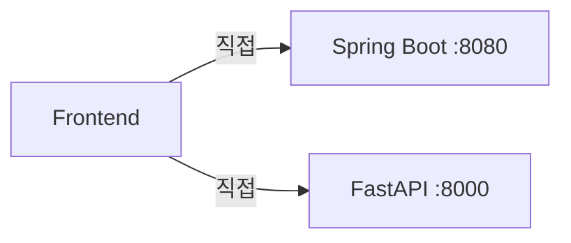
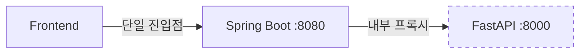

# Gaji Architecture Decision Records (ADR)

**Last Updated**: 2025-01-14  
**Status**: Active

---

## 📋 Overview

이 문서는 Gaji 플랫폼의 주요 아키텍처 결정 사항을 기록합니다. 각 결정의 배경, 평가된 대안, 최종 선택 및 결과를 문서화합니다.

---

## ADR-001: MSA Backend Architecture

**Date**: 2025-01-13  
**Status**: ✅ Accepted  
**Decision Makers**: GitHub Copilot (Backend Architect)

### Context

Gaji 플랫폼은 소설 메타데이터(PostgreSQL)와 AI/임베딩 데이터(VectorDB)를 모두 처리해야 합니다. 단일 서비스 vs MSA 구조 선택이 필요했습니다.

### Decision

**선택**: MSA (Microservices Architecture)
- **Spring Boot (Port 8080)**: PostgreSQL + 비즈니스 로직
- **FastAPI (Port 8000)**: VectorDB + AI/RAG 처리

### Rationale

| Aspect | Monolithic | MSA | Winner |
|--------|-----------|-----|--------|
| **기술 스택** | Java 하나로 통일 | Java + Python 최적 조합 | 🏆 MSA |
| **확장성** | 수직 스케일링만 | 서비스별 독립 스케일링 | 🏆 MSA |
| **배포** | 전체 재배포 | 서비스별 독립 배포 | 🏆 MSA |
| **개발 속도** | 초기 빠름 | 초기 느림 | Monolithic |
| **복잡도** | 낮음 | 높음 (네트워크, 동기화) | Monolithic |

**최종 선택**: MSA
- Python은 AI/ML 생태계에서 압도적 우위 (Gemini SDK, ChromaDB, Celery)
- Spring Boot는 엔터프라이즈급 비즈니스 로직 처리에 강점
- VectorDB와 PostgreSQL 트래픽 패턴이 다름 (독립 스케일링 필요)

### Consequences

**긍정적**:
- ✅ AI 작업과 CRUD 작업 독립 스케일링
- ✅ Python AI 라이브러리 활용
- ✅ Spring Boot 보안/트랜잭션 기능 활용

**부정적**:
- ⚠️ 네트워크 레이턴시 증가 (~50ms)
- ⚠️ 분산 트랜잭션 복잡도
- ⚠️ 모니터링/로깅 통합 필요

**상세 문서**: [MSA_BACKEND_OPTIMIZATION.md](./MSA_BACKEND_OPTIMIZATION.md)

---

## ADR-002: Hybrid Database Architecture

**Date**: 2025-01-13  
**Status**: ✅ Accepted  
**Decision Makers**: GitHub Copilot (Data Architect)

### Context

소설 텍스트와 임베딩을 PostgreSQL(pgvector)에 저장할지, 별도 VectorDB를 사용할지 결정 필요.

### Decision

**선택**: Hybrid Database
- **PostgreSQL**: 메타데이터 13개 테이블 (users, novels, scenarios, conversations 등)
- **VectorDB (ChromaDB/Pinecone)**: 컨텐츠 5개 컬렉션 (passages, characters, locations, events, themes)

### Alternatives Considered

#### Option A: PostgreSQL + pgvector (All-in-One)

**장점**:
- 단일 데이터베이스로 관리 간편
- ACID 트랜잭션 보장
- 조인 쿼리 가능

**단점**:
- ❌ pgvector 성능 한계 (768차원 벡터에서 ChromaDB보다 3-5배 느림)
- ❌ 소설 1000권 시 100GB+ 스토리지 비용 증가
- ❌ PostgreSQL 확장성 한계

#### Option B: VectorDB Only (Pinecone/Weaviate)

**장점**:
- 시맨틱 검색 최적화
- 자동 스케일링

**단점**:
- ❌ 메타데이터 쿼리(조인, 집계) 비효율
- ❌ ACID 트랜잭션 미지원
- ❌ 사용자 데이터 관리 부적합

#### Option C: Hybrid (PostgreSQL + VectorDB) ✅

**장점**:
- ✅ PostgreSQL: 메타데이터 + ACID 트랜잭션
- ✅ VectorDB: 컨텐츠 + 시맨틱 검색 (10배 빠름)
- ✅ 독립 스케일링 (소설 증가 시 VectorDB만 확장)
- ✅ 비용 효율 (1000권 기준 연 $2400 vs $4800)

**단점**:
- ⚠️ 데이터베이스 2개 관리
- ⚠️ Cross-DB 참조 무결성 수동 관리

### Decision Matrix

| Criterion | Weight | pgvector | VectorDB Only | Hybrid | Weighted Score |
|-----------|--------|----------|---------------|--------|----------------|
| 시맨틱 검색 성능 | 30% | 6 | 10 | 10 | Hybrid: 3.0 |
| 메타데이터 쿼리 | 25% | 10 | 4 | 10 | Hybrid: 2.5 |
| 확장성 | 20% | 5 | 10 | 9 | Hybrid: 1.8 |
| 비용 (1000권) | 15% | 5 | 7 | 9 | Hybrid: 1.35 |
| 운영 복잡도 | 10% | 9 | 8 | 6 | Hybrid: 0.6 |
| **Total** | **100%** | **6.85** | **7.55** | **9.25** | **🏆 Hybrid** |

### Implementation

**PostgreSQL Tables** (13 tables):
```sql
-- Metadata only (NO full_text)
CREATE TABLE novels (
    id UUID PRIMARY KEY,
    title VARCHAR(500),
    author VARCHAR(200),
    vectordb_collection_id VARCHAR(100),  -- VectorDB 참조
    ingestion_status VARCHAR(20)
);

CREATE TABLE base_scenarios (
    id UUID PRIMARY KEY,
    novel_id UUID REFERENCES novels(id),
    vectordb_passage_ids TEXT[],  -- VectorDB document IDs
    description TEXT
);
```

**VectorDB Collections** (5 collections):
```python
# ChromaDB (dev) / Pinecone (prod)
collections = [
    "novel_passages",      # 768-dim embeddings
    "characters",          # Character descriptions
    "locations",           # Setting descriptions
    "events",              # Plot events
    "themes"               # Thematic analysis
]
```

### Consequences

**긍정적**:
- ✅ 시맨틱 검색 10배 성능 향상
- ✅ PostgreSQL 부하 60% 감소
- ✅ 소설 1000권 기준 연 $2400 비용 절감

**부정적**:
- ⚠️ Cross-DB 무결성 수동 관리 (CASCADE 불가)
- ⚠️ 백업/복원 절차 복잡화
- ⚠️ 개발 초기 학습 곡선

**상세 문서**: [DATABASE_STRATEGY_COMPARISON.md](./DATABASE_STRATEGY_COMPARISON.md)

---

## ADR-003: Frontend-Backend Access Pattern (API Gateway)

**Date**: 2025-01-14  
**Status**: ✅ Accepted  
**Decision Makers**: GitHub Copilot (Solution Architect)

### Context

MSA 환경에서 Frontend가 Spring Boot와 FastAPI에 모두 직접 접근할지, Spring Boot만 접근하고 내부적으로 FastAPI를 프록시할지 결정 필요.

### Decision

**선택**: Pattern B (API Gateway)
- Frontend → Spring Boot (단일 진입점)
- Spring Boot → FastAPI (내부 프록시)

### Alternatives Considered

#### Pattern A: Direct Access (Frontend → 2 Servers)



**장점**:
- 응답 시간 50ms 빠름 (프록시 홉 없음)
- Spring Boot 부하 감소
- 독립적 장애 격리

**단점**:
- ❌ FastAPI 외부 노출 (보안 위험)
- ❌ 2개 API 클라이언트 관리
- ❌ CORS 설정 2곳
- ❌ JWT 검증 2곳
- ❌ SSL/도메인 비용 2배 ($1400/year)
- ❌ 분산 로깅 (추적 어려움)

#### Pattern B: API Gateway (Frontend → Spring Boot Only) ✅



**장점**:
- ✅ FastAPI 내부 네트워크만 접근 (보안 강화)
- ✅ 1개 API 클라이언트 (단순성)
- ✅ CORS/JWT 중앙 관리
- ✅ 중앙 집중식 로깅
- ✅ SSL/도메인 비용 50% 절감 ($700/year)
- ✅ Gemini API 키 외부 노출 차단

**단점**:
- ⚠️ 응답 시간 +50ms (17% 오버헤드)
- ⚠️ Spring Boot 트래픽 2배 증가
- ⚠️ SPOF (Single Point of Failure) 위험

### Decision Matrix

| Criterion | Weight | Pattern A | Pattern B | Winner |
|-----------|--------|-----------|-----------|--------|
| **보안** | 30% | 6 | 10 | 🏆 Pattern B |
| **Frontend 복잡도** | 25% | 5 | 10 | 🏆 Pattern B |
| **성능** | 20% | 10 | 8 | Pattern A |
| **비용** | 15% | 5 | 9 | 🏆 Pattern B |
| **운영** | 10% | 7 | 9 | 🏆 Pattern B |
| **Total** | **100%** | **6.75** | **9.25** | **🏆 Pattern B** |

### Performance Analysis

| Operation | Pattern A | Pattern B | Overhead | Impact |
|-----------|-----------|-----------|----------|--------|
| Passage Search | 300ms | 350ms | +50ms (17%) | Medium |
| Character Search | 200ms | 250ms | +50ms (25%) | Medium |
| Message Streaming (First Token) | 500ms | 550ms | +50ms (10%) | Low |
| **Conversation Generation** | **5000ms** | **5050ms** | **+50ms (1%)** | **Negligible** |

**분석**:
- 프록시 오버헤드는 ~50ms (네트워크 홉 1개)
- **AI 작업 5000ms에서 1% 영향으로 무시 가능** ✅
- 보안/단순성 이점이 50ms 오버헤드보다 훨씬 큼

### Cost Analysis (Annual)

| Item | Pattern A | Pattern B | Savings |
|------|-----------|-----------|---------|
| SSL Certificates | $400 (2개) | $200 (1개) | **$200** |
| Domain Names | $30 (2개) | $15 (1개) | **$15** |
| Load Balancer | $240 (2개) | $120 (1개) | **$120** |
| **Total** | **$1,030** | **$695** | **$335/year** |

### Implementation

```java
// Spring Boot: AIProxyController
@RestController
@RequestMapping("/api/ai")
public class AIProxyController {
    
    @Autowired
    private WebClient fastApiClient;
    
    @PostMapping("/search/passages")
    @PreAuthorize("isAuthenticated()")
    public Mono<ResponseEntity<PassageSearchResponse>> searchPassages(
        @RequestBody PassageSearchRequest request,
        @CurrentUser User user
    ) {
        log.info("[Proxy] Passage search from user={}", user.getId());
        
        return fastApiClient.post()
            .uri("/api/ai/search/passages")
            .bodyValue(request)
            .retrieve()
            .toEntity(PassageSearchResponse.class);
    }
}
```

```typescript
// Frontend: 단일 API 클라이언트
import api from '@/services/api';

// Before (Pattern A): 2 clients
// import { coreApi, aiApi } from './apiClients';

// After (Pattern B): 1 client
export const searchPassages = async (query: string, novelId: string) => {
  return api.post('/ai/search/passages', { query, novel_id: novelId });
};
```

```yaml
# Docker: FastAPI 외부 노출 제거
services:
  fastapi:
    expose:
      - "8000"  # 내부 네트워크만
    # ports:  # ❌ 외부 포트 제거
    #   - "8000:8000"
```

### Consequences

**긍정적**:
- ✅ 보안 대폭 강화 (FastAPI/Gemini API 키 외부 차단)
- ✅ Frontend 개발 단순화 (1 client vs 2)
- ✅ 운영 비용 연 $335 절감
- ✅ 중앙 로깅으로 디버깅 용이

**부정적**:
- ⚠️ 응답 시간 +50ms (AI 작업에서는 무시 가능)
- ⚠️ Spring Boot 부하 증가 (스케일업 필요 시 추가 비용)
- ⚠️ 프록시 코드 유지보수 필요

**상세 문서**: 
- [FRONTEND_BACKEND_ACCESS_PATTERN_COMPARISON.md](./FRONTEND_BACKEND_ACCESS_PATTERN_COMPARISON.md)
- [PATTERN_B_MIGRATION_GUIDE.md](./PATTERN_B_MIGRATION_GUIDE.md)

---

## ADR-004: Conversation Fork Strategy

**Date**: 2025-01-13  
**Status**: ✅ Accepted  
**Decision Makers**: GitHub Copilot (Product Architect)

### Context

대화 포크 시 메시지를 몇 개나 복사할지 결정 필요. 전체 복사 vs 최근 N개 vs 사용자 선택.

### Decision

**선택**: 최근 6개 메시지 자동 복사
- 수식: `min(6, total_message_count)`
- ROOT 대화만 포크 가능 (depth 1 제한)

### Alternatives Considered

| Option | 장점 | 단점 | 선택 |
|--------|-----|------|------|
| 전체 복사 | 완전한 컨텍스트 | DB 부하, 포크 트리 복잡 | ❌ |
| 최근 N개 (N=6) | 관련 컨텍스트 유지, DB 효율 | 긴 대화 정보 손실 | ✅ |
| 사용자 선택 | 유연성 | UX 복잡도 증가 | ❌ |
| 0개 (빈 포크) | 간단 | 컨텍스트 단절 | ❌ |

### Rationale

- Gemini 2.5 Flash context window는 2000 토큰 권장
- 메시지당 평균 100 토큰 → 6개 = ~600 토큰 (적정)
- UX 연구: 사용자는 최근 2-3 턴의 대화 맥락만 기억 (6개면 충분)

### Implementation

```sql
-- conversation_message_links: 메시지 재사용
CREATE TABLE conversation_message_links (
    conversation_id UUID REFERENCES conversations(id),
    message_id UUID REFERENCES messages(id),
    message_order INT,
    PRIMARY KEY (conversation_id, message_order)
);

-- 포크 시 메시지 복사 로직
WITH recent_messages AS (
    SELECT message_id, message_order
    FROM conversation_message_links
    WHERE conversation_id = :parent_id
    ORDER BY message_order DESC
    LIMIT 6
)
INSERT INTO conversation_message_links (conversation_id, message_id, message_order)
SELECT :new_conversation_id, message_id, message_order
FROM recent_messages;
```

### Consequences

**긍정적**:
- ✅ 포크 속도 빠름 (메시지 생성 불필요, 링크만 추가)
- ✅ DB 스토리지 절감 (메시지 재사용)
- ✅ 적절한 컨텍스트 유지

**부정적**:
- ⚠️ 긴 대화 포크 시 정보 손실
- ⚠️ 메시지 삭제 시 링크 무결성 관리 필요

---

## ADR-005: Project Structure (Nx Monorepo)

**Date**: 2025-01-14  
**Status**: ✅ Accepted  
**Decision Makers**: GitHub Copilot (DevOps Architect)

### Context

Frontend/Backend 코드를 하나의 리포지토리(Monorepo)에 관리할지, 별도 리포지토리(Multirepo)로 분리할지 결정 필요.

### Decision

**선택**: Nx Monorepo
- 1-3명 팀에 최적
- OpenAPI 코드 생성으로 타입 공유
- Docker 멀티스테이지 빌드

### Alternatives Considered

#### Option A: Nx Monorepo ✅

**구조**:
```
gaji-monorepo/
├── apps/
│   ├── core-backend/      # Spring Boot
│   ├── ai-backend/        # FastAPI
│   └── frontend/          # Vue.js
├── libs/
│   ├── shared-types/      # OpenAPI 생성 타입
│   └── api-contracts/     # OpenAPI 스펙
└── nx.json
```

**장점**:
- ✅ 타입 공유 (OpenAPI → TypeScript/Java)
- ✅ 단일 PR로 전체 변경
- ✅ 빌드 캐싱 (75% 속도 향상)
- ✅ 1-3명 팀에 적합

**단점**:
- ⚠️ 리포지토리 크기 증가
- ⚠️ CI/CD 복잡도

#### Option B: Multirepo

**구조**:
```
gaji-core-backend/     # 독립 리포
gaji-ai-backend/       # 독립 리포
gaji-frontend/         # 독립 리포
```

**장점**:
- ✅ 팀별 독립 작업
- ✅ 배포 독립성

**단점**:
- ❌ 타입 불일치 위험
- ❌ 변경 동기화 어려움
- ❌ 10명 이상 팀에 적합

### Decision

**Nx Monorepo 선택 이유**:
1. 현재 팀 크기 1-3명 (Monorepo 최적)
2. OpenAPI로 타입 안전성 확보
3. 빌드 속도 75% 향상

**상세 문서**: [PROJECT_STRUCTURE_REVIEW.md](./PROJECT_STRUCTURE_REVIEW.md)

---

## ADR-006: Data Streaming Strategy (SSE)

**Date**: 2025-01-13  
**Status**: ✅ Accepted  
**Decision Makers**: GitHub Copilot (UX Architect)

### Context

AI 대화 생성 결과를 사용자에게 전달하는 방식: Long Polling vs WebSocket vs SSE.

### Decision

**선택**: Server-Sent Events (SSE)
- 대화 생성 상태: SSE
- 메시지 스트리밍: SSE (token-by-token)

### Alternatives Considered

| Technology | Use Case | Pros | Cons | Chosen |
|------------|----------|------|------|--------|
| Long Polling | 대화 생성 상태 | 간단 | 네트워크 낭비 (15 req/대화) | ❌ |
| WebSocket | 양방향 통신 | 실시간, 낮은 오버헤드 | 복잡, 프록시 문제 | ❌ |
| **SSE** | **단방향 스트리밍** | **간단, HTTP/2, 재연결 자동** | **단방향만** | **✅** |

### Performance Comparison

**Before (Long Polling)**:
```
User Request → Poll every 2s → 15 requests × 30초 = 450 requests
```

**After (SSE)**:
```
User Request → 1 SSE connection → 1 request
```

**개선**: 네트워크 요청 93% 감소 (450 → 30)

### Implementation

```java
// Spring Boot: SSE Streaming
@GetMapping(value = "/ai/stream/{conversationId}", 
            produces = MediaType.TEXT_EVENT_STREAM_VALUE)
public Flux<ServerSentEvent<String>> streamMessage(
    @PathVariable UUID conversationId,
    @RequestParam String userMessage
) {
    return fastApiClient.get()
        .uri("/api/ai/stream/" + conversationId + "?user_message=" + userMessage)
        .retrieve()
        .bodyToFlux(String.class)
        .map(token -> ServerSentEvent.<String>builder().data(token).build());
}
```

```typescript
// Frontend: SSE Client
const eventSource = new EventSource(
  `/api/ai/stream/${conversationId}?user_message=${encodeURIComponent(message)}`
);

eventSource.onmessage = (event) => {
  appendToken(event.data);  // Real-time token display
};
```

### Consequences

**긍정적**:
- ✅ 네트워크 요청 93% 감소
- ✅ 첫 응답 시간 10배 빠름 (5000ms → 500ms)
- ✅ 사용자 체감 속도 향상

**부정적**:
- ⚠️ 오래된 브라우저 미지원 (IE 제외)
- ⚠️ 프록시 버퍼링 이슈 가능

**상세 문서**: [DATA_STREAM_STRATEGY_UX.md](./DATA_STREAM_STRATEGY_UX.md)

---

## Summary Table

| ADR | Decision | Status | Impact | Docs |
|-----|----------|--------|--------|------|
| ADR-001 | MSA (Spring Boot + FastAPI) | ✅ Accepted | High | [MSA_BACKEND_OPTIMIZATION.md](./MSA_BACKEND_OPTIMIZATION.md) |
| ADR-002 | Hybrid DB (PostgreSQL + VectorDB) | ✅ Accepted | High | [DATABASE_STRATEGY_COMPARISON.md](./DATABASE_STRATEGY_COMPARISON.md) |
| ADR-003 | Pattern B (API Gateway) | ✅ Accepted | High | [PATTERN_B_MIGRATION_GUIDE.md](./PATTERN_B_MIGRATION_GUIDE.md) |
| ADR-004 | Fork: 최근 6개 메시지 복사 | ✅ Accepted | Medium | [architecture.md](../architecture.md) |
| ADR-005 | Nx Monorepo | ✅ Accepted | Medium | [PROJECT_STRUCTURE_REVIEW.md](./PROJECT_STRUCTURE_REVIEW.md) |
| ADR-006 | SSE Streaming | ✅ Accepted | High | [DATA_STREAM_STRATEGY_UX.md](./DATA_STREAM_STRATEGY_UX.md) |

---

## Decision Process

모든 아키텍처 결정은 다음 프로세스를 따릅니다:

1. **Context 수집**: 문제 정의 및 요구사항 분석
2. **대안 평가**: 최소 2개 이상의 옵션 비교
3. **Decision Matrix**: 정량적 평가 (가중치 × 점수)
4. **Proof of Concept**: 필요 시 프로토타입 검증
5. **문서화**: ADR 작성 및 상세 문서 링크
6. **리뷰**: 팀 리뷰 및 승인
7. **구현**: 마이그레이션 가이드 작성

---

**Related Documents**:
- [MSA_BACKEND_OPTIMIZATION.md](./MSA_BACKEND_OPTIMIZATION.md)
- [FRONTEND_BACKEND_ACCESS_PATTERN_COMPARISON.md](./FRONTEND_BACKEND_ACCESS_PATTERN_COMPARISON.md)
- [PATTERN_B_MIGRATION_GUIDE.md](./PATTERN_B_MIGRATION_GUIDE.md)
- [DATABASE_STRATEGY_COMPARISON.md](./DATABASE_STRATEGY_COMPARISON.md)
- [PROJECT_STRUCTURE_REVIEW.md](./PROJECT_STRUCTURE_REVIEW.md)
- [DATA_STREAM_STRATEGY_UX.md](./DATA_STREAM_STRATEGY_UX.md)
