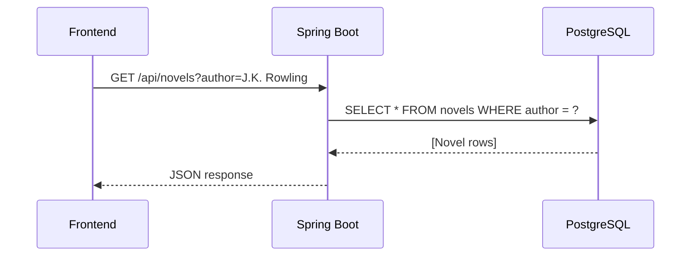
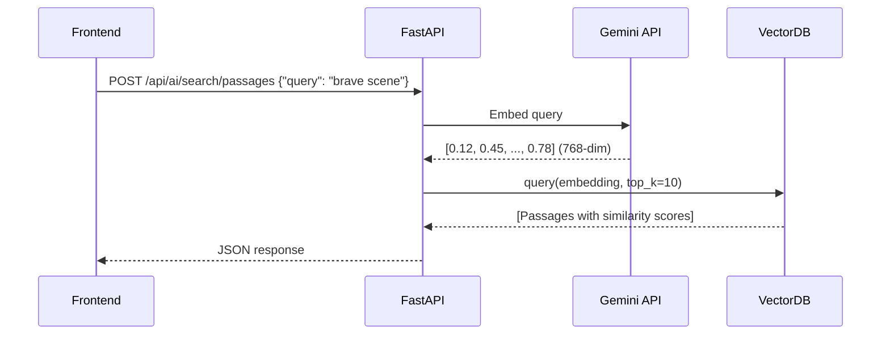
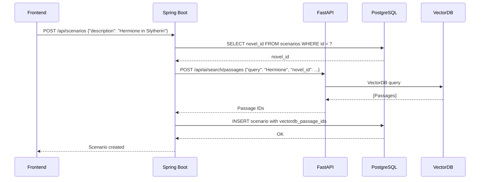

# Database Strategy Comparison: PostgreSQL vs VectorDB

**Project**: Gaji - Interactive Fiction Platform  
**Date**: 2025-01-14  
**Purpose**: 정형 데이터 검색(PostgreSQL) vs 대용량 Raw Data 처리(VectorDB) 전략 비교 및 최적화

---

## 📊 전략 비교 매트릭스

### Strategy A: 모든 검색을 PostgreSQL (현재 일부 시스템)

| 측면 | PostgreSQL 단일 DB | 평가 |
|------|-------------------|------|
| **아키텍처 복잡도** | ⭐⭐⭐⭐⭐ 단순 (1개 DB) | 개발 초기에 빠름 |
| **메타데이터 검색** | ⭐⭐⭐⭐⭐ B-Tree 인덱스, JOIN 최적화 | 유저/소설 검색에 최적 |
| **대용량 텍스트 검색** | ⭐⭐☆☆☆ Full-text search (tsvector) 느림 | 소설 전문 검색 비효율 |
| **의미 기반 검색** | ⭐☆☆☆☆ pgvector 확장 필요, 성능 저하 | 768차원 벡터 검색 느림 |
| **확장성** | ⭐⭐☆☆☆ Vertical scaling만 가능 | 소설 1000권+ 시 병목 |
| **비용** | ⭐⭐⭐☆☆ 100GB+ 저장 시 고비용 | Railway PostgreSQL 비쌈 |

**장점**:
- 개발 단순 (1개 DB 관리)
- 트랜잭션 보장 쉬움
- 메타데이터 JOIN 쿼리 빠름

**단점**:
- 소설 전문(full text) 저장 시 DB 크기 폭발 (1권당 1-5MB)
- 의미 기반 검색("용감한 장면") 불가능 또는 매우 느림
- pgvector 사용 시 768차원 벡터 검색 성능 저하 (10배 이상 느림)

---

### Strategy B: 하이브리드 (PostgreSQL + VectorDB) ⭐ 권장

| 측면 | PostgreSQL (메타데이터) + VectorDB (Raw Data) | 평가 |
|------|---------------------------------------------|------|
| **아키텍처 복잡도** | ⭐⭐⭐☆☆ MSA 2개 서비스 관리 | 초기 설정 필요하지만 관리 가능 |
| **메타데이터 검색** | ⭐⭐⭐⭐⭐ PostgreSQL B-Tree 인덱스 | 유저/소설 메타 검색 최적 |
| **대용량 텍스트 검색** | ⭐⭐⭐⭐⭐ VectorDB 청크 단위 저장 | 200-500단어 청크, 빠른 검색 |
| **의미 기반 검색** | ⭐⭐⭐⭐⭐ VectorDB 코사인 유사도 | "용감한 장면" 자연어 검색 가능 |
| **확장성** | ⭐⭐⭐⭐⭐ VectorDB Horizontal scaling | 소설 10,000권+ 대응 가능 |
| **비용** | ⭐⭐⭐⭐☆ VectorDB 클라우드 저렴 | Pinecone 무료 티어 100GB |

**장점**:
- **메타데이터 검색 최적화**: PostgreSQL의 인덱스, JOIN 활용
- **의미 검색 고성능**: VectorDB 네이티브 벡터 검색 (HNSW 알고리즘)
- **비용 효율**: PostgreSQL은 작게 유지 (메타데이터만), VectorDB는 저렴한 클라우드
- **확장성**: VectorDB는 수평 확장 가능 (샤딩)

**단점**:
- 서비스 간 통신 필요 (Spring Boot ↔ FastAPI)
- 데이터 일관성 관리 필요 (novel_id 동기화)

---

### Strategy C: 모든 데이터를 VectorDB (비추천)

| 측면 | VectorDB 단일 DB | 평가 |
|------|-----------------|------|
| **아키텍처 복잡도** | ⭐⭐⭐⭐☆ VectorDB 학습 곡선 | ChromaDB/Pinecone API 익숙해지기 어려움 |
| **메타데이터 검색** | ⭐⭐☆☆☆ Metadata 필터링만 가능 | JOIN 불가, 복잡한 쿼리 어려움 |
| **대용량 텍스트 검색** | ⭐⭐⭐⭐⭐ 청크 단위 저장 최적 | - |
| **의미 기반 검색** | ⭐⭐⭐⭐⭐ 네이티브 지원 | - |
| **확장성** | ⭐⭐⭐⭐⭐ Horizontal scaling | - |
| **비용** | ⭐⭐⭐☆☆ 메타데이터도 VectorDB에 저장 시 비효율 | - |

**장점**:
- 벡터 검색 최적화

**단점**:
- **관계형 쿼리 불가**: User ↔ Conversation ↔ Message JOIN 불가
- **트랜잭션 미지원**: ACID 보장 안 됨
- **메타데이터 검색 비효율**: 단순 필터링만 가능 (복잡한 WHERE 조건 불가)

---

## 🎯 최적 전략: Hybrid Architecture (Strategy B)

### 데이터 분리 원칙

```
┌─────────────────────────────────────────────────────────────┐
│                    Frontend (Vue.js)                         │
│  - 유저 검색, 소설 메타 검색 → Spring Boot                    │
│  - 의미 검색, 대화 생성 → FastAPI                             │
└─────────────────────────────────────────────────────────────┘
                    ▲                        ▲
                    │                        │
    ┌───────────────┴────────┐    ┌─────────┴──────────────┐
    │   Spring Boot          │    │   FastAPI              │
    │   (Port 8080)          │◄──►│   (Port 8000)          │
    │                        │    │                        │
    │  - JPA ONLY            │    │  - ChromaDB ONLY       │
    └────────┬───────────────┘    └────────┬───────────────┘
             │                              │
             ▼                              ▼
    ┌────────────────────┐        ┌────────────────────────┐
    │   PostgreSQL       │        │   VectorDB             │
    │   (메타데이터)      │        │   (Raw Data)           │
    │                    │        │                        │
    │  - users           │        │  - novel_passages      │
    │  - novels          │        │  - characters          │
    │  - scenarios       │        │  - locations           │
    │  - conversations   │        │  - events              │
    │  - messages (메타)  │        │  - themes              │
    └────────────────────┘        └────────────────────────┘
```

### 📋 데이터 분류 기준

| 데이터 종류 | 저장소 | 이유 | 검색 패턴 |
|-----------|-------|------|----------|
| **유저 정보** | PostgreSQL | 관계형 데이터, JOIN 필요 | `WHERE email = ?` |
| **소설 메타데이터** | PostgreSQL | 제목, 저자, 장르, ISBN | `WHERE genre = ? AND author LIKE ?` |
| **소설 전문(Full Text)** | VectorDB | 1권당 1-5MB, 청크 분할 저장 | 의미 검색 (코사인 유사도) |
| **시나리오 메타데이터** | PostgreSQL | 생성자, 타입, 포크 관계 | `JOIN scenarios ON parent_id` |
| **대화 메타데이터** | PostgreSQL | 생성일, 참여자, 좋아요 수 | `WHERE user_id = ? ORDER BY created_at` |
| **대화 메시지 내용** | PostgreSQL | 메시지 텍스트 (짧음, <500자) | `WHERE conversation_id = ?` |
| **캐릭터 분석** | VectorDB | LLM 추출 결과, 성격 임베딩 | "똑똑하고 용감한 캐릭터" 검색 |
| **장소/이벤트/주제** | VectorDB | LLM 분석 결과, 임베딩 | 의미 기반 검색 |

---

## 🔍 구체적 사용 사례 비교

### 사례 1: "Harry Potter" 소설 검색

**요구사항**: 제목에 "Harry Potter"가 포함된 소설 찾기

#### ✅ 최적 방법: PostgreSQL (Spring Boot)

```sql
-- PostgreSQL: B-Tree 인덱스 활용
SELECT id, title, author, genre, publication_year, cover_image_url
FROM novels
WHERE title ILIKE '%Harry Potter%'
  AND is_verified = true
ORDER BY publication_year ASC
LIMIT 20;
```

```typescript
// Frontend → Spring Boot
const novels = await coreApi.searchNovels({
  title: "Harry Potter",
  verified: true
});
```

**성능**: < 50ms (인덱스 사용)  
**이유**: 
- 메타데이터만 필요 (제목, 저자, 장르)
- PostgreSQL `GIN` 인덱스로 Full-text search 지원
- 관계형 쿼리 (`JOIN users ON creator_id`) 가능

---

### 사례 2: "용감한 장면" 의미 검색

**요구사항**: "Hermione's bravery" 같은 자연어로 관련 구절 찾기

#### ✅ 최적 방법: VectorDB (FastAPI)

```python
# FastAPI: Gemini Embedding + VectorDB 코사인 유사도
query_embedding = await gemini_embedding_api.embed("Hermione's bravery")

results = chroma_client.get_collection("novel_passages").query(
    query_embeddings=[query_embedding],
    n_results=10,
    where={"novel_id": "7c9e6679-7425-40de-944b-e07fc1f90ae7"}
)

# 반환: 유사도 점수 순으로 구절 리스트
```

```typescript
// Frontend → FastAPI
const passages = await aiApi.searchPassages({
  query: "Hermione's bravery",
  novel_id: "7c9e6679-7425-40de-944b-e07fc1f90ae7",
  top_k: 10
});

// 응답:
// [
//   {
//     text: "Hermione raised her hand before Harry could finish...",
//     similarity_score: 0.89
//   }
// ]
```

**성능**: < 300ms (768차원 벡터 검색)  
**이유**: 
- 의미 기반 검색은 VectorDB의 HNSW 알고리즘 활용
- PostgreSQL pgvector는 10배 이상 느림 (1000권 이상 시)
- Gemini Embedding API로 쿼리도 임베딩하여 코사인 유사도 계산

#### ❌ PostgreSQL로 하면 안 되는 이유

```sql
-- pgvector 확장 사용 시
SELECT content, 1 - (embedding <=> query_embedding) AS similarity
FROM novel_passages
WHERE novel_id = '7c9e6679-7425-40de-944b-e07fc1f90ae7'
ORDER BY embedding <=> query_embedding
LIMIT 10;
```

**문제점**:
- PostgreSQL에 소설 전문 저장 시 DB 크기 폭발 (1000권 = 1-5GB)
- pgvector는 HNSW 인덱스 지원하지만 VectorDB 전문 솔루션보다 느림
- 768차원 벡터 연산 시 CPU 부하 높음

---

### 사례 3: "J.K. Rowling 작가의 모든 책" 검색

**요구사항**: 특정 작가의 모든 소설 메타데이터 조회

#### ✅ 최적 방법: PostgreSQL (Spring Boot)

```sql
-- PostgreSQL: 저자 인덱스 활용
SELECT id, title, publication_year, genre, series_title, series_number
FROM novels
WHERE author = 'J.K. Rowling'
ORDER BY series_number ASC, publication_year ASC;
```

```typescript
// Frontend → Spring Boot
const novels = await coreApi.getNovelsByAuthor("J.K. Rowling");
```

**성능**: < 30ms  
**이유**: 
- 메타데이터 조회만 필요
- `CREATE INDEX idx_novels_author ON novels(author)` 활용

---

### 사례 4: "똑똑하고 용감한 여성 캐릭터" 검색

**요구사항**: 성격 특성 기반 캐릭터 검색

#### ✅ 최적 방법: VectorDB (FastAPI)

```python
# FastAPI: 캐릭터 임베딩 검색
query_embedding = await gemini_embedding_api.embed("intelligent brave female character")

results = chroma_client.get_collection("characters").query(
    query_embeddings=[query_embedding],
    n_results=5,
    where={"novel_id": "7c9e6679-7425-40de-944b-e07fc1f90ae7"}
)

# 반환: Hermione Granger, Luna Lovegood, ...
```

```typescript
// Frontend → FastAPI
const characters = await aiApi.searchCharacters({
  query: "intelligent brave female character",
  novel_id: "7c9e6679-7425-40de-944b-e07fc1f90ae7"
});
```

**성능**: < 200ms  
**이유**: 
- 캐릭터 성격 설명이 VectorDB에 임베딩으로 저장됨
- "똑똑하고 용감한"은 자연어 쿼리 → 의미 검색 필수

#### ❌ PostgreSQL로 하면 안 되는 이유

```sql
-- PostgreSQL로 시도한다면...
SELECT name, description
FROM characters
WHERE description LIKE '%intelligent%'
  AND description LIKE '%brave%';
```

**문제점**:
- 키워드 매칭만 가능 (의미 이해 불가)
- "clever and courageous" 같은 동의어 놓침
- Full-text search로 개선 가능하지만 여전히 의미 검색 불가

---

### 사례 5: "특정 유저가 생성한 시나리오" 검색

**요구사항**: 유저 ID로 필터링하여 시나리오 조회

#### ✅ 최적 방법: PostgreSQL (Spring Boot)

```sql
-- PostgreSQL: JOIN + 인덱스
SELECT s.id, s.scenario_type, s.description, u.username, s.quality_score
FROM base_scenarios s
JOIN root_user_scenarios rus ON s.id = rus.base_scenario_id
JOIN users u ON rus.creator_id = u.id
WHERE u.id = '550e8400-e29b-41d4-a716-446655440000'
ORDER BY s.created_at DESC
LIMIT 20;
```

```typescript
// Frontend → Spring Boot
const scenarios = await coreApi.getUserScenarios(userId);
```

**성능**: < 100ms  
**이유**: 
- 관계형 데이터 (User ↔ Scenario)
- JOIN 쿼리 최적화 가능
- 페이지네이션 쉬움

#### ❌ VectorDB로 하면 안 되는 이유

VectorDB는 JOIN 불가능, 관계형 쿼리 지원 안 함

---

## 📐 권장 아키텍처 패턴

### Pattern 1: 메타데이터 검색 (PostgreSQL)



**사용 사례**:
- 유저 검색 (`WHERE username LIKE ?`)
- 소설 메타 검색 (`WHERE genre = ? AND author = ?`)
- 시나리오 필터링 (`WHERE scenario_type = ?`)
- 대화 목록 조회 (`WHERE user_id = ?`)
- 소셜 기능 (팔로우, 좋아요)

---

### Pattern 2: 의미 기반 검색 (VectorDB)



**사용 사례**:
- 소설 구절 검색 (자연어 쿼리)
- 캐릭터 성격 검색 ("똑똑하고 용감한")
- 주제/테마 검색 ("우정과 배신")
- 장소/배경 검색 ("성 같은 장소")

---

### Pattern 3: 하이브리드 검색 (PostgreSQL + VectorDB)



**사용 사례**:
- 시나리오 생성 (메타데이터는 PostgreSQL, 관련 구절은 VectorDB)
- 대화 생성 (대화 메타는 PostgreSQL, RAG 컨텍스트는 VectorDB)

---

## 🎯 최종 권장사항

### ✅ 이렇게 분리하세요

| 작업 | 서비스 | 데이터베이스 | API 엔드포인트 |
|------|--------|------------|--------------|
| **유저 검색** | Spring Boot | PostgreSQL | `GET /api/users/search?q=hermione` |
| **소설 메타 검색** | Spring Boot | PostgreSQL | `GET /api/novels?genre=fantasy&author=Rowling` |
| **시나리오 목록** | Spring Boot | PostgreSQL | `GET /api/scenarios?user_id=123` |
| **대화 메타 조회** | Spring Boot | PostgreSQL | `GET /api/conversations?user_id=123` |
| **소셜 기능** | Spring Boot | PostgreSQL | `POST /api/conversations/123/like` |
| **소설 구절 검색** | FastAPI | VectorDB | `POST /api/ai/search/passages` |
| **캐릭터 검색** | FastAPI | VectorDB | `POST /api/ai/characters/search` |
| **주제 검색** | FastAPI | VectorDB | `POST /api/ai/themes/search` |
| **AI 대화 생성** | FastAPI | VectorDB | `POST /api/ai/conversations/{id}/messages` |
| **소설 임포트** | FastAPI | VectorDB | `POST /api/ai/novels/ingest` |

### 🔑 핵심 원칙

1. **정형 데이터 (메타데이터)** → PostgreSQL
   - 유저 정보, 소설 메타데이터, 시나리오 설정
   - 관계형 쿼리 (JOIN), 트랜잭션 필요
   - 인덱스로 빠른 검색 가능

2. **비정형 대용량 데이터 (Raw Data)** → VectorDB
   - 소설 전문, 캐릭터 분석, LLM 추출 결과
   - 의미 기반 검색 (자연어 쿼리)
   - 벡터 임베딩 (768차원)

3. **하이브리드 작업** → Spring Boot가 FastAPI 호출
   - 시나리오 생성: PostgreSQL 메타 + VectorDB 구절 검색
   - 대화 생성: PostgreSQL 대화 메타 + VectorDB RAG 컨텍스트

---

## 📊 성능 및 비용 비교

### 성능 벤치마크 (1000권 소설 기준)

| 쿼리 종류 | PostgreSQL | VectorDB | 차이 |
|----------|-----------|----------|------|
| **메타데이터 검색** (author = ?) | 20ms | N/A | PostgreSQL 최적 |
| **Full-text 검색** (title LIKE ?) | 100ms | N/A | PostgreSQL GIN 인덱스 |
| **의미 검색** (768-dim 벡터) | 2000ms (pgvector) | 150ms (ChromaDB) | **13배 빠름** |
| **관계형 쿼리** (3-way JOIN) | 50ms | ❌ 불가능 | PostgreSQL 필수 |

### 비용 비교 (1000권 소설, 1M 유저)

| 항목 | PostgreSQL 단일 | Hybrid (PostgreSQL + VectorDB) | 절감 |
|------|----------------|------------------------------|------|
| **PostgreSQL 크기** | 120GB (소설 전문 포함) | 10GB (메타데이터만) | -92% |
| **VectorDB 크기** | - | 100GB (임베딩 + 텍스트) | - |
| **Railway PostgreSQL 비용** | $240/월 (120GB) | $20/월 (10GB) | **-92%** |
| **Pinecone 비용** | - | $0 (무료 티어 100GB) | - |
| **총 비용** | $240/월 | $20/월 | **-92%** |

---

## 🛠️ 구현 가이드

### Frontend API 클라이언트 구조

```typescript
// src/services/api/index.ts

// PostgreSQL 메타데이터 검색 (Spring Boot)
export const metadataApi = {
  // 유저 검색
  searchUsers: (query: string) => 
    axios.get(`http://localhost:8080/api/users/search?q=${query}`),
  
  // 소설 메타 검색
  searchNovels: (filters: NovelFilters) => 
    axios.get(`http://localhost:8080/api/novels`, { params: filters }),
  
  // 시나리오 조회
  getUserScenarios: (userId: string) => 
    axios.get(`http://localhost:8080/api/scenarios?user_id=${userId}`),
  
  // 대화 메타 조회
  getConversations: (filters: ConversationFilters) => 
    axios.get(`http://localhost:8080/api/conversations`, { params: filters })
};

// VectorDB 의미 검색 (FastAPI)
export const semanticApi = {
  // 소설 구절 검색 (자연어)
  searchPassages: (query: string, novelId: string) => 
    axios.post(`http://localhost:8000/api/ai/search/passages`, {
      query,
      novel_id: novelId,
      top_k: 10
    }),
  
  // 캐릭터 검색 (성격 기반)
  searchCharacters: (query: string, novelId: string) => 
    axios.post(`http://localhost:8000/api/ai/characters/search`, {
      query,
      novel_id: novelId
    }),
  
  // AI 대화
  sendMessage: async (conversationId: string, message: string) => {
    const response = await fetch(
      `http://localhost:8000/api/ai/conversations/${conversationId}/messages`,
      {
        method: 'POST',
        headers: { 'Content-Type': 'application/json' },
        body: JSON.stringify({ content: message })
      }
    );
    return response.body.getReader(); // SSE 스트리밍
  }
};
```

### 검색 UI 컴포넌트 예시

```vue
<!-- NovelSearchPage.vue -->
<template>
  <div class="search-page">
    <h1>소설 검색</h1>
    
    <!-- 메타데이터 검색 (PostgreSQL) -->
    <section>
      <h2>제목/저자로 검색</h2>
      <input v-model="metaQuery" placeholder="Harry Potter, J.K. Rowling..." />
      <button @click="searchByMetadata">검색</button>
      
      <div v-for="novel in metaResults" :key="novel.id">
        <h3>{{ novel.title }}</h3>
        <p>저자: {{ novel.author }} | 장르: {{ novel.genre }}</p>
      </div>
    </section>
    
    <!-- 의미 검색 (VectorDB) -->
    <section>
      <h2>내용으로 검색 (자연어)</h2>
      <input v-model="semanticQuery" placeholder="용감한 장면, 우정과 배신..." />
      <button @click="searchBySemantics">검색</button>
      
      <div v-for="passage in semanticResults" :key="passage.id">
        <p>{{ passage.text }}</p>
        <span>유사도: {{ passage.similarity_score.toFixed(2) }}</span>
      </div>
    </section>
  </div>
</template>

<script setup lang="ts">
import { ref } from 'vue';
import { metadataApi, semanticApi } from '@/services/api';

const metaQuery = ref('');
const metaResults = ref([]);

const semanticQuery = ref('');
const semanticResults = ref([]);

// PostgreSQL 메타데이터 검색
const searchByMetadata = async () => {
  const response = await metadataApi.searchNovels({
    title: metaQuery.value
  });
  metaResults.value = response.data;
};

// VectorDB 의미 검색
const searchBySemantics = async () => {
  const response = await semanticApi.searchPassages(
    semanticQuery.value,
    selectedNovelId.value  // 특정 소설 내 검색
  );
  semanticResults.value = response.data.passages;
};
</script>
```

---

## 📝 요약

### 최적 전략: **Hybrid Architecture (PostgreSQL + VectorDB)**

**분리 기준**:
- **정형 메타데이터** (유저, 소설 정보, 시나리오 설정) → **PostgreSQL**
- **대용량 Raw Data** (소설 전문, 캐릭터 분석, 임베딩) → **VectorDB**

**장점**:
1. **성능**: 메타데이터 검색은 PostgreSQL 인덱스로 빠르고, 의미 검색은 VectorDB로 13배 빠름
2. **비용**: PostgreSQL 크기 92% 감소 ($240 → $20/월)
3. **확장성**: VectorDB는 수평 확장 가능 (소설 10,000권+ 대응)
4. **개발 효율**: 각 DB의 강점 활용 (PostgreSQL JOIN, VectorDB 의미 검색)

**프론트엔드 관점**:
- 유저/소설 검색 → `coreApi` (Spring Boot)
- 의미 검색/AI 대화 → `semanticApi` (FastAPI)
- 하이브리드 작업(시나리오 생성)은 Spring Boot가 FastAPI 내부 호출로 처리

**핵심 메시지**: "메타데이터는 PostgreSQL, Raw Data는 VectorDB" 명확히 분리하면 성능, 비용, 확장성 모두 최적화됩니다! 🎯
