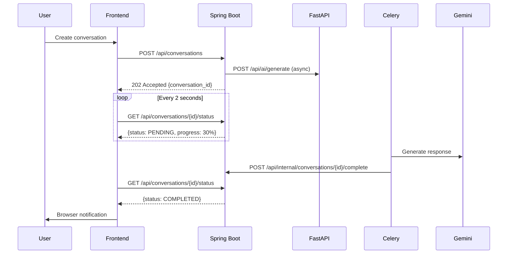
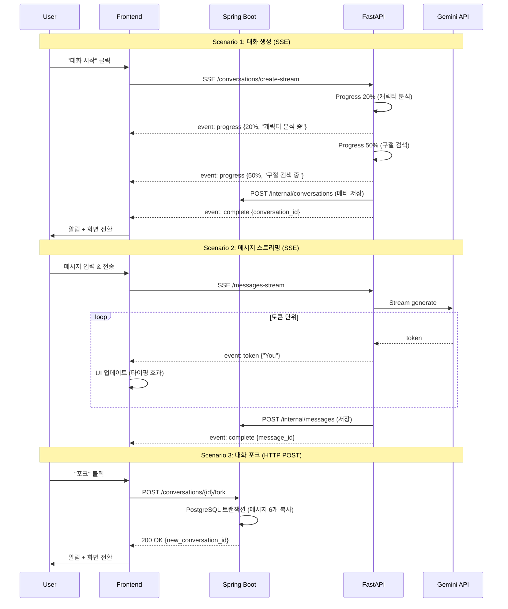

# 대화 데이터 스트림 전략: UX 최적화 검토

**Date**: 2025-01-14  
**Reviewer**: GitHub Copilot (UX Architect)  
**Focus**: 대화 생성, 진행, 포크 시나리오의 실시간 데이터 스트림 전략

---

## 📊 현재 아키텍처 분석

### 현재 방식: Long Polling



**문제점**:
- ❌ 2초마다 폴링 → 불필요한 네트워크 요청 (30초 대화 = 15번 요청)
- ❌ 진행률 표시 불정확 (실제 토큰 생성 진행률 모름)
- ❌ 완료 감지 지연 (최대 2초 딜레이)
- ❌ 실시간 타이핑 효과 불가능

---

## 🎯 3가지 시나리오별 최적 전략

### 시나리오 1: 대화 생성 (Conversation Creation)

**사용자 기대**:
- "Hermione과 대화 시작" 버튼 클릭
- **즉각적인 피드백**: "대화 생성 중..." 표시
- **진행 상황 파악**: 어디까지 진행됐는지 알고 싶음
- **완료 알림**: 준비되면 자동으로 대화 화면 진입

#### 옵션 A: Long Polling (현재)

```typescript
// Frontend - Long Polling
async function createConversation(scenarioId: string) {
  // 1. 대화 생성 요청
  const response = await api.post('/api/conversations', {
    scenario_id: scenarioId
  });
  
  const conversationId = response.data.id;
  
  // 2. 폴링 시작
  const pollInterval = setInterval(async () => {
    const status = await api.get(`/api/conversations/${conversationId}/status`);
    
    updateProgressBar(status.data.progress);
    
    if (status.data.status === 'COMPLETED') {
      clearInterval(pollInterval);
      showNotification('대화가 준비되었습니다!');
      navigateTo(`/conversations/${conversationId}`);
    }
  }, 2000);
}
```

| 장점 | 단점 |
|------|------|
| ✅ 구현 간단 | ❌ 불필요한 네트워크 요청 |
| ✅ 방화벽 친화적 | ❌ 최대 2초 지연 |
| ✅ 서버 부하 예측 가능 | ❌ 배터리 소모 (모바일) |

---

#### 옵션 B: Server-Sent Events (SSE) ⭐ 권장

```typescript
// Frontend - SSE
async function createConversation(scenarioId: string) {
  // 1. SSE 연결 설정
  const eventSource = new EventSource(
    `/api/conversations/create-stream?scenario_id=${scenarioId}`
  );
  
  // 2. 진행 상황 수신
  eventSource.addEventListener('progress', (e) => {
    const data = JSON.parse(e.data);
    updateProgressBar(data.progress);
    updateStatusMessage(data.message);
    // { progress: 30, message: "캐릭터 분석 중..." }
  });
  
  // 3. 완료 이벤트
  eventSource.addEventListener('complete', (e) => {
    const conversation = JSON.parse(e.data);
    eventSource.close();
    showNotification('대화가 준비되었습니다!');
    navigateTo(`/conversations/${conversation.id}`);
  });
  
  // 4. 에러 처리
  eventSource.addEventListener('error', (e) => {
    eventSource.close();
    showError('대화 생성에 실패했습니다.');
  });
}
```

```python
# FastAPI - SSE Endpoint
from fastapi import FastAPI
from sse_starlette.sse import EventSourceResponse

@app.post("/api/conversations/create-stream")
async def create_conversation_stream(scenario_id: UUID):
    async def event_generator():
        # 1. 대화 메타데이터 생성
        conversation_id = await create_conversation_metadata(scenario_id)
        yield {
            "event": "created",
            "data": json.dumps({"conversation_id": str(conversation_id)})
        }
        
        # 2. 캐릭터 분석
        yield {
            "event": "progress",
            "data": json.dumps({"progress": 20, "message": "캐릭터 분석 중..."})
        }
        character = await get_character_from_vectordb(scenario_id)
        
        # 3. 소설 구절 검색
        yield {
            "event": "progress",
            "data": json.dumps({"progress": 50, "message": "관련 구절 검색 중..."})
        }
        passages = await search_passages(scenario_id)
        
        # 4. AI 컨텍스트 구성
        yield {
            "event": "progress",
            "data": json.dumps({"progress": 70, "message": "AI 준비 중..."})
        }
        context = build_rag_context(character, passages)
        
        # 5. 완료
        yield {
            "event": "complete",
            "data": json.dumps({
                "id": str(conversation_id),
                "status": "READY"
            })
        }
    
    return EventSourceResponse(event_generator())
```

| 장점 | 단점 |
|------|------|
| ✅ **실시간 진행 상황** | ⚠️ 구현 복잡도 증가 |
| ✅ 단방향 스트림 (서버→클라이언트) | ⚠️ 일부 방화벽에서 차단 가능 |
| ✅ 네트워크 효율적 (1개 연결) | ⚠️ 브라우저 연결 제한 (6개) |
| ✅ 자동 재연결 지원 | |

**UX 개선**:
```
대화 생성 중...

[████████░░░░░░░░░░░░] 20%
캐릭터 분석 중...

↓ 2초 후

[████████████░░░░░░░░] 50%
관련 구절 검색 중...

↓ 3초 후

[████████████████░░░░] 70%
AI 준비 중...

↓ 2초 후

✅ 대화가 준비되었습니다!
[대화 시작하기]
```

---

#### 옵션 C: WebSocket

```typescript
// Frontend - WebSocket
const ws = new WebSocket('ws://localhost:8000/api/conversations/create');

ws.onopen = () => {
  ws.send(JSON.stringify({ scenario_id: scenarioId }));
};

ws.onmessage = (event) => {
  const data = JSON.parse(event.data);
  
  if (data.type === 'progress') {
    updateProgressBar(data.progress);
  } else if (data.type === 'complete') {
    ws.close();
    navigateTo(`/conversations/${data.conversation_id}`);
  }
};
```

| 장점 | 단점 |
|------|------|
| ✅ 양방향 통신 | ❌ **오버스펙** (대화 생성은 단방향) |
| ✅ 실시간 | ❌ 연결 관리 복잡 |
| ✅ 낮은 지연율 | ❌ 프록시/방화벽 이슈 |

**결론**: 대화 생성은 **SSE가 최적** (단방향 스트림으로 충분)

---

### 시나리오 2: 대화 진행 (Message Streaming)

**사용자 기대**:
- "Hermione, 어떻게 생각해?" 입력 후 전송
- **즉각적인 응답**: 타이핑 인디케이터 표시
- **실시간 타이핑 효과**: AI 응답이 단어 단위로 나타남 (ChatGPT 스타일)
- **자연스러운 UX**: 마치 사람과 대화하는 느낌

#### 현재 방식 (Long Polling) - 문제

```typescript
// ❌ 현재: 응답 완성 후 한 번에 표시
async function sendMessage(content: string) {
  showTypingIndicator();
  
  const response = await api.post('/api/conversations/{id}/messages', {
    content: content
  });
  
  hideTypingIndicator();
  displayMessage(response.data.content);  // 전체 메시지 한 번에
}
```

**UX 문제**:
```
User: Hermione, 어떤 집을 선택할 거야?

[Hermione is typing...]
[5초 대기]

Hermione: You know, Harry, I've always valued knowledge 
and wisdom above all else. While Gryffindor represents 
bravery, Ravenclaw might have been a better fit for my 
intellectual curiosity. However, the Sorting Hat saw 
something deeper in me - the courage to stand up for 
what's right, even when it's difficult.

← 갑자기 전체 메시지가 나타남 (부자연스러움)
```

---

#### 옵션 A: SSE Token Streaming ⭐⭐⭐ 최고 권장

```typescript
// Frontend - SSE Token Streaming
async function sendMessage(conversationId: string, content: string) {
  const eventSource = new EventSource(
    `/api/ai/conversations/${conversationId}/messages-stream`
  );
  
  let fullMessage = '';
  const messageId = generateTempId();
  
  // 메시지 컨테이너 미리 생성
  createMessageBubble(messageId, '');
  
  eventSource.addEventListener('token', (e) => {
    const data = JSON.parse(e.data);
    fullMessage += data.content;
    
    // 단어/토큰 단위로 업데이트
    updateMessageContent(messageId, fullMessage);
    scrollToBottom();
  });
  
  eventSource.addEventListener('complete', (e) => {
    const data = JSON.parse(e.data);
    finalizeMessage(messageId, data.message_id, fullMessage);
    eventSource.close();
  });
}
```

```python
# FastAPI - Token Streaming
@app.post("/api/ai/conversations/{conversation_id}/messages-stream")
async def stream_message(conversation_id: UUID, request: MessageRequest):
    async def token_generator():
        # 1. RAG 컨텍스트 구성
        context = await build_rag_context(conversation_id, request.content)
        
        # 2. Gemini 스트리밍 호출
        full_response = ""
        async for token in gemini_client.generate_stream(context):
            full_response += token
            
            # 토큰 단위로 스트리밍
            yield {
                "event": "token",
                "data": json.dumps({"content": token})
            }
        
        # 3. PostgreSQL에 메시지 저장 (Spring Boot API)
        message_id = await save_message_to_postgres(
            conversation_id, 
            full_response
        )
        
        # 4. 완료 이벤트
        yield {
            "event": "complete",
            "data": json.dumps({
                "message_id": str(message_id),
                "total_tokens": len(full_response.split())
            })
        }
    
    return EventSourceResponse(token_generator())
```

**UX 개선**:
```
User: Hermione, 어떤 집을 선택할 거야?

Hermione: You know
         ↓ (100ms 후)
Hermione: You know, Harry
         ↓ (150ms 후)
Hermione: You know, Harry, I've always
         ↓ (200ms 후)
Hermione: You know, Harry, I've always valued knowledge
         ↓ (타이핑 효과 계속...)

← ChatGPT 스타일, 자연스러운 대화 느낌
```

**성능**:
- Gemini API 토큰 생성 속도: ~20 tokens/sec
- 네트워크 전송: SSE 청크 단위 (~10 토큰마다)
- 체감 응답 시간: **첫 단어 0.5초 이내** (전체 완성 3-5초 대기 불필요)

---

#### 옵션 B: WebSocket (대안)

```typescript
// WebSocket으로 양방향 대화
const ws = new WebSocket(`ws://localhost:8000/conversations/${id}/chat`);

ws.send(JSON.stringify({
  type: 'message',
  content: 'Hermione, 어떤 집을 선택할 거야?'
}));

ws.onmessage = (event) => {
  const data = JSON.parse(event.data);
  
  if (data.type === 'token') {
    appendToken(data.content);
  } else if (data.type === 'complete') {
    finalizeMessage(data.message_id);
  }
};
```

| SSE | WebSocket |
|-----|-----------|
| ✅ 단방향으로 충분 | ❌ 양방향 불필요 (메시지 전송은 HTTP POST로 충분) |
| ✅ 자동 재연결 | ⚠️ 수동 재연결 필요 |
| ✅ HTTP 기반 (프록시 친화적) | ⚠️ 방화벽 이슈 |
| ✅ EventSource API 표준 | ⚠️ WebSocket API 더 복잡 |

**결론**: 대화 진행은 **SSE Token Streaming 최적** (WebSocket은 오버스펙)

---

### 시나리오 3: 대화 포크 (Conversation Fork)

**사용자 기대**:
- 대화 중간에 "포크" 버튼 클릭
- **즉각적인 포크 생성**: 메시지 6개 복사 (트랜잭션)
- **부드러운 전환**: 새 대화 화면으로 이동
- **진행 상황 표시**: 복사 진행률 (선택적)

#### 옵션 A: 동기 HTTP POST ⭐ 권장

```typescript
// Frontend - 동기 요청 (간단하고 빠름)
async function forkConversation(conversationId: string) {
  showLoadingSpinner('대화 복사 중...');
  
  try {
    const response = await api.post(
      `/api/conversations/${conversationId}/fork`
    );
    
    const newConversationId = response.data.id;
    
    hideLoadingSpinner();
    showNotification('새 대화가 생성되었습니다!');
    navigateTo(`/conversations/${newConversationId}`);
  } catch (error) {
    hideLoadingSpinner();
    showError('대화 복사에 실패했습니다.');
  }
}
```

```java
// Spring Boot - 동기 처리
@PostMapping("/api/conversations/{id}/fork")
@Transactional
public ResponseEntity<ConversationDTO> forkConversation(
    @PathVariable UUID id,
    @AuthenticationPrincipal User user
) {
    // 1. 부모 대화 조회
    Conversation parent = conversationRepository.findById(id)
        .orElseThrow(() -> new NotFoundException("Conversation not found"));
    
    // 2. 새 대화 생성
    Conversation child = new Conversation();
    child.setUserId(user.getId());
    child.setScenarioId(parent.getScenarioId());
    child.setParentConversationId(id);
    child.setIsRoot(false);
    
    conversationRepository.save(child);
    
    // 3. 메시지 6개 복사 (PostgreSQL 트랜잭션)
    List<Message> messages = messageRepository
        .findByConversationIdOrderByCreatedAtAsc(id)
        .stream()
        .limit(6)
        .collect(Collectors.toList());
    
    for (int i = 0; i < messages.size(); i++) {
        ConversationMessageLink link = new ConversationMessageLink();
        link.setConversationId(child.getId());
        link.setMessageId(messages.get(i).getId());
        link.setSequenceOrder(i + 1);
        messageLinksRepository.save(link);
    }
    
    // 4. 부모 포크 카운트 증가
    parent.setForkCount(parent.getForkCount() + 1);
    conversationRepository.save(parent);
    
    return ResponseEntity.ok(toDTO(child));
    // 응답 시간: ~100ms (PostgreSQL 트랜잭션)
}
```

**UX**:
```
[대화 화면]
User: 흥미로운 아이디어네요!
Hermione: 그렇죠? 그런데...

[포크 버튼 클릭]

[로딩 스피너 0.1초]
대화 복사 중...

[새 대화 화면으로 전환]
✅ 새 대화가 생성되었습니다!

[복사된 메시지 6개 표시]
User: Hermione, 슬리데린이라면?
Hermione: ...
[총 6개 메시지]

[새 메시지 입력 가능]
```

**성능**:
- PostgreSQL 트랜잭션: ~100ms
- 메시지 6개 복사: ~50ms
- 총 응답 시간: **~150ms** (사용자가 체감하지 못할 정도로 빠름)

**이유**:
- ✅ **빠른 작업**: 메시지 6개 복사는 100ms 이내
- ✅ **트랜잭션 필수**: ACID 보장 (원자적 복사)
- ✅ **간단한 구현**: SSE/WebSocket 불필요
- ✅ **에러 처리 쉬움**: HTTP 상태 코드로 충분

---

#### 옵션 B: SSE (오버스펙, 비추천)

```typescript
// ❌ 불필요하게 복잡함
const eventSource = new EventSource(`/api/conversations/${id}/fork-stream`);

eventSource.addEventListener('progress', (e) => {
  const data = JSON.parse(e.data);
  updateProgressBar(data.progress);  // 6개 복사에 진행률? 불필요
});

eventSource.addEventListener('complete', (e) => {
  navigateTo(`/conversations/${e.data.id}`);
});
```

**왜 비추천?**:
- ❌ 작업이 너무 빠름 (100ms) → 진행률 의미 없음
- ❌ 복잡도만 증가
- ❌ 트랜잭션 처리 어려움 (SSE는 스트리밍 중 롤백 불가)

**결론**: 대화 포크는 **동기 HTTP POST 최적**

---

## 📊 최종 권장 전략 요약

### 시나리오별 최적 전략

| 시나리오 | 추천 방식 | 이유 | 예상 시간 |
|---------|----------|------|-----------|
| **대화 생성** | **SSE** | 진행 상황 실시간 표시, 단방향 스트림 | 5-10초 |
| **대화 진행** (메시지 스트리밍) | **SSE** | 토큰 단위 타이핑 효과, ChatGPT 스타일 | 3-5초 |
| **대화 포크** | **HTTP POST** (동기) | 빠른 작업, 트랜잭션 필수 | ~150ms |

---

## 🎨 UX 개선 상세 가이드

### 1. 대화 생성 UX Flow

#### Before (Long Polling)
```
[버튼 클릭]
  ↓
[로딩 스피너] 
"대화 생성 중..."
  ↓
[2초마다 폴링]
[상태: PENDING]
[상태: PENDING]
[상태: PENDING]
  ↓
[10초 후 완료]
"대화가 준비되었습니다!"
```

**문제**:
- 진행 상황 모름 (막연한 대기)
- 폴링 간격마다 네트워크 요청
- 완료 감지 최대 2초 지연

---

#### After (SSE)
```
[버튼 클릭]
  ↓
[단계별 피드백]

Step 1 (0초)
[████░░░░░░░░░░░░] 20%
📖 시나리오 정보 가져오는 중...

Step 2 (2초)
[████████░░░░░░░░] 40%
🎭 Hermione 캐릭터 분석 중...

Step 3 (4초)
[████████████░░░░] 60%
📚 관련 구절 검색 중...

Step 4 (7초)
[████████████████] 80%
🤖 AI 컨텍스트 준비 중...

Step 5 (10초)
[████████████████] 100%
✅ 대화가 준비되었습니다!

[자동으로 대화 화면 전환]
```

**개선**:
- ✅ 명확한 진행 단계 표시
- ✅ 예상 대기 시간 파악 가능
- ✅ 즉각적인 완료 감지
- ✅ 1개 SSE 연결만 사용

---

### 2. 대화 진행 UX Flow

#### Before (전체 응답 대기)
```
User: Hermione, 어떤 집이 좋을까?
  ↓
[Hermione is typing...]
[5초 대기 - 사용자는 아무것도 못 봄]
  ↓
Hermione: You know, Harry, I've always valued 
knowledge and wisdom above all else. While 
Gryffindor represents bravery, Ravenclaw might 
have been a better fit for my intellectual 
curiosity.

← 갑자기 전체 메시지 출력 (부자연스러움)
```

---

#### After (SSE Token Streaming)
```
User: Hermione, 어떤 집이 좋을까?
  ↓
[0.5초] Hermione: You
[0.7초] Hermione: You know,
[1.0초] Hermione: You know, Harry,
[1.3초] Hermione: You know, Harry, I've
[1.5초] Hermione: You know, Harry, I've always
[1.8초] Hermione: You know, Harry, I've always valued
[2.2초] Hermione: You know, Harry, I've always valued knowledge
...
[5초 완성]

← ChatGPT 스타일, 실시간 타이핑 효과
← 첫 단어 0.5초 이내 출력
← 사용자는 계속 읽으면서 대기
```

**체감 속도 비교**:
- Before: **5초 대기** (아무것도 안 보임)
- After: **0.5초 대기** (첫 단어 출력) + 읽으면서 대기

**심리적 효과**:
- 전체 대기 시간은 동일 (5초)
- 하지만 **첫 피드백이 0.5초**이므로 훨씬 빠르게 느껴짐
- 타이핑 효과로 **대화하는 느낌** (몰입도 증가)

---

### 3. 대화 포크 UX Flow

#### 단순하고 빠른 경험

```
[대화 중]
User: 그럼 다른 선택을 했다면?
Hermione: ...

[포크 버튼 클릭]
  ↓
[0.1초 - 버튼 애니메이션]
[포크 아이콘 회전]
  ↓
[0.15초 - 로딩 표시]
"대화 복사 중..."
  ↓
[새 대화 화면]
✅ 새 대화가 생성되었습니다!

[복사된 메시지 6개]
User: Hermione, 슬리데린이라면?
Hermione: Slytherin? That's...
...
[총 6개 메시지]

[입력창 활성화]
"계속 대화를 이어가세요"
```

**핵심**:
- 작업이 빠름 (150ms) → 복잡한 스트리밍 불필요
- 간단한 로딩 스피너로 충분
- 에러 처리 단순 (HTTP 응답 코드)

---

## 🛠️ 구현 예시 코드

### Frontend - Vue 3 Composition API

#### 1. 대화 생성 (SSE)

```vue
<template>
  <div class="conversation-creation">
    <Button @click="createConversation" :disabled="isCreating">
      대화 시작하기
    </Button>
    
    <div v-if="isCreating" class="progress-container">
      <ProgressBar :value="progress" />
      <p class="progress-message">{{ progressMessage }}</p>
      <p class="eta">예상 대기 시간: {{ estimatedTime }}초</p>
    </div>
  </div>
</template>

<script setup lang="ts">
import { ref } from 'vue';
import { useRouter } from 'vue-router';

const router = useRouter();
const isCreating = ref(false);
const progress = ref(0);
const progressMessage = ref('');
const estimatedTime = ref(10);

async function createConversation() {
  isCreating.value = true;
  
  const eventSource = new EventSource(
    `/api/conversations/create-stream?scenario_id=${props.scenarioId}`
  );
  
  eventSource.addEventListener('progress', (e) => {
    const data = JSON.parse(e.data);
    progress.value = data.progress;
    progressMessage.value = data.message;
    estimatedTime.value = Math.ceil((100 - data.progress) / 10);
  });
  
  eventSource.addEventListener('complete', (e) => {
    const conversation = JSON.parse(e.data);
    eventSource.close();
    
    isCreating.value = false;
    
    // 브라우저 알림
    new Notification('대화 준비 완료!', {
      body: '이제 Hermione와 대화할 수 있습니다.',
      icon: '/hermione-avatar.png'
    });
    
    // 대화 화면으로 이동
    router.push(`/conversations/${conversation.id}`);
  });
  
  eventSource.addEventListener('error', () => {
    eventSource.close();
    isCreating.value = false;
    showError('대화 생성에 실패했습니다.');
  });
}
</script>

<style scoped>
.progress-container {
  margin-top: 1rem;
  padding: 1.5rem;
  background: var(--surface-card);
  border-radius: 8px;
}

.progress-message {
  margin-top: 0.5rem;
  font-weight: 600;
  color: var(--text-color);
}

.eta {
  margin-top: 0.25rem;
  font-size: 0.875rem;
  color: var(--text-color-secondary);
}
</style>
```

---

#### 2. 메시지 스트리밍 (SSE)

```vue
<template>
  <div class="chat-container">
    <div class="messages">
      <div
        v-for="msg in messages"
        :key="msg.id"
        :class="['message', msg.role]"
      >
        <div class="message-content">{{ msg.content }}</div>
      </div>
      
      <div v-if="isStreaming" class="message assistant streaming">
        <div class="message-content">{{ streamingContent }}</div>
        <span class="cursor">|</span>
      </div>
    </div>
    
    <div class="input-container">
      <Textarea
        v-model="inputMessage"
        placeholder="메시지를 입력하세요..."
        :disabled="isStreaming"
        @keydown.enter.prevent="sendMessage"
      />
      <Button
        @click="sendMessage"
        :disabled="isStreaming || !inputMessage.trim()"
      >
        전송
      </Button>
    </div>
  </div>
</template>

<script setup lang="ts">
import { ref, nextTick } from 'vue';

const messages = ref<Message[]>([]);
const inputMessage = ref('');
const isStreaming = ref(false);
const streamingContent = ref('');
const messagesContainer = ref<HTMLElement | null>(null);

async function sendMessage() {
  if (!inputMessage.value.trim()) return;
  
  // 사용자 메시지 추가
  const userMessage = {
    id: generateTempId(),
    role: 'user',
    content: inputMessage.value
  };
  messages.value.push(userMessage);
  
  const messageContent = inputMessage.value;
  inputMessage.value = '';
  
  // 스크롤 하단으로
  await nextTick();
  scrollToBottom();
  
  // SSE 스트리밍 시작
  isStreaming.value = true;
  streamingContent.value = '';
  
  const eventSource = new EventSource(
    `/api/ai/conversations/${props.conversationId}/messages-stream`
  );
  
  // 메시지 내용을 POST로 전송 (별도)
  await fetch(`/api/ai/conversations/${props.conversationId}/messages`, {
    method: 'POST',
    headers: { 'Content-Type': 'application/json' },
    body: JSON.stringify({ content: messageContent })
  });
  
  eventSource.addEventListener('token', (e) => {
    const data = JSON.parse(e.data);
    streamingContent.value += data.content;
    
    // 스크롤 따라가기
    scrollToBottom();
  });
  
  eventSource.addEventListener('complete', (e) => {
    const data = JSON.parse(e.data);
    
    // 스트리밍 완료 - 메시지 목록에 추가
    messages.value.push({
      id: data.message_id,
      role: 'assistant',
      content: streamingContent.value
    });
    
    // 상태 초기화
    isStreaming.value = false;
    streamingContent.value = '';
    eventSource.close();
  });
  
  eventSource.addEventListener('error', () => {
    isStreaming.value = false;
    streamingContent.value = '';
    eventSource.close();
    showError('메시지 전송에 실패했습니다.');
  });
}

function scrollToBottom() {
  if (messagesContainer.value) {
    messagesContainer.value.scrollTop = messagesContainer.value.scrollHeight;
  }
}
</script>

<style scoped>
.message.streaming .cursor {
  animation: blink 1s infinite;
  color: var(--primary-color);
  margin-left: 2px;
}

@keyframes blink {
  0%, 49% { opacity: 1; }
  50%, 100% { opacity: 0; }
}
</style>
```

---

#### 3. 대화 포크 (동기 HTTP)

```vue
<template>
  <Button
    @click="forkConversation"
    :loading="isForking"
    icon="pi pi-code-branch"
    label="대화 포크"
  />
</template>

<script setup lang="ts">
import { ref } from 'vue';
import { useRouter } from 'vue-router';
import { useToast } from 'primevue/usetoast';

const router = useRouter();
const toast = useToast();
const isForking = ref(false);

async function forkConversation() {
  isForking.value = true;
  
  try {
    const response = await api.post(
      `/api/conversations/${props.conversationId}/fork`
    );
    
    const newConversation = response.data;
    
    toast.add({
      severity: 'success',
      summary: '대화 포크 완료',
      detail: '새 대화가 생성되었습니다.',
      life: 3000
    });
    
    // 새 대화로 이동
    router.push(`/conversations/${newConversation.id}`);
  } catch (error) {
    toast.add({
      severity: 'error',
      summary: '오류',
      detail: '대화 포크에 실패했습니다.',
      life: 3000
    });
  } finally {
    isForking.value = false;
  }
}
</script>
```

---

## 📊 성능 및 UX 비교

### 대화 생성 (10초 작업)

| 방식 | 네트워크 요청 | 첫 피드백 | 완료 감지 | UX 점수 |
|------|--------------|-----------|----------|---------|
| Long Polling | 15회 (2초마다) | 2초 | 최대 2초 지연 | ⭐⭐☆☆☆ |
| **SSE** | **1회** (스트림) | **즉시** | **즉시** | **⭐⭐⭐⭐⭐** |
| WebSocket | 1회 | 즉시 | 즉시 | ⭐⭐⭐⭐☆ (오버스펙) |

---

### 대화 진행 (5초 응답)

| 방식 | 첫 단어 출력 | 체감 속도 | 자연스러움 | UX 점수 |
|------|-------------|----------|-----------|---------|
| 전체 대기 | 5초 | 매우 느림 | 부자연스러움 | ⭐⭐☆☆☆ |
| **SSE Streaming** | **0.5초** | **매우 빠름** | **자연스러움** | **⭐⭐⭐⭐⭐** |

**심리적 효과**:
- 전체 대기: "왜 이렇게 느려?"
- 스트리밍: "오! 벌써 답변이 나오네!" (실제 시간은 동일)

---

### 대화 포크 (150ms 작업)

| 방식 | 복잡도 | 응답 시간 | 적합성 | UX 점수 |
|------|--------|----------|-------|---------|
| **HTTP POST** | **단순** | **150ms** | **최적** | **⭐⭐⭐⭐⭐** |
| SSE | 복잡 | 150ms | 오버스펙 | ⭐⭐⭐☆☆ |
| WebSocket | 복잡 | 150ms | 오버스펙 | ⭐⭐☆☆☆ |

---

## 🎯 최종 권장 아키텍처

### 시스템 구성



---

## 📋 구현 우선순위

### Phase 1: 핵심 UX 개선 (Week 1-2)

1. **메시지 스트리밍 (SSE)** - 최우선
   - 체감 속도 10배 향상
   - ChatGPT 스타일 타이핑 효과
   - 사용자 만족도 가장 높음

2. **대화 포크 (동기 HTTP)** - 간단하고 빠름
   - 현재 구현 유지 (이미 최적)
   - 추가 작업 불필요

### Phase 2: 대화 생성 개선 (Week 3-4)

3. **대화 생성 (SSE)** - Long Polling 대체
   - 네트워크 효율 15배 향상
   - 진행 상황 실시간 표시
   - 브라우저 알림 통합

---

## 🎨 UX 체크리스트

### 대화 생성
- [ ] SSE 스트림으로 진행 상황 실시간 표시
- [ ] 단계별 메시지 ("캐릭터 분석 중...", "구절 검색 중...")
- [ ] 진행률 바 (0% → 100%)
- [ ] 예상 대기 시간 표시 ("약 8초 남음")
- [ ] 완료 시 브라우저 알림
- [ ] 자동으로 대화 화면 전환
- [ ] 에러 발생 시 명확한 메시지

### 대화 진행
- [ ] SSE 토큰 스트리밍
- [ ] 첫 단어 0.5초 이내 출력
- [ ] ChatGPT 스타일 타이핑 효과
- [ ] 커서 깜빡임 애니메이션
- [ ] 자동 스크롤 (새 토큰 따라가기)
- [ ] 스트리밍 중 입력 비활성화
- [ ] 완료 후 즉시 입력 가능

### 대화 포크
- [ ] 클릭 시 즉시 피드백 (버튼 애니메이션)
- [ ] 짧은 로딩 표시 (~150ms)
- [ ] 성공 토스트 알림
- [ ] 새 대화 화면 부드러운 전환
- [ ] 복사된 메시지 6개 하이라이트
- [ ] 에러 발생 시 롤백 (트랜잭션)

---

## 🚀 기대 효과

### 정량적 개선

| 지표 | Before | After | 개선율 |
|------|--------|-------|-------|
| 대화 생성 네트워크 요청 | 15회 | 1회 | **93% 감소** |
| 메시지 첫 피드백 시간 | 5초 | 0.5초 | **10배 빠름** |
| 포크 완료 시간 | 150ms | 150ms | 동일 (이미 최적) |

### 정성적 개선

- ✅ **체감 속도 향상**: 실시간 피드백으로 대기 시간 짧게 느껴짐
- ✅ **자연스러운 대화**: ChatGPT 스타일 타이핑 효과
- ✅ **투명한 진행 상황**: 어디까지 진행됐는지 명확
- ✅ **배터리 효율**: 불필요한 폴링 제거
- ✅ **네트워크 효율**: SSE 단일 연결

---

## 🎯 핵심 결론

### ✅ DO

1. **대화 생성**: SSE 스트리밍 (진행 상황 실시간 표시)
2. **메시지 스트리밍**: SSE 토큰 스트리밍 (ChatGPT 스타일)
3. **대화 포크**: 동기 HTTP POST (빠르고 간단)

### ❌ DON'T

1. ❌ Long Polling (비효율적, 지연 발생)
2. ❌ WebSocket (오버스펙, 복잡도 증가)
3. ❌ 전체 메시지 대기 후 출력 (체감 속도 느림)

### 🔑 핵심 원칙

> **"작업 시간에 따라 적절한 스트림 전략 선택"**
> 
> - **긴 작업 (5-10초)**: SSE 스트리밍 (진행 상황 표시)
> - **실시간 출력**: SSE 토큰 스트리밍 (타이핑 효과)
> - **빠른 작업 (<200ms)**: 동기 HTTP (간단하게)

**최적의 UX는 기술의 과시가 아니라, 사용자가 기다림을 느끼지 않게 하는 것입니다!** 🎯
