# Entity Relationship Diagram (ERD)

**Project**: Gaji - Interactive Fiction Platform  
**Last Updated**: 2025-01-13  
**Database**: PostgreSQL 15.x  
**Migration Tool**: Flyway

---

## Table of Contents

1. [Database Overview](#database-overview)
2. [ERD Diagram](#erd-diagram)
3. [Table Definitions](#table-definitions)
4. [Relationships](#relationships)
5. [Indexes](#indexes)
6. [Constraints & Triggers](#constraints--triggers)
7. [JSONB Schemas](#jsonb-schemas)
8. [Migration Strategy](#migration-strategy)

---

## Database Overview

### Schema Statistics

- **Total Tables**: 32 (21 core + 11 normalized relationship tables)
- **Database Extensions**: uuid-ossp, pg_trgm, pgvector
- **Total JSONB Columns**: 0 (fully normalized relational design)

### Key Design Decisions

1. **Join Table Pattern**: `conversation_message_links` enables message reuse across forked conversations
2. **Normalized Relational Design**: All JSONB columns have been normalized into structured relational tables for better queryability, type safety, and performance
   - Character analysis: 3 normalized tables (aliases, personality_traits, relationships)
   - Novel analysis: 5 normalized tables (event_characters, theme_passages, narrative_arc_characters, narrative_arc_events)
   - Scenario parameters: 3 type-specific tables (character_changes, event_alterations, setting_modifications)
   - Base scenario metadata: Structured columns (character_summary, location_summary, theme_summary, tags, etc.)
   - Conversation emotions: Structured columns (secondary_emotions, reasoning, confidence)
3. **Fork Constraints**:
   - **Scenarios**: Unlimited depth meta-timelines with circular reference prevention
   - **Conversations**: ROOT-only forks (max depth = 1) with auto-message copying (min(6, total_message_count) messages)
4. **Performance Optimization**: B-tree indexes on all foreign keys, scoring columns (intensity, strength, relevance, importance), and text search with pg_trgm
5. **Social Features**: Composite PKs for follow/like/memo tables
6. **Referential Integrity**: CASCADE DELETE on all foreign keys ensures automatic cleanup of dependent records

---

## ERD Diagram

```mermaid
erDiagram
    users ||--o{ novels : uploads
    users ||--o{ base_scenarios : creates
    users ||--o{ root_user_scenarios : creates
    users ||--o{ leaf_user_scenarios : creates
    users ||--o{ conversations : creates
    users ||--o{ user_follows : follows
    users ||--o{ user_follows : "is followed by"
    users ||--o{ conversation_likes : likes
    users ||--o{ conversation_memos : writes

    novels ||--o{ novel_chapters : "divided into"
    novels ||--o{ characters : "contains"
    novels ||--o{ locations : "features"
    novels ||--o{ events : "describes"
    novels ||--o{ themes : "explores"
    novels ||--o{ narrative_arcs : "develops"
    novels ||--o{ llm_analysis_metadata : "analyzed by"
    novels ||--o{ base_scenarios : "source for"

    novel_chapters ||--o{ novel_passages : "split into"
    novel_chapters ||--o{ characters : "first appears in"
    novel_chapters ||--o{ locations : "first appears in"
    novel_chapters ||--o{ narrative_arcs : "starts in"
    novel_chapters ||--o{ narrative_arcs : "ends in"
    novel_chapters ||--o{ character_relationships : "first interaction in"

    novel_passages ||--o{ character_appearances : "mentions"
    novel_passages ||--o{ location_appearances : "set in"
    novel_passages ||--o{ events : "contains"
    novel_passages ||--o{ character_personality_traits : "evidence for"
    novel_passages ||--o{ theme_passages : "exhibits theme"

    characters ||--o{ character_appearances : "appears as"
    characters ||--o{ character_aliases : "known as"
    characters ||--o{ character_personality_traits : "has trait"
    characters ||--o{ character_relationships : "source of"
    characters ||--o{ character_relationships : "target of"
    characters ||--o{ event_characters : "involved in"
    characters ||--o{ narrative_arc_characters : "participates in"
    characters ||--o{ scenario_character_changes : "modified in"

    locations ||--o{ locations : "contains"
    locations ||--o{ location_appearances : "mentioned in"
    locations ||--o{ events : "hosts"
    locations ||--o{ scenario_setting_modifications : "modified in"

    events ||--o{ event_characters : "involves"
    events ||--o{ narrative_arc_events : "part of arc"
    events ||--o{ scenario_event_alterations : "altered in"

    themes ||--o{ theme_passages : "found in"

    narrative_arcs ||--o{ narrative_arc_characters : "involves"
    narrative_arcs ||--o{ narrative_arc_events : "contains"

    base_scenarios ||--o{ root_user_scenarios : "inspires"

    root_user_scenarios ||--o{ leaf_user_scenarios : "forks into"
    root_user_scenarios ||--o{ conversations : "used in"
    root_user_scenarios ||--o{ scenario_character_changes : "modifies"
    root_user_scenarios ||--o{ scenario_event_alterations : "alters"
    root_user_scenarios ||--o{ scenario_setting_modifications : "changes"

    leaf_user_scenarios ||--o{ conversations : "used in"
    leaf_user_scenarios ||--o{ scenario_character_changes : "modifies"
    leaf_user_scenarios ||--o{ scenario_event_alterations : "alters"
    leaf_user_scenarios ||--o{ scenario_setting_modifications : "changes"

    conversations ||--o{ conversations : "forks into"
    conversations ||--o{ conversation_message_links : contains
    conversations ||--o{ conversation_likes : "liked by"
    conversations ||--o{ conversation_memos : "has memos"
    conversations ||--o{ conversation_emotions : "has emotions"

    messages ||--o{ conversation_message_links : "appears in"
    messages ||--o{ conversation_emotions : "analyzed for"

    users {
        uuid id PK
        varchar email UK
        varchar username UK
        varchar password_hash
        text bio
        varchar avatar_url
        timestamp created_at
        timestamp updated_at
    }

    novels {
        uuid id PK
        varchar title
        varchar author
        varchar original_language
        varchar era
        varchar genre
        varchar full_text_s3_path
        int total_word_count
        int publication_year
        varchar isbn
        varchar series_title
        int series_number
        varchar copyright_status
        text copyright_note
        varchar cover_image_url
        text description
        boolean is_verified
        uuid creator_id FK
        timestamp created_at
        timestamp updated_at
    }

    novel_chapters {
        uuid id PK
        uuid novel_id FK
        int chapter_number
        varchar title
        text content_text
        int word_count
        int character_count
        text summary
        timestamp created_at
    }

    novel_passages {
        uuid id PK
        uuid chapter_id FK
        int sequence_order
        text content_text
        int start_char_offset
        int end_char_offset
        int word_count
        varchar passage_type
        vector embedding_vector
        varchar embedding_model
        timestamp created_at
    }

    characters {
        uuid id PK
        uuid novel_id FK
        varchar name
        varchar role
        text description
        uuid first_appearance_chapter_id FK
        vector embedding_vector
        timestamp created_at
        timestamp updated_at
    }

    character_appearances {
        uuid id PK
        uuid passage_id FK
        uuid character_id FK
        varchar mention_type
        int mention_count
        text context_snippet
        varchar sentiment
        varchar emotional_state
        timestamp created_at
    }

    character_aliases {
        uuid id PK
        uuid character_id FK
        varchar alias
        text usage_context
        timestamp created_at
    }

    character_personality_traits {
        uuid id PK
        uuid character_id FK
        varchar trait
        decimal intensity
        uuid evidence_passage_id FK
        timestamp created_at
    }

    character_relationships {
        uuid id PK
        uuid character_id FK
        uuid related_character_id FK
        varchar relationship_type
        text relationship_description
        decimal strength
        boolean is_mutual
        uuid first_interaction_chapter_id FK
        timestamp created_at
    }

    locations {
        uuid id PK
        uuid novel_id FK
        varchar name
        varchar type
        text description
        uuid first_appearance_chapter_id FK
        uuid parent_location_id FK
        varchar significance
        timestamp created_at
    }

    location_appearances {
        uuid id PK
        uuid passage_id FK
        uuid location_id FK
        boolean is_primary_setting
        text context_snippet
        timestamp created_at
    }

    events {
        uuid id PK
        uuid novel_id FK
        uuid passage_id FK
        varchar event_type
        varchar title
        text description
        uuid location_id FK
        decimal significance_score
        int chronological_order
        timestamp created_at
    }

    event_characters {
        uuid id PK
        uuid event_id FK
        uuid character_id FK
        varchar role_in_event
        timestamp created_at
    }

    themes {
        uuid id PK
        uuid novel_id FK
        varchar name
        text description
        decimal prominence_score
        timestamp created_at
    }

    theme_passages {
        uuid id PK
        uuid theme_id FK
        uuid passage_id FK
        decimal relevance_score
        timestamp created_at
    }

    narrative_arcs {
        uuid id PK
        uuid novel_id FK
        varchar name
        text description
        uuid start_chapter_id FK
        uuid end_chapter_id FK
        decimal significance_score
        timestamp created_at
    }

    narrative_arc_characters {
        uuid id PK
        uuid narrative_arc_id FK
        uuid character_id FK
        varchar role
        timestamp created_at
    }

    narrative_arc_events {
        uuid id PK
        uuid narrative_arc_id FK
        uuid event_id FK
        int sequence_order
        decimal importance_to_arc
        timestamp created_at
    }

    llm_analysis_metadata {
        uuid id PK
        uuid novel_id FK
        varchar analysis_type
        varchar llm_model
        decimal llm_temperature
        varchar prompt_template_version
        int tokens_used
        int input_tokens
        int output_tokens
        decimal cost_usd
        varchar status
        text error_message
        timestamp started_at
        timestamp completed_at
        int progress_percentage
        int processed_passages
        int total_passages
        timestamp created_at
        timestamp updated_at
    }

    base_scenarios {
        uuid id PK
        uuid novel_id FK
        uuid chapter_id FK
        uuid passage_id FK
        varchar base_story
        text character_summary
        text location_summary
        text theme_summary
        varchar page_range
        text content_summary
        text[] tags
        boolean is_verified
        uuid creator_id FK
        timestamp created_at
        timestamp updated_at
    }

    root_user_scenarios {
        uuid id PK
        uuid base_scenario_id FK
        uuid user_id FK
        varchar scenario_type
        decimal quality_score
        boolean is_private
        int fork_count
        int conversation_count
        timestamp created_at
        timestamp updated_at
    }

    scenario_character_changes {
        uuid id PK
        uuid root_scenario_id FK
        uuid leaf_scenario_id FK
        uuid character_id FK
        varchar attribute
        text original_value
        text new_value
        text reasoning
        timestamp created_at
    }

    scenario_event_alterations {
        uuid id PK
        uuid root_scenario_id FK
        uuid leaf_scenario_id FK
        uuid event_id FK
        varchar alteration_type
        text new_outcome
        text cascading_effects
        timestamp created_at
    }

    scenario_setting_modifications {
        uuid id PK
        uuid root_scenario_id FK
        uuid leaf_scenario_id FK
        uuid location_id FK
        varchar modification_type
        text new_description
        text impact_scope
        timestamp created_at
    }

    leaf_user_scenarios {
        uuid id PK
        uuid root_scenario_id FK
        uuid user_id FK
        decimal quality_score
        boolean is_private
        int conversation_count
        timestamp created_at
        timestamp updated_at
    }

    conversations {
        uuid id PK
        uuid parent_conversation_id FK
        uuid scenario_id FK
        uuid user_id FK
        varchar scenario_type
        varchar title
        int like_count
        timestamp created_at
        timestamp updated_at
    }

    messages {
        uuid id PK
        varchar role
        text content
        timestamp created_at
    }

    conversation_message_links {
        uuid conversation_id PK,FK
        uuid message_id PK,FK
        int sequence_number
    }

    conversation_emotions {
        uuid id PK
        uuid conversation_id FK
        uuid message_id FK
        varchar character_name
        varchar primary_emotion
        decimal emotion_intensity
        text[] secondary_emotions
        text reasoning
        decimal confidence
        timestamp analyzed_at
    }

    user_follows {
        uuid follower_id PK,FK
        uuid following_id PK,FK
        timestamp created_at
    }

    conversation_likes {
        uuid user_id PK,FK
        uuid conversation_id PK,FK
        timestamp created_at
    }

    conversation_memos {
        uuid user_id PK,FK
        uuid conversation_id PK,FK
        varchar memo_text
        timestamp created_at
        timestamp updated_at
    }
```



---

## Table Definitions

### Core Tables

#### `users`

User accounts for authentication and profile management.

```sql
CREATE TABLE users (
    id UUID PRIMARY KEY DEFAULT uuid_generate_v4(),
    email VARCHAR(255) UNIQUE NOT NULL,
    username VARCHAR(50) UNIQUE NOT NULL,
    password_hash VARCHAR(255) NOT NULL,
    bio TEXT,
    avatar_url VARCHAR(500),
    created_at TIMESTAMP DEFAULT CURRENT_TIMESTAMP,
    updated_at TIMESTAMP DEFAULT CURRENT_TIMESTAMP
);
```

**Columns**:

- `id`: Unique user identifier (UUID v4)
- `email`: Email address (unique, used for login)
- `username`: Display name (unique, 3-50 chars, alphanumeric + underscore)
- `password_hash`: BCrypt hashed password (cost factor 10)
- `bio`: User biography (max 500 chars, nullable)
- `avatar_url`: CDN URL to avatar image (nullable)
- `created_at`: Account creation timestamp
- `updated_at`: Last profile update timestamp

**Constraints**:

- `email` must match regex: `^[a-zA-Z0-9._%+-]+@[a-zA-Z0-9.-]+\.[a-zA-Z]{2,}$`
- `username` must match regex: `^[a-zA-Z0-9_]{3,50}$`
- `password_hash` length = 60 characters (BCrypt output)

---

#### `novels`

Original novel metadata (top-level source material).

```sql
CREATE TABLE novels (
    id UUID PRIMARY KEY DEFAULT uuid_generate_v4(),
    title VARCHAR(300) NOT NULL,
    author VARCHAR(200) NOT NULL,
    original_language VARCHAR(50),
    era VARCHAR(100),
    genre VARCHAR(100),
    full_text_s3_path VARCHAR(500),
    total_word_count INTEGER,
    publication_year INTEGER,
    isbn VARCHAR(20),
    series_title VARCHAR(300),
    series_number INTEGER,
    copyright_status VARCHAR(100) DEFAULT 'unknown',
    copyright_note TEXT,
    cover_image_url VARCHAR(500),
    description TEXT,
    is_verified BOOLEAN DEFAULT false,
    creator_id UUID REFERENCES users(id),
    created_at TIMESTAMP DEFAULT CURRENT_TIMESTAMP,
    updated_at TIMESTAMP DEFAULT CURRENT_TIMESTAMP
);
```

**Columns**:

- `id`: Unique novel identifier
- `title`: Full novel title (e.g., 'Pride and Prejudice')
- `author`: Author name (e.g., 'Jane Austen')
- `original_language`: ISO language code (e.g., 'en', 'ko', 'zh')
- `era`: Historical period (e.g., 'Victorian', 'Joseon', '1920s America')
- `genre`: Literary genre (e.g., 'Romance', 'Mystery', 'Historical Fiction')
- `full_text_s3_path`: S3 or file system path to complete text
- `total_word_count`: Total word count for the entire novel
- `publication_year`: Original publication year
- `isbn`: ISBN identifier (nullable)
- `series_title`: Series name if part of a series (e.g., 'The Barton books for girls', nullable)
- `series_number`: Book number in the series (e.g., 8, nullable)
- `copyright_status`: Copyright status ('public_domain', 'copyrighted', 'creative_commons', 'unknown')
- `copyright_note`: Detailed copyright information (e.g., 'Public domain in the USA', nullable)
- `cover_image_url`: CDN URL to cover image
- `description`: Brief synopsis or description
- `is_verified`: Admin verification status
- `creator_id`: User who uploaded the content
- `created_at`: Upload timestamp
- `updated_at`: Last modification timestamp

---

#### `novel_chapters`

Chapter/section divisions within novels.

```sql
CREATE TABLE novel_chapters (
    id UUID PRIMARY KEY DEFAULT uuid_generate_v4(),
    novel_id UUID NOT NULL REFERENCES novels(id) ON DELETE CASCADE,
    chapter_number INTEGER NOT NULL,
    title VARCHAR(300),
    content_text TEXT NOT NULL,
    word_count INTEGER NOT NULL,
    character_count INTEGER NOT NULL,
    summary TEXT,
    created_at TIMESTAMP DEFAULT CURRENT_TIMESTAMP,
    UNIQUE(novel_id, chapter_number)
);
```

**Columns**:

- `id`: Unique chapter identifier
- `novel_id`: Parent novel reference
- `chapter_number`: Sequential chapter number (1, 2, 3...)
- `title`: Chapter title (e.g., 'Chapter 1: The Boy Who Lived', nullable)
- `content_text`: Full chapter text content
- `word_count`: Number of words in chapter
- `character_count`: Number of characters (for Asian languages)
- `summary`: LLM-generated chapter summary (nullable)
- `created_at`: Creation timestamp

---

#### `novel_passages`

Passage-level segmentation optimized for LLM context windows and RAG retrieval.

```sql
CREATE TABLE novel_passages (
    id UUID PRIMARY KEY DEFAULT uuid_generate_v4(),
    chapter_id UUID NOT NULL REFERENCES novel_chapters(id) ON DELETE CASCADE,
    sequence_order INTEGER NOT NULL,
    content_text TEXT NOT NULL,
    start_char_offset INTEGER NOT NULL,
    end_char_offset INTEGER NOT NULL,
    word_count INTEGER NOT NULL,
    passage_type VARCHAR(50) NOT NULL CHECK (passage_type IN (
        'narrative', 'dialogue', 'description', 'action', 'internal_thought', 'mixed'
    )),
    embedding_vector vector(1536),  -- OpenAI ada-002 or similar
    embedding_model VARCHAR(100),
    created_at TIMESTAMP DEFAULT CURRENT_TIMESTAMP,
    UNIQUE(chapter_id, sequence_order)
);
```

**Columns**:

- `id`: Unique passage identifier
- `chapter_id`: Parent chapter reference
- `sequence_order`: Sequential order within chapter (1, 2, 3...)
- `content_text`: Passage text (200-500 words recommended for RAG)
- `start_char_offset`: Starting character position in chapter
- `end_char_offset`: Ending character position in chapter
- `word_count`: Number of words in passage
- `passage_type`: LLM-classified passage type
- `embedding_vector`: Vector embedding for semantic search (pgvector extension)
- `embedding_model`: Model used for embedding (e.g., 'text-embedding-ada-002')
- `created_at`: Creation timestamp

**Passage Types**:

- `narrative`: Third-person narration
- `dialogue`: Character speech-heavy passages
- `description`: Scene/setting descriptions
- `action`: Action sequences
- `internal_thought`: Character introspection
- `mixed`: Multiple types combined

---

#### `characters`

Character registry extracted from novels.

```sql
CREATE TABLE characters (
    id UUID PRIMARY KEY DEFAULT uuid_generate_v4(),
    novel_id UUID NOT NULL REFERENCES novels(id) ON DELETE CASCADE,
    name VARCHAR(200) NOT NULL,
    role VARCHAR(50) CHECK (role IN ('protagonist', 'antagonist', 'supporting', 'minor')),
    description TEXT,
    first_appearance_chapter_id UUID REFERENCES novel_chapters(id),
    embedding_vector vector(1536),
    created_at TIMESTAMP DEFAULT CURRENT_TIMESTAMP,
    updated_at TIMESTAMP DEFAULT CURRENT_TIMESTAMP,
    UNIQUE(novel_id, name)
);
```

**Columns**:

- `id`: Unique character identifier
- `novel_id`: Novel this character belongs to
- `name`: Primary character name
- `role`: Character importance level
- `description`: Physical and personality description
- `first_appearance_chapter_id`: Chapter where character first appears
- `embedding_vector`: Character description embedding for similarity search
- `created_at`: Creation timestamp
- `updated_at`: Last update timestamp

**Note**: Character aliases, personality traits, and relationships are stored in separate normalized tables:

- `character_aliases` (1:N)
- `character_personality_traits` (1:N)
- `character_relationships` (N:M self-referencing)

---

#### `character_appearances`

Track character mentions and presence throughout the novel.

```sql
CREATE TABLE character_appearances (
    id UUID PRIMARY KEY DEFAULT uuid_generate_v4(),
    passage_id UUID NOT NULL REFERENCES novel_passages(id) ON DELETE CASCADE,
    character_id UUID NOT NULL REFERENCES characters(id) ON DELETE CASCADE,
    mention_type VARCHAR(50) NOT NULL CHECK (mention_type IN (
        'direct_speech', 'action', 'description', 'mentioned', 'thought', 'internal_monologue'
    )),
    mention_count INTEGER DEFAULT 1,
    context_snippet TEXT,
    sentiment VARCHAR(20) CHECK (sentiment IN ('positive', 'negative', 'neutral', 'mixed')),
    emotional_state VARCHAR(50),  -- LLM-detected emotion: 'happy', 'angry', 'sad', etc.
    created_at TIMESTAMP DEFAULT CURRENT_TIMESTAMP,
    UNIQUE(passage_id, character_id, mention_type)
);
```

**Columns**:

- `id`: Unique appearance identifier
- `passage_id`: Passage where character appears
- `character_id`: Character being mentioned
- `mention_type`: How character is referenced
- `mention_count`: Number of times mentioned in this context
- `context_snippet`: Relevant text snippet (optional)
- `sentiment`: Overall sentiment of the passage regarding this character
- `emotional_state`: LLM-detected emotional state of character in this passage
- `created_at`: Creation timestamp

---

#### `character_aliases`

Character alternative names and nicknames (normalized from characters.aliases JSONB).

```sql
CREATE TABLE character_aliases (
    id UUID PRIMARY KEY DEFAULT uuid_generate_v4(),
    character_id UUID NOT NULL REFERENCES characters(id) ON DELETE CASCADE,
    alias VARCHAR(200) NOT NULL,
    usage_context TEXT,  -- When/why this alias is used (e.g., "Used by Death Eaters")
    created_at TIMESTAMP DEFAULT CURRENT_TIMESTAMP,
    UNIQUE(character_id, alias)
);
```

**Columns**:

- `id`: Unique alias identifier
- `character_id`: Character this alias belongs to
- `alias`: Alternative name (e.g., "The Boy Who Lived", "Mr. Potter")
- `usage_context`: Optional context for when/why alias is used
- `created_at`: Creation timestamp

**Business Rules**:

- One-to-many relationship: One character can have multiple aliases
- CASCADE DELETE: Delete aliases when character is deleted
- Unique constraint prevents duplicate aliases per character

---

#### `character_personality_traits`

Character personality traits (normalized from characters.personality_traits JSONB).

```sql
CREATE TABLE character_personality_traits (
    id UUID PRIMARY KEY DEFAULT uuid_generate_v4(),
    character_id UUID NOT NULL REFERENCES characters(id) ON DELETE CASCADE,
    trait VARCHAR(100) NOT NULL,
    intensity DECIMAL(3,2) CHECK (intensity >= 0.0 AND intensity <= 1.0),  -- How strongly this trait is exhibited
    evidence_passage_id UUID REFERENCES novel_passages(id),  -- Optional passage supporting this trait
    created_at TIMESTAMP DEFAULT CURRENT_TIMESTAMP,
    UNIQUE(character_id, trait)
);
```

**Columns**:

- `id`: Unique trait identifier
- `character_id`: Character this trait belongs to
- `trait`: Personality trait descriptor (e.g., "brave", "loyal", "stubborn")
- `intensity`: How strongly the trait is exhibited (0.0 = weak, 1.0 = defining characteristic)
- `evidence_passage_id`: Optional reference to passage demonstrating this trait
- `created_at`: Creation timestamp

**Business Rules**:

- One-to-many relationship: One character can have multiple traits
- Intensity scoring enables trait prominence analysis
- Optional passage reference for LLM explainability

---

#### `character_relationships`

Character relationship graph (normalized from characters.relationships JSONB) - N:M self-referencing table.

```sql
CREATE TABLE character_relationships (
    id UUID PRIMARY KEY DEFAULT uuid_generate_v4(),
    character_id UUID NOT NULL REFERENCES characters(id) ON DELETE CASCADE,
    related_character_id UUID NOT NULL REFERENCES characters(id) ON DELETE CASCADE,
    relationship_type VARCHAR(50) NOT NULL CHECK (relationship_type IN (
        'family', 'friend', 'enemy', 'romantic', 'mentor', 'rival', 'colleague', 'other'
    )),
    relationship_description TEXT,
    strength DECIMAL(3,2) CHECK (strength >= 0.0 AND strength <= 1.0),  -- Relationship strength (0.0 = weak, 1.0 = very strong)
    is_mutual BOOLEAN DEFAULT false,  -- Whether the relationship is bidirectional
    first_interaction_chapter_id UUID REFERENCES novel_chapters(id),
    created_at TIMESTAMP DEFAULT CURRENT_TIMESTAMP,
    UNIQUE(character_id, related_character_id, relationship_type),
    CHECK(character_id != related_character_id)
);
```

**Columns**:

- `id`: Unique relationship identifier
- `character_id`: Source character
- `related_character_id`: Target character
- `relationship_type`: Category of relationship
- `relationship_description`: Detailed description of the relationship
- `strength`: Relationship strength/importance (0.0-1.0)
- `is_mutual`: Whether relationship is bidirectional (e.g., both are friends)
- `first_interaction_chapter_id`: Chapter where relationship begins
- `created_at`: Creation timestamp

**Business Rules**:

- N:M self-referencing relationship: Characters can have multiple relationships with multiple other characters
- No self-relationships: CHECK constraint prevents character_id = related_character_id
- Multiple relationship types allowed between same character pair (e.g., "friend" AND "rival")
- Strength scoring enables relationship prominence analysis
- Enables social network analysis and relationship graphs

---

#### `locations`

Settings and locations extracted from novels.

```sql
CREATE TABLE locations (
    id UUID PRIMARY KEY DEFAULT uuid_generate_v4(),
    novel_id UUID NOT NULL REFERENCES novels(id) ON DELETE CASCADE,
    name VARCHAR(200) NOT NULL,
    type VARCHAR(50) CHECK (type IN ('building', 'room', 'city', 'country', 'natural', 'fictional')),
    description TEXT,
    first_appearance_chapter_id UUID REFERENCES novel_chapters(id),
    parent_location_id UUID REFERENCES locations(id),  -- e.g., "Gryffindor Common Room" → "Hogwarts"
    significance VARCHAR(50) CHECK (significance IN ('major', 'minor', 'background')),
    created_at TIMESTAMP DEFAULT CURRENT_TIMESTAMP,
    UNIQUE(novel_id, name)
);
```

**Columns**:

- `id`: Unique location identifier
- `novel_id`: Novel this location belongs to
- `name`: Location name (e.g., 'Hogwarts', 'Gryffindor Common Room')
- `type`: Location category
- `description`: Physical description and significance
- `first_appearance_chapter_id`: First mention chapter
- `parent_location_id`: Hierarchical parent (room → building → city)
- `significance`: Importance to plot
- `created_at`: Creation timestamp

---

#### `location_appearances`

Track location mentions throughout passages.

```sql
CREATE TABLE location_appearances (
    id UUID PRIMARY KEY DEFAULT uuid_generate_v4(),
    passage_id UUID NOT NULL REFERENCES novel_passages(id) ON DELETE CASCADE,
    location_id UUID NOT NULL REFERENCES locations(id) ON DELETE CASCADE,
    is_primary_setting BOOLEAN DEFAULT false,
    context_snippet TEXT,
    created_at TIMESTAMP DEFAULT CURRENT_TIMESTAMP,
    UNIQUE(passage_id, location_id)
);
```

---

#### `events`

Major plot events and story beats.

```sql
CREATE TABLE events (
    id UUID PRIMARY KEY DEFAULT uuid_generate_v4(),
    novel_id UUID NOT NULL REFERENCES novels(id) ON DELETE CASCADE,
    passage_id UUID REFERENCES novel_passages(id),
    event_type VARCHAR(50) CHECK (event_type IN (
        'conflict', 'resolution', 'revelation', 'character_development',
        'romance', 'tragedy', 'comedy', 'turning_point'
    )),
    title VARCHAR(300) NOT NULL,
    description TEXT NOT NULL,
    location_id UUID REFERENCES locations(id),
    significance_score DECIMAL(3,2) CHECK (significance_score >= 0.0 AND significance_score <= 1.0),
    chronological_order INTEGER,
    created_at TIMESTAMP DEFAULT CURRENT_TIMESTAMP
);
```

**Columns**:

- `id`: Unique event identifier
- `novel_id`: Novel reference
- `passage_id`: Passage where event occurs (nullable if spans multiple passages)
- `event_type`: Category of event
- `title`: Brief event title
- `description`: Detailed description
- `location_id`: Where event takes place
- `significance_score`: LLM-assessed importance (0.0-1.0)
- `chronological_order`: Sequence in story timeline
- `created_at`: Creation timestamp

**Note**: Involved characters are stored in the normalized `event_characters` join table (N:M relationship).

---

#### `event_characters`

Characters involved in events (normalized from events.involved_character_ids JSONB) - N:M join table.

```sql
CREATE TABLE event_characters (
    id UUID PRIMARY KEY DEFAULT uuid_generate_v4(),
    event_id UUID NOT NULL REFERENCES events(id) ON DELETE CASCADE,
    character_id UUID NOT NULL REFERENCES characters(id) ON DELETE CASCADE,
    role_in_event VARCHAR(100),  -- Optional: "protagonist", "victim", "witness", etc.
    created_at TIMESTAMP DEFAULT CURRENT_TIMESTAMP,
    UNIQUE(event_id, character_id)
);
```

**Columns**:

- `id`: Unique join record identifier
- `event_id`: Event reference
- `character_id`: Character reference
- `role_in_event`: Optional description of character's role in this specific event
- `created_at`: Creation timestamp

**Business Rules**:

- Many-to-many relationship: Events can involve multiple characters, characters can be in multiple events
- CASCADE DELETE: Delete join records when event or character is deleted
- Unique constraint prevents duplicate character participation per event

---

#### `themes`

Thematic elements and motifs.

```sql
CREATE TABLE themes (
    id UUID PRIMARY KEY DEFAULT uuid_generate_v4(),
    novel_id UUID NOT NULL REFERENCES novels(id) ON DELETE CASCADE,
    name VARCHAR(100) NOT NULL,
    description TEXT,
    prominence_score DECIMAL(3,2) CHECK (prominence_score >= 0.0 AND prominence_score <= 1.0),
    created_at TIMESTAMP DEFAULT CURRENT_TIMESTAMP,
    UNIQUE(novel_id, name)
);
```

**Note**: Related passages are stored in the normalized `theme_passages` join table (N:M relationship).

---

#### `theme_passages`

Passages related to themes (normalized from themes.related_passages JSONB) - N:M join table.

```sql
CREATE TABLE theme_passages (
    id UUID PRIMARY KEY DEFAULT uuid_generate_v4(),
    theme_id UUID NOT NULL REFERENCES themes(id) ON DELETE CASCADE,
    passage_id UUID NOT NULL REFERENCES novel_passages(id) ON DELETE CASCADE,
    relevance_score DECIMAL(3,2) CHECK (relevance_score >= 0.0 AND relevance_score <= 1.0),  -- How strongly this passage exhibits the theme
    created_at TIMESTAMP DEFAULT CURRENT_TIMESTAMP,
    UNIQUE(theme_id, passage_id)
);
```

**Columns**:

- `id`: Unique join record identifier
- `theme_id`: Theme reference
- `passage_id`: Passage reference
- `relevance_score`: How strongly the passage exhibits this theme (0.0-1.0)
- `created_at`: Creation timestamp

**Business Rules**:

- Many-to-many relationship: Themes appear in multiple passages, passages can exhibit multiple themes
- Relevance scoring enables theme prominence analysis across passages

---

#### `narrative_arcs`

Story arcs and plot threads.

```sql
CREATE TABLE narrative_arcs (
    id UUID PRIMARY KEY DEFAULT uuid_generate_v4(),
    novel_id UUID NOT NULL REFERENCES novels(id) ON DELETE CASCADE,
    arc_type VARCHAR(50) CHECK (arc_type IN ('main_plot', 'subplot', 'character_arc', 'romance_arc')),
    title VARCHAR(300) NOT NULL,
    description TEXT,
    start_chapter_id UUID REFERENCES novel_chapters(id),
    end_chapter_id UUID REFERENCES novel_chapters(id),
    resolution_status VARCHAR(50) CHECK (resolution_status IN ('unresolved', 'resolved', 'ongoing')),
    created_at TIMESTAMP DEFAULT CURRENT_TIMESTAMP
);
```

**Note**: Involved characters and key events are stored in separate normalized tables:

- `narrative_arc_characters` (N:M join table)
- `narrative_arc_events` (N:M join table)

---

#### `narrative_arc_characters`

Characters involved in narrative arcs (normalized from narrative_arcs.involved_character_ids JSONB) - N:M join table.

```sql
CREATE TABLE narrative_arc_characters (
    id UUID PRIMARY KEY DEFAULT uuid_generate_v4(),
    narrative_arc_id UUID NOT NULL REFERENCES narrative_arcs(id) ON DELETE CASCADE,
    character_id UUID NOT NULL REFERENCES characters(id) ON DELETE CASCADE,
    role VARCHAR(100),  -- Optional: "main", "supporting", "antagonist", etc.
    created_at TIMESTAMP DEFAULT CURRENT_TIMESTAMP,
    UNIQUE(narrative_arc_id, character_id)
);
```

**Columns**:

- `id`: Unique join record identifier
- `narrative_arc_id`: Narrative arc reference
- `character_id`: Character reference
- `role`: Optional character role in this arc
- `created_at`: Creation timestamp

---

#### `narrative_arc_events`

Key events in narrative arcs (normalized from narrative_arcs.key_event_ids JSONB) - N:M join table.

```sql
CREATE TABLE narrative_arc_events (
    id UUID PRIMARY KEY DEFAULT uuid_generate_v4(),
    narrative_arc_id UUID NOT NULL REFERENCES narrative_arcs(id) ON DELETE CASCADE,
    event_id UUID NOT NULL REFERENCES events(id) ON DELETE CASCADE,
    sequence_order INTEGER,  -- Order of event within this narrative arc
    importance_to_arc DECIMAL(3,2) CHECK (importance_to_arc >= 0.0 AND importance_to_arc <= 1.0),
    created_at TIMESTAMP DEFAULT CURRENT_TIMESTAMP,
    UNIQUE(narrative_arc_id, event_id)
);
```

**Columns**:

- `id`: Unique join record identifier
- `narrative_arc_id`: Narrative arc reference
- `event_id`: Event reference
- `sequence_order`: Order of this event within the arc (enables chronological sorting)
- `importance_to_arc`: How critical this event is to the arc (0.0-1.0)
- `created_at`: Creation timestamp

---

#### `llm_analysis_metadata`

Track LLM analysis jobs, model versions, and costs for all novel processing pipelines.

```sql
CREATE TABLE llm_analysis_metadata (
    id UUID PRIMARY KEY DEFAULT uuid_generate_v4(),
    novel_id UUID NOT NULL REFERENCES novels(id) ON DELETE CASCADE,
    analysis_type VARCHAR(50) NOT NULL CHECK (analysis_type IN (
        'character_extraction',      -- Extract characters from passages
        'location_extraction',        -- Extract locations and settings
        'event_detection',            -- Identify major plot events
        'theme_analysis',             -- Analyze themes and motifs
        'embedding_generation',       -- Generate vector embeddings for passages
        'sentiment_analysis',         -- Analyze sentiment and tone
        'relationship_mapping',       -- Map character relationships
        'narrative_arc_detection'     -- Detect story arcs and plot threads
    )),
    llm_model VARCHAR(100) NOT NULL,  -- e.g., 'gpt-4o-mini', 'claude-3-haiku-20240307'
    llm_temperature DECIMAL(3,2),     -- Temperature setting (0.0-2.0)
    prompt_template_version VARCHAR(50),  -- Version of prompt used (for A/B testing)
    tokens_used INTEGER,              -- Total tokens consumed (input + output)
    input_tokens INTEGER,             -- Input tokens only
    output_tokens INTEGER,            -- Output tokens only
    cost_usd DECIMAL(10,4),          -- Cost in USD for this analysis
    status VARCHAR(50) NOT NULL DEFAULT 'pending' CHECK (status IN (
        'pending',      -- Analysis queued but not started
        'processing',   -- Currently running
        'completed',    -- Successfully completed
        'failed'        -- Failed with error
    )),
    error_message TEXT,               -- Error details if status = 'failed'
    started_at TIMESTAMP,             -- When analysis began
    completed_at TIMESTAMP,           -- When analysis finished
    progress_percentage INTEGER DEFAULT 0 CHECK (progress_percentage BETWEEN 0 AND 100),
    processed_passages INTEGER DEFAULT 0,  -- For tracking progress
    total_passages INTEGER,           -- Total passages to process
    created_at TIMESTAMP DEFAULT CURRENT_TIMESTAMP,
    updated_at TIMESTAMP DEFAULT CURRENT_TIMESTAMP
);
```

**Columns**:

- `id`: Unique analysis job identifier
- `novel_id`: Novel being analyzed
- `analysis_type`: Type of LLM analysis (8 distinct types supported)
- `llm_model`: Specific model used (supports OpenAI and Anthropic models)
- `llm_temperature`: Temperature parameter for LLM (lower = more deterministic)
- `prompt_template_version`: Version of prompt template (enables prompt iteration tracking)
- `tokens_used`: Total token consumption (for cost tracking)
- `input_tokens`: Input tokens separately tracked
- `output_tokens`: Output tokens separately tracked
- `cost_usd`: Calculated cost in USD (based on model pricing)
- `status`: Current job status (pending → processing → completed/failed)
- `error_message`: Error details if analysis fails
- `started_at`: Job start timestamp
- `completed_at`: Job completion timestamp
- `progress_percentage`: Progress indicator (0-100%)
- `processed_passages`: Number of passages processed so far
- `total_passages`: Total passages to process for this job
- `created_at`: Record creation timestamp
- `updated_at`: Last update timestamp

**Business Rules**:

- Each analysis type runs as a separate job per novel
- Costs are tracked per analysis type for budget monitoring
- Progress tracking enables UI progress bars and ETA calculations
- Failed jobs retain error messages for debugging
- Multiple analysis types can run in parallel for the same novel
- Completed analyses can be re-run with different models/prompts (creates new record)

**Cost Calculation Logic**:

```python
# OpenAI GPT-4o mini pricing (as of 2025-01)
if model == 'gpt-4o-mini':
    cost = (input_tokens / 1_000_000 * 0.150) + (output_tokens / 1_000_000 * 0.600)

# Anthropic Claude 3 Haiku pricing
elif model == 'claude-3-haiku-20240307':
    cost = (input_tokens / 1_000_000 * 0.25) + (output_tokens / 1_000_000 * 1.25)
```

**Example Record**:

```json
{
  "id": "550e8400-e29b-41d4-a716-446655440000",
  "novel_id": "123e4567-e89b-12d3-a456-426614174000",
  "analysis_type": "character_extraction",
  "llm_model": "gpt-4o-mini",
  "llm_temperature": 0.2,
  "prompt_template_version": "v1.2.0",
  "tokens_used": 45230,
  "input_tokens": 38000,
  "output_tokens": 7230,
  "cost_usd": 10.038,
  "status": "completed",
  "error_message": null,
  "started_at": "2025-01-13T10:30:00Z",
  "completed_at": "2025-01-13T10:35:23Z",
  "progress_percentage": 100,
  "processed_passages": 450,
  "total_passages": 450
}
```

---

#### Updated `base_scenarios` Reference Table

Keep a simplified reference table for linking to root_user_scenarios:

```sql
CREATE TABLE base_scenarios (
    id UUID PRIMARY KEY DEFAULT uuid_generate_v4(),
    novel_id UUID NOT NULL REFERENCES novels(id) ON DELETE CASCADE,
    chapter_id UUID REFERENCES novel_chapters(id),
    passage_id UUID REFERENCES novel_passages(id),
    base_story VARCHAR(100) NOT NULL,  -- Short identifier: 'pride_and_prejudice'
    -- Metadata fields (previously in JSONB, now structured columns)
    character_summary TEXT,  -- Summary of key characters in this scenario
    location_summary TEXT,  -- Summary of locations/settings
    theme_summary TEXT,  -- Summary of themes present
    page_range VARCHAR(50),  -- Page range for this scenario (e.g., "45-78")
    content_summary TEXT,  -- Overall content summary
    tags TEXT[],  -- Tags for categorization and search
    is_verified BOOLEAN DEFAULT false,
    creator_id UUID REFERENCES users(id),
    created_at TIMESTAMP DEFAULT CURRENT_TIMESTAMP,
    updated_at TIMESTAMP DEFAULT CURRENT_TIMESTAMP
);
```

**Columns**:

- `id`: Unique base scenario identifier
- `novel_id`: Reference to novel (required)
- `chapter_id`: Optional chapter reference (nullable for book-level scenarios)
- `passage_id`: Optional passage reference (nullable for chapter/book-level scenarios)
- `base_story`: Short identifier (e.g., 'pride_and_prejudice')
- `character_summary`: AI-extracted summary of key characters in this scenario
- `location_summary`: AI-extracted summary of locations/settings
- `theme_summary`: AI-extracted summary of themes present
- `page_range`: Page range for this scenario (e.g., "45-78", nullable)
- `content_summary`: Overall content summary
- `tags`: Array of tags for categorization and search (e.g., '{"romance", "conflict", "resolution"}')
- `is_verified`: Whether this scenario has been verified (default false)
- `creator_id`: User who created this base scenario (nullable)
- `created_at`: Creation timestamp
- `updated_at`: Last modification timestamp

**Purpose**: Serves as a bridge between detailed novel analysis and user-created "What If" scenarios.

**Design Note**: Metadata previously stored in JSONB is now structured into explicit columns for better queryability and type safety.

---

#### `root_user_scenarios`

User-created "What If" scenarios based on book content (CAN BE FORKED).

```sql
CREATE TABLE root_user_scenarios (
    id UUID PRIMARY KEY DEFAULT uuid_generate_v4(),
    base_scenario_id UUID REFERENCES base_scenarios(id) NOT NULL,
    user_id UUID REFERENCES users(id) NOT NULL,
    scenario_type VARCHAR(50) NOT NULL CHECK (scenario_type IN (
        'CHARACTER_CHANGE',
        'EVENT_ALTERATION',
        'SETTING_MODIFICATION'
    )),
    -- custom_parameters JSONB removed - now in type-specific tables below
    quality_score DECIMAL(3,2) DEFAULT 0.0 CHECK (quality_score >= 0.0 AND quality_score <= 1.0),
    is_private BOOLEAN DEFAULT false,
    fork_count INTEGER DEFAULT 0,
    conversation_count INTEGER DEFAULT 0,
    created_at TIMESTAMP DEFAULT CURRENT_TIMESTAMP,
    updated_at TIMESTAMP DEFAULT CURRENT_TIMESTAMP
);
```

**Columns**:

- `id`: Unique root user scenario identifier
- `base_scenario_id`: Reference to book content being used as source
- `user_id`: User who created this "What If" scenario
- `scenario_type`: Type of modification (CHARACTER_CHANGE | EVENT_ALTERATION | SETTING_MODIFICATION)
- `quality_score`: AI-computed quality score (0.0-1.0, default 0.0)
- `is_private`: Whether this scenario is private (default false = public)
- `fork_count`: Number of times this root scenario has been forked by others
- `conversation_count`: Number of conversations using this root scenario
- `created_at`: Creation timestamp
- `updated_at`: Last modification timestamp

**Business Rules**:

- Root user scenarios are "What If" variations based on book content
- Users select base_scenario (book content) and define modification parameters in type-specific tables
- Can be forked by other users (if is_private = false) → creates leaf_user_scenarios
- Private root scenarios (is_private = true) are only visible to creator
- Used directly in conversations (scenario_type = 'root_user')
- Custom parameters are stored in one of three type-specific tables based on scenario_type

**Design Note**: Custom parameters previously stored in JSONB are now in separate normalized tables (scenario_character_changes, scenario_event_alterations, scenario_setting_modifications).

---

#### `scenario_character_changes`

Character modification parameters for CHARACTER_CHANGE scenarios.

```sql
CREATE TABLE scenario_character_changes (
    id UUID PRIMARY KEY DEFAULT uuid_generate_v4(),
    root_scenario_id UUID REFERENCES root_user_scenarios(id) ON DELETE CASCADE,
    leaf_scenario_id UUID REFERENCES leaf_user_scenarios(id) ON DELETE CASCADE,
    character_id UUID NOT NULL REFERENCES characters(id),
    attribute VARCHAR(100) NOT NULL,  -- Attribute being changed (e.g., 'personality', 'motivation', 'backstory')
    original_value TEXT,  -- Original attribute value from book
    new_value TEXT NOT NULL,  -- New "What If" attribute value
    reasoning TEXT NOT NULL,  -- User's reasoning for this change
    created_at TIMESTAMP DEFAULT CURRENT_TIMESTAMP,
    CHECK (
        (root_scenario_id IS NOT NULL AND leaf_scenario_id IS NULL) OR
        (root_scenario_id IS NULL AND leaf_scenario_id IS NOT NULL)
    ),
    UNIQUE(root_scenario_id),
    UNIQUE(leaf_scenario_id)
);
```

**Purpose**: Store character modification parameters for "What If" scenarios where user changes a character's attribute.

**Columns**:

- `id`: Unique record identifier
- `root_scenario_id`: FK to root_user_scenarios (nullable, mutually exclusive with leaf_scenario_id)
- `leaf_scenario_id`: FK to leaf_user_scenarios (nullable, mutually exclusive with root_scenario_id)
- `character_id`: FK to characters table (which character is being modified)
- `attribute`: Name of attribute being changed (e.g., 'personality', 'motivation', 'backstory')
- `original_value`: Original attribute value from book (nullable)
- `new_value`: User's "What If" modified value
- `reasoning`: User's explanation for why they're making this change
- `created_at`: Creation timestamp

**Business Rules**:

- Each scenario (root or leaf) can have exactly ONE character change record (1:1 relationship)
- Either root_scenario_id OR leaf_scenario_id must be set, but not both (CHECK constraint)
- UNIQUE constraints ensure 1:1 relationship with parent scenario
- CASCADE DELETE ensures cleanup when parent scenario is deleted
- Used when scenario_type = 'CHARACTER_CHANGE'

---

#### `scenario_event_alterations`

Event modification parameters for EVENT_ALTERATION scenarios.

```sql
CREATE TABLE scenario_event_alterations (
    id UUID PRIMARY KEY DEFAULT uuid_generate_v4(),
    root_scenario_id UUID REFERENCES root_user_scenarios(id) ON DELETE CASCADE,
    leaf_scenario_id UUID REFERENCES leaf_user_scenarios(id) ON DELETE CASCADE,
    event_id UUID NOT NULL REFERENCES events(id),
    alteration_type VARCHAR(50) NOT NULL,  -- Type of alteration (e.g., 'outcome_change', 'participant_change', 'timing_change')
    new_outcome TEXT NOT NULL,  -- Modified event outcome
    cascading_effects TEXT,  -- Description of cascading effects on story (nullable)
    created_at TIMESTAMP DEFAULT CURRENT_TIMESTAMP,
    CHECK (
        (root_scenario_id IS NOT NULL AND leaf_scenario_id IS NULL) OR
        (root_scenario_id IS NULL AND leaf_scenario_id IS NOT NULL)
    ),
    UNIQUE(root_scenario_id),
    UNIQUE(leaf_scenario_id)
);
```

**Purpose**: Store event modification parameters for "What If" scenarios where user changes how an event unfolds.

**Columns**:

- `id`: Unique record identifier
- `root_scenario_id`: FK to root_user_scenarios (nullable, mutually exclusive with leaf_scenario_id)
- `leaf_scenario_id`: FK to leaf_user_scenarios (nullable, mutually exclusive with root_scenario_id)
- `event_id`: FK to events table (which event is being altered)
- `alteration_type`: Type of alteration (e.g., 'outcome_change', 'participant_change', 'timing_change')
- `new_outcome`: User's modified event outcome description
- `cascading_effects`: Description of how this change affects the rest of the story (nullable)
- `created_at`: Creation timestamp

**Business Rules**:

- Each scenario (root or leaf) can have exactly ONE event alteration record (1:1 relationship)
- Either root_scenario_id OR leaf_scenario_id must be set, but not both
- UNIQUE constraints ensure 1:1 relationship with parent scenario
- CASCADE DELETE ensures cleanup when parent scenario is deleted
- Used when scenario_type = 'EVENT_ALTERATION'

---

#### `scenario_setting_modifications`

Setting/location modification parameters for SETTING_MODIFICATION scenarios.

```sql
CREATE TABLE scenario_setting_modifications (
    id UUID PRIMARY KEY DEFAULT uuid_generate_v4(),
    root_scenario_id UUID REFERENCES root_user_scenarios(id) ON DELETE CASCADE,
    leaf_scenario_id UUID REFERENCES leaf_user_scenarios(id) ON DELETE CASCADE,
    location_id UUID REFERENCES locations(id),  -- Nullable if creating new location
    modification_type VARCHAR(50) NOT NULL,  -- Type of modification (e.g., 'environment_change', 'time_period_change', 'new_location')
    new_description TEXT NOT NULL,  -- Modified setting description
    impact_scope TEXT,  -- How this change impacts character interactions and plot (nullable)
    created_at TIMESTAMP DEFAULT CURRENT_TIMESTAMP,
    CHECK (
        (root_scenario_id IS NOT NULL AND leaf_scenario_id IS NULL) OR
        (root_scenario_id IS NULL AND leaf_scenario_id IS NOT NULL)
    ),
    UNIQUE(root_scenario_id),
    UNIQUE(leaf_scenario_id)
);
```

**Purpose**: Store setting/location modification parameters for "What If" scenarios where user changes the setting or creates a new location.

**Columns**:

- `id`: Unique record identifier
- `root_scenario_id`: FK to root_user_scenarios (nullable, mutually exclusive with leaf_scenario_id)
- `leaf_scenario_id`: FK to leaf_user_scenarios (nullable, mutually exclusive with root_scenario_id)
- `location_id`: FK to locations table (nullable if user is creating a new location not in original book)
- `modification_type`: Type of modification (e.g., 'environment_change', 'time_period_change', 'new_location')
- `new_description`: User's modified setting description
- `impact_scope`: Description of how this setting change impacts character interactions and plot (nullable)
- `created_at`: Creation timestamp

**Business Rules**:

- Each scenario (root or leaf) can have exactly ONE setting modification record (1:1 relationship)
- Either root_scenario_id OR leaf_scenario_id must be set, but not both
- UNIQUE constraints ensure 1:1 relationship with parent scenario
- CASCADE DELETE ensures cleanup when parent scenario is deleted
- location_id can be NULL if user is creating an entirely new location not in the original book
- Used when scenario_type = 'SETTING_MODIFICATION'

---

#### `leaf_user_scenarios`

Forked "What If" scenarios (forks of root_user_scenarios - CANNOT BE FORKED AGAIN).

```sql
CREATE TABLE leaf_user_scenarios (
    id UUID PRIMARY KEY DEFAULT uuid_generate_v4(),
    root_scenario_id UUID REFERENCES root_user_scenarios(id) NOT NULL,
    user_id UUID REFERENCES users(id) NOT NULL,
    -- custom_parameters JSONB removed - now in shared type-specific tables above
    quality_score DECIMAL(3,2) DEFAULT 0.0 CHECK (quality_score >= 0.0 AND quality_score <= 1.0),
    is_private BOOLEAN DEFAULT false,
    conversation_count INTEGER DEFAULT 0,
    created_at TIMESTAMP DEFAULT CURRENT_TIMESTAMP,
    updated_at TIMESTAMP DEFAULT CURRENT_TIMESTAMP
);
```

**Columns**:

- `id`: Unique leaf user scenario identifier
- `root_scenario_id`: Reference to root user scenario being forked
- `user_id`: User who created this fork
- `quality_score`: AI-computed quality score (0.0-1.0, default 0.0)
- `is_private`: Whether this fork is private (default false = public)
- `conversation_count`: Number of conversations using this leaf scenario
- `created_at`: Creation timestamp
- `updated_at`: Last modification timestamp

**Business Rules**:

- Leaf scenarios are forks of root_user_scenarios - CANNOT BE FORKED AGAIN
- Maximum fork depth = 1 (base_content → root_scenario → leaf_scenario)
- Modification parameters are stored in the same type-specific tables (scenario_character_changes, scenario_event_alterations, scenario_setting_modifications)
- Private leaf scenarios (is_private = true) are only visible to creator
- Used directly in conversations (scenario_type = 'leaf_user')
- scenario_type is inherited from parent root_user_scenarios

**Design Note**: Custom parameters previously stored in JSONB are now in shared type-specific tables that support both root and leaf scenarios via nullable FK columns.

---

#### `conversations`

User conversations exploring scenarios.

```sql
CREATE TABLE conversations (
    id UUID PRIMARY KEY DEFAULT uuid_generate_v4(),
    parent_conversation_id UUID REFERENCES conversations(id),
    scenario_id UUID NOT NULL,
    scenario_type VARCHAR(20) NOT NULL CHECK (scenario_type IN ('root_user', 'leaf_user')),
    user_id UUID NOT NULL REFERENCES users(id),
    title VARCHAR(200),
    like_count INTEGER DEFAULT 0,
    created_at TIMESTAMP DEFAULT CURRENT_TIMESTAMP,
    updated_at TIMESTAMP DEFAULT CURRENT_TIMESTAMP,
    CONSTRAINT conversation_fork_root_only CHECK (
        parent_conversation_id IS NULL OR
        (SELECT parent_conversation_id FROM conversations WHERE id = parent_conversation_id) IS NULL
    )
);
```

**Columns**:

- `id`: Unique conversation identifier
- `parent_conversation_id`: Parent conversation for forks (nullable for root conversations)
- `scenario_id`: Associated scenario ID (references root_user_scenarios.id or leaf_user_scenarios.id)
- `scenario_type`: Type of scenario ('root_user' | 'leaf_user') - base scenarios NOT used for conversations
- `user_id`: Conversation owner
- `title`: User-defined conversation title (max 200 chars, nullable)
- `like_count`: Cached like count (updated by trigger)
- `created_at`: Creation timestamp
- `updated_at`: Last modification timestamp

**Business Rules**:

- **Fork Constraint**: Only ROOT conversations can be forked (max depth = 1)
- **Message Copying**: Fork automatically copies `min(6, total_message_count)` most recent messages
- **Like Count**: Maintained by trigger on `conversation_likes` INSERT/DELETE
- **Scenario Reference**:
  - scenario_type='root_user' → scenario_id references root_user_scenarios.id
  - scenario_type='leaf_user' → scenario_id references leaf_user_scenarios.id
  - **Note**: 'base' scenarios are NOT used for conversations (removed from CHECK constraint)

---

#### `conversation_emotions`

Character emotion analysis during conversations (NEW).

```sql
CREATE TABLE conversation_emotions (
    id UUID PRIMARY KEY DEFAULT uuid_generate_v4(),
    conversation_id UUID NOT NULL REFERENCES conversations(id) ON DELETE CASCADE,
    message_id UUID NOT NULL REFERENCES messages(id) ON DELETE CASCADE,
    character_name VARCHAR(100) NOT NULL,
    primary_emotion VARCHAR(50) NOT NULL CHECK (primary_emotion IN (
        'joy', 'sadness', 'anger', 'fear', 'surprise', 'neutral', 'conflicted'
    )),
    emotion_intensity DECIMAL(3,2) NOT NULL CHECK (emotion_intensity >= 0.0 AND emotion_intensity <= 1.0),
    -- Emotion details fields (previously in JSONB, now structured columns)
    secondary_emotions TEXT[],  -- Array of secondary emotions (e.g., '{"hope", "excitement", "anxiety"}')
    reasoning TEXT,  -- AI's reasoning for emotion detection (e.g., "Harry expressed joy about receiving letter")
    confidence DECIMAL(3,2) CHECK (confidence >= 0.0 AND confidence <= 1.0),  -- AI confidence score for this emotion analysis
    analyzed_at TIMESTAMP DEFAULT CURRENT_TIMESTAMP
);
```

**Columns**:

- `id`: Unique emotion analysis record identifier
- `conversation_id`: Associated conversation
- `message_id`: Associated message (typically AI assistant response)
- `character_name`: Character whose emotion is being analyzed (e.g., 'Harry Potter', 'Hermione')
- `primary_emotion`: Primary emotion detected (joy | sadness | anger | fear | surprise | neutral | conflicted)
- `emotion_intensity`: Emotion strength (0.0 = none, 1.0 = extreme)
- `secondary_emotions`: Array of secondary emotions detected (e.g., '{"hope", "excitement"}')
- `reasoning`: AI's explanation for why this emotion was detected (e.g., "Harry expressed joy about...")
- `confidence`: AI confidence score for this emotion analysis (0.0-1.0, nullable)
- `analyzed_at`: Timestamp of emotion analysis

**Business Rules**:

- Emotions are analyzed per AI message (not user messages)
- Multiple characters can have emotions analyzed in a single message
- Emotion timeline visualization queries by conversation_id + analyzed_at ordering
- CASCADE DELETE: When conversation/message deleted, emotion records also deleted
- secondary_emotions can be empty array if no secondary emotions detected
- reasoning provides explainability for emotion detection

**Design Note**: Emotion details previously stored in JSONB (emotion_details) are now structured into explicit columns (secondary_emotions, reasoning, confidence) for better queryability and analytics.

---

#### `messages`

Conversation messages (user and AI assistant).

```sql
CREATE TABLE messages (
    id UUID PRIMARY KEY DEFAULT uuid_generate_v4(),
    role VARCHAR(20) NOT NULL CHECK (role IN ('user', 'assistant')),
    content TEXT NOT NULL,
    created_at TIMESTAMP DEFAULT CURRENT_TIMESTAMP
);
```

**Columns**:

- `id`: Unique message identifier
- `role`: Message sender (user | assistant)
- `content`: Message text (markdown supported)
- `created_at`: Message timestamp

**Design Note**: Messages are reusable across forked conversations via join table pattern.

---

#### `conversation_message_links`

Join table linking conversations to messages.

```sql
CREATE TABLE conversation_message_links (
    conversation_id UUID NOT NULL REFERENCES conversations(id) ON DELETE CASCADE,
    message_id UUID NOT NULL REFERENCES messages(id) ON DELETE CASCADE,
    sequence_number INTEGER NOT NULL,
    PRIMARY KEY (conversation_id, message_id),
    UNIQUE (conversation_id, sequence_number)
);
```

**Columns**:

- `conversation_id`: Conversation reference
- `message_id`: Message reference
- `sequence_number`: Message order within conversation (1-indexed)

**Business Rules**:

- Composite primary key ensures unique message per conversation
- `sequence_number` uniqueness enforces message ordering
- Cascading deletes remove links when conversation or message is deleted
- Enables message reuse across forked conversations

---

### Social Tables

#### `user_follows`

User follow relationships.

```sql
CREATE TABLE user_follows (
    follower_id UUID NOT NULL REFERENCES users(id) ON DELETE CASCADE,
    following_id UUID NOT NULL REFERENCES users(id) ON DELETE CASCADE,
    created_at TIMESTAMP DEFAULT CURRENT_TIMESTAMP,
    PRIMARY KEY (follower_id, following_id),
    CONSTRAINT no_self_follow CHECK (follower_id != following_id)
);
```

**Columns**:

- `follower_id`: User doing the following
- `following_id`: User being followed
- `created_at`: Follow timestamp

**Business Rules**:

- Composite primary key prevents duplicate follows
- Self-follow prevented by CHECK constraint
- Cascading deletes when user account is deleted

---

#### `conversation_likes`

User likes on conversations.

```sql
CREATE TABLE conversation_likes (
    user_id UUID NOT NULL REFERENCES users(id) ON DELETE CASCADE,
    conversation_id UUID NOT NULL REFERENCES conversations(id) ON DELETE CASCADE,
    created_at TIMESTAMP DEFAULT CURRENT_TIMESTAMP,
    PRIMARY KEY (user_id, conversation_id)
);
```

**Columns**:

- `user_id`: User who liked
- `conversation_id`: Liked conversation
- `created_at`: Like timestamp

**Business Rules**:

- Composite primary key ensures one like per user per conversation
- Trigger updates `conversations.like_count` on INSERT/DELETE
- Idempotent API: duplicate likes return 200 OK without error

---

#### `conversation_memos`

Personal memos on conversations.

```sql
CREATE TABLE conversation_memos (
    user_id UUID NOT NULL REFERENCES users(id) ON DELETE CASCADE,
    conversation_id UUID NOT NULL REFERENCES conversations(id) ON DELETE CASCADE,
    memo_text VARCHAR(1000) NOT NULL,
    created_at TIMESTAMP DEFAULT CURRENT_TIMESTAMP,
    updated_at TIMESTAMP DEFAULT CURRENT_TIMESTAMP,
    PRIMARY KEY (user_id, conversation_id)
);
```

**Columns**:

- `user_id`: Memo author
- `conversation_id`: Associated conversation
- `memo_text`: Memo content (max 1000 chars, markdown supported)
- `created_at`: Memo creation timestamp
- `updated_at`: Last edit timestamp

**Business Rules**:

- Composite primary key: one memo per user per conversation
- Memos are private (only visible to author)
- Markdown rendering supported in frontend

---

## Relationships

### One-to-Many Relationships

| Parent                | Child                   | Relationship                                | Cardinality        |
| --------------------- | ----------------------- | ------------------------------------------- | ------------------ |
| `users`               | `novels`                | User uploads novels                         | 1:N                |
| `novels`              | `novel_chapters`        | Novel divided into chapters                 | 1:N                |
| `novels`              | `characters`            | Novel contains characters                   | 1:N                |
| `novels`              | `locations`             | Novel features locations                    | 1:N                |
| `novels`              | `events`                | Novel describes events                      | 1:N                |
| `novels`              | `themes`                | Novel explores themes                       | 1:N                |
| `novels`              | `narrative_arcs`        | Novel develops narrative arcs               | 1:N                |
| `novels`              | `llm_analysis_metadata` | Novel analyzed by LLM                       | 1:N                |
| `novels`              | `base_scenarios`        | Novel serves as source for base scenarios   | 1:N                |
| `novel_chapters`      | `novel_passages`        | Chapter split into passages                 | 1:N                |
| `novel_chapters`      | `characters`            | Chapter where character first appears       | 1:N                |
| `novel_chapters`      | `locations`             | Chapter where location first appears        | 1:N                |
| `novel_passages`      | `character_appearances` | Passage mentions characters                 | 1:N                |
| `novel_passages`      | `location_appearances`  | Passage set in locations                    | 1:N                |
| `novel_passages`      | `events`                | Passage contains events                     | 1:N                |
| `characters`          | `character_appearances` | Character appears in passages               | 1:N                |
| `locations`           | `locations`             | Location contains sub-locations             | 1:N (hierarchical) |
| `locations`           | `location_appearances`  | Location mentioned in passages              | 1:N                |
| `locations`           | `events`                | Location hosts events                       | 1:N                |
| `base_scenarios`      | `root_user_scenarios`   | Base scenario inspires user scenarios       | 1:N                |
| `root_user_scenarios` | `leaf_user_scenarios`   | Root scenario forked into leaf scenarios    | 1:N                |
| `users`               | `root_user_scenarios`   | User creates "What If" scenarios            | 1:N                |
| `users`               | `leaf_user_scenarios`   | User forks scenarios                        | 1:N                |
| `users`               | `conversations`         | User creates conversations                  | 1:N                |
| `root_user_scenarios` | `conversations`         | Root scenario used in conversations         | 1:N                |
| `leaf_user_scenarios` | `conversations`         | Leaf scenario used in conversations         | 1:N                |
| `conversations`       | `conversations`         | Conversation forks (parent_conversation_id) | 1:N (max depth 1)  |

**Data Flow**: novels → chapters → passages → (LLM analysis) → characters/locations/events/themes → base_scenarios → root_user_scenarios → conversations

### Many-to-Many Relationships

| Entity A        | Entity B        | Join Table                   | Notes                               |
| --------------- | --------------- | ---------------------------- | ----------------------------------- |
| `users`         | `users`         | `user_follows`               | Follow relationships (asymmetric)   |
| `users`         | `conversations` | `conversation_likes`         | Like relationships                  |
| `users`         | `conversations` | `conversation_memos`         | Memo relationships                  |
| `conversations` | `messages`      | `conversation_message_links` | Messages can be shared across forks |

---

## Indexes

### Primary Keys (Automatic Indexes)

All tables have UUID primary keys with automatic B-tree indexes.

### Foreign Key Indexes

```sql
-- Novels
CREATE INDEX idx_novels_creator ON novels(creator_id);
CREATE INDEX idx_novels_author ON novels(author);
CREATE INDEX idx_novels_genre ON novels(genre);
CREATE INDEX idx_novels_era ON novels(era);
CREATE INDEX idx_novels_is_verified ON novels(is_verified);
CREATE INDEX idx_novels_publication_year ON novels(publication_year);

-- Novel Chapters
CREATE INDEX idx_chapters_novel ON novel_chapters(novel_id);
CREATE INDEX idx_chapters_chapter_number ON novel_chapters(chapter_number);

-- Novel Passages
CREATE INDEX idx_passages_chapter ON novel_passages(chapter_id);
CREATE INDEX idx_passages_sequence ON novel_passages(sequence_order);
CREATE INDEX idx_passages_type ON novel_passages(passage_type);

-- Characters
CREATE INDEX idx_characters_novel ON characters(novel_id);
CREATE INDEX idx_characters_name ON characters(name);
CREATE INDEX idx_characters_role ON characters(role);
CREATE INDEX idx_characters_first_appearance ON characters(first_appearance_chapter_id);

-- Character Appearances
CREATE INDEX idx_char_appearances_passage ON character_appearances(passage_id);
CREATE INDEX idx_char_appearances_character ON character_appearances(character_id);
CREATE INDEX idx_char_appearances_type ON character_appearances(mention_type);
CREATE INDEX idx_char_appearances_sentiment ON character_appearances(sentiment);

-- Locations
CREATE INDEX idx_locations_novel ON locations(novel_id);
CREATE INDEX idx_locations_name ON locations(name);
CREATE INDEX idx_locations_type ON locations(type);
CREATE INDEX idx_locations_parent ON locations(parent_location_id);
CREATE INDEX idx_locations_significance ON locations(significance);
CREATE INDEX idx_locations_first_appearance ON locations(first_appearance_chapter_id);

-- Location Appearances
CREATE INDEX idx_loc_appearances_passage ON location_appearances(passage_id);
CREATE INDEX idx_loc_appearances_location ON location_appearances(location_id);
CREATE INDEX idx_loc_appearances_primary ON location_appearances(is_primary_setting);

-- Events
CREATE INDEX idx_events_novel ON events(novel_id);
CREATE INDEX idx_events_passage ON events(passage_id);
CREATE INDEX idx_events_type ON events(event_type);
CREATE INDEX idx_events_location ON events(location_id);
CREATE INDEX idx_events_significance ON events(significance_score);
CREATE INDEX idx_events_chronological ON events(chronological_order);

-- Themes
CREATE INDEX idx_themes_novel ON themes(novel_id);
CREATE INDEX idx_themes_name ON themes(name);
CREATE INDEX idx_themes_prominence ON themes(prominence_score);

-- Narrative Arcs
CREATE INDEX idx_arcs_novel ON narrative_arcs(novel_id);
CREATE INDEX idx_arcs_type ON narrative_arcs(arc_type);
CREATE INDEX idx_arcs_start_chapter ON narrative_arcs(start_chapter_id);
CREATE INDEX idx_arcs_end_chapter ON narrative_arcs(end_chapter_id);
CREATE INDEX idx_arcs_resolution ON narrative_arcs(resolution_status);

-- LLM Analysis Metadata
CREATE INDEX idx_llm_analysis_novel ON llm_analysis_metadata(novel_id);
CREATE INDEX idx_llm_analysis_type ON llm_analysis_metadata(analysis_type);
CREATE INDEX idx_llm_analysis_status ON llm_analysis_metadata(status);
CREATE INDEX idx_llm_analysis_started ON llm_analysis_metadata(started_at);

-- Base Scenarios
CREATE INDEX idx_base_scenarios_novel ON base_scenarios(novel_id);
CREATE INDEX idx_base_scenarios_chapter ON base_scenarios(chapter_id);
CREATE INDEX idx_base_scenarios_passage ON base_scenarios(passage_id);
CREATE INDEX idx_base_scenarios_base_story ON base_scenarios(base_story);
CREATE INDEX idx_base_scenarios_is_verified ON base_scenarios(is_verified);
CREATE INDEX idx_base_scenarios_creator ON base_scenarios(creator_id);

-- Root User Scenarios
CREATE INDEX idx_root_user_scenarios_base_scenario ON root_user_scenarios(base_scenario_id);
CREATE INDEX idx_root_user_scenarios_user ON root_user_scenarios(user_id);
CREATE INDEX idx_root_user_scenarios_scenario_type ON root_user_scenarios(scenario_type);
CREATE INDEX idx_root_user_scenarios_is_private ON root_user_scenarios(is_private);
CREATE INDEX idx_root_user_scenarios_quality ON root_user_scenarios(quality_score);

-- Leaf User Scenarios
CREATE INDEX idx_leaf_user_scenarios_root_scenario ON leaf_user_scenarios(root_scenario_id);
CREATE INDEX idx_leaf_user_scenarios_user ON leaf_user_scenarios(user_id);
CREATE INDEX idx_leaf_user_scenarios_is_private ON leaf_user_scenarios(is_private);
CREATE INDEX idx_leaf_user_scenarios_quality ON leaf_user_scenarios(quality_score);

-- Conversations
CREATE INDEX idx_conversations_parent ON conversations(parent_conversation_id);
CREATE INDEX idx_conversations_scenario_id ON conversations(scenario_id);
CREATE INDEX idx_conversations_scenario_type ON conversations(scenario_type);
CREATE INDEX idx_conversations_user ON conversations(user_id);

-- Conversation Emotions
CREATE INDEX idx_emotions_conversation ON conversation_emotions(conversation_id);
CREATE INDEX idx_emotions_message ON conversation_emotions(message_id);
CREATE INDEX idx_emotions_character ON conversation_emotions(character_name);
CREATE INDEX idx_emotions_primary_emotion ON conversation_emotions(primary_emotion);
CREATE INDEX idx_emotions_analyzed_at ON conversation_emotions(analyzed_at);

-- Messages
CREATE INDEX idx_messages_role ON messages(role);

-- Conversation Message Links
-- Covered by composite PK and UNIQUE constraint

-- User Follows
CREATE INDEX idx_follows_follower ON user_follows(follower_id);
CREATE INDEX idx_follows_following ON user_follows(following_id);

-- Conversation Likes
CREATE INDEX idx_likes_user ON conversation_likes(user_id);
CREATE INDEX idx_likes_conversation ON conversation_likes(conversation_id);
```

### JSONB Indexes (GIN)

```sql
-- Characters: JSONB fields
CREATE INDEX idx_characters_aliases ON characters USING GIN (aliases);
CREATE INDEX idx_characters_personality_traits ON characters USING GIN (personality_traits);
CREATE INDEX idx_characters_relationships ON characters USING GIN (relationships);

-- Events: JSONB fields
CREATE INDEX idx_events_involved_characters ON events USING GIN (involved_character_ids);

-- Themes: JSONB fields
CREATE INDEX idx_themes_related_passages ON themes USING GIN (related_passages);

-- Narrative Arcs: JSONB fields
CREATE INDEX idx_arcs_involved_characters ON narrative_arcs USING GIN (involved_character_ids);
CREATE INDEX idx_arcs_key_events ON narrative_arcs USING GIN (key_event_ids);

-- Base Scenarios: JSONB metadata
CREATE INDEX idx_base_scenarios_metadata ON base_scenarios USING GIN (metadata);

-- Root User Scenarios: JSONB custom parameters
CREATE INDEX idx_root_user_scenarios_custom_parameters ON root_user_scenarios USING GIN (custom_parameters);

-- Leaf User Scenarios: JSONB custom parameters
CREATE INDEX idx_leaf_user_scenarios_custom_parameters ON leaf_user_scenarios USING GIN (custom_parameters);

-- Conversation Emotions: JSONB emotion details
CREATE INDEX idx_emotions_details ON conversation_emotions USING GIN (emotion_details);
```

**Use Cases**:

- **Characters**:
  - Find by alias: `WHERE aliases @> '["Harry"]'`
  - Find by trait: `WHERE personality_traits @> '["brave"]'`
  - Find relationships: `WHERE relationships @> '[{"type": "friend"}]'`
- **Events**:
  - Find events involving character: `WHERE involved_character_ids @> '["char-uuid"]'`
- **Themes**:
  - Find themes in passage: `WHERE related_passages @> '["passage-uuid"]'`
- **Narrative Arcs**:
  - Find arcs by character: `WHERE involved_character_ids @> '["char-uuid"]'`
  - Find arcs by event: `WHERE key_event_ids @> '["event-uuid"]'`
- **Base Scenarios**:
  - Filter by novel metadata: `WHERE metadata @> '{"novel_title": "Pride and Prejudice"}'`
  - Check themes: `WHERE metadata -> 'themes' @> '["marriage"]'`
- **User Scenarios**:
  - Custom ending filter: `WHERE custom_parameters @> '{"custom_ending": true}'`
  - Alternative outcome: `WHERE custom_parameters @> '{"alternative_outcome": "happy"}'`
- **Emotion Details**:
  - Secondary emotions: `WHERE emotion_details @> '{"secondary": ["hope"]}'`

### Vector Indexes (pgvector - ivfflat)

```sql
-- Enable pgvector extension
CREATE EXTENSION IF NOT EXISTS vector;

-- Novel Passages: Semantic search (1536-dimensional OpenAI embeddings)
CREATE INDEX idx_passages_embedding ON novel_passages
USING ivfflat (embedding_vector vector_cosine_ops)
WITH (lists = 100);

-- Characters: Similar character search (1536-dimensional OpenAI embeddings)
CREATE INDEX idx_characters_embedding ON characters
USING ivfflat (embedding_vector vector_cosine_ops)
WITH (lists = 50);
```

**Use Cases**:

- **Passage Semantic Search**:
  - Find passages similar to query: `ORDER BY embedding_vector <-> '[0.1, 0.2, ...]'::vector LIMIT 10`
  - Cosine similarity search: `SELECT *, 1 - (embedding_vector <=> query_vector) as similarity`
- **Character Similarity**:
  - Find similar characters: `ORDER BY embedding_vector <-> hermione_embedding LIMIT 5`
  - Character clustering: Use embedding distances for character grouping

**Index Tuning**:

- `lists` parameter: Number of inverted lists (clusters)
  - Passages: 100 lists (expecting ~10,000 passages per novel)
  - Characters: 50 lists (expecting ~500 characters per novel)
  - Rule of thumb: `lists = rows / 1000` for best performance
- Query time: O(sqrt(lists))
- Index build time: O(n \* lists)

### Full-Text Search Indexes (Trigram)

```sql
-- Enable pg_trgm extension
CREATE EXTENSION IF NOT EXISTS pg_trgm;

-- Novels
CREATE INDEX idx_novels_title_trgm ON novels USING GIN (title gin_trgm_ops);
CREATE INDEX idx_novels_author_trgm ON novels USING GIN (author gin_trgm_ops);
CREATE INDEX idx_novels_description_trgm ON novels USING GIN (description gin_trgm_ops);

-- Novel Chapters
CREATE INDEX idx_chapters_title_trgm ON novel_chapters USING GIN (title gin_trgm_ops);
CREATE INDEX idx_chapters_content_trgm ON novel_chapters USING GIN (content_text gin_trgm_ops);
CREATE INDEX idx_chapters_summary_trgm ON novel_chapters USING GIN (summary gin_trgm_ops);

-- Novel Passages
CREATE INDEX idx_passages_content_trgm ON novel_passages USING GIN (content_text gin_trgm_ops);

-- Characters
CREATE INDEX idx_characters_name_trgm ON characters USING GIN (name gin_trgm_ops);
CREATE INDEX idx_characters_description_trgm ON characters USING GIN (description gin_trgm_ops);

-- Locations
CREATE INDEX idx_locations_name_trgm ON locations USING GIN (name gin_trgm_ops);
CREATE INDEX idx_locations_description_trgm ON locations USING GIN (description gin_trgm_ops);

-- Events
CREATE INDEX idx_events_title_trgm ON events USING GIN (title gin_trgm_ops);
CREATE INDEX idx_events_description_trgm ON events USING GIN (description gin_trgm_ops);

-- Themes
CREATE INDEX idx_themes_name_trgm ON themes USING GIN (name gin_trgm_ops);
CREATE INDEX idx_themes_description_trgm ON themes USING GIN (description gin_trgm_ops);

-- Narrative Arcs
CREATE INDEX idx_arcs_title_trgm ON narrative_arcs USING GIN (title gin_trgm_ops);
CREATE INDEX idx_arcs_description_trgm ON narrative_arcs USING GIN (description gin_trgm_ops);

-- Base Scenarios
CREATE INDEX idx_base_scenarios_base_story_trgm ON base_scenarios USING GIN (base_story gin_trgm_ops);

-- Users
CREATE INDEX idx_users_username_trgm ON users USING GIN (username gin_trgm_ops);
```

**Use Cases**:

- **Fuzzy novel search**: `WHERE title ILIKE '%pride%prejudice%'`
- **Author search**: `WHERE author % 'Jane Austin'` (similarity operator, handles typos)
- **Content search**: `WHERE content_text ILIKE '%Darcy%'`
- **Character name search**: `WHERE name % 'Hermione'` (fuzzy matching for typos)
- **Location search**: `WHERE name ILIKE '%Hogwarts%'`
- **Event search**: `WHERE title ILIKE '%battle%'`
- **Theme search**: `WHERE name % 'friendship'`
- **Similarity ranking**: `SELECT *, similarity(title, 'Harry Potter') as score ORDER BY score DESC`
- **Username search**: `WHERE username % 'john_doe'`

**Performance Notes**:

- Trigram indexes enable ILIKE queries without full table scan
- `%` operator (similarity) requires `pg_trgm` and returns fuzzy match score (0.0-1.0)
- Default similarity threshold: 0.3 (configurable with `SET pg_trgm.similarity_threshold = 0.5`)
- Best for short to medium text fields (< 1MB)
- For long text fields (chapters, passages), consider using vector embeddings for semantic search instead

---

## JSONB Schemas

### 1. characters.aliases

**Purpose**: Store alternative names and titles for character entity resolution

**Schema**:

```json
["Harry", "The Boy Who Lived", "Mr. Potter", "Harry James Potter"]
```

**Usage**:

- Find character by any alias: `WHERE aliases @> '["Harry"]'`
- Check if alias exists: `WHERE aliases ? 'The Boy Who Lived'`
- Extract all aliases: `SELECT name, aliases FROM characters WHERE novel_id = ?`

### 2. characters.personality_traits

**Purpose**: LLM-extracted character personality descriptors

**Schema**:

```json
["brave", "loyal", "stubborn", "impulsive", "caring", "hot-tempered"]
```

**Usage**:

- Find characters by trait: `WHERE personality_traits @> '["brave"]'`
- Find brave AND loyal characters: `WHERE personality_traits @> '["brave", "loyal"]'`
- Character trait analysis: `SELECT name, personality_traits FROM characters WHERE novel_id = ?`

### 3. characters.relationships

**Purpose**: Character relationship graph (extracted by LLM)

**Schema**:

```json
[
  {
    "character_id": "hermione-uuid",
    "type": "friend",
    "description": "Best friend since Year 1, study partner, voice of reason"
  },
  {
    "character_id": "voldemort-uuid",
    "type": "enemy",
    "description": "Mortal enemy, prophesied to defeat"
  },
  {
    "character_id": "ginny-uuid",
    "type": "romantic",
    "description": "Future wife, saved from Chamber of Secrets"
  }
]
```

**Relationship Types**: `friend`, `enemy`, `family`, `romantic`, `mentor`, `rival`, `neutral`

**Usage**:

- Find all relationships: `SELECT name, relationships FROM characters WHERE id = ?`
- Find friends: `WHERE relationships @> '[{"type": "friend"}]'`
- Find specific relationship: `WHERE relationships @> '[{"character_id": "hermione-uuid"}]'`
- Relationship network: Use for building character relationship graphs

### 4. events.involved_character_ids

**Purpose**: Track which characters are involved in each event

**Schema**:

```json
["harry-uuid", "hermione-uuid", "ron-uuid"]
```

**Usage**:

- Find events involving character: `WHERE involved_character_ids @> '["harry-uuid"]'`
- Find events with multiple characters: `WHERE involved_character_ids @> '["harry-uuid", "hermione-uuid"]'`
- Character event timeline: `SELECT * FROM events WHERE involved_character_ids @> ? ORDER BY chronological_order`

### 5. themes.related_passages

**Purpose**: Link theme to specific passages where it appears

**Schema**:

```json
["passage-uuid-1", "passage-uuid-2", "passage-uuid-3"]
```

**Usage**:

- Find passages for theme: `SELECT passage_id FROM themes, jsonb_array_elements_text(related_passages) passage_id WHERE themes.id = ?`
- Find themes in passage: `WHERE related_passages @> '["passage-uuid"]'`
- Theme prevalence: `SELECT name, jsonb_array_length(related_passages) as passage_count FROM themes ORDER BY passage_count DESC`

### 6. narrative_arcs.involved_character_ids

**Purpose**: Track which characters are part of each narrative arc

**Schema**:

```json
["harry-uuid", "voldemort-uuid", "dumbledore-uuid"]
```

**Usage**:

- Find arcs for character: `WHERE involved_character_ids @> '["harry-uuid"]'`
- Character arc participation: `SELECT * FROM narrative_arcs WHERE involved_character_ids @> ? ORDER BY start_chapter_id`
- Main plot characters: `SELECT DISTINCT jsonb_array_elements_text(involved_character_ids) FROM narrative_arcs WHERE arc_type = 'main_plot'`

### 7. narrative_arcs.key_event_ids

**Purpose**: Link narrative arc to its key plot events

**Schema**:

```json
["event-uuid-1", "event-uuid-2", "event-uuid-3"]
```

**Usage**:

- Find events in arc: `SELECT event_id FROM narrative_arcs, jsonb_array_elements_text(key_event_ids) event_id WHERE narrative_arcs.id = ?`
- Find arcs containing event: `WHERE key_event_ids @> '["event-uuid"]'`
- Arc complexity: `SELECT title, jsonb_array_length(key_event_ids) as event_count FROM narrative_arcs ORDER BY event_count DESC`

### 8. base_scenarios.metadata

**Purpose**: Computed summary from novel/chapter/passage analysis for scenario creation

**Schema**:

```json
{
  "novel_title": "Pride and Prejudice",
  "chapter_title": "Chapter 1",
  "passage_summary": "Mr. Bennet discusses marriage prospects with Mrs. Bennet",
  "main_characters": ["Mr. Bennet", "Mrs. Bennet"],
  "location": "Longbourn Estate",
  "themes": ["marriage", "social class", "irony"],
  "passage_type": "dialogue",
  "emotional_tone": "satirical",
  "setting_era": "Regency England",
  "original_passage_snippet": "It is a truth universally acknowledged..."
}
```

**Usage**:

- Find scenarios by novel: `WHERE metadata @> '{"novel_title": "Pride and Prejudice"}'`
- Find scenarios with theme: `WHERE metadata -> 'themes' @> '["marriage"]'`
- Find dialogue-based scenarios: `WHERE metadata @> '{"passage_type": "dialogue"}'`
- Search by character: `WHERE metadata -> 'main_characters' @> '["Elizabeth Bennet"]'`

### 9. root_user_scenarios.custom_parameters

**Purpose**: User-defined parameters for "What If" scenario variations

**Schema**:

```json
{
  "character_change": {
    "character_name": "Elizabeth Bennet",
    "new_trait": "impulsive",
    "original_trait": "rational"
  },
  "event_alteration": {
    "event": "first meeting with Darcy",
    "new_outcome": "positive first impression"
  },
  "setting_modification": {
    "location": "London",
    "original_location": "Netherfield"
  },
  "custom_ending": true,
  "divergence_point": "Chapter 13"
}
```

**Usage**:

- Find character-change scenarios: `WHERE custom_parameters -> 'character_change' IS NOT NULL`
- Find scenarios with custom endings: `WHERE custom_parameters @> '{"custom_ending": true}'`
- Find scenarios altering specific event: `WHERE custom_parameters -> 'event_alteration' ->> 'event' = 'first meeting with Darcy'`

### 10. leaf_user_scenarios.custom_parameters

**Purpose**: Further refinements on root user scenarios

**Schema**:

```json
{
  "alternative_outcome": "happy",
  "additional_characters": ["new-character-uuid"],
  "tone_shift": "comedic",
  "timeline_change": "20 years later"
}
```

**Usage**:

- Find alternative outcomes: `WHERE custom_parameters @> '{"alternative_outcome": "happy"}'`
- Find tone variations: `WHERE custom_parameters -> 'tone_shift' IS NOT NULL`
- Find timeline changes: `WHERE custom_parameters -> 'timeline_change' IS NOT NULL`

### 11. conversation_emotions.emotion_details

**Purpose**: Detailed emotion analysis for conversation messages

**Schema**:

```json
{
  "secondary": ["hope", "nervousness"],
  "intensity_factors": {
    "dialogue_tone": 0.8,
    "context": 0.6,
    "character_state": 0.7
  },
  "emotion_triggers": ["confession", "revelation"],
  "character_voice": "Elizabeth Bennet"
}
```

**Usage**:

- Find secondary emotions: `WHERE emotion_details -> 'secondary' @> '["hope"]'`
- Analyze emotion triggers: `WHERE emotion_details -> 'emotion_triggers' @> '["confession"]'`
- Filter by character voice: `WHERE emotion_details ->> 'character_voice' = 'Elizabeth Bennet'`

---

## Constraints & Triggers

### Check Constraints

```sql
-- Novel Passages
ALTER TABLE novel_passages ADD CONSTRAINT passage_type_enum CHECK (
    passage_type IN ('narrative', 'dialogue', 'description', 'action', 'internal_thought', 'mixed')
);

-- Characters
ALTER TABLE characters ADD CONSTRAINT character_role_enum CHECK (
    role IN ('protagonist', 'antagonist', 'supporting', 'minor')
);

-- Character Appearances
ALTER TABLE character_appearances ADD CONSTRAINT mention_type_enum CHECK (
    mention_type IN ('direct_speech', 'action', 'description', 'mentioned', 'thought', 'internal_monologue')
);

ALTER TABLE character_appearances ADD CONSTRAINT sentiment_enum CHECK (
    sentiment IN ('positive', 'negative', 'neutral', 'mixed')
);

-- Locations
ALTER TABLE locations ADD CONSTRAINT location_type_enum CHECK (
    type IN ('building', 'room', 'city', 'country', 'natural', 'fictional')
);

ALTER TABLE locations ADD CONSTRAINT location_significance_enum CHECK (
    significance IN ('major', 'minor', 'background')
);

-- Events
ALTER TABLE events ADD CONSTRAINT event_type_enum CHECK (
    event_type IN ('conflict', 'resolution', 'revelation', 'character_development',
                   'romance', 'tragedy', 'comedy', 'turning_point')
);

ALTER TABLE events ADD CONSTRAINT event_significance_range CHECK (
    significance_score >= 0.0 AND significance_score <= 1.0
);

-- Themes
ALTER TABLE themes ADD CONSTRAINT theme_prominence_range CHECK (
    prominence_score >= 0.0 AND prominence_score <= 1.0
);

-- Narrative Arcs
ALTER TABLE narrative_arcs ADD CONSTRAINT arc_type_enum CHECK (
    arc_type IN ('main_plot', 'subplot', 'character_arc', 'romance_arc')
);

ALTER TABLE narrative_arcs ADD CONSTRAINT arc_resolution_enum CHECK (
    resolution_status IN ('unresolved', 'resolved', 'ongoing')
);

-- LLM Analysis Metadata
ALTER TABLE llm_analysis_metadata ADD CONSTRAINT analysis_type_enum CHECK (
    analysis_type IN ('character_extraction', 'location_extraction', 'event_detection',
                      'theme_analysis', 'embedding_generation', 'sentiment_analysis',
                      'relationship_mapping', 'narrative_arc_detection')
);

ALTER TABLE llm_analysis_metadata ADD CONSTRAINT analysis_status_enum CHECK (
    status IN ('pending', 'processing', 'completed', 'failed')
);

-- Root User Scenarios
ALTER TABLE root_user_scenarios ADD CONSTRAINT root_scenario_type_enum CHECK (
    scenario_type IN ('CHARACTER_CHANGE', 'EVENT_ALTERATION', 'SETTING_MODIFICATION')
);

ALTER TABLE root_user_scenarios ADD CONSTRAINT root_quality_score_range CHECK (
    quality_score >= 0.0 AND quality_score <= 1.0
);

-- Leaf User Scenarios
ALTER TABLE leaf_user_scenarios ADD CONSTRAINT leaf_quality_score_range CHECK (
    quality_score >= 0.0 AND quality_score <= 1.0
);

-- Conversation Emotions
ALTER TABLE conversation_emotions ADD CONSTRAINT emotion_type_enum CHECK (
    primary_emotion IN ('joy', 'sadness', 'anger', 'fear', 'surprise', 'neutral', 'conflicted')
);

ALTER TABLE conversation_emotions ADD CONSTRAINT emotion_intensity_range CHECK (
    emotion_intensity >= 0.0 AND emotion_intensity <= 1.0
);

-- Conversations (Scenario Type)
ALTER TABLE conversations ADD CONSTRAINT conversation_scenario_type_enum CHECK (
    scenario_type IN ('root_user', 'leaf_user')
);

-- Messages
ALTER TABLE messages ADD CONSTRAINT message_role_enum CHECK (
    role IN ('user', 'assistant')
);

-- Conversations (Fork Constraint)
ALTER TABLE conversations ADD CONSTRAINT conversation_fork_root_only CHECK (
    parent_conversation_id IS NULL OR
    (SELECT parent_conversation_id FROM conversations WHERE id = parent_conversation_id) IS NULL
);

-- User Follows (No Self-Follow)
ALTER TABLE user_follows ADD CONSTRAINT no_self_follow CHECK (
    follower_id != following_id
);
```

### Unique Constraints

```sql
-- Users
ALTER TABLE users ADD CONSTRAINT users_email_unique UNIQUE (email);
ALTER TABLE users ADD CONSTRAINT users_username_unique UNIQUE (username);

-- Novel Chapters (One chapter per number per novel)
ALTER TABLE novel_chapters ADD CONSTRAINT novel_chapters_unique UNIQUE (novel_id, chapter_number);

-- Novel Passages (One passage per sequence per chapter)
ALTER TABLE novel_passages ADD CONSTRAINT novel_passages_unique UNIQUE (chapter_id, sequence_order);

-- Characters (One character name per novel)
ALTER TABLE characters ADD CONSTRAINT characters_name_unique UNIQUE (novel_id, name);

-- Character Appearances (One mention type per character per passage)
ALTER TABLE character_appearances ADD CONSTRAINT character_appearances_unique UNIQUE (passage_id, character_id, mention_type);

-- Conversation Message Links (Sequence Ordering)
ALTER TABLE conversation_message_links ADD CONSTRAINT unique_sequence UNIQUE (conversation_id, sequence_number);
```

### Triggers

#### 1. Auto-Update Like Count

```sql
CREATE OR REPLACE FUNCTION update_conversation_like_count()
RETURNS TRIGGER AS $$
BEGIN
    IF TG_OP = 'INSERT' THEN
        UPDATE conversations
        SET like_count = like_count + 1
        WHERE id = NEW.conversation_id;
        RETURN NEW;
    ELSIF TG_OP = 'DELETE' THEN
        UPDATE conversations
        SET like_count = like_count - 1
        WHERE id = OLD.conversation_id;
        RETURN OLD;
    END IF;
END;
$$ LANGUAGE plpgsql;

CREATE TRIGGER update_like_count_on_insert
AFTER INSERT ON conversation_likes
FOR EACH ROW
EXECUTE FUNCTION update_conversation_like_count();

CREATE TRIGGER update_like_count_on_delete
AFTER DELETE ON conversation_likes
FOR EACH ROW
EXECUTE FUNCTION update_conversation_like_count();
```

#### 2. Auto-Update Timestamps

EXECUTE FUNCTION update_conversation_like_count();

CREATE TRIGGER update_like_count_on_delete
AFTER DELETE ON conversation_likes
FOR EACH ROW
EXECUTE FUNCTION update_conversation_like_count();

````

#### 2. Auto-Update Timestamps

```sql
CREATE OR REPLACE FUNCTION update_updated_at_column()
RETURNS TRIGGER AS $$
BEGIN
    NEW.updated_at = CURRENT_TIMESTAMP;
    RETURN NEW;
END;
$$ LANGUAGE plpgsql;

-- Users
CREATE TRIGGER update_users_updated_at
BEFORE UPDATE ON users
FOR EACH ROW
EXECUTE FUNCTION update_updated_at_column();

-- Novels
CREATE TRIGGER update_novels_updated_at
BEFORE UPDATE ON novels
FOR EACH ROW
EXECUTE FUNCTION update_updated_at_column();

-- Characters
CREATE TRIGGER update_characters_updated_at
BEFORE UPDATE ON characters
FOR EACH ROW
EXECUTE FUNCTION update_updated_at_column();

-- Base Scenarios
CREATE TRIGGER update_base_scenarios_updated_at
BEFORE UPDATE ON base_scenarios
FOR EACH ROW
EXECUTE FUNCTION update_updated_at_column();

-- Root User Scenarios
CREATE TRIGGER update_root_user_scenarios_updated_at
BEFORE UPDATE ON root_user_scenarios
FOR EACH ROW
EXECUTE FUNCTION update_updated_at_column();

-- Leaf User Scenarios
CREATE TRIGGER update_leaf_user_scenarios_updated_at
BEFORE UPDATE ON leaf_user_scenarios
FOR EACH ROW
EXECUTE FUNCTION update_updated_at_column();

CREATE TRIGGER update_conversations_updated_at
BEFORE UPDATE ON conversations
FOR EACH ROW
EXECUTE FUNCTION update_updated_at_column();

CREATE TRIGGER update_memos_updated_at
BEFORE UPDATE ON conversation_memos
FOR EACH ROW
EXECUTE FUNCTION update_updated_at_column();
````

---

## JSONB Schemas

### `base_scenarios.metadata`

Flexible metadata for book content indexing and RAG pipeline.

```json
{
  "characters": ["string"], // Characters mentioned in this content (optional)
  "locations": ["string"], // Locations mentioned (optional)
  "themes": ["string"], // Thematic tags (optional)
  "page_range": "string", // Page numbers (e.g., "45-52") (optional)
  "summary": "string", // Brief summary of this content section (optional)
  "tags": ["string"] // Custom tags for categorization (optional)
}
```

**Example**:

```json
{
  "characters": ["Harry Potter", "Hermione Granger", "Ron Weasley"],
  "locations": ["Hogwarts", "Gryffindor Common Room"],
  "themes": ["friendship", "bravery", "magic"],
  "page_range": "45-52",
  "summary": "Harry's first day at Hogwarts",
  "tags": ["chapter1", "introduction", "school"]
}
```

---

### `root_user_scenarios.custom_parameters`, `leaf_user_scenarios.custom_parameters`

Flexible schema per `scenario_type`:

#### CHARACTER_CHANGE

```json
{
  "character": "string", // Character name (required)
  "property": "house|personality|skill|backstory", // Property being changed (required)
  "original_value": "string", // Original value (required)
  "new_value": "string", // New value (required)
  "change_point": "string", // When the change occurs (optional)
  "ripple_effects": ["string"] // List of consequences (optional)
}
```

**Example**:

```json
{
  "character": "Hermione Granger",
  "property": "house",
  "original_value": "Gryffindor",
  "new_value": "Slytherin",
  "change_point": "Sorting Hat ceremony",
  "ripple_effects": [
    "Different friend group",
    "Changed house dynamics",
    "Academic rivalry with Draco"
  ]
}
```

#### EVENT_ALTERATION

```json
{
  "event": "string", // Event name (required)
  "timeline_point": "string", // When in timeline (required)
  "alteration_type": "prevent|accelerate|relocate|outcome_change", // Type (required)
  "original_outcome": "string", // Original result (required)
  "new_outcome": "string", // Altered result (required)
  "affected_characters": ["string"] // List of affected characters (optional)
}
```

**Example**:

```json
{
  "event": "Hermione befriends Draco in Slytherin common room",
  "timeline_point": "Year 1, October",
  "alteration_type": "outcome_change",
  "original_outcome": "Hermione isolated from Slytherin clique",
  "new_outcome": "Hermione and Draco form unlikely alliance",
  "affected_characters": ["Hermione Granger", "Draco Malfoy", "Harry Potter"]
}
```

#### SETTING_MODIFICATION

```json
{
  "setting_element": "location|era|magic_system|technology", // Element type (required)
  "scope": "global|regional|local", // Impact scope (required)
  "change_description": "string", // Description (required)
  "impact_level": "minor|moderate|major" // Impact level (optional)
}
```

**Example**:

```json
{
  "setting_element": "magic_system",
  "scope": "global",
  "change_description": "Wands are powered by emotions instead of spells",
  "impact_level": "major"
}
```

---

### `conversation_emotions.emotion_details`

Detailed emotion breakdown for AI character analysis.

```json
{
  "secondary": ["string"], // Secondary emotions detected (optional)
  "reasoning": "string", // Why this emotion was detected (required)
  "confidence": "number" // Detection confidence 0.0-1.0 (optional)
}
```

**Example**:

```json
{
  "secondary": ["hope", "excitement", "curiosity"],
  "reasoning": "Harry expressed joy about learning magic while showing curiosity about the wizarding world and hope for his future at Hogwarts",
  "confidence": 0.92
}
```

**Field Descriptions**:

- `secondary`: Array of secondary emotions alongside primary_emotion (e.g., if primary is 'joy', secondary might be ['hope', 'excitement'])
- `reasoning`: AI's explanation for the emotion detection (helps with transparency and debugging)
- `confidence`: How confident the AI is in this emotion analysis (0.0 = not confident, 1.0 = very confident)

---

## Migration Strategy

### Flyway Migration Versioning

Migrations are located in `backend/src/main/resources/db/migration/`

**Naming Convention**: `V{version}__{description}.sql`

Example:

```
V1__initial_schema.sql
V2__add_novel_analysis_tables.sql
V3__add_vector_indexes.sql
```

### Complete Initial Schema Migration

**File**: `V1__initial_schema.sql`

```sql
-- ============================================
-- GAJI Platform - Complete Database Schema
-- Novel Analysis + Conversation System
-- ============================================

-- --------------------------------------------
-- STEP 1: Enable Extensions
-- --------------------------------------------
CREATE EXTENSION IF NOT EXISTS "uuid-ossp";  -- UUID generation
CREATE EXTENSION IF NOT EXISTS "pg_trgm";     -- Trigram fuzzy search
CREATE EXTENSION IF NOT EXISTS "vector";       -- pgvector for embeddings

-- --------------------------------------------
-- STEP 2: Core Tables (No Foreign Keys)
-- --------------------------------------------

-- Users Table
CREATE TABLE users (
    id UUID PRIMARY KEY DEFAULT uuid_generate_v4(),
    email VARCHAR(255) UNIQUE NOT NULL,
    username VARCHAR(50) UNIQUE NOT NULL,
    password_hash VARCHAR(255) NOT NULL,
    bio TEXT,
    avatar_url VARCHAR(500),
    created_at TIMESTAMP DEFAULT CURRENT_TIMESTAMP,
    updated_at TIMESTAMP DEFAULT CURRENT_TIMESTAMP
);

-- Novels Table (Book Metadata)
CREATE TABLE novels (
    id UUID PRIMARY KEY DEFAULT uuid_generate_v4(),
    title VARCHAR(300) NOT NULL,
    author VARCHAR(200) NOT NULL,
    era VARCHAR(100),               -- e.g., "Joseon Dynasty", "Victorian Era"
    genre VARCHAR(100),              -- e.g., "Romance", "Historical Fiction"
    full_text_s3_path VARCHAR(500), -- S3 path to original full text
    total_word_count INTEGER,
    publication_year INTEGER,
    isbn VARCHAR(20),
    cover_image_url VARCHAR(500),
    description TEXT,
    is_verified BOOLEAN DEFAULT false,
    creator_id UUID REFERENCES users(id),
    created_at TIMESTAMP DEFAULT CURRENT_TIMESTAMP,
    updated_at TIMESTAMP DEFAULT CURRENT_TIMESTAMP
);

-- Messages Table (Standalone for reuse)
CREATE TABLE messages (
    id UUID PRIMARY KEY DEFAULT uuid_generate_v4(),
    content TEXT NOT NULL,
    role VARCHAR(20) NOT NULL CHECK (role IN ('user', 'assistant')),
    created_at TIMESTAMP DEFAULT CURRENT_TIMESTAMP
);

-- --------------------------------------------
-- STEP 3: Novel Content Hierarchy
-- --------------------------------------------

-- Novel Chapters (Chapter-Level Division)
CREATE TABLE novel_chapters (
    id UUID PRIMARY KEY DEFAULT uuid_generate_v4(),
    novel_id UUID NOT NULL REFERENCES novels(id) ON DELETE CASCADE,
    chapter_number INTEGER NOT NULL,
    title VARCHAR(200),
    content_text TEXT NOT NULL,
    word_count INTEGER,
    character_count INTEGER,
    summary TEXT,                    -- LLM-generated chapter summary
    created_at TIMESTAMP DEFAULT CURRENT_TIMESTAMP,
    UNIQUE(novel_id, chapter_number)
);

-- Novel Passages (Passage-Level Segmentation for LLM)
CREATE TABLE novel_passages (
    id UUID PRIMARY KEY DEFAULT uuid_generate_v4(),
    chapter_id UUID NOT NULL REFERENCES novel_chapters(id) ON DELETE CASCADE,
    sequence_order INTEGER NOT NULL,
    content_text TEXT NOT NULL,
    start_char_offset INTEGER,       -- Start position in chapter
    end_char_offset INTEGER,         -- End position in chapter
    word_count INTEGER,
    passage_type VARCHAR(50) CHECK (passage_type IN (
        'narrative', 'dialogue', 'description', 'action', 'internal_thought', 'mixed'
    )),
    embedding_vector vector(1536),   -- OpenAI text-embedding-ada-002
    embedding_model VARCHAR(100) DEFAULT 'text-embedding-ada-002',
    created_at TIMESTAMP DEFAULT CURRENT_TIMESTAMP,
    UNIQUE(chapter_id, sequence_order)
);

-- --------------------------------------------
-- STEP 4: LLM-Extracted Entities
-- --------------------------------------------

-- Characters (LLM-Extracted Character Registry)
CREATE TABLE characters (
    id UUID PRIMARY KEY DEFAULT uuid_generate_v4(),
    novel_id UUID NOT NULL REFERENCES novels(id) ON DELETE CASCADE,
    name VARCHAR(200) NOT NULL,
    aliases JSONB,                   -- ["Harry", "The Boy Who Lived"]
    role VARCHAR(50) CHECK (role IN ('protagonist', 'antagonist', 'supporting', 'minor')),
    description TEXT,
    first_appearance_chapter_id UUID REFERENCES novel_chapters(id),
    personality_traits JSONB,        -- ["brave", "loyal", "stubborn"]
    relationships JSONB,             -- [{"character_id": "uuid", "type": "friend", "description": "..."}]
    embedding_vector vector(1536),  -- Character embedding for similarity search
    created_at TIMESTAMP DEFAULT CURRENT_TIMESTAMP,
    updated_at TIMESTAMP DEFAULT CURRENT_TIMESTAMP,
    UNIQUE(novel_id, name)
);

-- Locations (LLM-Extracted Settings/Places)
CREATE TABLE locations (
    id UUID PRIMARY KEY DEFAULT uuid_generate_v4(),
    novel_id UUID NOT NULL REFERENCES novels(id) ON DELETE CASCADE,
    name VARCHAR(200) NOT NULL,
    type VARCHAR(50) CHECK (type IN ('building', 'room', 'city', 'country', 'natural', 'fictional')),
    description TEXT,
    first_appearance_chapter_id UUID REFERENCES novel_chapters(id),
    parent_location_id UUID REFERENCES locations(id), -- Hierarchical structure
    significance VARCHAR(50) CHECK (significance IN ('major', 'minor', 'background')),
    created_at TIMESTAMP DEFAULT CURRENT_TIMESTAMP
);

-- Events (LLM-Extracted Plot Events)
CREATE TABLE events (
    id UUID PRIMARY KEY DEFAULT uuid_generate_v4(),
    novel_id UUID NOT NULL REFERENCES novels(id) ON DELETE CASCADE,
    passage_id UUID REFERENCES novel_passages(id) ON DELETE SET NULL,
    event_type VARCHAR(50) CHECK (event_type IN (
        'conflict', 'resolution', 'revelation', 'character_development',
        'romance', 'tragedy', 'comedy', 'turning_point'
    )),
    title VARCHAR(300) NOT NULL,
    description TEXT,
    involved_character_ids JSONB,   -- ["char-uuid-1", "char-uuid-2"]
    location_id UUID REFERENCES locations(id),
    significance_score DECIMAL(3,2) CHECK (significance_score >= 0.0 AND significance_score <= 1.0),
    chronological_order INTEGER,    -- Story timeline order
    created_at TIMESTAMP DEFAULT CURRENT_TIMESTAMP
);

-- Themes (LLM-Extracted Thematic Elements)
CREATE TABLE themes (
    id UUID PRIMARY KEY DEFAULT uuid_generate_v4(),
    novel_id UUID NOT NULL REFERENCES novels(id) ON DELETE CASCADE,
    name VARCHAR(200) NOT NULL,
    description TEXT,
    related_passages JSONB,          -- ["passage-uuid-1", "passage-uuid-2"]
    prominence_score DECIMAL(3,2) CHECK (prominence_score >= 0.0 AND prominence_score <= 1.0),
    created_at TIMESTAMP DEFAULT CURRENT_TIMESTAMP
);

-- Narrative Arcs (LLM-Extracted Story Arcs)
CREATE TABLE narrative_arcs (
    id UUID PRIMARY KEY DEFAULT uuid_generate_v4(),
    novel_id UUID NOT NULL REFERENCES novels(id) ON DELETE CASCADE,
    arc_type VARCHAR(50) CHECK (arc_type IN ('main_plot', 'subplot', 'character_arc', 'romance_arc')),
    title VARCHAR(300) NOT NULL,
    description TEXT,
    start_chapter_id UUID REFERENCES novel_chapters(id),
    end_chapter_id UUID REFERENCES novel_chapters(id),
    involved_character_ids JSONB,   -- ["char-uuid-1", "char-uuid-2"]
    key_event_ids JSONB,             -- ["event-uuid-1", "event-uuid-2"]
    resolution_status VARCHAR(50) CHECK (resolution_status IN ('unresolved', 'resolved', 'ongoing')),
    created_at TIMESTAMP DEFAULT CURRENT_TIMESTAMP
);

-- --------------------------------------------
-- STEP 5: Appearance Tracking Tables
-- --------------------------------------------

-- Character Appearances (Character Mentions in Passages)
CREATE TABLE character_appearances (
    id UUID PRIMARY KEY DEFAULT uuid_generate_v4(),
    passage_id UUID NOT NULL REFERENCES novel_passages(id) ON DELETE CASCADE,
    character_id UUID NOT NULL REFERENCES characters(id) ON DELETE CASCADE,
    mention_type VARCHAR(50) CHECK (mention_type IN (
        'direct_speech', 'action', 'description', 'mentioned', 'thought', 'internal_monologue'
    )),
    mention_count INTEGER DEFAULT 1,
    context_snippet TEXT,            -- Brief excerpt showing mention
    sentiment VARCHAR(50) CHECK (sentiment IN ('positive', 'negative', 'neutral', 'mixed')),
    emotional_state VARCHAR(100),    -- LLM-detected emotion in this passage
    created_at TIMESTAMP DEFAULT CURRENT_TIMESTAMP,
    UNIQUE(passage_id, character_id, mention_type)
);

-- Location Appearances (Location Mentions in Passages)
CREATE TABLE location_appearances (
    id UUID PRIMARY KEY DEFAULT uuid_generate_v4(),
    passage_id UUID NOT NULL REFERENCES novel_passages(id) ON DELETE CASCADE,
    location_id UUID NOT NULL REFERENCES locations(id) ON DELETE CASCADE,
    is_primary_setting BOOLEAN DEFAULT false,
    context_snippet TEXT,
    created_at TIMESTAMP DEFAULT CURRENT_TIMESTAMP
);

-- --------------------------------------------
-- STEP 6: LLM Analysis Metadata
-- --------------------------------------------

-- LLM Analysis Metadata (Track Analysis Jobs)
CREATE TABLE llm_analysis_metadata (
    id UUID PRIMARY KEY DEFAULT uuid_generate_v4(),
    novel_id UUID NOT NULL REFERENCES novels(id) ON DELETE CASCADE,
    analysis_type VARCHAR(50) CHECK (analysis_type IN (
        'character_extraction', 'location_extraction', 'event_detection', 'theme_analysis',
        'embedding_generation', 'sentiment_analysis', 'relationship_mapping', 'narrative_arc_detection'
    )),
    llm_model VARCHAR(100),          -- e.g., "gpt-4-turbo"
    llm_temperature DECIMAL(2,1),    -- e.g., 0.7
    prompt_template_version VARCHAR(20),
    tokens_used INTEGER,
    cost_usd DECIMAL(10,4),
    status VARCHAR(50) CHECK (status IN ('pending', 'processing', 'completed', 'failed')),
    error_message TEXT,
    started_at TIMESTAMP,
    completed_at TIMESTAMP,
    created_at TIMESTAMP DEFAULT CURRENT_TIMESTAMP
);

-- --------------------------------------------
-- STEP 7: Scenario Tables (Bridge to Conversations)
-- --------------------------------------------

-- Base Scenarios (Book Content Bridge)
CREATE TABLE base_scenarios (
    id UUID PRIMARY KEY DEFAULT uuid_generate_v4(),
    novel_id UUID REFERENCES novels(id) ON DELETE SET NULL,
    chapter_id UUID REFERENCES novel_chapters(id) ON DELETE SET NULL,
    passage_id UUID REFERENCES novel_passages(id) ON DELETE SET NULL,
    base_story VARCHAR(100) NOT NULL,
    metadata JSONB,                  -- Computed summary from novel/chapter/passage
    creator_id UUID REFERENCES users(id),
    is_verified BOOLEAN DEFAULT false,
    deleted_at TIMESTAMP,
    created_at TIMESTAMP DEFAULT CURRENT_TIMESTAMP,
    updated_at TIMESTAMP DEFAULT CURRENT_TIMESTAMP
);

-- Root User Scenarios (User "What If" Scenarios)
CREATE TABLE root_user_scenarios (
    id UUID PRIMARY KEY DEFAULT uuid_generate_v4(),
    base_scenario_id UUID NOT NULL REFERENCES base_scenarios(id),
    user_id UUID NOT NULL REFERENCES users(id),
    scenario_type VARCHAR(50) CHECK (scenario_type IN (
        'CHARACTER_CHANGE', 'EVENT_ALTERATION', 'SETTING_MODIFICATION'
    )),
    custom_parameters JSONB NOT NULL,
    quality_score DECIMAL(3,2) DEFAULT 0.0 CHECK (quality_score >= 0.0 AND quality_score <= 1.0),
    is_private BOOLEAN DEFAULT false,
    fork_count INTEGER DEFAULT 0,
    conversation_count INTEGER DEFAULT 0,
    created_at TIMESTAMP DEFAULT CURRENT_TIMESTAMP,
    updated_at TIMESTAMP DEFAULT CURRENT_TIMESTAMP
);

-- Leaf User Scenarios (Forked Scenarios - Cannot be forked again)
CREATE TABLE leaf_user_scenarios (
    id UUID PRIMARY KEY DEFAULT uuid_generate_v4(),
    root_scenario_id UUID NOT NULL REFERENCES root_user_scenarios(id),
    user_id UUID NOT NULL REFERENCES users(id),
    custom_parameters JSONB NOT NULL,
    quality_score DECIMAL(3,2) DEFAULT 0.0 CHECK (quality_score >= 0.0 AND quality_score <= 1.0),
    is_private BOOLEAN DEFAULT false,
    conversation_count INTEGER DEFAULT 0,
    created_at TIMESTAMP DEFAULT CURRENT_TIMESTAMP,
    updated_at TIMESTAMP DEFAULT CURRENT_TIMESTAMP
);

-- --------------------------------------------
-- STEP 8: Conversation Tables
-- --------------------------------------------

-- Conversations Table
CREATE TABLE conversations (
    id UUID PRIMARY KEY DEFAULT uuid_generate_v4(),
    parent_conversation_id UUID REFERENCES conversations(id),
    scenario_id UUID NOT NULL,
    scenario_type VARCHAR(50) NOT NULL CHECK (scenario_type IN ('root_user', 'leaf_user')),
    user_id UUID NOT NULL REFERENCES users(id),
    title VARCHAR(200),
    like_count INTEGER DEFAULT 0,
    is_public BOOLEAN DEFAULT true,
    is_ai_generated BOOLEAN DEFAULT false,
    created_at TIMESTAMP DEFAULT CURRENT_TIMESTAMP,
    updated_at TIMESTAMP DEFAULT CURRENT_TIMESTAMP,
    CHECK (
        parent_conversation_id IS NULL OR
        (SELECT parent_conversation_id FROM conversations WHERE id = parent_conversation_id) IS NULL
    )
);

-- Conversation Emotions Table
CREATE TABLE conversation_emotions (
    id UUID PRIMARY KEY DEFAULT uuid_generate_v4(),
    conversation_id UUID NOT NULL REFERENCES conversations(id) ON DELETE CASCADE,
    message_id UUID NOT NULL REFERENCES messages(id) ON DELETE CASCADE,
    character_name VARCHAR(200),
    primary_emotion VARCHAR(50) CHECK (primary_emotion IN (
        'joy', 'sadness', 'anger', 'fear', 'surprise', 'neutral', 'conflicted'
    )),
    emotion_intensity DECIMAL(3,2) CHECK (emotion_intensity >= 0.0 AND emotion_intensity <= 1.0),
    emotion_details JSONB,
    analyzed_at TIMESTAMP DEFAULT CURRENT_TIMESTAMP,
    created_at TIMESTAMP DEFAULT CURRENT_TIMESTAMP
);

-- Conversation Message Links
CREATE TABLE conversation_message_links (
    conversation_id UUID NOT NULL REFERENCES conversations(id) ON DELETE CASCADE,
    message_id UUID NOT NULL REFERENCES messages(id) ON DELETE CASCADE,
    sequence_number INTEGER NOT NULL,
    PRIMARY KEY (conversation_id, message_id),
    UNIQUE (conversation_id, sequence_number)
);

-- User Follows
CREATE TABLE user_follows (
    follower_id UUID NOT NULL REFERENCES users(id) ON DELETE CASCADE,
    following_id UUID NOT NULL REFERENCES users(id) ON DELETE CASCADE,
    created_at TIMESTAMP DEFAULT CURRENT_TIMESTAMP,
    PRIMARY KEY (follower_id, following_id),
    CHECK (follower_id != following_id)
);

-- Conversation Likes
CREATE TABLE conversation_likes (
    user_id UUID NOT NULL REFERENCES users(id) ON DELETE CASCADE,
    conversation_id UUID NOT NULL REFERENCES conversations(id) ON DELETE CASCADE,
    created_at TIMESTAMP DEFAULT CURRENT_TIMESTAMP,
    PRIMARY KEY (user_id, conversation_id)
);

-- Conversation Memos
CREATE TABLE conversation_memos (
    id UUID PRIMARY KEY DEFAULT uuid_generate_v4(),
    conversation_id UUID NOT NULL REFERENCES conversations(id) ON DELETE CASCADE,
    user_id UUID NOT NULL REFERENCES users(id),
    memo_text TEXT NOT NULL,
    created_at TIMESTAMP DEFAULT CURRENT_TIMESTAMP,
    updated_at TIMESTAMP DEFAULT CURRENT_TIMESTAMP
);

-- ============================================
-- INDEXES
-- ============================================

-- B-tree Indexes (Foreign Keys + Enums)
CREATE INDEX idx_novels_creator ON novels(creator_id);
CREATE INDEX idx_novels_author ON novels(author);
CREATE INDEX idx_novels_genre ON novels(genre);
CREATE INDEX idx_novels_era ON novels(era);
CREATE INDEX idx_novels_is_verified ON novels(is_verified);
CREATE INDEX idx_novels_publication_year ON novels(publication_year);

CREATE INDEX idx_chapters_novel ON novel_chapters(novel_id);
CREATE INDEX idx_chapters_chapter_number ON novel_chapters(chapter_number);

CREATE INDEX idx_passages_chapter ON novel_passages(chapter_id);
CREATE INDEX idx_passages_sequence ON novel_passages(sequence_order);
CREATE INDEX idx_passages_type ON novel_passages(passage_type);

CREATE INDEX idx_characters_novel ON characters(novel_id);
CREATE INDEX idx_characters_name ON characters(name);
CREATE INDEX idx_characters_role ON characters(role);
CREATE INDEX idx_characters_first_appearance ON characters(first_appearance_chapter_id);

CREATE INDEX idx_char_appearances_passage ON character_appearances(passage_id);
CREATE INDEX idx_char_appearances_character ON character_appearances(character_id);
CREATE INDEX idx_char_appearances_type ON character_appearances(mention_type);
CREATE INDEX idx_char_appearances_sentiment ON character_appearances(sentiment);

CREATE INDEX idx_locations_novel ON locations(novel_id);
CREATE INDEX idx_locations_name ON locations(name);
CREATE INDEX idx_locations_type ON locations(type);
CREATE INDEX idx_locations_parent ON locations(parent_location_id);
CREATE INDEX idx_locations_significance ON locations(significance);
CREATE INDEX idx_locations_first_appearance ON locations(first_appearance_chapter_id);

CREATE INDEX idx_loc_appearances_passage ON location_appearances(passage_id);
CREATE INDEX idx_loc_appearances_location ON location_appearances(location_id);
CREATE INDEX idx_loc_appearances_primary ON location_appearances(is_primary_setting);

CREATE INDEX idx_events_novel ON events(novel_id);
CREATE INDEX idx_events_passage ON events(passage_id);
CREATE INDEX idx_events_type ON events(event_type);
CREATE INDEX idx_events_location ON events(location_id);
CREATE INDEX idx_events_significance ON events(significance_score);
CREATE INDEX idx_events_chronological ON events(chronological_order);

CREATE INDEX idx_themes_novel ON themes(novel_id);
CREATE INDEX idx_themes_name ON themes(name);
CREATE INDEX idx_themes_prominence ON themes(prominence_score);

CREATE INDEX idx_arcs_novel ON narrative_arcs(novel_id);
CREATE INDEX idx_arcs_type ON narrative_arcs(arc_type);
CREATE INDEX idx_arcs_start_chapter ON narrative_arcs(start_chapter_id);
CREATE INDEX idx_arcs_end_chapter ON narrative_arcs(end_chapter_id);
CREATE INDEX idx_arcs_resolution ON narrative_arcs(resolution_status);

CREATE INDEX idx_llm_analysis_novel ON llm_analysis_metadata(novel_id);
CREATE INDEX idx_llm_analysis_type ON llm_analysis_metadata(analysis_type);
CREATE INDEX idx_llm_analysis_status ON llm_analysis_metadata(status);
CREATE INDEX idx_llm_analysis_started ON llm_analysis_metadata(started_at);

CREATE INDEX idx_base_scenarios_novel ON base_scenarios(novel_id);
CREATE INDEX idx_base_scenarios_chapter ON base_scenarios(chapter_id);
CREATE INDEX idx_base_scenarios_passage ON base_scenarios(passage_id);
CREATE INDEX idx_base_scenarios_base_story ON base_scenarios(base_story);
CREATE INDEX idx_base_scenarios_is_verified ON base_scenarios(is_verified);
CREATE INDEX idx_base_scenarios_creator ON base_scenarios(creator_id);

CREATE INDEX idx_root_user_scenarios_base_scenario ON root_user_scenarios(base_scenario_id);
CREATE INDEX idx_root_user_scenarios_user ON root_user_scenarios(user_id);
CREATE INDEX idx_root_user_scenarios_scenario_type ON root_user_scenarios(scenario_type);
CREATE INDEX idx_root_user_scenarios_is_private ON root_user_scenarios(is_private);
CREATE INDEX idx_root_user_scenarios_quality ON root_user_scenarios(quality_score);

CREATE INDEX idx_leaf_user_scenarios_root_scenario ON leaf_user_scenarios(root_scenario_id);
CREATE INDEX idx_leaf_user_scenarios_user ON leaf_user_scenarios(user_id);
CREATE INDEX idx_leaf_user_scenarios_is_private ON leaf_user_scenarios(is_private);
CREATE INDEX idx_leaf_user_scenarios_quality ON leaf_user_scenarios(quality_score);

CREATE INDEX idx_conversations_parent ON conversations(parent_conversation_id);
CREATE INDEX idx_conversations_scenario_id ON conversations(scenario_id);
CREATE INDEX idx_conversations_scenario_type ON conversations(scenario_type);
CREATE INDEX idx_conversations_user ON conversations(user_id);

CREATE INDEX idx_emotions_conversation ON conversation_emotions(conversation_id);
CREATE INDEX idx_emotions_message ON conversation_emotions(message_id);
CREATE INDEX idx_emotions_character ON conversation_emotions(character_name);
CREATE INDEX idx_emotions_primary_emotion ON conversation_emotions(primary_emotion);
CREATE INDEX idx_emotions_analyzed_at ON conversation_emotions(analyzed_at);

CREATE INDEX idx_messages_role ON messages(role);

CREATE INDEX idx_follows_follower ON user_follows(follower_id);
CREATE INDEX idx_follows_following ON user_follows(following_id);

CREATE INDEX idx_likes_user ON conversation_likes(user_id);
CREATE INDEX idx_likes_conversation ON conversation_likes(conversation_id);

-- GIN Indexes (JSONB)
CREATE INDEX idx_characters_aliases ON characters USING GIN (aliases);
CREATE INDEX idx_characters_personality_traits ON characters USING GIN (personality_traits);
CREATE INDEX idx_characters_relationships ON characters USING GIN (relationships);

CREATE INDEX idx_events_involved_characters ON events USING GIN (involved_character_ids);

CREATE INDEX idx_themes_related_passages ON themes USING GIN (related_passages);

CREATE INDEX idx_arcs_involved_characters ON narrative_arcs USING GIN (involved_character_ids);
CREATE INDEX idx_arcs_key_events ON narrative_arcs USING GIN (key_event_ids);

CREATE INDEX idx_base_scenarios_metadata ON base_scenarios USING GIN (metadata);

CREATE INDEX idx_root_user_scenarios_custom_parameters ON root_user_scenarios USING GIN (custom_parameters);

CREATE INDEX idx_leaf_user_scenarios_custom_parameters ON leaf_user_scenarios USING GIN (custom_parameters);

CREATE INDEX idx_emotions_details ON conversation_emotions USING GIN (emotion_details);

-- Vector Indexes (ivfflat for pgvector)
CREATE INDEX idx_passages_embedding ON novel_passages
USING ivfflat (embedding_vector vector_cosine_ops)
WITH (lists = 100);

CREATE INDEX idx_characters_embedding ON characters
USING ivfflat (embedding_vector vector_cosine_ops)
WITH (lists = 50);

-- Trigram Indexes (Full-text search)
CREATE INDEX idx_novels_title_trgm ON novels USING GIN (title gin_trgm_ops);
CREATE INDEX idx_novels_author_trgm ON novels USING GIN (author gin_trgm_ops);
CREATE INDEX idx_novels_description_trgm ON novels USING GIN (description gin_trgm_ops);

CREATE INDEX idx_chapters_title_trgm ON novel_chapters USING GIN (title gin_trgm_ops);
CREATE INDEX idx_chapters_content_trgm ON novel_chapters USING GIN (content_text gin_trgm_ops);
CREATE INDEX idx_chapters_summary_trgm ON novel_chapters USING GIN (summary gin_trgm_ops);

CREATE INDEX idx_passages_content_trgm ON novel_passages USING GIN (content_text gin_trgm_ops);

CREATE INDEX idx_characters_name_trgm ON characters USING GIN (name gin_trgm_ops);
CREATE INDEX idx_characters_description_trgm ON characters USING GIN (description gin_trgm_ops);

CREATE INDEX idx_locations_name_trgm ON locations USING GIN (name gin_trgm_ops);
CREATE INDEX idx_locations_description_trgm ON locations USING GIN (description gin_trgm_ops);

CREATE INDEX idx_events_title_trgm ON events USING GIN (title gin_trgm_ops);
CREATE INDEX idx_events_description_trgm ON events USING GIN (description gin_trgm_ops);

CREATE INDEX idx_themes_name_trgm ON themes USING GIN (name gin_trgm_ops);
CREATE INDEX idx_themes_description_trgm ON themes USING GIN (description gin_trgm_ops);

CREATE INDEX idx_arcs_title_trgm ON narrative_arcs USING GIN (title gin_trgm_ops);
CREATE INDEX idx_arcs_description_trgm ON narrative_arcs USING GIN (description gin_trgm_ops);

CREATE INDEX idx_base_scenarios_base_story_trgm ON base_scenarios USING GIN (base_story gin_trgm_ops);

CREATE INDEX idx_users_username_trgm ON users USING GIN (username gin_trgm_ops);

-- ============================================
-- TRIGGERS
-- ============================================

-- Function: Auto-update like_count
CREATE OR REPLACE FUNCTION update_conversation_like_count()
RETURNS TRIGGER AS $$
BEGIN
    IF TG_OP = 'INSERT' THEN
        UPDATE conversations
        SET like_count = like_count + 1
        WHERE id = NEW.conversation_id;
        RETURN NEW;
    ELSIF TG_OP = 'DELETE' THEN
        UPDATE conversations
        SET like_count = like_count - 1
        WHERE id = OLD.conversation_id;
        RETURN OLD;
    END IF;
END;
$$ LANGUAGE plpgsql;

CREATE TRIGGER update_like_count_on_insert
AFTER INSERT ON conversation_likes
FOR EACH ROW
EXECUTE FUNCTION update_conversation_like_count();

CREATE TRIGGER update_like_count_on_delete
AFTER DELETE ON conversation_likes
FOR EACH ROW
EXECUTE FUNCTION update_conversation_like_count();

-- Function: Auto-update updated_at
CREATE OR REPLACE FUNCTION update_updated_at_column()
RETURNS TRIGGER AS $$
BEGIN
    NEW.updated_at = CURRENT_TIMESTAMP;
    RETURN NEW;
END;
$$ LANGUAGE plpgsql;

CREATE TRIGGER update_users_updated_at
BEFORE UPDATE ON users
FOR EACH ROW
EXECUTE FUNCTION update_updated_at_column();

CREATE TRIGGER update_novels_updated_at
BEFORE UPDATE ON novels
FOR EACH ROW
EXECUTE FUNCTION update_updated_at_column();

CREATE TRIGGER update_characters_updated_at
BEFORE UPDATE ON characters
FOR EACH ROW
EXECUTE FUNCTION update_updated_at_column();

CREATE TRIGGER update_base_scenarios_updated_at
BEFORE UPDATE ON base_scenarios
FOR EACH ROW
EXECUTE FUNCTION update_updated_at_column();

CREATE TRIGGER update_root_user_scenarios_updated_at
BEFORE UPDATE ON root_user_scenarios
FOR EACH ROW
EXECUTE FUNCTION update_updated_at_column();

CREATE TRIGGER update_leaf_user_scenarios_updated_at
BEFORE UPDATE ON leaf_user_scenarios
FOR EACH ROW
EXECUTE FUNCTION update_updated_at_column();

CREATE TRIGGER update_conversations_updated_at
BEFORE UPDATE ON conversations
FOR EACH ROW
EXECUTE FUNCTION update_updated_at_column();

CREATE TRIGGER update_memos_updated_at
BEFORE UPDATE ON conversation_memos
FOR EACH ROW
EXECUTE FUNCTION update_updated_at_column();
```

---

## Migration Execution

### Running Migrations

```bash
# Validate migrations
./gradlew flywayValidate

# Run migrations
./gradlew flywayMigrate

# Check migration status
./gradlew flywayInfo

# Clean database (WARNING: Drops all objects)
./gradlew flywayClean
```

### Vector Search Performance Tuning

After migration, tune vector indexes for optimal performance:

```sql
-- For novel_passages (expect ~10,000 passages per novel)
CREATE INDEX CONCURRENTLY idx_passages_embedding ON novel_passages
USING ivfflat (embedding_vector vector_cosine_ops)
WITH (lists = 100);  -- Adjust based on actual row count

-- For characters (expect ~500 characters per novel)
CREATE INDEX CONCURRENTLY idx_characters_embedding ON characters
USING ivfflat (embedding_vector vector_cosine_ops)
WITH (lists = 50);   -- Adjust based on actual row count

-- Query performance analysis
EXPLAIN ANALYZE
SELECT *, 1 - (embedding_vector <=> '[...]'::vector) as similarity
FROM novel_passages
ORDER BY embedding_vector <-> '[...]'::vector
LIMIT 10;
```

**Tuning Guidelines**:

- `lists` parameter should be approximately `sqrt(total_rows)` for best performance
- For < 1,000 rows: lists = 30
- For 1,000-10,000 rows: lists = 100
- For 10,000-100,000 rows: lists = 300
- For > 100,000 rows: lists = 1000

### Testing Vector Search

```sql
-- Test passage semantic search
SELECT
    id,
    content_text,
    1 - (embedding_vector <=> '[0.1, 0.2, ...]'::vector) as similarity_score
FROM novel_passages
WHERE chapter_id = 'your-chapter-uuid'
ORDER BY embedding_vector <-> '[0.1, 0.2, ...]'::vector
LIMIT 10;

-- Test character similarity
SELECT
    c1.name as character_1,
    c2.name as character_2,
    1 - (c1.embedding_vector <=> c2.embedding_vector) as similarity
FROM characters c1
CROSS JOIN characters c2
WHERE c1.novel_id = c2.novel_id AND c1.id < c2.id
ORDER BY c1.embedding_vector <-> c2.embedding_vector
LIMIT 20;
```

---

## Security Considerations

1. **Password Storage**: Bcrypt hashing with salt (handled by application layer)
2. **UUID Primary Keys**: Prevents enumeration attacks
3. **Row-Level Security**: Not enabled (handled by application layer)
4. **Encryption at Rest**: Provided by Railway (AES-256)
5. **Encryption in Transit**: SSL/TLS required for all connections
6. **Audit Logging**: Soft deletes (`deleted_at`) preserve data for audit trails

---

## Future Enhancements

1. **Partitioning**: Partition `messages` table by `created_at` (monthly) for >10M rows
2. **Materialized Views**:
   - Cache frequently accessed novel statistics
   - Pre-compute character appearance counts
   - Aggregate theme prominence scores
3. **Full-Text Search**: Consider Elasticsearch for advanced multi-language search
4. **Read Replicas**: Add read replicas for semantic search queries
5. **Sharding**: Horizontal sharding by `novel_id` for >100M passages
6. **Vector Index Optimization**:
   - HNSW indexes when pgvector 0.6+ is available (better than ivfflat)
   - Quantization for 75% storage reduction with minimal accuracy loss

---

## Support & Resources

- **Flyway Documentation**: https://flywaydb.org/documentation/
- **PostgreSQL JSONB Guide**: https://www.postgresql.org/docs/15/datatype-json.html
- **pgvector Extension**: https://github.com/pgvector/pgvector
- **pg_trgm Extension**: https://www.postgresql.org/docs/15/pgtrgm.html
- **Migration Files**: `backend/src/main/resources/db/migration/`
- **Architecture**: `/docs/architecture.md`
- **API Docs**: `/docs/API_DOCUMENTATION.md`

---

**Last Updated**: 2025-01-13  
**Maintained By**: Gaji Engineering Team
