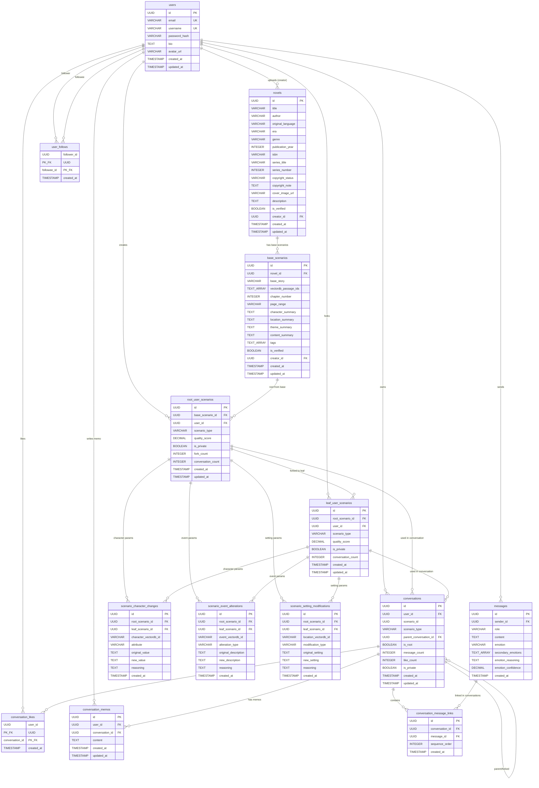

# Entity Relationship Diagram (ERD)

**Project**: Gaji - Interactive Fiction Platform  
**Last Updated**: 2025-11-19 (Version 1.1)
**Database Architecture**: PostgreSQL 15.x (Metadata) + VectorDB (Content & Embeddings)  
**Backend Architecture**: MSA (FastAPI AI Service + Spring Boot CRUD Service)  
**Novel Source**: Project Gutenberg Dataset (Direct Import)  
**Migration Tool**: Flyway  
**VectorDB**: ChromaDB (Development) / Pinecone (Production)

**Version 1.1 Changes**: Quality score removed, book-centric architecture, unified scenario creation

---

## Table of Contents

1. [Database Overview](#database-overview)
2. [Architecture Design](#architecture-design)
3. [MSA Backend Architecture](#msa-backend-architecture)
4. [ERD Diagram](#erd-diagram)
5. [PostgreSQL Table Definitions](#postgresql-table-definitions)
6. [VectorDB Schema](#vectordb-schema)
7. [Relationships](#relationships)
8. [Indexes](#indexes)
9. [Migration Strategy](#migration-strategy)

---

## Database Overview

### Architecture Philosophy

**Hybrid Storage Strategy**: Separate metadata from content to optimize for different access patterns.

- **PostgreSQL**: Relational metadata, user data, social graph, conversation structure
- **VectorDB (ChromaDB/Pinecone)**: Novel full text, embeddings, LLM analysis results

### Schema Statistics

- **PostgreSQL Tables**: 13 core tables (metadata only)
- **PostgreSQL Extensions**: `uuid-ossp`, `pg_trgm` (removed `pgvector` - embeddings now in VectorDB)
- **VectorDB Collections**: 5 collections (novel_passages, characters, locations, events, themes)
- **Redis Data Structures**: 2 types (async task tracking, user activity feed)
- **Total JSONB Columns**: 0 (no JSONB columns in current schema)

### Key Design Decisions

1. **Content-Metadata Separation**:

   - **PostgreSQL**: Only Project Gutenberg metadata (title, author, ISBN, copyright status, etc.)
   - **VectorDB**: Full text content, chunks, embeddings, all LLM-generated analysis

2. **Why VectorDB for Content?**:

   - Optimized for semantic search and similarity queries
   - Native support for high-dimensional embeddings (Gemini Embedding API: 768 dimensions)
   - Horizontal scalability for large novel collections
   - Reduced PostgreSQL storage costs and complexity

3. **Novel Data Source**:

   - **Source**: Project Gutenberg Dataset (direct import, not API)
   - `novels` table stores only metadata from dataset
   - Dataset includes pre-processed text files ready for chunking
   - No real-time API calls during ingestion

4. **MSA Backend Architecture**:

   - **Spring Boot Service**: CRUD operations, user management, social features, metadata queries
   - **FastAPI Service**: AI/LLM operations, embeddings, RAG pipeline, conversation generation
   - **Communication**: REST API + Long Polling for async AI operations
   - **Browser Notifications**: WebSocket/SSE for conversation completion alerts

5. **Fork Constraints**:

   - **Scenarios**: Unlimited depth meta-timelines with circular reference prevention
   - **Conversations**:
     - ROOT conversations can be forked (creates forked conversation)
     - Forked conversations CANNOT be forked again (max depth = 1)
     - **Message Copy Rule**: Copy **최대 6개 메시지** (if total < 6, copy all)
     - Example: 8개 메시지 → 6개 복사, 4개 메시지 → 4개 모두 복사

6. **Social Features**: Composite PKs for follow/like/memo tables

7. **Referential Integrity**: CASCADE DELETE on all foreign keys ensures automatic cleanup

---

## Architecture Design

### MSA Backend Architecture


### Service Responsibilities

**Spring Boot Service (Port 8080)**:

- **User Management**: Registration, login, profile CRUD
- **Novel Metadata**: Browse novels, filter by genre/era/author
- **Scenario CRUD**: Create/read/update/delete scenarios (metadata only)
- **Conversation Metadata**: Track conversation state, fork status, message count
- **Social Features**: Follows, likes, memos
- **Long Polling Endpoint**: `/api/conversations/{id}/status` (check AI generation progress)

**FastAPI Service (Port 8000)**:

- **Novel Ingestion**: Process Gutenberg dataset → VectorDB
- **Embedding Generation**: Text → Gemini Embedding API → VectorDB
- **RAG Pipeline**: Query VectorDB + prompt engineering
- **Conversation Generation**: Gemini 2.5 Flash integration
- **LLM Analysis**: Character/location/event/theme extraction
- **Async Task Management**: Celery task queue for long-running operations

### Long Polling Flow for Conversation Creation


### Data Flow: Novel Ingestion Pipeline


### Query Patterns

**Scenario Creation (RAG Pipeline)**:

1. User selects novel from PostgreSQL `novels` table (metadata browsing via Spring Boot)
2. Frontend requests conversation generation → Spring Boot enqueues task
3. FastAPI worker queries VectorDB `novel_passages` collection with semantic search
4. Retrieved passages + character/location/event metadata → prompt engineering
5. Gemini 2.5 Flash generates scenario response
6. FastAPI sends completed messages to Spring Boot
7. Spring Boot saves to PostgreSQL `conversations` + `messages` tables
8. Frontend long polling detects completion → browser notification

**Browse Novels** (Spring Boot):

- PostgreSQL query on `novels` table (title, author, genre, era filters)
- Fast metadata-only queries, no content loading

**Character Search** (FastAPI):

- VectorDB semantic search on `characters` collection
- Returns character metadata + embedding similarity scores

---

## MSA Backend Architecture

### Communication Patterns

**REST API** (Spring Boot ↔ FastAPI):

- Spring Boot calls FastAPI for AI operations: `POST http://fastapi:8000/api/ai/generate`
- FastAPI calls Spring Boot to update status: `POST http://spring:8080/api/internal/conversations/{id}/complete`

**Long Polling** (Frontend ↔ Spring Boot):

- Frontend: `GET /api/conversations/{id}/status` every 2 seconds
- Spring Boot returns: `{status: "PENDING" | "COMPLETED" | "FAILED", progress: 0-100}`

**Browser Notifications**:

- When status changes to `COMPLETED`, frontend triggers `Notification API`
- User can navigate to other pages while waiting for AI response

### Conversation Fork Business Logic

**Fork Message Copy Rule** (implemented in Spring Boot):

```java
// Example: Conversation Fork Service
public ConversationForkResult forkConversation(UUID conversationId, UUID userId) {
    Conversation original = conversationRepository.findById(conversationId);

    // Business Rule: Only ROOT conversations can be forked
    if (!original.isRoot()) {
        throw new BusinessException("Forked conversations cannot be forked again");
    }

    // Create forked conversation
    Conversation forked = new Conversation();
    forked.setUserId(userId);
    forked.setScenarioId(original.getScenarioId());
    forked.setScenarioType(original.getScenarioType());
    forked.setParentConversationId(conversationId);
    forked.setIsRoot(false);  // Forked conversation cannot fork again
    forked.setIsPrivate(original.isPrivate());
    conversationRepository.save(forked);

    // Copy messages: min(6, total_message_count)
    List<ConversationMessageLink> originalLinks = messageRepository
        .findByConversationIdOrderBySequenceOrder(conversationId);

    int messagesToCopy = Math.min(6, originalLinks.size());

    for (int i = 0; i < messagesToCopy; i++) {
        ConversationMessageLink originalLink = originalLinks.get(i);

        ConversationMessageLink forkedLink = new ConversationMessageLink();
        forkedLink.setConversationId(forked.getId());
        forkedLink.setMessageId(originalLink.getMessageId());  // Reuse same message entity
        forkedLink.setSequenceOrder(i + 1);
        messageRepository.save(forkedLink);
    }

    forked.setMessageCount(messagesToCopy);
    conversationRepository.save(forked);

    return new ConversationForkResult(forked, messagesToCopy);
}
```

**Example Scenarios**:

- **Case 1**: Original has 8 messages → Fork copies 6 messages (최대 6개)
- **Case 2**: Original has 4 messages → Fork copies 4 messages (전체 복사)
- **Case 3**: Original has 10 messages → Fork copies 6 messages (최대 6개)
- **Case 4**: Original has 2 messages → Fork copies 2 messages (전체 복사)

---

## ERD Diagram

**Note**: This diagram shows only PostgreSQL tables. VectorDB collections are detailed in the [VectorDB Schema](#vectordb-schema) section.


---

## PostgreSQL Table Definitions

### Core Tables

#### `users`

User accounts for authentication and profile management.

```sql
CREATE TABLE users (
    id UUID PRIMARY KEY DEFAULT uuid_generate_v4(),
    email VARCHAR(255) UNIQUE NOT NULL,
    username VARCHAR(50) UNIQUE NOT NULL,
    password_hash VARCHAR(60) NOT NULL,  -- BCrypt hash
    bio TEXT CHECK (LENGTH(bio) <= 500),
    avatar_url VARCHAR(500),
    created_at TIMESTAMP DEFAULT CURRENT_TIMESTAMP,
    updated_at TIMESTAMP DEFAULT CURRENT_TIMESTAMP
);
```

**Columns**:

- `id`: Unique user identifier (UUID v4)
- `email`: Email address (unique, used for login)
- `username`: Display name (unique, 3-50 chars, alphanumeric + underscore)
- `password_hash`: BCrypt hashed password (cost factor 10)
- `bio`: User biography (max 500 chars)
- `avatar_url`: CDN URL to avatar image
- `created_at`: Account creation timestamp
- `updated_at`: Last profile update timestamp

---

#### `novels`

**Novel metadata only** (from Project Gutenberg) - NO TEXT CONTENT.

```sql
CREATE TABLE novels (
    id UUID PRIMARY KEY DEFAULT uuid_generate_v4(),
    title VARCHAR(500) NOT NULL,
    author VARCHAR(200),
    original_language VARCHAR(10),  -- ISO language code: 'en', 'ko', 'zh'
    era VARCHAR(100),  -- e.g., 'Victorian', 'Joseon', '1920s America'
    genre VARCHAR(100),  -- e.g., 'Romance', 'Mystery', 'Historical Fiction'
    publication_year INTEGER,
    isbn VARCHAR(20),
    series_title VARCHAR(300),  -- e.g., 'The Barton books for girls'
    series_number INTEGER,  -- Book number in series
    copyright_status VARCHAR(50) CHECK (copyright_status IN (
        'public_domain', 'copyrighted', 'creative_commons', 'unknown'
    )),
    copyright_note TEXT,  -- e.g., 'Public domain in the USA'
    cover_image_url VARCHAR(500),
    description TEXT,
    is_verified BOOLEAN DEFAULT false,
    creator_id UUID REFERENCES users(id) ON DELETE SET NULL,
    created_at TIMESTAMP DEFAULT CURRENT_TIMESTAMP,
    updated_at TIMESTAMP DEFAULT CURRENT_TIMESTAMP
);
```

**Columns**:

- `id`: Unique novel identifier
- `title`: Full novel title (e.g., 'Pride and Prejudice')
- `author`: Author name (e.g., 'Jane Austen')
- `original_language`: ISO language code
- `era`: Historical period
- `genre`: Literary genre
- `publication_year`: Original publication year
- `isbn`: ISBN identifier (optional)
- `series_title`: Series name if part of a series (optional)
- `series_number`: Book number in series (optional)
- `copyright_status`: Copyright classification
- `copyright_note`: Detailed copyright information
- `cover_image_url`: CDN URL to cover image
- `description`: Brief synopsis or description
- `is_verified`: Admin verification status
- `creator_id`: User who uploaded the metadata
- `created_at`: Upload timestamp
- `updated_at`: Last modification timestamp

**NOTE**:

- **NO `full_text_s3_path` column** - text is in VectorDB
- **NO `total_word_count` column** - computed from VectorDB metadata
- **Removed chapters, passages, all text content** - handled by VectorDB

---

#### `base_scenarios`

Base scenario metadata linking to VectorDB content.

```sql
CREATE TABLE base_scenarios (
    id UUID PRIMARY KEY DEFAULT uuid_generate_v4(),
    novel_id UUID NOT NULL REFERENCES novels(id) ON DELETE CASCADE,
    base_story VARCHAR(100) NOT NULL,  -- Short identifier: 'pride_and_prejudice'

    -- VectorDB References (stored as metadata, not content)
    vectordb_passage_ids TEXT[],  -- Array of VectorDB passage document IDs
    chapter_number INTEGER,  -- Logical chapter number (if applicable)
    page_range VARCHAR(50),  -- Page range for this scenario (e.g., "45-78")

    -- AI-Generated Summaries (metadata for browsing, not full analysis)
    character_summary TEXT,  -- Brief summary of key characters
    location_summary TEXT,  -- Brief summary of locations/settings
    theme_summary TEXT,  -- Brief summary of themes present
    content_summary TEXT,  -- Overall content summary (200-300 chars)

    tags TEXT[],  -- Tags for categorization and search
    is_verified BOOLEAN DEFAULT false,
    creator_id UUID REFERENCES users(id),
    created_at TIMESTAMP DEFAULT CURRENT_TIMESTAMP,
    updated_at TIMESTAMP DEFAULT CURRENT_TIMESTAMP
);
```

**Columns**:

- `id`: Unique base scenario identifier
- `novel_id`: Reference to novel metadata
- `base_story`: Short identifier (e.g., 'pride_and_prejudice')
- `vectordb_passage_ids`: Array of VectorDB document IDs for passages in this scenario
- `chapter_number`: Logical chapter number (optional)
- `page_range`: Page range (e.g., "45-78", optional)
- `character_summary`: Brief character summary (for UI preview)
- `location_summary`: Brief location summary (for UI preview)
- `theme_summary`: Brief theme summary (for UI preview)
- `content_summary`: Overall summary (200-300 chars max)
- `tags`: Array of tags (e.g., '{"romance", "conflict", "resolution"}')
- `is_verified`: Verification status
- `creator_id`: User who created this base scenario
- `created_at`: Creation timestamp
- `updated_at`: Last modification timestamp

**Design Rationale**:

- Stores **references** to VectorDB content, not the content itself
- Summaries are brief metadata for browsing/filtering, not full LLM analysis
- Full character/location/event/theme analysis lives in VectorDB collections
- `vectordb_passage_ids` enables quick lookup of related passages

---

#### `root_user_scenarios`

User-created "What If" scenarios based on book content (CAN BE FORKED).

```sql
CREATE TABLE root_user_scenarios (
    id UUID PRIMARY KEY DEFAULT uuid_generate_v4(),
    base_scenario_id UUID REFERENCES base_scenarios(id) NOT NULL,
    user_id UUID REFERENCES users(id) NOT NULL,
    scenario_type VARCHAR(50) NOT NULL CHECK (scenario_type IN (
        'CHARACTER_CHANGE',
        'EVENT_ALTERATION',
        'SETTING_MODIFICATION'
    )),
    quality_score DECIMAL(3,2) DEFAULT 0.0 CHECK (quality_score >= 0.0 AND quality_score <= 1.0),
    is_private BOOLEAN DEFAULT false,
    fork_count INTEGER DEFAULT 0,
    conversation_count INTEGER DEFAULT 0,
    created_at TIMESTAMP DEFAULT CURRENT_TIMESTAMP,
    updated_at TIMESTAMP DEFAULT CURRENT_TIMESTAMP
);
```

**Business Rules**:

- Root user scenarios are "What If" variations based on book content
- Can be forked by other users (if `is_private = false`) → creates `leaf_user_scenarios`
- Custom parameters stored in type-specific tables (`scenario_character_changes`, etc.)

---

#### `scenario_character_changes`

Character modification parameters for CHARACTER_CHANGE scenarios.

```sql
CREATE TABLE scenario_character_changes (
    id UUID PRIMARY KEY DEFAULT uuid_generate_v4(),
    root_scenario_id UUID REFERENCES root_user_scenarios(id) ON DELETE CASCADE,
    leaf_scenario_id UUID REFERENCES leaf_user_scenarios(id) ON DELETE CASCADE,

    -- VectorDB Reference
    character_vectordb_id VARCHAR(100) NOT NULL,  -- Document ID in VectorDB characters collection

    -- Modification Parameters
    attribute VARCHAR(100) NOT NULL,  -- e.g., 'personality', 'motivation', 'backstory'
    original_value TEXT,  -- Optional: original value for comparison
    new_value TEXT NOT NULL,  -- User's "What If" modified value
    reasoning TEXT,  -- User's explanation

    created_at TIMESTAMP DEFAULT CURRENT_TIMESTAMP,

    CHECK (
        (root_scenario_id IS NOT NULL AND leaf_scenario_id IS NULL) OR
        (root_scenario_id IS NULL AND leaf_scenario_id IS NOT NULL)
    ),
    UNIQUE(root_scenario_id),
    UNIQUE(leaf_scenario_id)
);
```

**Design Changes**:

- **NO `character_id` FK** - characters now in VectorDB
- **NEW `character_vectordb_id`** - reference to VectorDB character document
- User browses characters via VectorDB semantic search
- Modification parameters still stored in PostgreSQL for relational queries

---

#### `scenario_event_alterations`

Event modification parameters for EVENT_ALTERATION scenarios.

```sql
CREATE TABLE scenario_event_alterations (
    id UUID PRIMARY KEY DEFAULT uuid_generate_v4(),
    root_scenario_id UUID REFERENCES root_user_scenarios(id) ON DELETE CASCADE,
    leaf_scenario_id UUID REFERENCES leaf_user_scenarios(id) ON DELETE CASCADE,

    -- VectorDB Reference
    event_vectordb_id VARCHAR(100) NOT NULL,  -- Document ID in VectorDB events collection

    -- Modification Parameters
    alteration_type VARCHAR(50) NOT NULL CHECK (alteration_type IN (
        'outcome_change', 'prevent_event', 'timing_change', 'participant_change'
    )),
    original_description TEXT,
    new_description TEXT NOT NULL,
    reasoning TEXT,

    created_at TIMESTAMP DEFAULT CURRENT_TIMESTAMP,

    CHECK (
        (root_scenario_id IS NOT NULL AND leaf_scenario_id IS NULL) OR
        (root_scenario_id IS NULL AND leaf_scenario_id IS NOT NULL)
    ),
    UNIQUE(root_scenario_id),
    UNIQUE(leaf_scenario_id)
);
```

---

#### `scenario_setting_modifications`

Setting modification parameters for SETTING_MODIFICATION scenarios.

```sql
CREATE TABLE scenario_setting_modifications (
    id UUID PRIMARY KEY DEFAULT uuid_generate_v4(),
    root_scenario_id UUID REFERENCES root_user_scenarios(id) ON DELETE CASCADE,
    leaf_scenario_id UUID REFERENCES leaf_user_scenarios(id) ON DELETE CASCADE,

    -- VectorDB Reference (optional - setting can be entirely new)
    location_vectordb_id VARCHAR(100),  -- Nullable: reference to VectorDB locations collection

    -- Modification Parameters
    modification_type VARCHAR(50) NOT NULL CHECK (modification_type IN (
        'time_period_change', 'location_change', 'cultural_context_change', 'technology_level_change'
    )),
    original_setting TEXT,
    new_setting TEXT NOT NULL,
    reasoning TEXT,

    created_at TIMESTAMP DEFAULT CURRENT_TIMESTAMP,

    CHECK (
        (root_scenario_id IS NOT NULL AND leaf_scenario_id IS NULL) OR
        (root_scenario_id IS NULL AND leaf_scenario_id IS NOT NULL)
    ),
    UNIQUE(root_scenario_id),
    UNIQUE(leaf_scenario_id)
);
```

---

#### `leaf_user_scenarios`

Forked scenarios from `root_user_scenarios` (CANNOT BE FORKED AGAIN - max depth = 1).

```sql
CREATE TABLE leaf_user_scenarios (
    id UUID PRIMARY KEY DEFAULT uuid_generate_v4(),
    root_scenario_id UUID NOT NULL REFERENCES root_user_scenarios(id) ON DELETE CASCADE,
    user_id UUID NOT NULL REFERENCES users(id) NOT NULL,
    scenario_type VARCHAR(50) NOT NULL CHECK (scenario_type IN (
        'CHARACTER_CHANGE',
        'EVENT_ALTERATION',
        'SETTING_MODIFICATION'
    )),
    quality_score DECIMAL(3,2) DEFAULT 0.0 CHECK (quality_score >= 0.0 AND quality_score <= 1.0),
    is_private BOOLEAN DEFAULT false,
    conversation_count INTEGER DEFAULT 0,
    created_at TIMESTAMP DEFAULT CURRENT_TIMESTAMP,
    updated_at TIMESTAMP DEFAULT CURRENT_TIMESTAMP
);
```

**Business Rules**:

- Leaf scenarios are forks of root scenarios
- **CANNOT be forked again** (enforced by application logic)
- Custom parameters stored in same type-specific tables as root scenarios

---

#### `conversations`

Conversation instances using scenarios (ROOT or FORKED).

```sql
CREATE TABLE conversations (
    id UUID PRIMARY KEY DEFAULT uuid_generate_v4(),
    user_id UUID NOT NULL REFERENCES users(id) ON DELETE CASCADE,

    -- Polymorphic scenario reference
    scenario_id UUID NOT NULL,  -- Can reference root_user_scenarios OR leaf_user_scenarios
    scenario_type VARCHAR(20) NOT NULL CHECK (scenario_type IN ('root_user', 'leaf_user')),

    -- Conversation forking
    parent_conversation_id UUID REFERENCES conversations(id) ON DELETE SET NULL,
    is_root BOOLEAN DEFAULT true,  -- true = root conversation (can fork), false = forked (cannot fork)

    -- Metadata
    message_count INTEGER DEFAULT 0,
    like_count INTEGER DEFAULT 0,
    is_private BOOLEAN DEFAULT false,

    created_at TIMESTAMP DEFAULT CURRENT_TIMESTAMP,
    updated_at TIMESTAMP DEFAULT CURRENT_TIMESTAMP,

    CHECK (
        (is_root = true AND parent_conversation_id IS NULL) OR
        (is_root = false AND parent_conversation_id IS NOT NULL)
    )
);
```

**Business Rules**:

- `scenario_id` + `scenario_type` polymorphic reference pattern
- Only root conversations (`is_root = true`) can be forked
- Forked conversations (`is_root = false`) have `parent_conversation_id` and CANNOT fork again
- **Message Copy on Fork**: Copy **최대 6개 메시지** from parent conversation
  - If parent has ≥ 6 messages → copy first 6 messages
  - If parent has < 6 messages → copy all messages
  - Example: 8 messages → 6 copied, 4 messages → 4 copied
- **AI Generation Status**: Managed via Spring Boot service with long polling

---

#### `conversation_message_links`

Join table linking conversations to messages (enables message reuse across forks).

```sql
CREATE TABLE conversation_message_links (
    id UUID PRIMARY KEY DEFAULT uuid_generate_v4(),
    conversation_id UUID NOT NULL REFERENCES conversations(id) ON DELETE CASCADE,
    message_id UUID NOT NULL REFERENCES messages(id) ON DELETE CASCADE,
    sequence_order INTEGER NOT NULL,  -- Message order in this conversation
    created_at TIMESTAMP DEFAULT CURRENT_TIMESTAMP,
    UNIQUE(conversation_id, sequence_order),
    UNIQUE(conversation_id, message_id)
);
```

**Purpose**:

- Messages can be copied to forked conversations (**최대 6개**)
- Same message entity referenced from multiple conversations
- `sequence_order` maintains conversation thread order---

#### `messages`

Individual conversation messages (user or AI).

```sql
CREATE TABLE messages (
    id UUID PRIMARY KEY DEFAULT uuid_generate_v4(),
    sender_id UUID REFERENCES users(id),  -- Nullable: null = AI message
    role VARCHAR(20) NOT NULL CHECK (role IN ('user', 'assistant', 'system')),
    content TEXT NOT NULL,

    -- Emotion Detection (AI-generated metadata)
    emotion VARCHAR(50),  -- Primary emotion: 'joy', 'anger', 'sadness', 'fear', 'surprise', 'neutral'
    secondary_emotions TEXT[],  -- Array of secondary emotions
    emotion_reasoning TEXT,  -- LLM explanation for emotion classification
    emotion_confidence DECIMAL(3,2),  -- Confidence score (0.0-1.0)

    created_at TIMESTAMP DEFAULT CURRENT_TIMESTAMP
);
```

**Columns**:

- `sender_id`: User who sent message (NULL for AI messages)
- `role`: Message sender type
- `content`: Message text
- `emotion`: Primary emotion (LLM-detected)
- `secondary_emotions`: Array of additional emotions
- `emotion_reasoning`: LLM explanation
- `emotion_confidence`: Confidence score
- `created_at`: Creation timestamp

---

### Social Feature Tables

#### `user_follows`

User follow relationships.

```sql
CREATE TABLE user_follows (
    follower_id UUID NOT NULL REFERENCES users(id) ON DELETE CASCADE,
    followee_id UUID NOT NULL REFERENCES users(id) ON DELETE CASCADE,
    created_at TIMESTAMP DEFAULT CURRENT_TIMESTAMP,
    PRIMARY KEY (follower_id, followee_id),
    CHECK (follower_id != followee_id)
);
```

---

#### `conversation_likes`

User likes on conversations.

```sql
CREATE TABLE conversation_likes (
    user_id UUID NOT NULL REFERENCES users(id) ON DELETE CASCADE,
    conversation_id UUID NOT NULL REFERENCES conversations(id) ON DELETE CASCADE,
    created_at TIMESTAMP DEFAULT CURRENT_TIMESTAMP,
    PRIMARY KEY (user_id, conversation_id)
);
```

---

#### `conversation_memos`

User-written memos/notes on conversations (private bookmarks).

```sql
CREATE TABLE conversation_memos (
    id UUID PRIMARY KEY DEFAULT uuid_generate_v4(),
    user_id UUID NOT NULL REFERENCES users(id) ON DELETE CASCADE,
    conversation_id UUID NOT NULL REFERENCES conversations(id) ON DELETE CASCADE,
    memo_text TEXT NOT NULL CHECK (LENGTH(memo_text) <= 1000),
    created_at TIMESTAMP DEFAULT CURRENT_TIMESTAMP,
    updated_at TIMESTAMP DEFAULT CURRENT_TIMESTAMP,
    UNIQUE(user_id, conversation_id)
);
```

---

### Additional System Tables

#### `user_notifications`

System notifications for users (conversation completion, new followers, etc.).

````sql
---

## VectorDB Schema

### Why VectorDB for Novel Content?

1. **Optimized for Semantic Search**: Native support for cosine similarity, approximate nearest neighbors
2. **Scalability**: Horizontal scaling for large text corpora (thousands of novels)
3. **Embedding Storage**: Efficient storage of 768-dimensional Gemini embeddings
4. **Metadata Filtering**: Combined vector search + metadata filters (genre, era, character names)
5. **Cost Efficiency**: Reduce PostgreSQL storage/query costs for large text datasets

### ChromaDB Collections

#### Collection: `novel_passages`

**Purpose**: Store novel full text chunked into passages (200-500 words each) with embeddings.

**Schema**:

```python
{
    "id": "UUID (passage identifier)",
    "metadata": {
        "novel_id": "UUID (FK to PostgreSQL novels.id)",
        "chapter_number": int,
        "chapter_title": str (optional),
        "sequence_order": int,  # Within chapter
        "start_char_offset": int,
        "end_char_offset": int,
        "word_count": int,
        "passage_type": str,  # 'narrative', 'dialogue', 'description', 'action', 'internal_thought', 'mixed'
        "embedding_model": "text-embedding-004"  # Gemini Embedding API
    },
    "document": "Passage text content (200-500 words)",
    "embedding": [768-dimensional float vector from Gemini Embedding API]
}
````

**Indexing Strategy**:

- HNSW index for fast ANN search (ef_construction=200, M=16)
- Metadata filters: `novel_id`, `chapter_number`, `passage_type`

**Query Patterns**:

- Semantic search by passage content
- Filter by novel_id + chapter_number
- Retrieve passages for base scenario creation

---

#### Collection: `characters`

**Purpose**: Character analysis extracted from novels via LLM.

**Schema**:

```python
{
    "id": "UUID (character identifier)",
    "metadata": {
        "novel_id": "UUID (FK to PostgreSQL novels.id)",
        "name": str,  # Primary character name
        "aliases": [str],  # Alternative names, nicknames
        "role": str,  # 'protagonist', 'antagonist', 'supporting', 'minor'
        "personality_traits": [
            {"trait": str, "intensity": float, "evidence_passage_id": str}
        ],
        "relationships": [
            {
                "related_character_id": str,
                "relationship_type": str,
                "description": str,
                "strength": float
            }
        ],
        "first_appearance_chapter": int,
        "embedding_model": "text-embedding-004"
    },
    "document": "Character description (physical + personality)",
    "embedding": [768-dimensional vector]
}
```

**Query Patterns**:

- Character semantic search by description
- Filter by novel_id
- Find similar characters across novels

---

#### Collection: `locations`

**Purpose**: Settings and locations extracted from novels.

**Schema**:

```python
{
    "id": "UUID (location identifier)",
    "metadata": {
        "novel_id": "UUID",
        "name": str,
        "type": str,  # 'city', 'building', 'room', 'landscape', 'fictional_place'
        "parent_location_id": str,  # Hierarchical: room → building → city
        "significance": str,  # 'major', 'minor', 'mentioned'
        "first_appearance_chapter": int,
        "appearance_count": int,
        "embedding_model": "text-embedding-004"
    },
    "document": "Location description",
    "embedding": [768-dimensional vector]
}
```

---

#### Collection: `events`

**Purpose**: Major plot events and story beats.

**Schema**:

```python
{
    "id": "UUID (event identifier)",
    "metadata": {
        "novel_id": "UUID",
        "chapter_number": int,
        "passage_id": str,  # FK to novel_passages collection
        "event_type": str,  # 'conflict', 'resolution', 'discovery', 'betrayal', 'romance', etc.
        "title": str,
        "involved_character_ids": [str],  # Character IDs from characters collection
        "location_id": str,  # Location ID from locations collection
        "significance_score": float,  # 0.0-1.0
        "chronological_order": int,
        "embedding_model": "text-embedding-004"
    },
    "document": "Event description",
    "embedding": [768-dimensional vector]
}
```

---

#### Collection: `themes`

**Purpose**: Thematic elements and motifs.

**Schema**:

```python
{
    "id": "UUID (theme identifier)",
    "metadata": {
        "novel_id": "UUID",
        "name": str,  # e.g., 'love_vs_duty', 'coming_of_age', 'redemption'
        "category": str,  # 'moral', 'social', 'psychological', 'existential'
        "prevalence_score": float,  # How prominent in the novel
        "related_passage_ids": [str],  # Passage IDs exhibiting this theme
        "embedding_model": "text-embedding-004"
    },
    "document": "Theme description",
    "embedding": [768-dimensional vector]
}
```

---

### VectorDB Query Examples

**Example 1: Find similar characters**

```python
# User searching for "brave young wizard" characters
results = chroma_client.query(
    collection_name="characters",
    query_embeddings=[embed_text("brave young wizard")],
    n_results=10,
    where={"role": "protagonist"}  # Metadata filter
)
```

**Example 2: Semantic passage search for scenario creation**

```python
# User wants scenario about "forbidden romance in Victorian England"
results = chroma_client.query(
    collection_name="novel_passages",
    query_embeddings=[embed_text("forbidden romance Victorian England")],
    n_results=20,
    where={
        "novel_id": novel_uuid,
        "passage_type": {"$in": ["dialogue", "narrative", "internal_thought"]}
    }
)
```

**Example 3: Find events involving specific character**

```python
# Find all events involving character_id "abc-123"
results = chroma_client.query(
    collection_name="events",
    query_embeddings=None,  # No semantic search, just filter
    where={
        "involved_character_ids": {"$contains": "abc-123"}
    }
)
```

---

## Relationships

### PostgreSQL Foreign Keys

```sql
-- User relationships
ALTER TABLE novels ADD FOREIGN KEY (creator_id) REFERENCES users(id) ON DELETE SET NULL;
ALTER TABLE base_scenarios ADD FOREIGN KEY (creator_id) REFERENCES users(id);
ALTER TABLE base_scenarios ADD FOREIGN KEY (novel_id) REFERENCES novels(id) ON DELETE CASCADE;
ALTER TABLE root_user_scenarios ADD FOREIGN KEY (user_id) REFERENCES users(id) NOT NULL;
ALTER TABLE root_user_scenarios ADD FOREIGN KEY (base_scenario_id) REFERENCES base_scenarios(id) NOT NULL;

-- Scenario forking
ALTER TABLE leaf_user_scenarios ADD FOREIGN KEY (root_scenario_id) REFERENCES root_user_scenarios(id) ON DELETE CASCADE;
ALTER TABLE leaf_user_scenarios ADD FOREIGN KEY (user_id) REFERENCES users(id) NOT NULL;

-- Scenario modification parameters
ALTER TABLE scenario_character_changes ADD FOREIGN KEY (root_scenario_id) REFERENCES root_user_scenarios(id) ON DELETE CASCADE;
ALTER TABLE scenario_character_changes ADD FOREIGN KEY (leaf_scenario_id) REFERENCES leaf_user_scenarios(id) ON DELETE CASCADE;
ALTER TABLE scenario_event_alterations ADD FOREIGN KEY (root_scenario_id) REFERENCES root_user_scenarios(id) ON DELETE CASCADE;
ALTER TABLE scenario_event_alterations ADD FOREIGN KEY (leaf_scenario_id) REFERENCES leaf_user_scenarios(id) ON DELETE CASCADE;
ALTER TABLE scenario_setting_modifications ADD FOREIGN KEY (root_scenario_id) REFERENCES root_user_scenarios(id) ON DELETE CASCADE;
ALTER TABLE scenario_setting_modifications ADD FOREIGN KEY (leaf_scenario_id) REFERENCES leaf_user_scenarios(id) ON DELETE CASCADE;

-- Conversations
ALTER TABLE conversations ADD FOREIGN KEY (user_id) REFERENCES users(id) ON DELETE CASCADE;
ALTER TABLE conversations ADD FOREIGN KEY (parent_conversation_id) REFERENCES conversations(id) ON DELETE SET NULL;

-- Messages
ALTER TABLE conversation_message_links ADD FOREIGN KEY (conversation_id) REFERENCES conversations(id) ON DELETE CASCADE;
ALTER TABLE conversation_message_links ADD FOREIGN KEY (message_id) REFERENCES messages(id) ON DELETE CASCADE;
ALTER TABLE messages ADD FOREIGN KEY (sender_id) REFERENCES users(id);

-- Social features
ALTER TABLE user_follows ADD FOREIGN KEY (follower_id) REFERENCES users(id) ON DELETE CASCADE;
ALTER TABLE user_follows ADD FOREIGN KEY (followee_id) REFERENCES users(id) ON DELETE CASCADE;
ALTER TABLE conversation_likes ADD FOREIGN KEY (user_id) REFERENCES users(id) ON DELETE CASCADE;
ALTER TABLE conversation_likes ADD FOREIGN KEY (conversation_id) REFERENCES conversations(id) ON DELETE CASCADE;
ALTER TABLE conversation_memos ADD FOREIGN KEY (user_id) REFERENCES users(id) ON DELETE CASCADE;
ALTER TABLE conversation_memos ADD FOREIGN KEY (conversation_id) REFERENCES conversations(id) ON DELETE CASCADE;
```

### Cross-Database References

**PostgreSQL → VectorDB**:

- `base_scenarios.vectordb_passage_ids[]` → `novel_passages` collection document IDs
- `scenario_character_changes.character_vectordb_id` → `characters` collection document ID
- `scenario_event_alterations.event_vectordb_id` → `events` collection document ID
- `scenario_setting_modifications.location_vectordb_id` → `locations` collection document ID

**VectorDB → PostgreSQL**:

- All VectorDB collections have `metadata.novel_id` → `novels.id` (UUID)
- VectorDB `characters.metadata.relationships[].related_character_id` → Other character documents in same collection

---

## Indexes

### PostgreSQL Indexes

```sql
-- User indexes
CREATE INDEX idx_users_email ON users(email);
CREATE INDEX idx_users_username ON users(username);

-- Novel indexes
CREATE INDEX idx_novels_title ON novels(title);
CREATE INDEX idx_novels_author ON novels(author);
CREATE INDEX idx_novels_genre ON novels(genre);
CREATE INDEX idx_novels_era ON novels(era);
CREATE INDEX idx_novels_creator_id ON novels(creator_id);
CREATE INDEX idx_novels_is_verified ON novels(is_verified);

-- Base scenario indexes
CREATE INDEX idx_base_scenarios_novel_id ON base_scenarios(novel_id);
CREATE INDEX idx_base_scenarios_creator_id ON base_scenarios(creator_id);
CREATE INDEX idx_base_scenarios_tags ON base_scenarios USING gin(tags);  -- GIN index for array search
CREATE INDEX idx_base_scenarios_is_verified ON base_scenarios(is_verified);

-- Root user scenario indexes
CREATE INDEX idx_root_user_scenarios_user_id ON root_user_scenarios(user_id);
CREATE INDEX idx_root_user_scenarios_base_scenario_id ON root_user_scenarios(base_scenario_id);
CREATE INDEX idx_root_user_scenarios_scenario_type ON root_user_scenarios(scenario_type);
CREATE INDEX idx_root_user_scenarios_is_private ON root_user_scenarios(is_private);
CREATE INDEX idx_root_user_scenarios_quality_score ON root_user_scenarios(quality_score);

-- Leaf user scenario indexes
CREATE INDEX idx_leaf_user_scenarios_root_scenario_id ON leaf_user_scenarios(root_scenario_id);
CREATE INDEX idx_leaf_user_scenarios_user_id ON leaf_user_scenarios(user_id);
CREATE INDEX idx_leaf_user_scenarios_is_private ON leaf_user_scenarios(is_private);

-- Conversation indexes
CREATE INDEX idx_conversations_user_id ON conversations(user_id);
CREATE INDEX idx_conversations_scenario_id_type ON conversations(scenario_id, scenario_type);
CREATE INDEX idx_conversations_parent_conversation_id ON conversations(parent_conversation_id);
CREATE INDEX idx_conversations_is_root ON conversations(is_root);
CREATE INDEX idx_conversations_is_private ON conversations(is_private);
CREATE INDEX idx_conversations_created_at ON conversations(created_at DESC);

-- Message indexes
CREATE INDEX idx_messages_sender_id ON messages(sender_id);
CREATE INDEX idx_messages_created_at ON messages(created_at);

-- Conversation message link indexes
CREATE INDEX idx_conversation_message_links_conversation_id ON conversation_message_links(conversation_id);
CREATE INDEX idx_conversation_message_links_message_id ON conversation_message_links(message_id);

-- Social feature indexes
CREATE INDEX idx_user_follows_follower_id ON user_follows(follower_id);
CREATE INDEX idx_user_follows_followee_id ON user_follows(followee_id);
CREATE INDEX idx_conversation_likes_user_id ON conversation_likes(user_id);
CREATE INDEX idx_conversation_likes_conversation_id ON conversation_likes(conversation_id);
CREATE INDEX idx_conversation_memos_user_id ON conversation_memos(user_id);
CREATE INDEX idx_conversation_memos_conversation_id ON conversation_memos(conversation_id);
```

### VectorDB Indexes

**ChromaDB**: Automatic HNSW indexing on all embeddings
**Pinecone**: Automatic indexing with metadata filters

**Metadata Index Configuration** (ChromaDB):

```python
collection.create_index(
    field="metadata.novel_id",
    index_type="string"
)
collection.create_index(
    field="metadata.chapter_number",
    index_type="integer"
)
```

---

## Migration Strategy

### Phase 1: PostgreSQL Schema Setup (Week 1)

1. Create `users` table
2. Create `novels` table (metadata only)
3. Create `base_scenarios` table with VectorDB reference fields
4. Create scenario tables (`root_user_scenarios`, `leaf_user_scenarios`, scenario parameter tables)
5. Create conversation tables (`conversations`, `messages`, `conversation_message_links`)
6. Create social feature tables (`user_follows`, `conversation_likes`, `conversation_memos`)
7. Create all indexes

**Flyway Migration Script**: `V1__Initial_Schema.sql`

---

### Phase 2: Redis Setup (Week 1)

1. **Async Task Tracking** (Replace `async_task_status` table):

```python
# Redis key structure for task status
# Key: task:{task_id}
# Type: Hash
# TTL: 1 hour after completion

redis.hset(f"task:{task_id}", mapping={
    "task_type": "conversation_generation",
    "user_id": str(user_id),
    "status": "PENDING",  # PENDING | IN_PROGRESS | COMPLETED | FAILED
    "progress": 0,
    "entity_id": str(conversation_id),
    "entity_type": "conversation",
    "celery_task_id": celery_task_id,
    "created_at": datetime.now().isoformat()
})
redis.expire(f"task:{task_id}", 3600)  # 1 hour TTL

# Query pattern
task_data = redis.hgetall(f"task:{task_id}")
```

2. **User Activity Feed** (Replace `user_activity_feed` table):

```python
# Redis key structure for activity feed
# Key: activity:user:{user_id}
# Type: Sorted Set (score = timestamp)
# Retention: Latest 100 activities per user

redis.zadd(
    f"activity:user:{user_id}",
    {
        json.dumps({
            "activity_type": "created_scenario",
            "entity_id": str(scenario_id),
            "entity_type": "scenario",
            "metadata": {"scenario_title": "..."}
        }): timestamp
    }
)

# Keep only latest 100 activities
redis.zremrangebyrank(f"activity:user:{user_id}", 0, -101)

# Query pattern: Get latest 50 activities
activities = redis.zrevrange(
    f"activity:user:{user_id}",
    0, 49,
    withscores=True
)
```

**Setup Script**: `scripts/redis_init.sh`

---

### Phase 3: VectorDB Setup (Week 1)

1. Initialize ChromaDB client (development)
2. Create 5 collections: `novel_passages`, `characters`, `locations`, `events`, `themes`
3. Configure HNSW indexes (ef_construction=200, M=16)
4. Set up metadata index configurations

**Setup Script**: `scripts/vectordb_init.py`

---

### Phase 4: Novel Ingestion Pipeline (Week 2)

**Pipeline Architecture**:

```
Project Gutenberg Dataset Files
    ↓
FastAPI Ingestion Service (Background Task)
    ├─→ Spring Boot API: Insert novels metadata
    └─→ Chunking Service (200-500 words)
            ├─→ Gemini Embedding API
            └─→ VectorDB: Insert novel_passages
                    ↓
            LLM Analysis Pipeline (Gemini 2.5 Flash)
                    ├─→ Character Extraction → VectorDB: characters
                    ├─→ Location Extraction → VectorDB: locations
                    ├─→ Event Extraction → VectorDB: events
                    └─→ Theme Extraction → VectorDB: themes
```

**Implementation**:

- **Data Source**: Project Gutenberg Dataset (pre-downloaded text files, not API)
- **FastAPI endpoint**: `POST /api/ai/novels/ingest` (accepts batch of novel files)
- **Spring Boot coordination**: Track ingestion jobs, provide status via long polling
- **Background job**: Celery task queue for LLM analysis
- **Progress tracking**: Long polling endpoint `/api/novels/ingestion/{job_id}/status`
- **Browser notification**: Alert user when ingestion completes

---

### Phase 4: Data Migration from Old Schema (If Applicable)

**If migrating from previous ERD with PostgreSQL pgvector**:

```sql
-- Migration script to export data to VectorDB
-- Export novel_passages
COPY (
    SELECT id, novel_id, chapter_id, sequence_order, content_text,
           word_count, passage_type, embedding_vector
    FROM novel_passages
) TO '/tmp/passages.csv' CSV HEADER;

-- Python script to import to VectorDB
import chromadb
import csv

client = chromadb.PersistentClient(path="./chroma_data")
collection = client.get_or_create_collection(
    name="novel_passages",
    metadata={"hnsw:space": "cosine"}
)

with open('/tmp/passages.csv', 'r') as f:
    reader = csv.DictReader(f)
    for row in reader:
        collection.add(
            ids=[row['id']],
            documents=[row['content_text']],
            embeddings=[eval(row['embedding_vector'])],  # Parse vector array
            metadatas=[{
                "novel_id": row['novel_id'],
                "chapter_number": row['chapter_number'],
                "sequence_order": int(row['sequence_order']),
                "word_count": int(row['word_count']),
                "passage_type": row['passage_type'],
                "embedding_model": "text-embedding-ada-002"  # Update as needed
            }]
        )
```

---

### Rollback Strategy

**PostgreSQL**: Use Flyway versioned migrations with `V{version}__description.sql`

**VectorDB**:

- ChromaDB: Snapshot collections before major updates
- Pinecone: Use namespace versioning (e.g., `v1_passages`, `v2_passages`)

**Example Rollback**:

```python
# ChromaDB snapshot
collection.snapshot(name="pre_migration_snapshot_2025_01_14")

# Restore from snapshot
client.delete_collection("novel_passages")
client.restore_collection("novel_passages", snapshot="pre_migration_snapshot_2025_01_14")
```

---

## Appendix: Technology Stack Summary

### Backend Services

**Spring Boot (CRUD Service)**:

- **Version**: 3.x
- **Port**: 8080
- **Language**: Java 17+
- **Framework**: MyBatis, Spring Security, Spring Web
- **Database**: PostgreSQL 15.x
- **Responsibilities**: User management, CRUD operations, social features, metadata queries
- **Communication**: REST API, Long Polling endpoints

**FastAPI (AI Service)**:

- **Version**: 0.104+
- **Port**: 8000
- **Language**: Python 3.11+
- **Framework**: FastAPI, Celery, LangChain
- **Database**: VectorDB (ChromaDB/Pinecone)
- **Responsibilities**: AI/LLM operations, embeddings, RAG pipeline, novel ingestion
- **Communication**: REST API, async task queue

**Message Queue**:

- **Development**: Redis
- **Production**: RabbitMQ (optional)
- **Purpose**: Async task queue for AI operations (Celery workers)

### PostgreSQL

- **Version**: 15.x
- **Extensions**: `uuid-ossp`, `pg_trgm`
- **Purpose**: Relational metadata, user data, social graph

### VectorDB Options

**Development: ChromaDB**

- **Deployment**: Embedded Python client
- **Storage**: Local filesystem (`./chroma_data`)
- **Advantages**: Zero-config, fast local development

**Production: Pinecone**

- **Deployment**: Managed cloud service
- **Pricing**: $70/month for 100GB index (1M+ vectors)
- **Advantages**: Horizontal scaling, high availability, managed backups

### Novel Data Source

- **Source**: Project Gutenberg Dataset
- **Format**: Pre-downloaded text files (not real-time API)
- **Ingestion**: Batch processing via FastAPI service
- **Metadata Extraction**: Title, author, publication year, genre, etc.

### Embedding Model

- **Model**: Gemini Embedding API (`text-embedding-004`)
- **Dimensions**: 768
- **Pricing**: $0.00002 per 1K tokens (Gemini 2.5 Flash pricing)

### LLM Analysis

- **Model**: Gemini 2.5 Flash
- **Context Window**: 1M tokens (input) + 8K tokens (output)
- **Pricing**: $0.075 per 1M input tokens, $0.30 per 1M output tokens

### Frontend Communication

- **Long Polling**: Check AI operation status every 2 seconds
- **Browser Notifications**: Native Notification API for task completion alerts
- **WebSocket/SSE**: Optional real-time updates (future enhancement)

---

## Storage-Specific Relationship Diagrams

### PostgreSQL-Only ERD

This diagram shows the clean relational structure of the 13 PostgreSQL tables without VectorDB references.



**Key Relationships**:

- **Users → Novels**: One-to-many (creator relationship)
- **Novels → Base Scenarios**: One-to-many (novel content basis)
- **Base Scenarios → Root Scenarios**: One-to-many (user variations)
- **Root Scenarios → Leaf Scenarios**: One-to-many (forking with max depth = 1)
- **Scenarios → Conversations**: Polymorphic (root_user OR leaf_user)
- **Conversations → Messages**: Many-to-many via `conversation_message_links` (enables message reuse on fork)
- **Conversations → Conversations**: Self-referencing (fork relationship, max 6 messages copied)

---

### VectorDB Collections Structure

This diagram shows the 5 VectorDB collections and their cross-references.


**Collection Details**:

1. **novel_passages** (Primary Content):

   - Full text content chunked into 200-500 word passages
   - 768-dimensional Gemini embeddings
   - Metadata: `novel_id`, `chapter_number`, `passage_type`, `word_count`
   - Referenced by `base_scenarios.vectordb_passage_ids[]`

2. **characters** (LLM Analysis):

   - Character profiles extracted by LLM from passages
   - Metadata: `name`, `role`, `personality_traits[]`, `relationships[]`
   - Cross-references: `relationships[].related_character_id` → other characters
   - Referenced by `scenario_character_changes.character_vectordb_id`

3. **locations** (LLM Analysis):

   - Settings and places extracted from passages
   - Metadata: `name`, `location_type`, `time_period`, `description`
   - Referenced by `scenario_setting_modifications.location_vectordb_id`

4. **events** (LLM Analysis):

   - Plot events and story beats
   - Metadata: `event_type`, `participants[]`, `location_id`, `temporal_order`
   - Cross-references: `participants[]` → characters, `location_id` → locations
   - Referenced by `scenario_event_alterations.event_vectordb_id`

5. **themes** (LLM Analysis):
   - Thematic elements and literary motifs
   - Metadata: `theme_name`, `description`, `exemplifying_events[]`
   - Cross-references: `exemplifying_events[]` → events

**Query Patterns**:

- Semantic search on passages → Find relevant content for scenario creation
- Character similarity search → Find similar characters across novels
- Event filtering by character → Find all events involving a specific character
- Theme-based discovery → Find passages exemplifying specific themes

---

### Redis Data Structures

This diagram shows the 2 Redis data structures for high-frequency operations.


**Redis Structure 1: Task Tracking (Hash)**

```python
# Key: task:{task_id}
# Type: Hash
# TTL: 3600 seconds (1 hour after completion)

{
    "task_type": "conversation_generation",
    "conversation_id": "uuid-123",
    "user_id": "uuid-456",
    "status": "COMPLETED",  # PENDING | PROCESSING | COMPLETED | FAILED
    "progress": 100,  # 0-100
    "result_data": '{"message_count": 12, "total_tokens": 1500}',
    "error_message": null,
    "created_at": "2025-11-15T10:00:00Z",
    "updated_at": "2025-11-15T10:05:23Z"
}

# Operations:
# - SET: redis.hset(f"task:{task_id}", mapping={...})
# - GET: redis.hgetall(f"task:{task_id}")
# - UPDATE: redis.hset(f"task:{task_id}", "status", "COMPLETED")
# - EXPIRE: redis.expire(f"task:{task_id}", 3600)
```

**Benefits over PostgreSQL**:

- 10-100x faster writes (no disk I/O)
- Automatic cleanup via TTL (no manual garbage collection)
- Optimized for high-frequency status polling (2-second intervals)

---

**Redis Structure 2: Activity Feed (Sorted Set)**

```python
# Key: activity:user:{user_id}
# Type: Sorted Set (score = timestamp)
# Retention: Latest 100 activities per user

# Score = Unix timestamp (for time-ordered queries)
# Member = JSON string with activity data

{
    1736933200: '{"type": "created_conversation", "conversation_id": "uuid-123", "timestamp": 1736933200}',
    1736933500: '{"type": "liked_conversation", "conversation_id": "uuid-456", "timestamp": 1736933500}',
    1736933800: '{"type": "followed_user", "target_user_id": "uuid-789", "timestamp": 1736933800}'
}

# Operations:
# - ADD: redis.zadd(f"activity:user:{user_id}", {json_data: timestamp})
# - TRIM: redis.zremrangebyrank(f"activity:user:{user_id}", 0, -101)
# - GET LATEST 50: redis.zrevrange(f"activity:user:{user_id}", 0, 49, withscores=True)
# - GET PAGINATED: redis.zrevrange(f"activity:user:{user_id}", 50, 99)
```

**Activity Types**:

- `created_scenario`: User created a new scenario
- `forked_scenario`: User forked another user's scenario
- `created_conversation`: User started a new conversation
- `forked_conversation`: User forked a conversation
- `liked_conversation`: User liked a conversation
- `followed_user`: User followed another user
- `added_memo`: User added a memo to a conversation

**Benefits over PostgreSQL**:

- Time-ordered queries in O(log N) time
- Constant memory footprint (always 100 items max)
- Efficient pagination with ZREVRANGE
- No need for complex SQL ORDER BY + LIMIT queries

---

**Data Flow: Long Polling with Redis**


**Key Advantages**:

- No database polling overhead (Redis in-memory)
- Fast status updates from Celery workers
- Automatic task cleanup via TTL
- Scalable to thousands of concurrent conversations

---

## Changelog

**2025-11-15**: Simplified notification architecture

- **Removed PostgreSQL table**: `user_notifications`
  - Rationale: Read/unread state tracking not needed for push-only notification system
  - Browser notifications deliver alerts without persistent storage requirement
  - Reduced database complexity and maintenance overhead
- **Updated Schema Statistics**: 14 → 13 PostgreSQL tables, 1 → 0 JSONB columns
- **Removed indexes**: 4 notification indexes (user_id, is_read, created_at, type)
- **Removed foreign key**: user_notifications.user_id → users.id
- **Updated Migration Strategy**: Removed user_notifications from Phase 1 table list
- **Added Storage-Specific Diagrams**:
  - PostgreSQL-only ERD showing clean relational structure (13 tables)
  - VectorDB collections structure with cross-references (5 collections)
  - Redis data structures with key patterns and data flow (2 types)

**2025-11-15**: Optimized data storage architecture with Redis integration

- **Removed PostgreSQL tables**: `async_task_status`, `user_activity_feed`
  - Rationale: High-frequency read/write patterns better suited for in-memory storage
- **Redis Async Task Tracking**: Replaced `async_task_status` table with Redis Hash
  - Key structure: `task:{task_id}`
  - TTL: 1 hour after completion
  - Benefits: 10-100x faster than PostgreSQL, automatic cleanup via TTL
- **Redis Activity Feed**: Replaced `user_activity_feed` table with Redis Sorted Set
  - Key structure: `activity:user:{user_id}`
  - Retention: Latest 100 activities per user (ZREMRANGEBYRANK)
  - Benefits: Optimized for time-ordered queries, constant memory footprint
- **Retained user_notifications**: Permanent notification history in PostgreSQL
  - Reason: Legal compliance (GDPR), long-term audit trail, user preference for unread notifications
- **Updated Schema Statistics**: 16 → 14 PostgreSQL tables
- **Added Redis Data Structures**: 2 types (task tracking, activity feed)
- **Migration Strategy**: Added Phase 2 for Redis setup with code examples

**2025-11-15**: Added system support tables for MSA architecture

- **user_notifications**: Browser notification management system
  - 6 notification types: conversation_complete, new_follower, conversation_liked, system_announcement, task_failed, ai_service_offline
  - Polymorphic entity references (entity_id, entity_type)
  - Support for browser push notifications and in-app notification center
- **async_task_status**: Long-running task tracking for AI operations
  - Celery integration with task_id tracking
  - Progress percentage monitoring (0-100)
  - JSONB task parameters and results storage
  - Status tracking: pending, processing, completed, failed, cancelled
- **user_activity_feed**: Social activity timeline
  - 7 activity types: created_scenario, forked_scenario, created_conversation, forked_conversation, liked_conversation, followed_user, added_memo
  - Related user tracking for social interactions
  - JSONB metadata for flexible activity data
- Updated ERD Mermaid diagram with 3 new tables
- Added 15 new indexes for notification, task, and activity queries
- Added 4 foreign key relationships (users → new tables)
- Updated migration strategy to include system support tables

**2025-11-14**: Complete architecture redesign

- **MSA Backend Architecture**: Separated Spring Boot (CRUD Service, Port 8080) and FastAPI (AI Service, Port 8000)
- **Novel Data Source**: Changed from Gutenberg API to Gutenberg Dataset (batch import, not real-time API)
- **Long Polling Pattern**: Added async communication for AI operations (check status every 2 seconds)
- **Browser Notifications**: Added Notification API integration for task completion alerts
- **Conversation Fork Rule Unification**: Standardized to **최대 6개 메시지 복사**
  - Rule: `min(6, total_message_count)` messages copied from parent to forked conversation
  - Example 1: 8 messages → 6 copied (최대값 적용)
  - Example 2: 4 messages → 4 copied (전체 복사)
  - Example 3: 10 messages → 6 copied (최대값 적용)
  - Example 4: 2 messages → 2 copied (전체 복사)
- Removed all novel content tables from PostgreSQL (chapters, passages, characters, locations, events, themes, narrative_arcs)
- Migrated content storage to VectorDB (ChromaDB/Pinecone)
- Retained only metadata in PostgreSQL (novels, base_scenarios)
- Updated scenario parameter tables to reference VectorDB document IDs
- Removed `pgvector` extension (embeddings now in VectorDB)
- Added VectorDB schema documentation with 5 collections
- Added MSA communication diagrams (mermaid)
- Added long polling sequence diagram
- Added conversation fork business logic example (Java)
- Updated migration strategy for hybrid architecture
