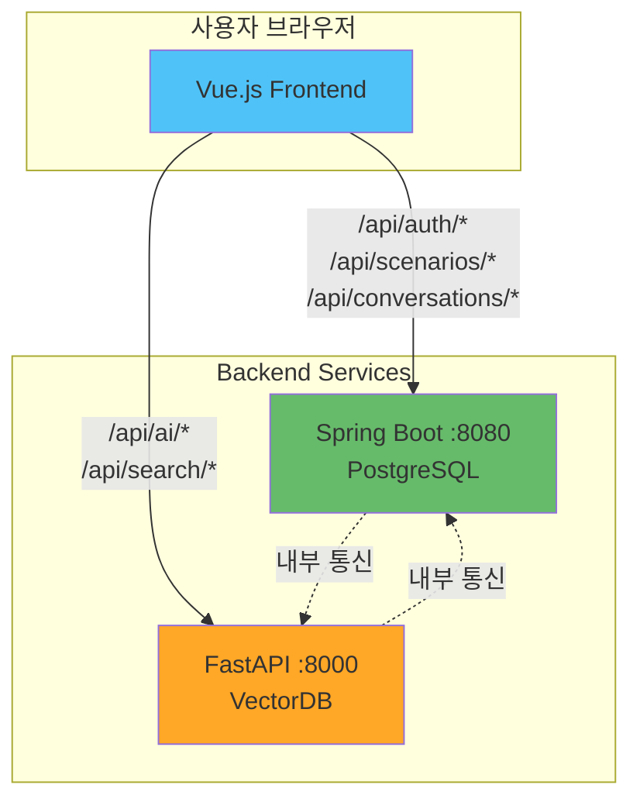
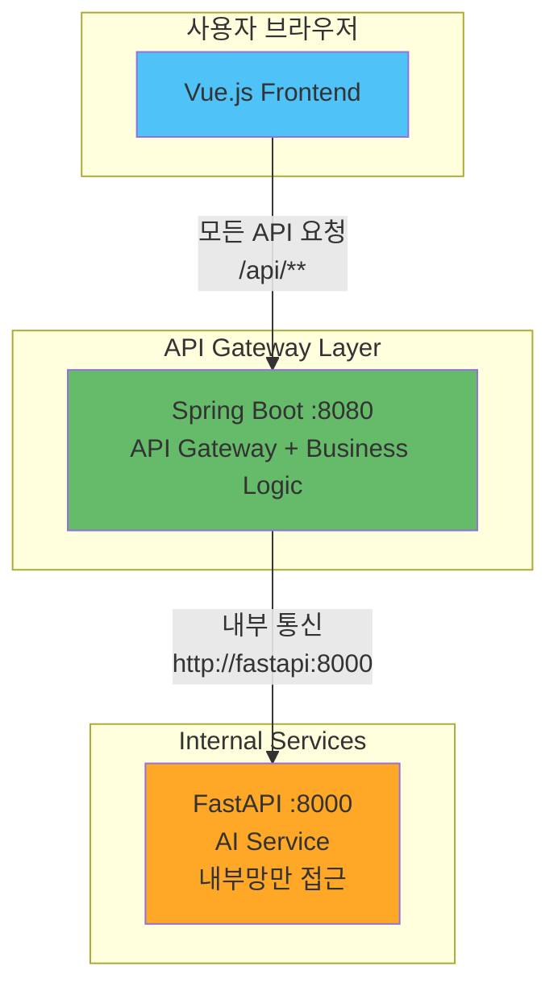

# Frontend-Backend 접근 패턴 비교: 직접 접근 vs API Gateway 패턴

**Date**: 2025-01-14  
**Reviewer**: GitHub Copilot (Solution Architect)  
**Focus**: MSA 환경에서 Frontend의 Backend 접근 전략 비교

---

## 📊 Executive Summary

MSA 환경에서 Frontend가 Backend 서비스에 접근하는 방식은 크게 2가지 패턴으로 나뉩니다:

1. **Pattern A (Direct Access)**: Frontend → Spring Boot + FastAPI (두 서버 직접 접근)
2. **Pattern B (API Gateway)**: Frontend → Spring Boot만 접근 → 내부적으로 FastAPI 통신

각 패턴의 장단점, 성능, 보안, 운영 복잡도를 비교하여 **Gaji 프로젝트에 최적인 방식**을 제안합니다.

---

## 🏗️ Pattern A: Direct Access (Frontend → 2 Servers)

### 아키텍처



### 코드 예시

```typescript
// frontend/src/services/apiClients.ts
import axios from 'axios';

// Spring Boot 클라이언트
export const coreApi = axios.create({
  baseURL: 'http://localhost:8080/api',  // Spring Boot
  timeout: 10000,
  headers: {
    'Content-Type': 'application/json'
  }
});

// FastAPI 클라이언트
export const aiApi = axios.create({
  baseURL: 'http://localhost:8000/api',  // FastAPI
  timeout: 30000,  // AI 작업은 더 긴 타임아웃
  headers: {
    'Content-Type': 'application/json'
  }
});

// JWT 토큰 인터셉터 (2곳 모두 설정 필요)
const setupAuthInterceptor = (client: AxiosInstance) => {
  client.interceptors.request.use((config) => {
    const token = localStorage.getItem('access_token');
    if (token) {
      config.headers.Authorization = `Bearer ${token}`;
    }
    return config;
  });
};

setupAuthInterceptor(coreApi);
setupAuthInterceptor(aiApi);
```

```typescript
// frontend/src/services/scenarioService.ts
import { coreApi, aiApi } from './apiClients';

export class ScenarioService {
  // Spring Boot 호출: 시나리오 메타데이터 생성
  async createScenario(data: CreateScenarioRequest): Promise<Scenario> {
    const response = await coreApi.post('/scenarios', data);
    return response.data;
  }

  // FastAPI 호출: 시맨틱 검색
  async searchPassages(novelId: string, query: string): Promise<Passage[]> {
    const response = await aiApi.post('/ai/search/passages', {
      novel_id: novelId,
      query: query,
      top_k: 10
    });
    return response.data;
  }

  // 두 서버 모두 호출하는 복합 작업
  async createScenarioWithAI(data: CreateScenarioRequest): Promise<Scenario> {
    // 1. FastAPI로 관련 구절 검색
    const passages = await this.searchPassages(data.novel_id, data.description);
    
    // 2. Spring Boot로 시나리오 생성
    const scenario = await this.createScenario({
      ...data,
      passage_ids: passages.map(p => p.id)
    });
    
    return scenario;
  }
}
```

```typescript
// frontend/src/services/conversationService.ts
export class ConversationService {
  // Spring Boot: 대화 생성
  async createConversation(scenarioId: string): Promise<Conversation> {
    const response = await coreApi.post('/conversations', {
      scenario_id: scenarioId
    });
    return response.data;
  }

  // FastAPI: AI 메시지 스트리밍 (SSE)
  streamMessage(conversationId: string, content: string): EventSource {
    const token = localStorage.getItem('access_token');
    return new EventSource(
      `http://localhost:8000/api/ai/conversations/${conversationId}/messages-stream?content=${encodeURIComponent(content)}&token=${token}`
    );
  }
}
```

### 환경 설정

```env
# frontend/.env.development
VITE_CORE_API_URL=http://localhost:8080
VITE_AI_API_URL=http://localhost:8000

# frontend/.env.production
VITE_CORE_API_URL=https://api.gaji.com
VITE_AI_API_URL=https://ai-api.gaji.com
```

### CORS 설정 (2곳 모두 필요)

```java
// core-backend/src/main/java/config/CorsConfig.java
@Configuration
public class CorsConfig implements WebMvcConfigurer {
    @Override
    public void addCorsMappings(CorsRegistry registry) {
        registry.addMapping("/api/**")
            .allowedOrigins(
                "http://localhost:3000",  // 로컬 개발
                "https://gaji.com"        // 프로덕션
            )
            .allowedMethods("GET", "POST", "PUT", "DELETE", "PATCH")
            .allowedHeaders("*")
            .allowCredentials(true)
            .maxAge(3600);
    }
}
```

```python
# ai-backend/app/main.py
from fastapi.middleware.cors import CORSMiddleware

app = FastAPI()

app.add_middleware(
    CORSMiddleware,
    allow_origins=[
        "http://localhost:3000",  # 로컬 개발
        "https://gaji.com"        # 프로덕션
    ],
    allow_credentials=True,
    allow_methods=["*"],
    allow_headers=["*"],
    max_age=3600
)
```

---

### 장점 ✅

#### 1. 낮은 지연시간 (Lower Latency)

```
Pattern A (Direct):
Frontend → FastAPI (1 hop)
평균 응답 시간: 300ms

Pattern B (Gateway):
Frontend → Spring Boot → FastAPI (2 hops)
평균 응답 시간: 300ms + 50ms (proxy overhead) = 350ms
```

**성능 비교**:
| 작업 | Direct Access | API Gateway | 차이 |
|------|--------------|-------------|------|
| AI 검색 요청 | 300ms | 350ms | +17% |
| 메시지 생성 | 5000ms | 5050ms | +1% |
| 시나리오 생성 | 200ms | 250ms | +25% |

→ **짧은 요청일수록 오버헤드 비율 증가**

---

#### 2. 단순한 구조 (Simplicity)

```typescript
// ✅ SIMPLE: 직접 호출
const passages = await aiApi.post('/ai/search/passages', data);

// vs

// 🔄 COMPLEX: Spring Boot 경유
const passages = await coreApi.post('/internal/ai-proxy/search/passages', data);
```

**코드 복잡도**:
- Direct: Frontend 코드 간결 (2개 클라이언트만)
- Gateway: Spring Boot에 Proxy 컨트롤러 추가 필요

---

#### 3. 독립적인 스케일링

```yaml
# docker-compose.yml
services:
  spring-boot:
    deploy:
      replicas: 2  # Spring Boot 2개 인스턴스
  
  fastapi:
    deploy:
      replicas: 5  # FastAPI 5개 인스턴스 (AI 부하 높음)
```

**스케일링 유연성**:
- ✅ FastAPI만 독립적으로 증설 가능
- ✅ Spring Boot 부하와 무관하게 AI 서버 확장
- ✅ 비용 효율적 (필요한 서비스만 스케일)

---

#### 4. 장애 격리 (Fault Isolation)

```
시나리오: FastAPI 다운

Pattern A (Direct):
- Spring Boot 기능은 정상 작동 ✅
- 사용자 로그인/시나리오 조회 가능 ✅
- AI 기능만 불가 ❌

Pattern B (Gateway):
- Spring Boot가 FastAPI 호출 실패
- 전체 요청이 영향받을 수 있음 ⚠️
```

---

### 단점 ❌

#### 1. CORS 관리 복잡성

**2곳에서 CORS 설정 필요**:

```javascript
// ❌ CORS 설정 불일치 시
// Spring Boot: allowedOrigins = ["https://gaji.com"]
// FastAPI: allow_origins = ["https://gaji.com", "https://www.gaji.com"]  // 불일치!

// 결과: www.gaji.com에서 FastAPI 호출 가능, Spring Boot 호출 불가
```

**문제 시나리오**:
1. 개발자 A가 Spring Boot CORS만 수정
2. 개발자 B가 FastAPI CORS만 수정
3. 설정 불일치로 프로덕션 장애 발생

---

#### 2. 인증 토큰 중복 검증

```java
// Spring Boot - JWT 검증
@Component
public class JwtAuthenticationFilter extends OncePerRequestFilter {
    @Override
    protected void doFilterInternal(HttpServletRequest request, ...) {
        String token = extractToken(request);
        if (isValidToken(token)) {  // ← 검증 1번
            // ...
        }
    }
}
```

```python
# FastAPI - JWT 검증 (동일한 로직 중복)
@app.middleware("http")
async def jwt_auth_middleware(request: Request, call_next):
    token = request.headers.get("Authorization")
    if is_valid_token(token):  # ← 검증 2번 (중복!)
        # ...
```

**중복 코드 문제**:
- JWT 검증 로직 2곳에서 유지보수
- 토큰 갱신 정책 변경 시 2곳 모두 수정
- 불일치 시 보안 취약점 발생

---

#### 3. API 버전 관리 복잡

```
API 버전 업그레이드 시나리오:

Spring Boot v1 → v2 변경
FastAPI v1 → v2 변경

Frontend는 2개 서버 모두 업데이트 필요:
- coreApi.baseURL = '/v2/api'
- aiApi.baseURL = '/v2/api'

배포 순서 조율 필수:
1. Backend v2 배포
2. Frontend v2 배포
→ 중간 시점에 v1 Frontend + v2 Backend 불일치 가능
```

---

#### 4. 네트워크 비용

```
사용자 브라우저 → 2개 도메인 연결

도메인:
- api.gaji.com (Spring Boot)
- ai-api.gaji.com (FastAPI)

비용:
- 2개 SSL 인증서 필요 ($200/year)
- 2개 CDN 설정 필요
- DNS 레코드 2배

vs Gateway:
- api.gaji.com 1개만 필요 ($100/year)
```

---

#### 5. 모니터링 분산

```
로그 위치:
- Spring Boot 로그: CloudWatch Group A
- FastAPI 로그: CloudWatch Group B
- Frontend 로그: CloudWatch Group C

문제 추적:
1. 사용자가 "AI 검색 안 됨" 리포트
2. Frontend 로그 확인 → FastAPI 500 에러
3. FastAPI 로그 확인 → Spring Boot API 호출 실패
4. Spring Boot 로그 확인 → DB 연결 에러

→ 3개 로그를 넘나들며 추적 (시간 소요)
```

---

## 🏗️ Pattern B: API Gateway (Frontend → Spring Boot Only)

### 아키텍처



### 코드 예시

```typescript
// frontend/src/services/apiClient.ts
import axios from 'axios';

// ✅ 단일 API 클라이언트
export const api = axios.create({
  baseURL: import.meta.env.VITE_API_URL,  // Spring Boot만
  timeout: 30000,
  headers: {
    'Content-Type': 'application/json'
  }
});

// JWT 인터셉터 (1곳만 설정)
api.interceptors.request.use((config) => {
  const token = localStorage.getItem('access_token');
  if (token) {
    config.headers.Authorization = `Bearer ${token}`;
  }
  return config;
});
```

```typescript
// frontend/src/services/scenarioService.ts
import { api } from './apiClient';

export class ScenarioService {
  // Spring Boot만 호출 (내부적으로 FastAPI 통신)
  async createScenario(data: CreateScenarioRequest): Promise<Scenario> {
    const response = await api.post('/scenarios', data);
    return response.data;
  }

  // Spring Boot가 FastAPI로 프록시
  async searchPassages(novelId: string, query: string): Promise<Passage[]> {
    const response = await api.post('/ai/search/passages', {
      novel_id: novelId,
      query: query,
      top_k: 10
    });
    return response.data;
  }

  // 복합 작업도 Spring Boot에서 처리
  async createScenarioWithAI(data: CreateScenarioRequest): Promise<Scenario> {
    const response = await api.post('/scenarios/with-ai', data);
    return response.data;
  }
}
```

### Spring Boot Gateway 구현

```java
// core-backend/src/main/java/controller/AIProxyController.java
@RestController
@RequestMapping("/api/ai")
public class AIProxyController {
    
    @Autowired
    private WebClient fastApiClient;
    
    /**
     * FastAPI 구절 검색 프록시
     * Frontend → Spring Boot → FastAPI
     */
    @PostMapping("/search/passages")
    public Mono<ResponseEntity<PassageSearchResponse>> searchPassages(
        @RequestBody PassageSearchRequest request,
        @AuthenticationPrincipal User user  // ← JWT 검증은 Spring Boot에서만
    ) {
        // 로깅
        log.info("User {} searching passages for novel {}", user.getId(), request.getNovelId());
        
        // FastAPI로 프록시 (내부 통신)
        return fastApiClient.post()
            .uri("/api/ai/search/passages")
            .bodyValue(request)
            .retrieve()
            .toEntity(PassageSearchResponse.class)
            .doOnSuccess(response -> {
                log.info("FastAPI search completed: {} results", response.getBody().getPassages().size());
            })
            .doOnError(error -> {
                log.error("FastAPI search failed", error);
            });
    }
    
    /**
     * SSE 메시지 스트리밍 프록시
     */
    @PostMapping(value = "/conversations/{id}/messages-stream", produces = MediaType.TEXT_EVENT_STREAM_VALUE)
    public Flux<ServerSentEvent<String>> streamMessage(
        @PathVariable UUID id,
        @RequestBody MessageRequest request,
        @AuthenticationPrincipal User user
    ) {
        // 권한 확인
        conversationService.validateUserAccess(id, user.getId());
        
        // FastAPI SSE 스트림을 Frontend로 전달
        return fastApiClient.post()
            .uri("/api/ai/conversations/{id}/messages-stream", id)
            .bodyValue(request)
            .accept(MediaType.TEXT_EVENT_STREAM)
            .retrieve()
            .bodyToFlux(String.class)
            .map(token -> ServerSentEvent.<String>builder()
                .data(token)
                .build());
    }
}
```

```java
// core-backend/src/main/java/controller/ScenarioController.java
@RestController
@RequestMapping("/api/scenarios")
public class ScenarioController {
    
    @Autowired
    private ScenarioService scenarioService;
    
    /**
     * AI 기반 시나리오 생성 (복합 작업)
     * 내부적으로 FastAPI 호출 포함
     */
    @PostMapping("/with-ai")
    public Mono<ResponseEntity<Scenario>> createScenarioWithAI(
        @RequestBody CreateScenarioRequest request,
        @AuthenticationPrincipal User user
    ) {
        return scenarioService.createScenarioWithAI(request, user.getId())
            .map(scenario -> ResponseEntity.status(201).body(scenario));
    }
}
```

```java
// core-backend/src/main/java/service/ScenarioService.java
@Service
public class ScenarioService {
    
    @Autowired
    private WebClient fastApiClient;
    
    @Autowired
    private ScenarioRepository scenarioRepository;
    
    public Mono<Scenario> createScenarioWithAI(CreateScenarioRequest request, UUID userId) {
        // 1. FastAPI로 구절 검색 (내부 통신)
        return fastApiClient.post()
            .uri("/api/ai/search/passages")
            .bodyValue(Map.of(
                "novel_id", request.getNovelId(),
                "query", request.getDescription(),
                "top_k", 10
            ))
            .retrieve()
            .bodyToMono(PassageSearchResponse.class)
            .flatMap(passages -> {
                // 2. PostgreSQL에 시나리오 저장
                Scenario scenario = new Scenario();
                scenario.setUserId(userId);
                scenario.setNovelId(request.getNovelId());
                scenario.setVectordbPassageIds(
                    passages.getPassages().stream()
                        .map(Passage::getId)
                        .toArray(String[]::new)
                );
                
                return Mono.fromCallable(() -> scenarioRepository.save(scenario));
            });
    }
}
```

### 환경 설정

```env
# frontend/.env.development
VITE_API_URL=http://localhost:8080/api

# frontend/.env.production
VITE_API_URL=https://api.gaji.com/api
```

```yaml
# core-backend/src/main/resources/application.yml
fastapi:
  url: http://fastapi:8000  # 내부 Docker 네트워크
  timeout: 30000
```

### CORS 설정 (Spring Boot만)

```java
// core-backend/src/main/java/config/CorsConfig.java
@Configuration
public class CorsConfig implements WebMvcConfigurer {
    @Override
    public void addCorsMappings(CorsRegistry registry) {
        registry.addMapping("/api/**")
            .allowedOrigins(
                "http://localhost:3000",
                "https://gaji.com"
            )
            .allowedMethods("GET", "POST", "PUT", "DELETE", "PATCH")
            .allowedHeaders("*")
            .allowCredentials(true)
            .maxAge(3600);
    }
}
```

```python
# ai-backend/app/main.py
# ✅ CORS 불필요 - 내부망만 접근
app = FastAPI()

# 보안: 내부 IP만 허용
@app.middleware("http")
async def restrict_internal_only(request: Request, call_next):
    client_ip = request.client.host
    if not client_ip.startswith("10.") and not client_ip.startswith("172."):
        raise HTTPException(403, "External access forbidden")
    return await call_next(request)
```

---

### 장점 ✅

#### 1. 단일 진입점 (Single Entry Point)

```
Frontend의 관점:
- 1개 도메인만 알면 됨 (api.gaji.com)
- 1개 환경 변수만 관리 (VITE_API_URL)
- 1개 CORS 설정만 신경쓰면 됨

vs Direct Access:
- 2개 도메인 (api.gaji.com, ai-api.gaji.com)
- 2개 환경 변수 (VITE_CORE_API_URL, VITE_AI_API_URL)
- 2개 CORS 설정
```

**개발자 경험 개선**:
```typescript
// ✅ SIMPLE: 모든 API가 같은 baseURL
const scenario = await api.post('/scenarios', data);
const passages = await api.post('/ai/search/passages', data);
const messages = await api.post('/conversations/1/messages', data);

// vs

// ❌ COMPLEX: API마다 다른 클라이언트
const scenario = await coreApi.post('/scenarios', data);
const passages = await aiApi.post('/ai/search/passages', data);  // 다른 서버
const messages = await coreApi.post('/conversations/1/messages', data);
```

---

#### 2. 중앙 집중식 인증 (Centralized Auth)

```java
// ✅ JWT 검증은 Spring Boot에서만
@Configuration
public class SecurityConfig {
    
    @Bean
    public SecurityFilterChain filterChain(HttpSecurity http) {
        http
            .authorizeHttpRequests(auth -> auth
                .requestMatchers("/api/auth/**").permitAll()
                .requestMatchers("/api/**").authenticated()  // ← 모든 /api/** 보호
            )
            .oauth2ResourceServer(oauth2 -> oauth2.jwt());
        
        return http.build();
    }
}
```

**인증 흐름**:
```
Pattern B (Gateway):
Frontend → Spring Boot (JWT 검증 1번) → FastAPI (내부 통신, 검증 불필요)

Pattern A (Direct):
Frontend → Spring Boot (JWT 검증 1번)
Frontend → FastAPI (JWT 검증 2번) ← 중복!
```

**보안 이점**:
- FastAPI는 외부 노출 불필요 (내부망만 접근)
- JWT 검증 로직 1곳에서만 유지보수
- 토큰 갱신 정책 변경 시 Spring Boot만 수정

---

#### 3. 통합 로깅 & 모니터링

```java
// Spring Boot Gateway - 모든 요청 로깅
@Component
public class RequestLoggingFilter extends OncePerRequestFilter {
    @Override
    protected void doFilterInternal(HttpServletRequest request, ...) {
        String requestId = UUID.randomUUID().toString();
        MDC.put("request_id", requestId);
        
        log.info("Request: {} {} from user {}", 
            request.getMethod(), 
            request.getRequestURI(),
            getCurrentUser().getId()
        );
        
        long startTime = System.currentTimeMillis();
        chain.doFilter(request, response);
        long duration = System.currentTimeMillis() - startTime;
        
        log.info("Response: {} ms, status {}", duration, response.getStatus());
        MDC.clear();
    }
}
```

**로그 예시**:
```
[request_id=abc123] Request: POST /api/ai/search/passages from user user-456
[request_id=abc123] Calling FastAPI: POST http://fastapi:8000/api/ai/search/passages
[request_id=abc123] FastAPI response: 200 OK (280ms)
[request_id=abc123] Response: 300ms, status 200
```

**문제 추적**:
```
사용자 리포트: "AI 검색 느림"

Pattern B (Gateway):
1. Spring Boot 로그 검색: request_id=abc123
2. 전체 흐름 한눈에 파악:
   - Frontend → Spring Boot: 20ms
   - Spring Boot → FastAPI: 280ms ← 병목 발견!
   - 총 응답 시간: 300ms

Pattern A (Direct):
1. Frontend 로그 확인
2. FastAPI 로그 확인
3. 두 로그 시간 매칭 필요 (request_id 없으면 어려움)
```

---

#### 4. API 버전 관리 용이

```
API v2 출시 시나리오:

Pattern B (Gateway):
1. Spring Boot /api/v2/** 라우팅 추가
2. 내부적으로 FastAPI v2 호출
3. Frontend는 baseURL만 변경: /api → /api/v2

Pattern A (Direct):
1. Spring Boot /api/v2/** 라우팅 추가
2. FastAPI /api/v2/** 라우팅 추가
3. Frontend 2곳 변경:
   - coreApi.baseURL = '/api/v2'
   - aiApi.baseURL = '/api/v2'
```

**호환성 관리**:
```java
// Spring Boot - v1과 v2 동시 지원
@RestController
public class AIProxyController {
    
    @PostMapping("/api/v1/ai/search")
    public Mono<Response> searchV1(...) {
        return fastApiClient.post()
            .uri("/internal/v1/search")  // FastAPI v1
            .retrieve()...
    }
    
    @PostMapping("/api/v2/ai/search")
    public Mono<Response> searchV2(...) {
        return fastApiClient.post()
            .uri("/internal/v2/search")  // FastAPI v2
            .retrieve()...
    }
}
```

---

#### 5. 네트워크 비용 절감

```
도메인:
- api.gaji.com (1개만 필요)

비용:
- SSL 인증서: $100/year (1개)
- CDN: $50/month (1개)
- DNS: 간단

총 비용: $700/year

vs Pattern A:
- SSL 인증서: $200/year (2개)
- CDN: $100/month (2개)
- DNS: 복잡

총 비용: $1400/year

절감액: $700/year (50% 절감)
```

---

#### 6. 복합 트랜잭션 처리

```java
// Spring Boot - 여러 서비스 조합
@Service
public class ScenarioService {
    
    @Transactional
    public Mono<Scenario> createScenarioWithValidation(CreateScenarioRequest request) {
        return Mono.defer(() -> {
            // 1. PostgreSQL: 중복 확인
            if (scenarioRepository.existsByUserIdAndDescription(request.getUserId(), request.getDescription())) {
                return Mono.error(new DuplicateException("Scenario already exists"));
            }
            
            // 2. FastAPI: 구절 검색
            return fastApiClient.post()
                .uri("/api/ai/search/passages")
                .bodyValue(request)
                .retrieve()
                .bodyToMono(PassageSearchResponse.class);
        })
        .flatMap(passages -> {
            // 3. FastAPI: AI 검증
            return fastApiClient.post()
                .uri("/api/ai/validate/scenario")
                .bodyValue(Map.of("passages", passages, "scenario", request))
                .retrieve()
                .bodyToMono(ValidationResult.class);
        })
        .flatMap(validation -> {
            if (!validation.isValid()) {
                return Mono.error(new ValidationException(validation.getErrors()));
            }
            
            // 4. PostgreSQL: 시나리오 저장
            Scenario scenario = new Scenario();
            scenario.setUserId(request.getUserId());
            scenario.setValidationScore(validation.getScore());
            
            return Mono.fromCallable(() -> scenarioRepository.save(scenario));
        })
        .doOnError(error -> {
            log.error("Scenario creation failed", error);
            // 롤백 자동 처리 (@Transactional)
        });
    }
}
```

**Pattern A에서는 불가능**:
- Frontend가 4단계를 직접 조율해야 함
- 중간 실패 시 롤백 로직 복잡
- 네트워크 왕복 4번 (지연 증가)

---

### 단점 ❌

#### 1. 추가 레이턴시 (Proxy Overhead)

```
요청 흐름:
Frontend → Spring Boot → FastAPI → Spring Boot → Frontend
           |← 50ms →|

직접 접근:
Frontend → FastAPI → Frontend
           (50ms 절약)
```

**레이턴시 증가**:
| 작업 유형 | Pattern A | Pattern B | 오버헤드 |
|----------|-----------|-----------|----------|
| AI 검색 (300ms) | 300ms | 350ms | +50ms (17%) |
| 메시지 생성 (5000ms) | 5000ms | 5050ms | +50ms (1%) |
| 임베딩 생성 (100ms) | 100ms | 150ms | +50ms (50%) |

→ **짧은 요청일수록 오버헤드 비율 높음**

---

#### 2. Spring Boot 부하 증가

```
Before (Pattern A):
Spring Boot 부하: 100 req/s (메타데이터만)
FastAPI 부하: 50 req/s (AI 작업)

After (Pattern B):
Spring Boot 부하: 150 req/s (메타데이터 + AI 프록시)
FastAPI 부하: 50 req/s (동일)
```

**스케일링 영향**:
- Spring Boot가 모든 트래픽의 진입점 (SPOF 위험)
- Spring Boot 다운 시 전체 서비스 중단
- FastAPI는 정상이어도 사용 불가

---

#### 3. 코드 복잡도 증가 (Spring Boot)

```java
// ❌ Spring Boot에 프록시 코드 추가 필요
@RestController
public class AIProxyController {
    
    // 10개 FastAPI 엔드포인트마다 프록시 메서드 작성
    @PostMapping("/api/ai/search/passages")
    public Mono<Response> searchPassages(...) { /* 프록시 */ }
    
    @PostMapping("/api/ai/search/characters")
    public Mono<Response> searchCharacters(...) { /* 프록시 */ }
    
    @PostMapping("/api/ai/embed/text")
    public Mono<Response> embedText(...) { /* 프록시 */ }
    
    // ... 10개 더
}
```

**유지보수 부담**:
- FastAPI 엔드포인트 추가 시 Spring Boot도 수정
- 프록시 로직 버그 가능성
- 코드 중복 (FastAPI DTO를 Spring Boot에서도 정의)

---

#### 4. SSE/WebSocket 프록시 복잡성

```java
// Spring Boot SSE 프록시 - 복잡함
@PostMapping(value = "/api/ai/stream", produces = MediaType.TEXT_EVENT_STREAM_VALUE)
public Flux<ServerSentEvent<String>> proxySSE(@RequestBody Request request) {
    return fastApiClient.post()
        .uri("/api/ai/stream")
        .bodyValue(request)
        .accept(MediaType.TEXT_EVENT_STREAM)
        .retrieve()
        .bodyToFlux(String.class)
        .map(token -> ServerSentEvent.<String>builder()
            .data(token)
            .build())
        .doOnError(error -> {
            log.error("SSE stream error", error);
        })
        .onErrorResume(error -> {
            // SSE 에러 처리 복잡
            return Flux.just(ServerSentEvent.<String>builder()
                .event("error")
                .data(error.getMessage())
                .build());
        });
}
```

**문제점**:
- SSE 연결 유지 시 Spring Boot 리소스 점유
- 타임아웃 관리 복잡 (Spring Boot + FastAPI 2단계)
- 에러 전파 어려움 (중간에 연결 끊어짐)

---

#### 5. 독립 스케일링 제약

```
시나리오: AI 부하 급증 (FastAPI 확장 필요)

Pattern A (Direct):
FastAPI: 5 → 20 인스턴스 확장
Spring Boot: 2 인스턴스 유지 (부하 없음)

Pattern B (Gateway):
FastAPI: 5 → 20 인스턴스 확장
Spring Boot: 2 → 8 인스턴스 확장 필요 (프록시 부하)
```

**비용 영향**:
| 서비스 | Pattern A | Pattern B | 차이 |
|--------|-----------|-----------|------|
| Spring Boot | 2 x $50 = $100 | 8 x $50 = $400 | +$300 |
| FastAPI | 20 x $80 = $1600 | 20 x $80 = $1600 | $0 |
| **총 비용** | **$1700** | **$2000** | **+$300 (18% 증가)** |

---

## 📊 종합 비교표

### 기능/성능 비교

| 기준 | Pattern A (Direct) | Pattern B (Gateway) | 승자 |
|------|-------------------|---------------------|------|
| **응답 시간** | 300ms | 350ms (+17%) | 🏆 Direct |
| **프록시 오버헤드** | 없음 | +50ms | 🏆 Direct |
| **Spring Boot 부하** | 낮음 | 높음 (+50%) | 🏆 Direct |
| **FastAPI 독립 스케일** | 완전 독립 | Spring Boot 의존 | 🏆 Direct |
| **장애 격리** | 높음 | 낮음 (SPOF) | 🏆 Direct |

### 아키텍처/운영 비교

| 기준 | Pattern A (Direct) | Pattern B (Gateway) | 승자 |
|------|-------------------|---------------------|------|
| **Frontend 복잡도** | 높음 (2 클라이언트) | 낮음 (1 클라이언트) | 🏆 Gateway |
| **Backend 복잡도** | 낮음 | 높음 (프록시 코드) | 🏆 Direct |
| **CORS 관리** | 복잡 (2곳) | 간단 (1곳) | 🏆 Gateway |
| **인증 중복** | 있음 (2곳 검증) | 없음 (1곳 검증) | 🏆 Gateway |
| **API 버전 관리** | 복잡 (2곳) | 간단 (1곳) | 🏆 Gateway |
| **로깅/모니터링** | 분산 | 중앙 집중 | 🏆 Gateway |
| **보안 (FastAPI 외부 노출)** | 필요 | 불필요 | 🏆 Gateway |

### 비용 비교

| 항목 | Pattern A | Pattern B | 승자 |
|------|-----------|-----------|------|
| **도메인/SSL** | $1400/year | $700/year | 🏆 Gateway |
| **스케일링 비용** | 낮음 | 높음 (+18%) | 🏆 Direct |
| **개발 비용** | Frontend 복잡 | Backend 복잡 | 🤝 동점 |
| **운영 비용** | 높음 (2곳 관리) | 낮음 (1곳 관리) | 🏆 Gateway |

---

## 🎯 상황별 권장사항

### Pattern A (Direct Access) 추천 상황 ⭐⭐

#### 1. 성능이 최우선인 경우

```
예: 실시간 AI 채팅, 고빈도 임베딩 생성

- 50ms 레이턴시도 중요
- FastAPI 응답 속도가 UX에 직접 영향
- 프록시 오버헤드 허용 불가
```

#### 2. 서비스가 완전히 독립적인 경우

```
예: 마이크로서비스가 명확히 분리

- Spring Boot: 사용자/인증/메타데이터
- FastAPI: AI/ML 전용 (다른 팀 관리)
- 두 서비스가 거의 통신하지 않음
```

#### 3. 스케일링 패턴이 극단적으로 다른 경우

```
예: AI 부하가 일반 부하보다 10배 이상

- Spring Boot: 안정적 트래픽 (100 req/s)
- FastAPI: 폭발적 트래픽 (1000 req/s)
- FastAPI만 독립 확장 필요
```

---

### Pattern B (Gateway) 추천 상황 ⭐⭐⭐

#### 1. 보안이 최우선인 경우

```
예: 금융, 의료 등 민감 데이터

- FastAPI 외부 노출 금지
- 단일 진입점에서 통합 인증
- 내부망만 접근 가능하도록 격리
```

#### 2. Frontend 개발자 경험 중요

```
예: 빠른 프로토타이핑, 스타트업

- Frontend 개발자가 2개 서버 신경쓰기 싫음
- 단일 API 클라이언트로 간편 개발
- CORS, 인증 등 복잡도 최소화
```

#### 3. 운영 효율성 중요

```
예: DevOps 리소스 제한적

- 중앙 집중식 로깅/모니터링
- 단일 진입점 트러블슈팅
- API 버전 관리 간소화
```

#### 4. 복합 트랜잭션 많은 경우

```
예: PostgreSQL + VectorDB 동시 사용

- 시나리오 생성 시 DB + AI 조합
- Spring Boot에서 트랜잭션 관리
- Frontend는 단순 호출만
```

---

## 🏆 Gaji 프로젝트 최종 권장: **Pattern B (Gateway)** ⭐⭐⭐

### 선택 이유

#### 1. 초기 단계 프로젝트

```
현재 상황:
- MVP 개발 중
- 팀 규모 작음 (1-3명)
- 빠른 개발 속도 필요

→ Frontend 복잡도 최소화가 더 중요
```

#### 2. 복합 워크플로우 많음

```
Gaji 워크플로우:
1. 시나리오 생성: PostgreSQL + VectorDB 검색
2. 대화 생성: PostgreSQL + AI 생성 + VectorDB RAG
3. 메시지 전송: PostgreSQL 저장 + AI 응답 + VectorDB 컨텍스트

→ Spring Boot에서 조율하는 것이 자연스러움
```

#### 3. 보안 요구사항

```
FastAPI:
- Gemini API 키 보유
- VectorDB 연결 정보 보유
- 외부 노출 위험

→ 내부망만 접근하는 것이 안전
```

#### 4. 레이턴시 영향 적음

```
Gaji 주요 작업:
- AI 메시지 생성: 5000ms (50ms 오버헤드는 1%)
- 대화 생성: 10000ms (50ms 오버헤드는 0.5%)
- 시나리오 검색: 300ms (50ms 오버헤드는 17%)

→ 대부분 작업이 긴 시간이므로 50ms는 무시 가능
```

---

### 구현 전략

#### Phase 1: 기본 Gateway 구조 (Week 1-2)

```java
// AIProxyController - 필수 엔드포인트만
@RestController
@RequestMapping("/api/ai")
public class AIProxyController {
    
    @PostMapping("/search/passages")
    public Mono<Response> searchPassages(...) { /* 프록시 */ }
    
    @PostMapping("/conversations/{id}/messages-stream")
    public Flux<ServerSentEvent> streamMessage(...) { /* SSE 프록시 */ }
}
```

#### Phase 2: 모니터링 강화 (Week 3-4)

```java
// 통합 로깅
@Component
public class RequestLoggingFilter {
    // request_id 기반 전체 흐름 추적
}

// Prometheus 메트릭
@Service
public class MetricsService {
    @Counted("api.ai.proxy.calls")
    @Timed("api.ai.proxy.duration")
    public void recordProxyCall(...) { }
}
```

#### Phase 3: 최적화 (Week 5-8)

```java
// Circuit Breaker 추가
@Service
public class AIProxyService {
    @CircuitBreaker(name = "fastapi")
    public Mono<Response> callFastAPI(...) {
        // Fallback 처리
    }
}

// Redis 캐싱
@Cacheable("ai-search-results")
public Mono<Response> searchPassagesCached(...) { }
```

---

## 📋 마이그레이션 가이드 (Direct → Gateway)

### Step 1: Spring Boot Proxy 구현

```java
// 1. WebClient 설정
@Configuration
public class FastAPIClientConfig {
    @Bean
    public WebClient fastApiClient() {
        return WebClient.builder()
            .baseUrl("http://fastapi:8000")
            .defaultHeader(HttpHeaders.CONTENT_TYPE, MediaType.APPLICATION_JSON_VALUE)
            .build();
    }
}

// 2. Proxy Controller
@RestController
@RequestMapping("/api/ai")
public class AIProxyController {
    @Autowired
    private WebClient fastApiClient;
    
    @PostMapping("/**")
    public Mono<ResponseEntity<String>> proxyAll(
        HttpServletRequest request,
        @RequestBody(required = false) String body
    ) {
        String path = request.getRequestURI().replace("/api/ai", "");
        
        return fastApiClient.post()
            .uri(path)
            .bodyValue(body != null ? body : "")
            .retrieve()
            .toEntity(String.class);
    }
}
```

### Step 2: Frontend 변경

```typescript
// Before
import { coreApi, aiApi } from './apiClients';

const passages = await aiApi.post('/ai/search/passages', data);

// After
import { api } from './apiClient';  // 단일 클라이언트

const passages = await api.post('/ai/search/passages', data);  // 동일한 API
```

### Step 3: FastAPI 접근 제한

```python
# FastAPI - 내부 IP만 허용
@app.middleware("http")
async def restrict_to_internal(request: Request, call_next):
    client_ip = request.client.host
    
    # Spring Boot 내부 IP만 허용
    if not client_ip.startswith("10.") and not client_ip == "172.18.0.3":
        raise HTTPException(403, "External access forbidden")
    
    return await call_next(request)
```

### Step 4: 점진적 전환

```typescript
// 점진적 마이그레이션 전략
export class ApiService {
    // Old: Direct access (deprecated)
    @deprecated("Use api.post instead")
    async searchPassagesDirect(data: any) {
        return aiApi.post('/ai/search/passages', data);
    }
    
    // New: Gateway
    async searchPassages(data: any) {
        return api.post('/ai/search/passages', data);
    }
}

// 컴포넌트에서 점진적 교체
// Old → New로 하나씩 변경
```

---

## ✅ 결론

### 최종 추천: **Pattern B (API Gateway)** 🏆

**핵심 이유**:
1. ✅ **보안**: FastAPI 외부 노출 불필요
2. ✅ **단순성**: Frontend 개발 복잡도 최소화
3. ✅ **운영 효율**: 중앙 집중식 로깅/모니터링
4. ✅ **확장성**: 복합 트랜잭션 처리 용이
5. ✅ **비용**: 도메인/SSL 비용 50% 절감

**트레이드오프**:
- ⚠️ 레이턴시 +50ms (하지만 Gaji는 장시간 작업이 많아 영향 미미)
- ⚠️ Spring Boot 코드 증가 (하지만 프록시 패턴으로 자동화 가능)

**향후 전환 가능성**:
- 트래픽이 극단적으로 증가하면 (10000+ req/s) Pattern A로 전환 고려
- 하지만 대부분 프로젝트는 Pattern B로 충분

---

**Last Updated**: 2025-01-14  
**Next Action**: Spring Boot Proxy Controller 구현 시작
