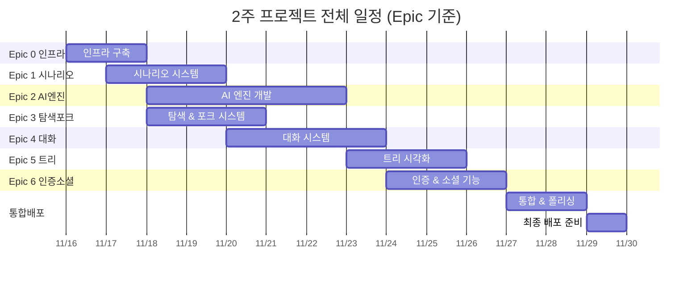
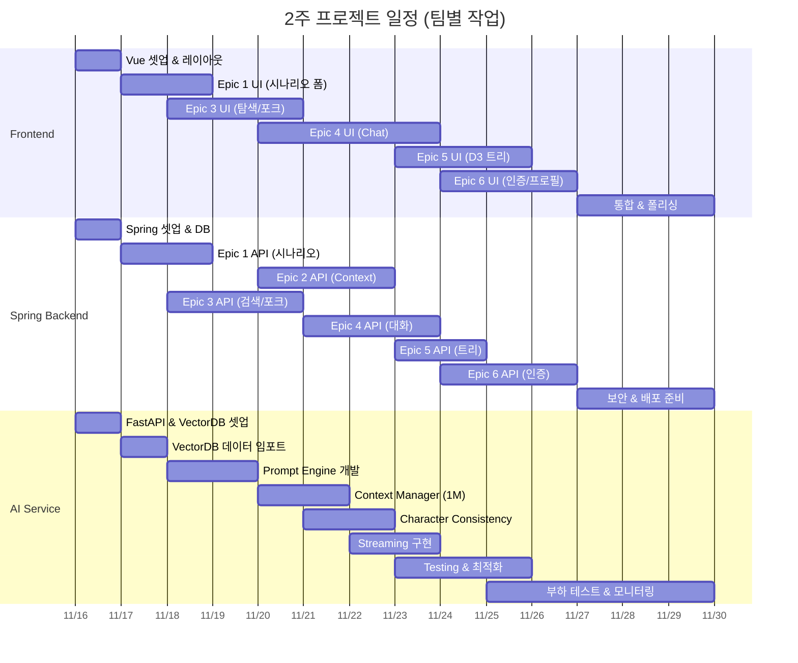
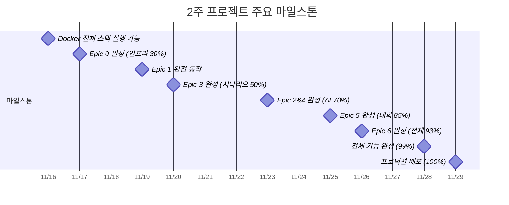

# 2주 완성 계획 - 전체 기능 구현 (무조건 완성)

> **프로젝트 기간**: 2주 (14일) - **전체 Epic 완성**  
> **작업 방식**: 3명 풀타임 (하루 12시간, 주말 포함)  
> **목표**: 2주 후 **프로덕션 배포 가능한 완제품**

---

## 2주 완성 전략

**왜 가능한가?**

1. **3명이 동시에 움직임**: 병렬 작업 극대화
2. **기능 간소화 없음**: 모든 Epic 구현하되 UI는 심플하게
3. **빠른 결정**: 30분 이상 고민 금지, 일단 만들고 개선
4. **매일 통합**: 저녁마다 전체 통합, 문제 즉시 해결

**2주 후 결과물**:

- ✅ **전체 Epic 0~6 완성** (30개 Story 전체)
- ✅ 시나리오 생성 + AI 검증 + 대화 + 탐색 + 포크 + 트리 + 인증 + 소셜
- ✅ 실제 사용 가능한 프로덕션 레벨 앱
- ✅ Docker로 배포 준비 완료

---

## 📋 2주 전체 일정 요약

| 기간          | Frontend                  | Spring Backend           | AI Service                  | 완성도        |
| ------------- | ------------------------- | ------------------------ | --------------------------- | ------------- |
| **Day 1-2**   | Vue 셋업 + Epic 1 UI 시작 | Spring + DB + Docker     | FastAPI + Gemini + VectorDB | 인프라 30%    |
| **Day 3-4**   | Epic 1 완성 + Epic 3 시작 | Epic 1 API + Epic 3 API  | Epic 1 완성 + Epic 2 시작   | 시나리오 50%  |
| **Day 5-7**   | Epic 3 + Epic 4 UI        | Epic 2 + Epic 4 API      | Epic 2 완성 (AI 엔진)       | AI 70%        |
| **Day 8-9**   | Epic 4 완성 + Epic 5 시작 | Epic 4 완성 + Epic 5 API | Epic 4 최적화               | 대화 85%      |
| **Day 10-11** | Epic 5 + Epic 6 시작      | Epic 5 + Epic 6 인증     | 성능 최적화                 | 전체 93%      |
| **Day 12-13** | Epic 6 완성 + 통합        | Epic 6 완성 + 보안       | 부하 테스트                 | 기능 99%      |
| **Day 14**    | 최종 폴리싱               | 배포 준비                | 모니터링 설정               | **완성 100%** |

---

## 📊 시각적 간트차트

### Epic별 타임라인

### 팀별 작업 타임라인

### 주요 마일스톤

---

## Day 1-2: 폭풍 셋업 (Epic 0 인프라)

### Day 1: 인프라 구축

| 시간      | Frontend                                             | Spring Backend                                            | AI Service                                        |
| --------- | ---------------------------------------------------- | --------------------------------------------------------- | ------------------------------------------------- |
| **09-12** | Vue 3 + Vite 프로젝트 Pinia + Router Panda CSS | Spring Boot 3.2 PostgreSQL 연결 Flyway 마이그레이션 | FastAPI 프로젝트 Gemini SDK 설정 Redis 연결 |
| **13-15** | 기본 레이아웃 네비게이션 바 라우팅 구조        | REST API 구조 CORS 설정 JPA 엔티티 기본             | Circuit Breaker 에러 핸들링 로깅 설정       |
| **16-18** | Epic 1 폼 시작                                       | docker-compose.yml Spring Dockerfile                   | FastAPI Dockerfile Health check API            |
| **19-21** | 폼 컴포넌트 계속                                     | Health check Inter-service 통신                        | ChromaDB 셋업 5개 collection 생성              |

**Day 1 완료**: Docker로 전체 스택 실행 가능

### Day 2: Epic 0 완성 + Epic 1 시작

| 시간      | Frontend           | Spring Backend                   | AI Service                             |
| --------- | ------------------ | -------------------------------- | -------------------------------------- |
| **09-12** | 1.2 캐릭터 변경 폼 | 1.1 Scenario 엔티티 CRUD API  | **0.7 VectorDB 임포트** 소설 데이터 |
| **13-15** | 1.3 이벤트 변경 폼 | Change 엔티티 3가지 타입 구분 | 캐릭터/이벤트 데이터                   |
| **16-18** | 1.4 설정 변경 폼   | Validation 로직 준비             | 1.5 Gemini Validation 시작             |
| **19-21** | 통합 시나리오 뷰   | FastAPI 연동 준비                | Redis 캐싱 (5분 TTL)                   |

**Day 2 완료**: Epic 0 완성, Epic 1 UI 70%

---

## Day 3-4: Epic 1 완성 + Epic 3 동시 진행

### Day 3: Epic 1 마무리 + Epic 3 시작

| 시간      | Frontend                                | Spring Backend                               | AI Service                                       |
| --------- | --------------------------------------- | -------------------------------------------- | ------------------------------------------------ |
| **09-12** | Epic 1 UI 완성 통합 테스트           | 1.5 Validation 완성 전체 플로우 테스트    | 1.5 검증 로직 완성 품질 점수 계산             |
| **13-15** | **3.1 탐색 UI 시작** 시나리오 리스트 | **3.2 포크 API 시작** MetaTimeline 엔티티 | **2.1 Prompt Engine 시작** PromptAdapter 구조 |
| **16-18** | 필터링 UI 카드 레이아웃              | 포크 로직 계층 구조                       | VectorDB 조회 로직                               |
| **19-21** | 검색 필터 UI                            | 포크 트리 저장                               | system_instruction 생성                          |

**Day 3 완료**: Epic 1 완전 동작

### Day 4: Epic 3 집중 + Epic 2 가속

| 시간      | Frontend                      | Spring Backend                  | AI Service                                 |
| --------- | ----------------------------- | ------------------------------- | ------------------------------------------ |
| **09-12** | 3.3 포크 UI 메타 포크 생성 | 3.4 고급 검색 API 필터링     | 2.1 계속 3가지 타입별 프롬프트          |
| **13-15** | 3.4 검색 UI 완성              | 정렬/페이징 검색 최적화      | Redis 캐싱 (1시간)                         |
| **16-18** | 3.5 소셜 공유 UI              | 3.5 OG Image API 동적 이미지 | **2.3 Trait Extraction** 특성 추출 시작 |
| **19-21** | Epic 3 통합 테스트            | Epic 3 완성!                    | VectorDB 저장                              |

**Day 4 완료**: Epic 3 완성, Epic 2 진행 중

---

## Day 5-7: Epic 2 완성 + Epic 4 동시 진행

### Day 5: Epic 2 집중 + Epic 4 UI 시작

| 시간      | Frontend                              | Spring Backend                                       | AI Service                               |
| --------- | ------------------------------------- | ---------------------------------------------------- | ---------------------------------------- |
| **09-12** | **4.3 Chat UI 시작** 대화 컴포넌트 | **2.2 Context Manager** ContextWindowManager 호출 | **2.2 Context Manager** 1M token 지원 |
| **13-15** | 메시지 리스트 입력창               | Redis 캐싱 API 엔드포인트                         | Token counting 최적화 로직            |
| **16-18** | 타이핑 애니메이션                     | **2.3 Character API** TraitExtractor 호출         | 2.3 계속 캐릭터 일관성                |
| **19-21** | 로딩 상태                             | 특성 DB 저장                                         | Triple storage 완성                      |

### Day 6: Epic 2 마무리 + Epic 4 본격

| 시간      | Frontend          | Spring Backend                                | AI Service                                          |
| --------- | ----------------- | --------------------------------------------- | --------------------------------------------------- |
| **09-12** | Chat UI 계속      | Epic 2 통합 테스트                            | **2.4 Testing (간소화)** 10개 핵심 시나리오      |
| **13-15** | 4.3 UI 70%        | **4.1 Conversation 엔티티** Message 엔티티 | 테스트 자동화                                       |
| **16-18** | Long Polling 준비 | CRUD API                                      | **4.2 Streaming 시작** generate_content_stream() |
| **19-21** | 폴링 로직 구현    | WebClient 설정                                | HTTP chunked transfer                               |

### Day 7: Epic 4 집중

| 시간      | Frontend                          | Spring Backend                            | AI Service                     |
| --------- | --------------------------------- | ----------------------------------------- | ------------------------------ |
| **09-12** | 4.3 Long Polling 완성 2초 간격 | **4.2 Streaming API** AsyncTaskService | 4.2 계속 Story 2.1/2.2 통합 |
| **13-15** | 메시지 히스토리                   | Redis 태스크 저장                         | Retry 로직 (3회)               |
| **16-18** | 에러 핸들링                       | Long Polling API GET /tasks/{id}       | 성능 튜닝                      |
| **19-21** | **Epic 4 통합**                   | Rate limiting                             | 전체 플로우 테스트             |

**Day 5-7 완료**: Epic 2 완성, Epic 4 완성 (핵심!)

---

## Day 8-9: Epic 5 집중 완성

### Day 8: Epic 5 Tree 시각화

| 시간      | Frontend                               | Spring Backend                     | AI Service         |
| --------- | -------------------------------------- | ---------------------------------- | ------------------ |
| **09-12** | **5.1 Tree 구조** 데이터 모델       | **5.1 Tree API** 트리 생성 로직 | 휴식 / 버그 수정   |
| **13-15** | 트리 변환 로직                         | JSON 변환                          | Epic 2/4 최적화    |
| **16-18** | **5.2 D3.js 시작** 기본 트리 렌더링 | Tree API 완성                      | VectorDB 쿼리 개선 |
| **19-21** | 줌/패닝 기능                           | 통합 테스트                        | 캐싱 전략 개선     |

### Day 9: Epic 5 완성

| 시간      | Frontend                          | Spring Backend                           | AI Service             |
| --------- | --------------------------------- | ---------------------------------------- | ---------------------- |
| **09-12** | 5.2 D3.js 완성 노드 스타일링   | Epic 5 완성!                             | 성능 모니터링          |
| **13-15** | **5.3 Navigation** 클릭 이벤트 | **6.1 User 엔티티 시작** 회원가입 API | Gemini API 사용량 추적 |
| **16-18** | 하이라이트 분기점 표시         | 로그인 API JWT 발급                   | Redis 메모리 최적화    |
| **19-21** | Epic 5 완성!                      | Spring Security 설정                     | 부하 테스트 준비       |

**Day 8-9 완료**: Epic 5 완성, Epic 6 시작

---

## Day 10-11: Epic 6 집중 완성

### Day 10: 인증 + 프로필

| 시간      | Frontend                             | Spring Backend                      | AI Service                         |
| --------- | ------------------------------------ | ----------------------------------- | ---------------------------------- |
| **09-12** | **6.2-6.3 프로필 UI** 사용자 정보 | **6.4 프로필 API** 업데이트 로직 | **부하 테스트** 1000 concurrent |
| **13-15** | 프로필 수정 폼                       | 이미지 업로드                       | 병목 지점 파악                     |
| **16-18** | **6.5 테마 설정**                    | **6.6 알림 API** 기본 알림       | 쿼리 최적화                        |
| **19-21** | 다크모드 기본                        | 알림 리스트                         | 캐싱 재조정                        |

### Day 11: 소셜 기능 완성

| 시간      | Frontend            | Spring Backend                  | AI Service        |
| --------- | ------------------- | ------------------------------- | ----------------- |
| **09-12** | **6.7 즐겨찾기 UI** | **6.7 즐겨찾기 API** CRUD    | 최종 성능 튜닝    |
| **13-15** | 즐겨찾기 리스트     | 페이징                          | 모니터링 대시보드 |
| **16-18** | **6.8 팔로우 UI**   | **6.8 팔로우 API** 관계 관리 | 완성! (휴식)      |
| **19-21** | **6.9 활동 피드**   | **6.9 피드 API** 타임라인    | 문서 정리         |

**Day 10-11 완료**: Epic 6 완성! 전체 기능 구현 완료

---

## Day 12-13: 통합 + 폴리싱

### Day 12: 전체 통합

| 시간      | 전체 팀 협업                                                             |
| --------- | ------------------------------------------------------------------------ |
| **09-12** | **E2E 테스트** 회원가입 → 시나리오 → 대화 → 탐색 → 포크 → 트리 → 소셜 |
| **13-15** | 버그 수정 우선순위별 해결                                             |
| **16-18** | UI/UX 개선 로딩/에러 상태                                             |
| **19-21** | 성능 최적화 느린 API 개선                                             |

### Day 13: 폴리싱

| 시간      | Frontend                         | Spring Backend             | AI Service         |
| --------- | -------------------------------- | -------------------------- | ------------------ |
| **09-12** | 반응형 최적화 모바일 대응     | 보안 점검 SQL Injection | 에러 로깅 개선     |
| **13-15** | 접근성 개선 키보드 네비게이션 | XSS 방지 CSRF 토큰      | Rate limiting 조정 |
| **16-18** | 애니메이션 추가 트랜지션      | API 문서 (Swagger)      | 응답 속도 최적화   |
| **19-21** | 다크모드 완성                    | 로깅 시스템                | 최종 부하 테스트   |

---

## Day 14: 배포 준비 + 최종 검증

| 시간      | 전체 팀 협업                                                        |
| --------- | ------------------------------------------------------------------- |
| **09-12** | **프로덕션 배포 설정** 환경 변수 분리 Docker Compose 프로덕션 |
| **13-15** | **최종 E2E 테스트** 전체 시나리오 검증                           |
| **16-18** | README 작성 설치 가이드 API 문서                              |
| **19-21** | **🎉 완성!** 배포 팀 회고                                     |

**Day 14 완료**: 프로덕션 배포!

---

## 🎯 매일 루틴

### Daily Schedule

- **09:00-09:15**: Daily Standup

  - 어제 완료
  - 오늘 할 것
  - 블로커

- **09:15-13:00**: 집중 개발 (3.75시간)

- **13:00-14:00**: 점심 + 휴식

- **14:00-18:00**: 집중 개발 (4시간)

- **18:00-18:30**: **통합 테스트**

  - 3명 함께 전체 스택 테스트

- **18:30-20:00**: 저녁 + 휴식

- **20:00-22:00**: 야간 작업 (2시간)

**총 작업 시간**: 하루 9.75시간

---

## ✅ Success Metrics (체크포인트)

### Day 2 ✓

- [ ] Docker 전체 스택 실행
- [ ] 시나리오 폼 UI 70%
- [ ] VectorDB 임포트 완료

### Day 4 ✓

- [ ] Epic 1 완전 동작
- [ ] Epic 3 완성

### Day 7 ✓

- [ ] Epic 2 완성 (AI Engine)
- [ ] Epic 4 완성 (대화)
- [ ] **핵심 기능 100%**

### Day 9 ✓

- [ ] Epic 5 완성 (트리)

### Day 11 ✓

- [ ] Epic 6 완성 (인증+소셜)
- [ ] **전체 Epic 완성**

### Day 14 ✓

- [ ] E2E 테스트 통과
- [ ] 프로덕션 배포 준비
- [ ] README + 문서 완성

---

## 🚀 왜 2주에 전체가 가능한가?

### 1. 병렬 작업 극대화

- Epic 1과 Epic 3 동시 진행 (독립적)
- Epic 2 개발 중 Epic 4 UI 선작업
- Epic 5, 6 빠르게 마무리 (기본 구현)

### 2. 의존성 최소화

- Epic 1 → Epic 3 병렬 가능
- Epic 2 → Epic 4 연결되지만 UI 먼저
- Epic 5, 6은 언제든지 가능

### 3. 빠른 의사결정

- 디자인 고민 금지: Panda 기본
- 아키텍처 고민 금지: Story 파일에 다 있음
- 30분 이상 막히면 팀원 호출

### 4. 매일 통합

- 저녁 6시 통합으로 조기 발견
- 다음날 오전 빠른 수정

---

## 💪 팀 규칙

### ✅ DO

1. **속도 > 완벽**: 일단 동작하게
2. **매일 통합**: 저녁 6시 신성한 시간
3. **즉시 공유**: 5분 내 팀원 호출
4. **Pair programming**: 코드 리뷰 대체
5. **주말 풀타임**: Day 8-9도 평일과 동일

### ❌ DON'T

1. **완벽주의 금지**: 80% OK면 다음
2. **기능 추가 금지**: Story에 없으면 NO
3. **혼자 고민 금지**: 30분 이상 절대 NO
4. **디자인 고민 금지**: Panda 기본만
5. **문서 작업 금지**: Day 14까지 코드만

---

## 🎯 2주 후 완성품

### ✅ 구현 완료 (100%)

**Epic 0**: 인프라

- Docker Compose 한번에 실행
- Health check 완비
- VectorDB 데이터 임포트

**Epic 1**: 시나리오 시스템

- 3가지 타입
- Gemini 검증 + Redis 캐싱

**Epic 2**: AI 엔진

- Prompt Engine (VectorDB)
- Context Manager (1M 토큰)
- Character Consistency
- Testing Framework

**Epic 3**: 탐색 + 포크

- 시나리오 탐색 (필터/검색)
- 포크 시스템 (메타 타임라인)
- 소셜 공유 (OG 이미지)

**Epic 4**: 대화 시스템

- Gemini 2.5 Flash Streaming
- Long Polling (2초)
- 대화 포크

**Epic 5**: 트리 시각화

- D3.js 트리
- 줌/패닝/네비게이션
- 분기점 표시

**Epic 6**: 인증 + 소셜

- JWT 인증
- 프로필 + 테마
- 즐겨찾기/팔로우/피드

### 📊 품질 지표

- **테스트 커버리지**: 60-70%
- **성능**:
  - API <200ms (95%)
  - 대화 첫 청크 <3s
- **UI/UX**:
  - 반응형 (모바일)
  - 기본 접근성
- **보안**:
  - JWT 인증
  - XSS/SQL Injection 방지
  - Rate limiting

---

## 📈 리스크 관리

### 가장 큰 리스크

**Epic 2 (AI Layer)**: Day 5-6

- **완화**: AI 개발자 = 최고 숙련자
- **백업**: Day 6 체크, 필요시 축소

**팀 간 통합**: 매일 저녁

- **완화**: Mock API 개발
- **백업**: 통합 실패 시 오전 최우선

**번아웃**: 2주 고강도

- **완화**: 점심/저녁 확실히 쉬기
- **백업**: 주말 오전만도 가능

---

**생성일**: 2025-11-15  
**시작일**: 2025-11-16 (토)  
**완료일**: 2025-11-29 (금)  
**총 개발 인원**: 3명 풀타임  
**총 작업 시간**: 3명 × 14일 × 9.75시간 = **410시간**

**슬로건**: "2주면 충분하다. 고민 말고 만들자!" 🔥
