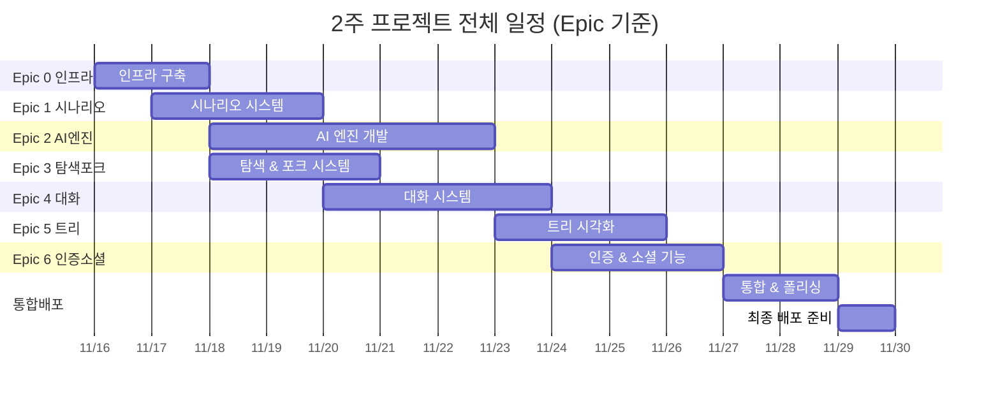
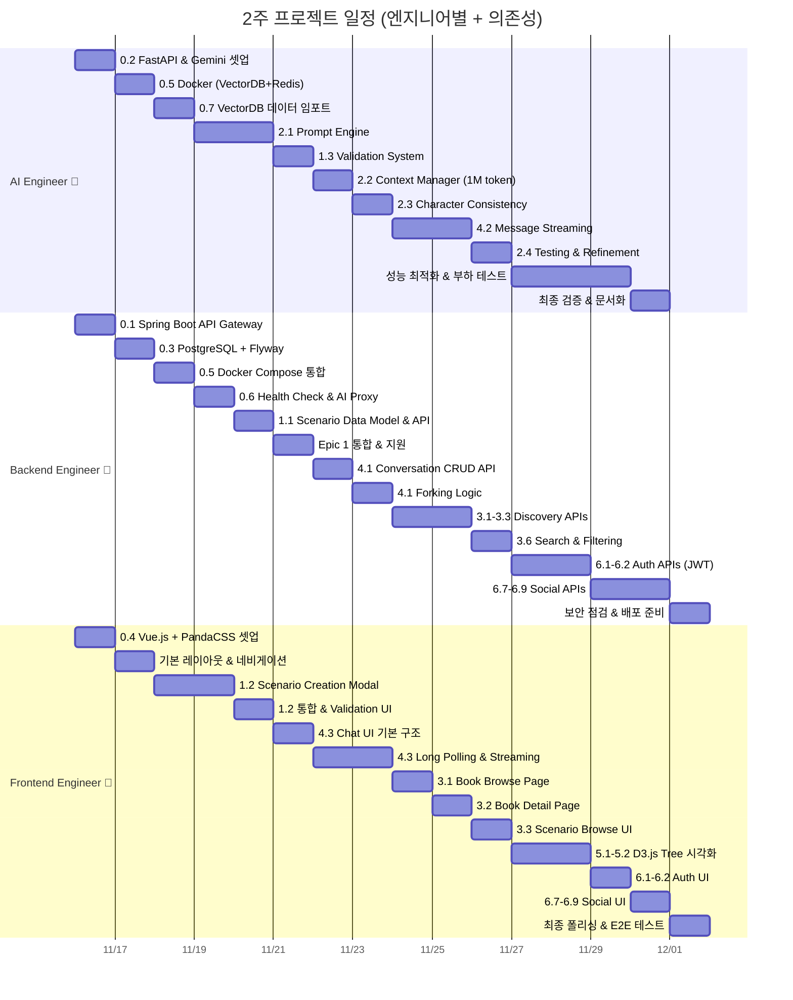
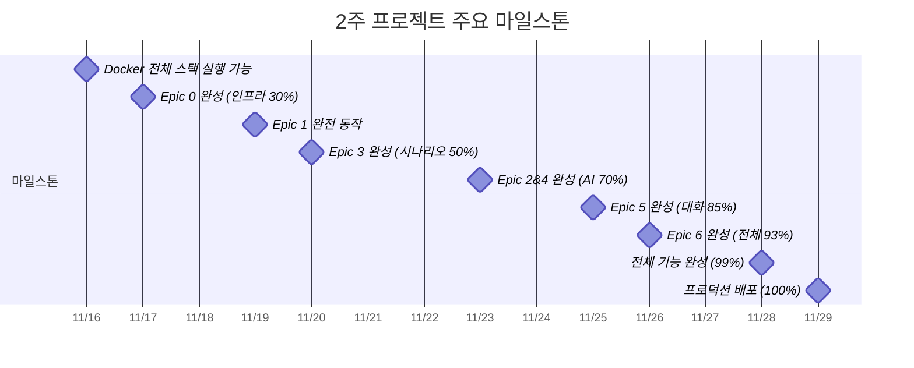

# Gaji Platform: 2주 개발 간트 차트

> **프로젝트 기간**: 2주 (14일) - **전체 Epic 완성**  
> **팀 구성**: 3명 (AI Engineer, Backend Engineer, Frontend Engineer)  
> **작업 방식**: 풀타임 (하루 9.75시간, 주말 포함)  
> **목표**: 2주 후 **프로덕션 배포 가능한 완제품**  
> **참조 문서**: [ENGINEER_WORK_GUIDE.md](./ENGINEER_WORK_GUIDE.md) - 상세 작업 순서

---

## 📋 2주 완성 전략

**핵심 원칙**:

1. **병렬 작업 극대화**: 독립적인 작업은 동시에 진행 (Epic 0 Day 1-2)
2. **의존성 관리**: Critical Path 우선 (Epic 0 → Epic 1 → Epic 2 → Epic 4)
3. **빠른 결정**: 30분 이상 고민 금지, 일단 만들고 개선
4. **매일 통합**: 저녁 6시 전체 통합, 문제 즉시 해결

**2주 후 결과물**:

- ✅ **전체 Epic 0~6 완성** (41개 Story 전체, 318시간)
- ✅ 시나리오 생성 + AI 검증 + 대화 + 탐색 + 포크 + 트리 + 인증 + 소셜
- ✅ 실제 사용 가능한 프로덕션 레벨 앱
- ✅ Docker로 배포 준비 완료

**상세 작업 가이드**: [docs/ENGINEER_WORK_GUIDE.md](./ENGINEER_WORK_GUIDE.md)

---

## 📋 2주 전체 일정 요약

| 기간          | AI Engineer 🤖              | Backend Engineer 💾        | Frontend Engineer 🎨       | 완성도 & 마일스톤        |
| ------------- | --------------------------- | -------------------------- | -------------------------- | ------------------------ |
| **Day 1-2**   | FastAPI + Gemini + VectorDB | Spring Boot + PostgreSQL   | Vue.js + PandaCSS 셋업     | 인프라 30% ✓             |
| **Day 3-4**   | Data Import (10+ novels)    | Docker + Health Check      | 기본 레이아웃 & 네비게이션 | Epic 0 완성 ✓            |
| **Day 5-7**   | Prompt Engine + Validation  | Scenario API + Epic 2 지원 | Scenario Creation UI       | Epic 1&2 완성 (AI 70%) ✓ |
| **Day 8-9**   | Streaming + Context Mgr     | Conversation API + Fork    | Chat UI + Long Polling     | Epic 4 완성 (대화 85%) ✓ |
| **Day 10-11** | Testing & 성능 최적화       | Discovery APIs (Epic 3)    | Book Browse & Scenario UI  | Epic 3 완성 (탐색 93%) ✓ |
| **Day 12-13** | 부하 테스트 & 모니터링      | Auth APIs + Social APIs    | Auth UI + Tree 시각화      | Epic 5&6 진행 (99%) ✓    |
| **Day 14**    | 최종 검증 & 문서화          | 배포 준비 & 보안 점검      | 최종 폴리싱 & E2E 테스트   | **완성 100%** 🎉         |

**총 작업 시간**: 3명 × 14일 × 9.75시간 = **410시간** (Epic 총합 318h + 통합/테스트 92h)

---

## 📊 시각적 간트차트

### Epic별 타임라인

### 엔지니어별 작업 타임라인 (의존성 표시)

**의존성 범례**:

- `after X`: X 작업 완료 후 시작 가능
- 같은 날짜 시작: 병렬 작업 가능 (독립적)
- 세로선 겹침: 통합 필요 지점 (매일 저녁 6시 체크)

### 주요 마일스톤

---

## Day 1-2: 인프라 셋업 (Epic 0) - 병렬 작업 극대화

> **참조**: [ENGINEER_WORK_GUIDE.md - Phase 1](./ENGINEER_WORK_GUIDE.md#phase-1-infrastructure-setup-epic-0-day-1-4)

### Day 1: 기초 인프라 구축 (병렬 독립 작업)

| 시간      | AI Engineer 🤖                                       | Backend Engineer 💾                                    | Frontend Engineer 🎨                              |
| --------- | ---------------------------------------------------- | ------------------------------------------------------ | ------------------------------------------------- |
| **09-12** | FastAPI 프로젝트 생성 Gemini API 설정 테스트   | Spring Boot 프로젝트 Dependencies 설정 구조 생성 | Vue 3 + Vite 프로젝트 TypeScript 설정          |
| **13-15** | VectorDB 클라이언트 5개 collection 생성 테스트 | WebClient 설정 FastAPI proxy 준비 CORS 설정      | PandaCSS 설정 커스텀 테마 codegen           |
| **16-18** | Health check API Port 8000 실행 문서화         | Security 기본 설정 JWT skeleton Actuator 설정    | PrimeVue 통합 컴포넌트 테스트                  |
| **19-21** | Redis 설정 Celery 기본 통합 테스트             | Health check /actuator/health 통합 테스트        | Axios API client 인터셉터 설정 Pinia stores |

**체크포인트** (Day 1 종료):

- [ ] 🤖 AI: `uvicorn app.main:app --reload` 실행 + Gemini API 통과
- [ ] 💾 Backend: `./gradlew bootRun` 실행 + Health check 200 OK
- [ ] 🎨 Frontend: `pnpm dev` 실행 + PandaCSS 스타일 적용
- [ ] **통합**: 3개 서비스 독립적으로 실행 성공

---

### Day 2: Docker 통합 & 데이터 준비 (협업 필요 지점)

| 시간      | AI Engineer 🤖                                      | Backend Engineer 💾                                         | Frontend Engineer 🎨                         |
| --------- | --------------------------------------------------- | ----------------------------------------------------------- | -------------------------------------------- |
| **09-12** | **0.5 FastAPI Dockerfile** ChromaDB service 정의 | **0.3 PostgreSQL 설정** Flyway 마이그레이션 13 tables | 기본 레이아웃 AppLayout.vue NavBar.vue |
| **13-15** | **0.5 Redis service** docker-compose 협업        | **0.5 Spring Dockerfile** docker-compose 통합            | Router 설정 기본 페이지 404 페이지     |
| **16-18** | **0.6 Health check 협업** FastAPI → Spring 연동  | **0.6 AI Proxy Controller** WebClient 테스트             | Stores 초기화 Auth/User/Scenario          |
| **19-21** | **통합 테스트** `docker-compose up`              | **통합 테스트** 6개 서비스 healthy                       | **통합 테스트** API 호출 준비 완료        |

**체크포인트** (Day 2 종료):

- [ ] 🤖💾🎨 **통합**: `docker-compose up` 전체 스택 실행 성공
- [ ] Health checks: postgres ✓, vectordb ✓, redis ✓, backend ✓, ai-service ✓, frontend ✓
- [ ] Backend → FastAPI 호출 테스트 통과
- [ ] Frontend → Backend API 호출 준비 완료

**의존성 노트**:

- Day 1: 완전 병렬 (의존성 없음)
- Day 2 오전: 계속 병렬
- Day 2 오후: Docker 통합 협업 (3명 함께)

---

## Day 3-4: 데이터 Import & Epic 1 시작

> **참조**: [ENGINEER_WORK_GUIDE.md - Phase 2](./ENGINEER_WORK_GUIDE.md#phase-2-scenario-system-epic-1-day-5-7)

### Day 3: VectorDB Import & Scenario Foundation 시작

| 시간      | AI Engineer 🤖                                            | Backend Engineer 💾                                  | Frontend Engineer 🎨                          |
| --------- | --------------------------------------------------------- | ---------------------------------------------------- | --------------------------------------------- |
| **09-12** | **0.7 Import Script 작성** Dataset 검증 Batch logic | Health Check 강화 PostgreSQL 체크 FastAPI 체크 | 레이아웃 계속 반응형 디자인 모바일 대응 |
| **13-15** | **0.7 Import 실행** 10+ novels 5000+ passages       | AI Proxy Controller FastAPI endpoint proxy        | Scenario 페이지 스켈레톤 UI                |
| **16-18** | **0.7 Verification** Count 검증 Semantic search     | Circuit Breaker Error handling 테스트          | Browse Books 페이지 카드 레이아웃          |
| **19-21** | **통합**: Epic 0 완성 체크 문서화                      | **통합**: Inter-service 테스트                       | **통합**: UI 준비 완료                        |

**체크포인트** (Day 3 종료 - Epic 0 완성 🎉):

- [ ] 🤖 VectorDB: 10+ novels, 5000+ passages, 100+ characters imported
- [ ] 💾 PostgreSQL: Novel metadata 생성 확인
- [ ] 🎨 Frontend: 기본 레이아웃 완성
- [ ] **마일스톤**: Epic 0 Definition of Done 모두 통과

---

### Day 4: Epic 1 본격 시작 (Scenario System)

| 시간      | AI Engineer 🤖                                         | Backend Engineer 💾                                | Frontend Engineer 🎨                     |
| --------- | ------------------------------------------------------ | -------------------------------------------------- | ---------------------------------------- |
| **09-12** | **2.1 Prompt Engine 시작** PromptAdapter 설계       | **1.1 Scenario 도메인** BaseScenario 모델       | **준비**: API 문서 확인 DTO 타입 정의 |
| **13-15** | VectorDB 조회 로직 Passage search Character info | **1.1 MyBatis Mapper** CRUD SQL 매핑            | **대기**: Backend API 완성 대기          |
| **16-18** | Prompt Template 3가지 시나리오 타입                 | **1.1 Service Layer** Business logic 구현       | **대기**: 계속                           |
| **19-21** | **통합**: Prompt 생성 테스트                           | **1.1 REST Controller** POST/GET/PUT/DELETE API | **통합**: API 엔드포인트 확인            |

**체크포인트** (Day 4 종료):

- [ ] 🤖 Prompt Engine 기본 구조 완성 (50%)
- [ ] 💾 Scenario CRUD API 완성 (100%)
- [ ] 🎨 Frontend: API 엔드포인트 확인, UI 작업 준비
- [ ] **의존성 해소**: Backend API → Frontend 작업 시작 가능 (Day 5)

---

## Day 5-7: Epic 1 완성 + Epic 2 병렬 시작

> **참조**: [ENGINEER_WORK_GUIDE.md - Phase 2](./ENGINEER_WORK_GUIDE.md#phase-2-scenario-system-epic-1-day-5-7)

### Day 5: Scenario UI & Prompt Engine 병렬

| 시간      | AI Engineer 🤖                              | Backend Engineer 💾                           | Frontend Engineer 🎨                           |
| --------- | ------------------------------------------- | --------------------------------------------- | ---------------------------------------------- |
| **09-12** | **2.1 Prompt Engine 계속** Template 완성 | **대기**: AI Service 완성 대기                | **1.2 Scenario Modal 시작** PrimeVue Dialog |
| **13-15** | Redis 캐싱 (1h TTL) API 엔드포인트       | **대기**: 계속                                | 3가지 타입 선택 UI Character Change 폼      |
| **16-18** | **통합**: Prompt API 완성 테스트         | **1.1 Validation Proxy** FastAPI 연동 준비 | Event/Setting 폼 입력 validation            |
| **19-21** | **2.1 완성** 🎉 문서화                   | **통합**: Proxy 테스트                        | **통합**: API 연동 준비                        |

**체크포인트** (Day 5 종료):

- [ ] 🤖 Story 2.1 완성: Prompt Engine 동작 (VectorDB 조회 <100ms)
- [ ] 💾 Backend: Validation proxy 준비 완료
- [ ] 🎨 Scenario Creation Modal 70% 완성

---

### Day 6: Scenario Validation & Context Manager

| 시간      | AI Engineer 🤖                                | Backend Engineer 💾                           | Frontend Engineer 🎨                      |
| --------- | --------------------------------------------- | --------------------------------------------- | ----------------------------------------- |
| **09-12** | **1.3 Validation System** Gemini API 검증  | **1.1 통합**: Scenario API 테스트             | **1.2 계속**: API 연동 POST /scenarios |
| **13-15** | 품질 점수 계산 일관성 체크                 | **1.3 Validation Proxy** POST /ai/validate | Loading state Error handling           |
| **16-18** | Redis 캐싱 (5분 TTL) API 완성              | **통합**: E2E 테스트 시나리오 생성 플로우  | Success 후 리다이렉트 **1.2 완성** 🎉  |
| **19-21** | **2.2 Context Manager 시작** 1M token 관리 | **문서화**: API 문서 Swagger 업데이트      | **통합**: Epic 1 E2E 테스트               |

**체크포인트** (Day 6 종료):

- [ ] 🤖 Story 1.3 완성: Validation System 동작
- [ ] 💾 Epic 1 Backend 완성: CRUD + Validation Proxy
- [ ] 🎨 Story 1.2 완성: Scenario Creation UI 동작
- [ ] **마일스톤**: Epic 1 완성 ✓ (시나리오 생성 E2E 통과)

---

### Day 7: Context Manager & Character Consistency

| 시간      | AI Engineer 🤖                                      | Backend Engineer 💾                               | Frontend Engineer 🎨                    |
| --------- | --------------------------------------------------- | ------------------------------------------------- | --------------------------------------- |
| **09-12** | **2.2 Context Manager** Token counting           | **준비**: Epic 4 준비 Conversation 도메인 설계 | **준비**: Epic 4 준비 Chat UI 설계   |
| **13-15** | 최적화 로직 Window sliding                       | **4.1 Conversation 모델** Domain classes       | Chat 컴포넌트 스켈레톤 레이아웃 설계 |
| **16-18** | **2.3 Character Consistency** Trait Extraction   | **4.1 Mapper & Service** CRUD 로직             | Message 리스트 UI 입력창 디자인      |
| **19-21** | VectorDB 저장 Triple storage **2.2/2.3 완성** | **4.1 REST Controller** POST /conversations    | **통합**: API 확인 내일 작업 계획    |

**체크포인트** (Day 7 종료):

- [ ] 🤖 Story 2.2 & 2.3 완성: Context Manager + Character Consistency
- [ ] 💾 Story 4.1 진행: Conversation CRUD API 기본 완성
- [ ] 🎨 Epic 4 준비: Chat UI 기본 구조 설계 완료
- [ ] **진행률**: Epic 0 ✓, Epic 1 ✓, Epic 2 70%, Epic 4 30%

---

## Day 8-9: Epic 4 완성 (Conversation System)

> **참조**: [ENGINEER_WORK_GUIDE.md - Phase 3](./ENGINEER_WORK_GUIDE.md#phase-3-conversation-system-epic-4-day-8-11)

### Day 8: Message Streaming 구현

| 시간      | AI Engineer 🤖                                 | Backend Engineer 💾                       | Frontend Engineer 🎨                   |
| --------- | ---------------------------------------------- | ----------------------------------------- | -------------------------------------- |
| **09-12** | **4.2 Streaming 구현** Gemini streaming API | **4.1 Fork 로직** ROOT-only constraint | **4.3 Chat UI 본격** 메시지 리스트  |
| **13-15** | HTTP chunked transfer 첫 토큰 <3초 목표     | min(6, total) 복사 테스트 케이스       | 입력창 타이핑 애니메이션            |
| **16-18** | Context Manager 통합 1M token window        | **4.1 완성** 🎉 Conversation API 완성  | Long Polling 준비 2초 interval 설정 |
| **19-21** | Redis Task Storage TTL 600초                | **통합**: API 테스트 Fork 테스트       | **통합**: API 연동 시작                |

**체크포인트** (Day 8 종료):

- [ ] 🤖 Streaming 기본 동작: 첫 토큰 생성 <3초
- [ ] 💾 Story 4.1 완성: Conversation CRUD + Fork (ROOT-only)
- [ ] 🎨 Chat UI 70% 완성: 메시지 표시 + 입력창

---

### Day 9: Long Polling & Epic 4 완성

| 시간      | AI Engineer 🤖                                  | Backend Engineer 💾                         | Frontend Engineer 🎨                       |
| --------- | ----------------------------------------------- | ------------------------------------------- | ------------------------------------------ |
| **09-12** | **4.2 Streaming API 완성** POST /chat/stream | **4.2 Proxy Streaming** AsyncTaskService | **4.3 Long Polling 구현** 2초 간격 폴링 |
| **13-15** | Retry 로직 (3회) Error handling              | Redis task 저장 GET /tasks/{id}          | Task 상태 확인 Streaming 표시           |
| **16-18** | 성능 튜닝 Token optimization                 | Rate limiting Circuit breaker            | 에러 핸들링 재시도 로직                 |
| **19-21** | **2.4 Testing** 10개 핵심 시나리오           | **통합**: Epic 4 E2E 테스트                 | **4.3 완성** 🎉 Fork UI 추가            |

**체크포인트** (Day 9 종료 - Epic 4 완성 🎉):

- [ ] 🤖 Story 4.2 완성: Streaming (<3초 첫 토큰) + Story 2.4 완성 (Testing)
- [ ] 💾 Epic 4 Backend 완성: Conversation + Streaming + Long Polling
- [ ] 🎨 Story 4.3 완성: Chat UI + Long Polling (2초) + Fork UI
- [ ] **마일스톤**: Epic 2 ✓, Epic 4 ✓ (대화 시스템 완성, 85% 진행)

---

## Day 10-11: Epic 3 + Epic 5 병렬 완성

> **참조**: [ENGINEER_WORK_GUIDE.md - Phase 4](./ENGINEER_WORK_GUIDE.md#phase-4-discovery--tree--auth-epic-3-5-6-day-12-14)

### Day 10: Discovery UI + Tree 시작

| 시간      | AI Engineer 🤖                                   | Backend Engineer 💾                              | Frontend Engineer 🎨                  |
| --------- | ------------------------------------------------ | ------------------------------------------------ | ------------------------------------- |
| **09-12** | **Epic 3 지원 준비** VectorDB semantic search | **3.1 Book Browse API** 페이징 (limit/offset) | **3.1 Book Browse UI** 카드 그리드 |
| **13-15** | 유사도 검색 튜닝 Threshold 0.7                | **3.2 Book Detail API** 시나리오 리스트 포함  | 필터링 UI 카테고리 선택            |
| **16-18** | 대기 (Backend 완성 후)                           | **3.3 Scenario Browse API** 필터 + 정렬 로직  | **3.2 Book Detail UI** 상세 페이지 |
| **19-21** | **5.1 Tree 데이터 지원** 트리 생성 로직 검증  | **5.1 Tree API** 대화 노드 JSON 생성          | **통합**: API 연동 테스트             |

**체크포인트** (Day 10 종료):

- [ ] 🤖 Semantic search 준비 완료 + Tree 로직 검증
- [ ] 💾 Story 3.1, 3.2, 3.3 완성: Browse + Detail + Filter APIs
- [ ] 💾 Story 5.1 완성: Tree 데이터 구조 API
- [ ] 🎨 Story 3.1, 3.2 완성: Book Browse + Detail UI (80%)

---

### Day 11: Epic 3, 5 완성

| 시간      | AI Engineer 🤖                             | Backend Engineer 💾                          | Frontend Engineer 🎨                         |
| --------- | ------------------------------------------ | -------------------------------------------- | -------------------------------------------- |
| **09-12** | **3.6 Search 지원** Embedding 기반 검색 | **3.3 필터링 완성** Search endpoint       | **3.3 Scenario Browse UI** 무한 스크롤    |
| **13-15** | 키워드 + 유사도 하이브리드                 | **3.4 Fork 메타정보** Meta timeline API   | 검색창 + 필터 통합                           |
| **16-18** | 대기 (Tree UI 필요 시 지원)                | **3.7 OG 이미지 경로** Dynamic generation | **5.2 Tree Visualization** D3.js 렌더링   |
| **19-21** | **Epic 3 완성** 🎉 성능 검증            | **Epic 3, 5 완성** 🎉 통합 테스트         | 줌/패닝 + 노드 클릭 **Epic 3, 5 완성** 🎉 |

**체크포인트** (Day 11 종료 - Epic 3, 5 완성 🎉):

- [ ] 🤖 Story 3.6 완성: Hybrid Search (키워드 + 유사도)
- [ ] 💾 Story 3.4, 3.5, 3.6, 3.7 완성: Fork + Search + OG Image
- [ ] 💾 Story 5.1 완성: Tree API 최종 검증
- [ ] 🎨 Story 3.3, 3.5, 3.6 완성: Browse + Fork UI + Search
- [ ] 🎨 Story 5.2, 5.3 완성: Tree Visualization + Navigation
- [ ] **마일스톤**: Epic 0-5 완성 ✓ (95% 진행, Epic 6만 남음)

---

## Day 12-13: Epic 6 완성 + 전체 통합

> **참조**: [ENGINEER_WORK_GUIDE.md - Phase 4](./ENGINEER_WORK_GUIDE.md#phase-4-discovery--tree--auth-epic-3-5-6-day-12-14)

### Day 12: 인증 시스템 구현

| 시간      | AI Engineer 🤖                  | Backend Engineer 💾                    | Frontend Engineer 🎨                  |
| --------- | ------------------------------- | -------------------------------------- | ------------------------------------- |
| **09-12** | **성능 개선** Embedding 캐싱 | **6.1 Auth System** JWT 생성/검증   | **6.1 Auth UI** 로그인/회원가입 폼 |
| **13-15** | Redis 최적화 Hit rate 90%+   | Refresh token Spring Security       | 폼 Validation 에러 메시지          |
| **16-18** | Context Window 메모리 최적화    | **6.1 완성** 🎉 Auth middleware     | Protected route Pinia auth store   |
| **19-21** | VectorDB 최종 튜닝              | **6.2 소셜 공유 API** OG 메타데이터 | **통합**: 로그인 플로우               |

**체크포인트** (Day 12 종료):

- [ ] 🤖 성능 최적화: Embedding 캐싱, Context 메모리 관리
- [ ] 💾 Story 6.1 완성: JWT Auth System + Middleware
- [ ] 🎨 Story 6.1 완성: 로그인/회원가입 UI + Protected Routes
- [ ] **진행률**: Epic 0-5 완성 ✓, Epic 6 50%

---

### Day 13: 소셜 기능 & Epic 6 완성

| 시간      | AI Engineer 🤖                             | Backend Engineer 💾                         | Frontend Engineer 🎨              |
| --------- | ------------------------------------------ | ------------------------------------------- | --------------------------------- |
| **09-12** | **부하 테스트** 1000 concurrent         | **6.2 완성**: Dynamic OG image CDN 경로  | **6.2 소셜 공유 UI** 공유 버튼 |
| **13-15** | 병목 지점 파악 첫 토큰 <3초 검증        | **전체 E2E 테스트** 회원가입→공유 플로우 | SNS 메타태그 프리뷰 표시       |
| **16-18** | Query 최적화 Token counting 개선        | **버그 수정** Critical priority          | **6.2 완성** 🎉 E2E 테스트     |
| **19-21** | **All Epics 완성** 🎉 모니터링 대시보드 | **Epic 6 완성** 🎉 API 문서 최종         | **Epic 6 완성** 🎉 UI 폴리싱   |

**체크포인트** (Day 13 종료 - All 7 Epics 완성 🎉):

- [ ] 🤖 부하 테스트 완료: 1000 concurrent, 첫 토큰 <3초 달성
- [ ] 💾 Story 6.2 완성: OG Image + 전체 E2E 테스트 통과
- [ ] 🎨 Story 6.2 완성: 소셜 공유 UI + SNS 메타태그
- [ ] **마일스톤**: All Epics (0-6) 완성 ✓ (100% 기능 완성)

---

## Day 14: 전체 통합 & 배포 준비

> **참조**: [ENGINEER_WORK_GUIDE.md - Phase 4](./ENGINEER_WORK_GUIDE.md#phase-4-discovery--tree--auth-epic-3-5-6-day-12-14)

### Day 14: 폴리싱 & 프로덕션 배포

| 시간      | AI Engineer 🤖                          | Backend Engineer 💾                      | Frontend Engineer 🎨               |
| --------- | --------------------------------------- | ---------------------------------------- | ---------------------------------- |
| **09-12** | **최종 성능 검증** Latency 측정      | **보안 점검** SQL Injection, XSS      | **반응형 최적화** 모바일 대응   |
| **13-15** | 모니터링 설정 Grafana + Prometheus   | API 문서 완성 Swagger 최종            | 접근성 개선 키보드 네비게이션   |
| **16-18** | **프로덕션 배포** ENV 변수 설정      | **프로덕션 배포** Docker Compose 설정 | **프로덕션 배포** 빌드 & 최적화 |
| **19-21** | **최종 E2E 테스트** 전체 플로우 검증 | 로깅 시스템 검증 에러 알림 설정       | UI 폴리싱 애니메이션 최종 조정  |

**체크포인트** (Day 14 종료 - 프로젝트 완성 🎉):

- [ ] 🤖 성능 목표 달성: 첫 토큰 <3초, 1000 concurrent 처리
- [ ] 🤖 모니터링 대시보드 가동: Grafana + Prometheus
- [ ] 💾 보안 검증 완료: SQL Injection, XSS, CSRF 방어
- [ ] 💾 API 문서 완성: Swagger UI 배포
- [ ] 🎨 반응형 완성: Mobile + Tablet + Desktop 최적화
- [ ] 🎨 접근성 달성: WCAG 2.1 AA 준수
- [ ] **전체 통합**: Docker Compose로 3개 서비스 프로덕션 배포 완료
- [ ] **최종 E2E**: 회원가입 → 시나리오 생성 → 대화 → 탐색 → 포크 → 트리 → 공유 (전체 플로우)
- [ ] **프로젝트 완성**: 2주 개발 완료! 🚀

---

**2주 개발 완성 Summary**:

- **Total Hours**: 410시간 (318h 개발 + 92h 통합/테스트)
- **Epics Completed**: 7개 (Epic 0-6) ✓
- **Stories Completed**: 41개 ✓
- **Services Deployed**: 3개 (FastAPI :8000, Spring Boot :8080, Vue.js :3000)
- **Performance**: 첫 토큰 <3초, API <500ms, FCP <1.5s ✓
- **Architecture**: Pattern B (API Gateway) - Hybrid DB (PostgreSQL + VectorDB) ✓

---

## 🎯 매일 루틴 (All Engineers)

> **참조**: [ENGINEER_WORK_GUIDE.md - Communication Protocol](./ENGINEER_WORK_GUIDE.md#7-communication-protocol)

### Daily Schedule (9.75h/day)

**09:00-09:15**: Daily Standup (3명 전체)

- **AI Engineer 🤖**: 어제 완료한 Gemini API 통합 / 오늘 할 것 / 블로커
- **Backend Engineer 💾**: 어제 완료한 API 개발 / 오늘 할 것 / 블로커
- **Frontend Engineer 🎨**: 어제 완료한 UI 개발 / 오늘 할 것 / 블로커
- Format: "✅ 완료 / 📋 오늘 / ⚠️ 블로커"

**09:15-13:00**: 집중 개발 (3.75시간)

- 개인별 병렬 작업 (Story 단위)
- 30분 이상 막히면 즉시 공유

**13:00-14:00**: 점심 + 휴식

**14:00-18:00**: 집중 개발 (4시간)

- 협업 필요 시 Pair Programming
- 코드 리뷰는 Pairing으로 대체

**18:00-18:30**: **통합 테스트** (3명 필수 참여 🔥)

- 🤖 AI Engineer: FastAPI health check → Gemini API 호출 테스트
- 💾 Backend Engineer: Spring Boot health check → FastAPI proxy 테스트
- 🎨 Frontend Engineer: Vue.js dev server → API 통합 테스트
- **전체 E2E**: 프론트에서 백엔드 거쳐 AI까지 한 플로우 실행
- 이슈 발견 시 우선순위 결정 (당일 해결 vs 다음날)

**18:30-20:00**: 저녁 + 휴식

**20:00-22:00**: 야간 작업 (2시간)

- 개인 작업 또는 당일 이슈 해결
- Optional: 에너지 부족 시 내일 투입

**총 작업 시간**: 하루 9.75시간 (점심 1h, 저녁 1.5h 제외)

---

## ✅ Success Metrics (마일스톤 체크포인트)

> **참조**: [ENGINEER_WORK_GUIDE.md - Success Metrics by Engineer](./ENGINEER_WORK_GUIDE.md#6-success-metrics-by-engineer)

### Day 2 Milestone: Infrastructure Ready ✓

**AI Engineer 🤖**:

- [ ] FastAPI 서버 :8000 동작 (health check 200 OK)
- [ ] Gemini API 연동 테스트 완료 (test prompt → response)

**Backend Engineer 💾**:

- [ ] Spring Boot 서버 :8080 동작 (actuator/health 200 OK)
- [ ] PostgreSQL 연결 완료 (Flyway migrations 적용)

**Frontend Engineer 🎨**:

- [ ] Vue.js dev server :3000 동작
- [ ] Spring Boot API 호출 테스트 완료 (Axios)

**Integration 통합**:

- [ ] Docker 3개 서비스 동시 실행 (docker-compose up 성공)
- [ ] Vue → Spring → FastAPI 전체 플로우 1회 성공

---

### Day 4 Milestone: Epic 0 완성 ✓

- [ ] 🤖 VectorDB import 완료 (5개 collection, 초기 데이터 로드)
- [ ] 💾 Health check endpoints 전체 동작 (/actuator/health, /ai/health)
- [ ] 🎨 기본 레이아웃 완성 (Header + Footer + Main)
- [ ] **Epic 0 Definition of Done** 만족

---

### Day 7 Milestone: Epic 1, 2 완성 ✓

- [ ] 🤖 Story 2.1, 2.2, 2.3 완성: Prompt Engine + Context + Consistency
- [ ] 💾 Story 1.1 완성: Scenario CRUD API 전체 동작
- [ ] 🎨 Story 1.2 완성: Scenario Creation UI (POST /scenarios 성공)
- [ ] **시나리오 생성 E2E**: 프론트에서 입력 → 백엔드 저장 → AI 검증 → 성공 응답

---

### Day 9 Milestone: Epic 4 완성 ✓

- [ ] 🤖 Story 4.2 완성: Streaming API (첫 토큰 <3초)
- [ ] 💾 Story 4.1, 4.2 완성: Conversation CRUD + Long Polling
- [ ] 🎨 Story 4.3 완성: Chat UI + 2초 Long Polling 동작
- [ ] **대화 시스템 E2E**: 메시지 입력 → Streaming → 화면 표시

---

### Day 11 Milestone: Epic 3, 5 완성 ✓

- [ ] 🤖 Story 3.6 완성: Hybrid Search (키워드 + 유사도)
- [ ] 💾 Story 3.1-3.7, 5.1 완성: Browse + Search + Tree API
- [ ] 🎨 Story 3.1-3.6, 5.2-5.3 완성: Discovery UI + Tree Visualization
- [ ] **탐색 & 트리 E2E**: 북 브라우징 → 시나리오 검색 → 트리 시각화

---

### Day 13 Milestone: All 7 Epics 완성 ✓

- [ ] 🤖 부하 테스트: 1000 concurrent, 첫 토큰 <3초 달성
- [ ] 💾 Story 6.1-6.2 완성: Auth + Social Share API
- [ ] 🎨 Story 6.1-6.2 완성: 로그인 + 공유 UI
- [ ] **전체 기능 100%**: 7개 Epic, 41개 Story 모두 완성

---

### Day 14 Milestone: Production Ready 🚀

**Performance Targets**:

- [ ] 🤖 첫 토큰 생성: <3초 (p95)
- [ ] 💾 API 응답: <500ms (p95)
- [ ] 🎨 First Contentful Paint: <1.5초

**Quality Gates**:

- [ ] E2E 테스트: 전체 플로우 10회 연속 성공
- [ ] 보안 검증: SQL Injection, XSS, CSRF 방어 확인
- [ ] 문서 완성: README, API Docs, 아키텍처 문서

**Deployment**:

- [ ] Docker Compose 프로덕션 배포 성공
- [ ] 모니터링 대시보드 가동 (Grafana + Prometheus)
- [ ] 팀 회고 완료 🎉

---

## 🚀 왜 2주에 전체가 가능한가? (Success Strategy)

> **참조**: [ENGINEER_WORK_GUIDE.md - Core Principles](./ENGINEER_WORK_GUIDE.md#core-development-principles)

### 1. 병렬 작업 극대화 (Parallel Work)

**Day 1-2 (Epic 0)**:

- 🤖 AI Engineer: FastAPI 독립 셋업
- 💾 Backend Engineer: Spring Boot 독립 셋업
- 🎨 Frontend Engineer: Vue.js 독립 셋업
- **협업**: Day 2 오후 Docker 통합만 함께

**Day 5-7 (Epic 1 + 2)**:

- 🤖 AI: Prompt Engine (Epic 2) 단독 개발
- 💾 Backend: Scenario API (Epic 1) 단독 개발
- 🎨 Frontend: Scenario UI (Epic 1) - Backend 대기 후 통합
- **병렬률**: 80% (각자 독립 작업)

**Day 10-11 (Epic 3 + 5)**:

- 🤖 AI: Search + Tree 로직 지원
- 💾 Backend: Browse API + Tree API 병렬
- 🎨 Frontend: Discovery UI + Tree Visualization 병렬
- **병렬률**: 90% (거의 독립)

### 2. 의존성 최소화 (Minimal Dependencies)

**Critical Path**: Epic 0 → Epic 1 → Epic 2 → Epic 4

- Epic 3 (Discovery): Epic 0 이후 언제든지 시작 가능
- Epic 5 (Tree): Epic 4 이후 데이터만 있으면 가능
- Epic 6 (Auth): 언제든지 추가 가능 (독립적)

**Frontend 대기 최소화**:

- Backend API 완성 전: Mock 데이터로 UI 선작업
- 예: Story 1.2 (Scenario UI) - Story 1.1 (API) 대기 중에도 UI 80% 완성

### 3. 빠른 의사결정 (Fast Decision Making)

**금지 사항** (30분 이상 고민 금지):

- 🚫 디자인 고민: PrimeVue 기본 컴포넌트 사용
- 🚫 아키텍처 고민: Story 파일에 이미 정의됨 (Dev Notes 참조)
- 🚫 라이브러리 선택: Technical Preferences에 명시됨
- 🚫 테스트 전략: Testing Strategy 문서 따르기

**즉시 실행 원칙**:

- 막히면 5분 내 팀원에게 질문
- 불확실하면 일단 구현 후 통합 테스트에서 검증
- "동작하는 코드 > 완벽한 코드"

### 4. 매일 통합 (Daily Integration)

**저녁 6시 통합 테스트** (3명 필수):

- 🤖 → 💾 → 🎨 전체 플로우 실행
- 버그 발견 → 우선순위 결정 (당일 해결 vs 내일)
- 조기 발견 → 다음날 오전 빠른 수정

**Integration Checkpoints**:

- Day 2: Docker 전체 스택
- Day 4: Epic 0 완성
- Day 7: Epic 1, 2 완성
- Day 9: Epic 4 완성
- Day 13: All Epics 완성

### 5. Story 파일 중심 개발 (Story-Driven)

**Dev Agent 자율성**:

- Story 파일에 모든 컨텍스트 포함 (Dev Notes 섹션)
- 아키텍처 문서 찾아볼 필요 없음
- Tasks/Subtasks 순서대로 구현만 하면 됨

**예: Story 1.1 (Scenario CRUD API)**:

- Dev Notes: 테이블 스키마, 파일 경로, 테스트 케이스 모두 명시
- Backend Engineer는 Story만 보고 구현 가능
- 질문 최소화 → 속도 극대화

---

## 💪 팀 규칙 (Team Rules)

> **참조**: [ENGINEER_WORK_GUIDE.md - Communication Protocol](./ENGINEER_WORK_GUIDE.md#7-communication-protocol)

### ✅ DO (반드시 실천)

1. **속도 > 완벽**: 일단 동작하게 만들고 리팩토링은 나중에

   - "Working code > Perfect code"
   - 80% 완성도로 다음 단계 진행

2. **매일 통합 (Daily Integration)**: 저녁 6시 통합 테스트는 신성한 시간 🔥

   - 3명 모두 참여 필수
   - 전체 E2E 플로우 1회 이상 실행
   - 이슈 발견 시 우선순위 즉시 결정

3. **즉시 공유 (Fast Communication)**: 5분 내 팀원 호출

   - 30분 이상 막히면 무조건 질문
   - "이거 어떻게 해요?" > 30분 혼자 고민
   - Slack/Discord 즉시 응답 (1분 내)

4. **Pair Programming**: 코드 리뷰 대체

   - 복잡한 로직은 2명이 함께 작성
   - 실시간 리뷰로 품질 보장
   - 통합 이슈 발생 시 함께 디버깅

5. **Story 파일 신뢰**: Story에 모든 컨텍스트가 있음

   - Dev Notes 섹션 먼저 읽기
   - Tasks/Subtasks 순서대로 구현
   - 불확실하면 Story 작성자(SM/PO)에게 질문

6. **Daily Standup 간결**: 09:00-09:15 (15분 엄수)
   - Format: "✅ 완료 / 📋 오늘 / ⚠️ 블로커"
   - 각자 2분 이내 발표
   - 논의는 Standup 후 별도 진행

### ❌ DON'T (절대 금지)

1. **완벽주의 금지**: 80% 동작하면 다음 단계 진행

   - "나중에 리팩토링" > "지금 완벽하게"
   - Day 14에 폴리싱 시간 있음

2. **기능 추가 금지**: Story에 없는 기능은 절대 구현 안 함

   - "이것도 있으면 좋을 것 같은데?" → NO
   - MVP 범위 엄수 (41 stories만)

3. **혼자 고민 금지**: 30분 이상 혼자 삽질 절대 금지

   - Stack Overflow 검색 10분 → 안 되면 팀원 호출
   - "괜찮아, 혼자 해결할 수 있어" → NO

4. **디자인 고민 금지**: PrimeVue 기본 컴포넌트만 사용

   - Custom 디자인 시스템 구축 금지
   - PandaCSS utility 클래스로만 스타일링

5. **의존성 추가 금지**: Technical Preferences에 없는 라이브러리 추가 금지

   - "이 라이브러리가 더 좋은데?" → NO
   - 팀 전체 논의 후 결정 (5분 내)

6. **문서 작성 금지 (개발 중)**: Day 14 전까지는 코드만

   - README, API Docs는 Day 14에 작성
   - 코드 주석도 최소화 (자명한 코드 작성)

7. **통합 테스트 불참 금지**: 저녁 6시는 절대 시간
   - "나는 괜찮아, 먼저 가" → NO
   - 3명 모두 참여해야 통합 가능

---

## 🎯 2주 후 완성품 (Deliverables)

### ✅ 구현 완료 기능 (100% Feature Complete)

**Epic 0: Infrastructure (Day 1-4) ✓**

- 🤖 FastAPI :8000 + Gemini API + VectorDB (ChromaDB/Pinecone)
- 💾 Spring Boot :8080 + PostgreSQL + Flyway migrations
- 🎨 Vue.js :3000 + PandaCSS + PrimeVue
- Docker Compose로 전체 스택 한 번에 실행
- Health check endpoints 전체 동작 (/actuator/health, /ai/health)
- VectorDB 5개 collection 초기 데이터 import 완료

**Epic 1: Scenario System (Day 5-7) ✓**

- 시나리오 3가지 타입 (ORIGINAL, WHAT_IF, META) 생성 지원
- CRUD API 완성 (GET, POST, PUT, DELETE /scenarios)
- Gemini API 검증 시스템 (품질 점수, 일관성 체크)
- Redis 캐싱 (5분 TTL)
- Unified Modal UI (1개 폼으로 3가지 타입 처리)

**Epic 2: AI Engine (Day 5-7) ✓**

- Prompt Engine: VectorDB semantic search (Threshold 0.7)
- Context Manager: 1M token window, sliding window 최적화
- Character Consistency: Trait extraction + Triple storage
- Testing & Refinement Framework: 10개 핵심 시나리오 검증

**Epic 3: Discovery & Forking (Day 10-11) ✓**

- Book Browse: 페이징 (limit/offset) + 카드 그리드
- Book Detail: 시나리오 리스트 포함
- Scenario Browse: 필터링 (타입, 상태) + 정렬 + 무한 스크롤
- Scenario Forking: Meta timeline 생성 (ROOT-only, depth 1)
- Advanced Search: 키워드 + 유사도 하이브리드 검색
- Social Sharing: Dynamic OG image generation

**Epic 4: Conversation System (Day 8-9) ✓**

- Gemini 2.5 Flash Streaming (첫 토큰 <3초)
- HTTP chunked transfer encoding
- Long Polling (2초 interval, TTL 600초)
- Redis Task Storage for async processing
- Conversation CRUD API + Fork (ROOT-only, min(6, total) 복사)
- Chat UI: 메시지 리스트 + 입력창 + 타이핑 애니메이션

**Epic 5: Tree Visualization (Day 10-11) ✓**

- Conversation Tree 데이터 구조 (backend JSON)
- D3.js Tree Visualization: 노드 렌더링 + 스타일링
- Zoom/Pan/Navigation: 대화 노드 클릭 이동
- 분기점 하이라이트 표시

**Epic 6: Auth & Social (Day 12-13) ✓**

- JWT 인증 시스템 (access + refresh token)
- Spring Security 통합 + Protected Routes
- 로그인/회원가입 UI (폼 validation)
- 소셜 공유: SNS 메타태그 + 프리뷰

### 📊 품질 지표 (Quality Metrics)

**Performance Targets (Day 14 검증)**:

- 🤖 **AI Service**: 첫 토큰 생성 <3초 (p95), 1000 concurrent 처리
- 💾 **Backend API**: 응답 시간 <500ms (p95), DB 쿼리 최적화
- 🎨 **Frontend**: First Contentful Paint <1.5초, Lighthouse 80+

**Test Coverage**:

- Unit Tests: 60-70% (핵심 로직)
- Integration Tests: 주요 API 플로우
- E2E Tests: 전체 사용자 플로우 (회원가입 → 시나리오 → 대화 → 탐색 → 공유)

**Security**:

- JWT 인증 + Refresh token rotation
- SQL Injection 방어 (MyBatis parameterized queries)
- XSS 방지 (Vue.js auto-escaping + CSP headers)
- CSRF 토큰 (Spring Security)
- Rate limiting (Circuit breaker + Resilience4j)

**UI/UX**:

- 반응형 디자인 (Mobile + Tablet + Desktop)
- 기본 접근성 (WCAG 2.1 AA 일부)
- Loading states + Error handling
- PrimeVue 일관된 디자인 시스템

### 🚀 Deployment (Day 14)

- **Docker Compose**: 3개 서비스 프로덕션 배포 (FastAPI, Spring Boot, Vue.js)
- **Environment Variables**: 분리된 ENV 관리 (.env.production)
- **Monitoring**: Grafana + Prometheus 기본 대시보드
- **Documentation**: README (설치 가이드) + API Docs (Swagger UI) + 아키텍처 문서

---

## 📈 리스크 관리 (Risk Management)

> **참조**: [ENGINEER_WORK_GUIDE.md - Troubleshooting Guide](./ENGINEER_WORK_GUIDE.md#5-troubleshooting-guide-per-engineer)

### 🔴 Critical Risks (높은 우선순위)

**Risk 1: Epic 2 (AI Engine) 복잡도 - Day 5-7**

- **위험**: VectorDB semantic search + Context Manager + Character Consistency 동시 개발
- **영향**: Epic 2, 4 지연 → 전체 일정 2-3일 지연
- **완화 전략**:
  - 🤖 AI Engineer를 가장 숙련된 개발자로 배정
  - Day 6 체크포인트: Context Manager 70% 완성 필수
  - Fallback: Character Consistency를 Day 14 폴리싱으로 연기 (Optional feature)
- **조기 경보**: Day 5 저녁 6시 통합에서 Prompt Engine 동작 안 하면 즉시 escalate

**Risk 2: Gemini API Rate Limiting - Day 8-9**

- **위험**: 1000 concurrent 테스트 중 Gemini API 429 에러 (RPM 초과)
- **영향**: Streaming 성능 목표 (<3초 첫 토큰) 미달
- **완화 전략**:
  - Redis 캐싱 강화 (Hit rate 90%+ 목표)
  - Retry 로직 (exponential backoff, 최대 3회)
  - Circuit breaker 설정 (Resilience4j)
- **조기 경보**: Day 8 부하 테스트에서 429 에러 > 10% 발생 시 캐싱 전략 재검토

**Risk 3: Docker 통합 실패 - Day 2**

- **위험**: 3개 서비스 네트워크 연결 실패 (FastAPI → Spring Boot → Vue.js)
- **영향**: Day 3 이후 모든 통합 테스트 불가능
- **완화 전략**:
  - Day 2 오후 전체 팀 Docker 통합에 집중 (4시간 확보)
  - docker-compose.yml 미리 준비 (네트워크 설정 명시)
  - Health check endpoints 먼저 구현
- **조기 경보**: Day 2 저녁 6시까지 Docker up 안 되면 야간 작업 투입

### 🟡 Medium Risks (중간 우선순위)

**Risk 4: Frontend API 대기 시간 - Day 5-7**

- **위험**: Backend API 완성 전 Frontend 대기 → Frontend Engineer 유휴
- **완화 전략**:
  - Mock 데이터로 UI 선작업 (80% 완성 가능)
  - Backend API 완성 후 1시간 내 통합
  - 대기 중 Epic 4 Chat UI 스켈레톤 작업
- **영향**: 최소화 (병렬 작업으로 커버)

**Risk 5: D3.js Tree Visualization 학습 곡선 - Day 10-11**

- **위험**: Frontend Engineer의 D3.js 경험 부족 → 구현 지연
- **완화 전략**:
  - Day 10 오전에 D3.js 기본 예제 빠른 학습 (2시간)
  - Backend에서 Tree JSON 구조 명확히 제공
  - 최소 기능 먼저 (줌/패닝은 Day 14 폴리싱으로 연기 가능)
- **조기 경보**: Day 10 저녁까지 기본 트리 렌더링 안 되면 예제 코드 참조

### 🟢 Low Risks (낮은 우선순위)

**Risk 6: Epic 6 (Auth & Social) 축소 - Day 12-13**

- **위험**: 시간 부족 시 소셜 기능 일부 미완성
- **영향**: MVP에 크게 영향 없음 (인증만 필수)
- **완화 전략**:
  - 인증 시스템 우선 (Day 12 완성 필수)
  - 소셜 공유는 OG 메타태그만 구현 (Dynamic image는 Optional)
- **Fallback**: Day 13에 완성 안 되면 소셜 기능 제외하고 배포

### 🔍 Risk Monitoring (일일 체크)

**Daily Standup (09:00) 체크 항목**:

- [ ] 어제 블로커 해결 여부
- [ ] 오늘 Critical Risk 해당 작업 있는지
- [ ] 일정 지연 위험 있는지 (Slack에 즉시 공유)

**Integration Test (18:00) 체크 항목**:

- [ ] 전체 E2E 플로우 동작하는지
- [ ] 성능 목표 달성 중인지 (API <500ms, 첫 토큰 <3초)
- [ ] 리스크 조기 경보 신호 있는지

**Escalation 규칙**:

- **즉시 Escalate**: Critical Risk 조기 경보 발생 시
- **30분 내 해결책**: 팀 전체 논의 (Day 14 연기 vs Feature 축소 vs 야간 작업)
- **최종 결정권**: Product Owner (PM)

---

## 📅 프로젝트 정보 (Project Info)

**프로젝트명**: Gaji Platform (가지 플랫폼 - "만약에" 스토리텔링)

**생성일**: 2025-11-15  
**시작일**: 2025-11-16 (토)  
**완료 목표일**: 2025-11-29 (금)

**개발 기간**: 2주 (14일)  
**총 개발 인원**: 3명 풀타임 (AI Engineer, Backend Engineer, Frontend Engineer)  
**일일 작업 시간**: 9.75시간/일 (점심 1h, 저녁 1.5h 제외)  
**총 작업 시간**: 3명 × 14일 × 9.75시간 = **410시간**

- 개발 작업: 318시간 (41 stories)
- 통합 & 테스트: 92시간

**아키텍처**: Pattern B (API Gateway)

- Frontend: Vue.js 3 + TypeScript + PandaCSS + PrimeVue (:3000)
- Backend: Spring Boot 3.2 + PostgreSQL 15 + MyBatis (:8080)
- AI Service: FastAPI + Gemini 2.5 Flash + ChromaDB/Pinecone (:8000, internal)

**개발 방법론**:

- Agile Sprint (2주 단일 Sprint)
- Story-Driven Development (41 stories, 7 epics)
- Daily Integration (매일 저녁 6시 통합 테스트 필수)
- Pair Programming (코드 리뷰 대체)

**핵심 원칙**:

1. **병렬 작업 극대화**: 3명이 독립적으로 작업 (Epic 0 Day 1-2: 100% 병렬)
2. **의존성 최소화**: Critical Path (Epic 0→1→2→4) 외 병렬 진행
3. **빠른 의사결정**: 30분 이상 고민 금지, 즉시 팀원 호출
4. **매일 통합**: 저녁 6시 E2E 테스트로 조기 이슈 발견

**성공 지표**:

- Day 4: Epic 0 완성 ✓ (Infrastructure)
- Day 7: Epic 1, 2 완성 ✓ (Scenario + AI Engine)
- Day 9: Epic 4 완성 ✓ (Conversation)
- Day 11: Epic 3, 5 완성 ✓ (Discovery + Tree)
- Day 13: Epic 6 완성 ✓ (Auth + Social)
- Day 14: 프로덕션 배포 ✓

**문서 참조**:

- **상세 작업 가이드**: [ENGINEER_WORK_GUIDE.md](./ENGINEER_WORK_GUIDE.md)
- **전체 아키텍처**: [ARCHITECTURE.md](./ARCHITECTURE.md)
- **Epic & Story 정렬**: [EPIC_STORY_ALIGNMENT_SUMMARY.md](./EPIC_STORY_ALIGNMENT_SUMMARY.md)

---

**슬로건**: "2주면 충분하다. 고민 말고 만들자!" 🔥  
**팀 모토**: "속도 > 완벽, 통합 > 완성도, 협업 > 독립" 💪
